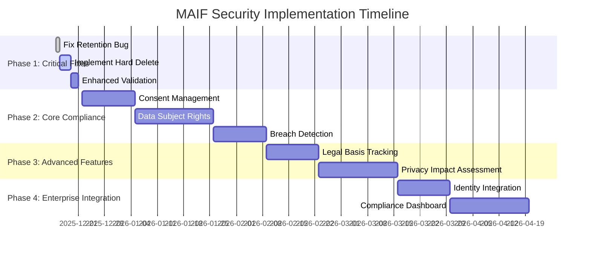

# MAIF Security Implementation Plan

**Version**: 1.0  
**Date**: December 2025  
**Status**: ROADMAP

## Executive Summary

This document outlines the implementation plan to enhance MAIF's security framework from its current **foundational state** to **full enterprise compliance**. Based on the honest assessment of current capabilities, this plan prioritizes critical gaps and provides a structured approach to achieving comprehensive data protection.

## Current State Assessment

### ✅ Strong Foundations Already Built
- **Universal Security**: All block types have identical protection
- **Encryption**: AES-256-GCM with 45 MB/s performance
- **Tamper Detection**: SHA-256 hashing with 328 MB/s performance
- **Data Anonymization**: Working PII detection and pseudonymization
- **Audit Trails**: Complete operation logging with versioning
- **Privacy by Design**: Built-in architecture-level controls

### ⚠️ Critical Gaps Identified
- **Hard Delete**: Only soft delete implemented
- **Consent Management**: No consent tracking system
- **Data Subject Rights**: No automated request handling
- **Breach Detection**: No automated monitoring
- **Legal Basis Tracking**: No processing lawfulness documentation
- **Retention Policy Bug**: Runtime error during enforcement

## Implementation Roadmap

### 🚨 Phase 1: Critical Fixes (Immediate - 2 weeks)

#### 1.1 Fix Retention Policy Bug
**Priority**: CRITICAL  
**Effort**: 1 day  
**Impact**: Enables automatic data retention enforcement

```python
# Current Issue: RuntimeError: dictionary changed size during iteration
def enforce_retention_policy(self):
    """Fixed retention policy enforcement."""
    current_time = time.time()
    expired_blocks = []
    
    # Fix: Create list copy to avoid iteration modification
    for block_id, retention_info in list(self.retention_policies.items()):
        if isinstance(retention_info, dict):
            created_at = retention_info.get('created_at', 0)
            retention_days = retention_info.get('retention_days', 30)
            
            expiry_time = created_at + (retention_days * 24 * 3600)
            if current_time > expiry_time:
                expired_blocks.append(block_id)
                self._secure_delete_block(block_id)  # Use secure delete
    
    return expired_blocks
```

#### 1.2 Implement Hard Delete (Secure Data Destruction)
**Priority**: CRITICAL  
**Effort**: 3 days  
**Impact**: Enables true "Right to Erasure" compliance

```python
class SecureDataDestruction:
    """Secure data destruction for GDPR compliance."""
    
    def secure_delete_block(self, block_id: str, overwrite_passes: int = 3) -> bool:
        """Securely overwrite and delete block data."""
        if block_id not in self.block_registry:
            return False
        
        # Get block data location
        block = self.block_registry[block_id][-1]
        
        # Perform secure overwrite
        for pass_num in range(overwrite_passes):
            # Overwrite with random data
            random_data = secrets.token_bytes(len(block.data))
            block.data = random_data
            
            # Force write to storage
            self._flush_to_storage(block)
        
        # Final overwrite with zeros
        block.data = b'\x00' * len(block.data)
        self._flush_to_storage(block)
        
        # Remove from all registries
        self._remove_from_registries(block_id)
        
        # Log secure deletion
        self._log_secure_deletion(block_id, overwrite_passes)
        
        return True
    
    def _flush_to_storage(self, block):
        """Force immediate write to storage medium."""
        # Implementation depends on storage backend
        pass
    
    def _remove_from_registries(self, block_id: str):
        """Remove block from all internal registries."""
        if block_id in self.block_registry:
            del self.block_registry[block_id]
        if block_id in self.privacy_engine.privacy_policies:
            del self.privacy_engine.privacy_policies[block_id]
        if block_id in self.privacy_engine.encryption_keys:
            del self.privacy_engine.encryption_keys[block_id]
```

#### 1.3 Enhanced Error Handling and Validation
**Priority**: HIGH  
**Effort**: 2 days  
**Impact**: Improves system reliability and security

```python
class SecurityValidationEnhanced:
    """Enhanced security validation with comprehensive error handling."""
    
    def validate_privacy_policy(self, policy: PrivacyPolicy) -> ValidationResult:
        """Validate privacy policy for compliance requirements."""
        errors = []
        warnings = []
        
        # Validate retention period
        if policy.retention_period and policy.retention_period < 1:
            errors.append("Retention period must be at least 1 day")
        
        # Validate encryption requirements
        if policy.privacy_level in [PrivacyLevel.HIGH, PrivacyLevel.SECRET, PrivacyLevel.TOP_SECRET]:
            if policy.encryption_mode == EncryptionMode.NONE:
                errors.append(f"Privacy level {policy.privacy_level.value} requires encryption")
        
        # Validate geographic restrictions
        if policy.geographic_restrictions:
            valid_regions = ["US", "EU", "CA", "UK", "AU", "JP"]
            invalid_regions = [r for r in policy.geographic_restrictions if r not in valid_regions]
            if invalid_regions:
                warnings.append(f"Unknown geographic restrictions: {invalid_regions}")
        
        return ValidationResult(
            is_valid=len(errors) == 0,
            errors=errors,
            warnings=warnings
        )
```

### 🔧 Phase 2: Core Compliance Features (1-2 months)

#### 2.1 Consent Management System
**Priority**: HIGH  
**Effort**: 2 weeks  
**Impact**: Enables GDPR Article 6 & 7 compliance

```python
@dataclass
class ConsentRecord:
    """GDPR-compliant consent record."""
    consent_id: str
    data_subject_id: str
    purpose: str
    legal_basis: str  # Article 6 basis
    consent_given: bool
    consent_timestamp: float
    consent_method: str  # "explicit", "implied", "opt-in"
    withdrawal_timestamp: Optional[float] = None
    withdrawal_method: Optional[str] = None
    data_categories: List[str] = None
    processing_activities: List[str] = None
    third_party_sharing: bool = False
    retention_period: Optional[int] = None
    
class ConsentManager:
    """Comprehensive consent management system."""
    
    def __init__(self):
        self.consent_records: Dict[str, ConsentRecord] = {}
        self.consent_history: Dict[str, List[ConsentRecord]] = {}
    
    def record_consent(self, data_subject_id: str, purpose: str, 
                      legal_basis: str, consent_method: str = "explicit") -> str:
        """Record new consent with full audit trail."""
        consent_id = str(uuid.uuid4())
        
        consent = ConsentRecord(
            consent_id=consent_id,
            data_subject_id=data_subject_id,
            purpose=purpose,
            legal_basis=legal_basis,
            consent_given=True,
            consent_timestamp=time.time(),
            consent_method=consent_method
        )
        
        self.consent_records[consent_id] = consent
        
        # Add to history
        if data_subject_id not in self.consent_history:
            self.consent_history[data_subject_id] = []
        self.consent_history[data_subject_id].append(consent)
        
        return consent_id
    
    def withdraw_consent(self, consent_id: str, withdrawal_method: str = "explicit") -> bool:
        """Process consent withdrawal (GDPR Article 7.3)."""
        if consent_id not in self.consent_records:
            return False
        
        consent = self.consent_records[consent_id]
        consent.consent_given = False
        consent.withdrawal_timestamp = time.time()
        consent.withdrawal_method = withdrawal_method
        
        # Trigger data deletion if required
        self._trigger_consent_withdrawal_actions(consent)
        
        return True
    
    def check_consent_validity(self, data_subject_id: str, purpose: str) -> bool:
        """Check if valid consent exists for processing."""
        for consent in self.consent_records.values():
            if (consent.data_subject_id == data_subject_id and 
                consent.purpose == purpose and 
                consent.consent_given and 
                consent.withdrawal_timestamp is None):
                
                # Check if consent has expired
                if consent.retention_period:
                    expiry = consent.consent_timestamp + (consent.retention_period * 24 * 3600)
                    if time.time() > expiry:
                        return False
                
                return True
        
        return False
```

#### 2.2 Data Subject Rights Management
**Priority**: HIGH  
**Effort**: 3 weeks  
**Impact**: Enables GDPR Articles 15-22 compliance

```python
class DataSubjectRightsManager:
    """Automated data subject rights request handling."""
    
    @dataclass
    class DataSubjectRequest:
        request_id: str
        data_subject_id: str
        request_type: str  # "access", "rectification", "erasure", "portability", "restriction"
        request_timestamp: float
        status: str  # "pending", "processing", "completed", "rejected"
        completion_timestamp: Optional[float] = None
        response_data: Optional[Dict] = None
        rejection_reason: Optional[str] = None
    
    def __init__(self, maif_encoder):
        self.maif_encoder = maif_encoder
        self.requests: Dict[str, DataSubjectRequest] = {}
    
    def submit_access_request(self, data_subject_id: str) -> str:
        """Handle GDPR Article 15 - Right of Access."""
        request_id = str(uuid.uuid4())
        
        request = self.DataSubjectRequest(
            request_id=request_id,
            data_subject_id=data_subject_id,
            request_type="access",
            request_timestamp=time.time(),
            status="processing"
        )
        
        # Automatically process access request
        personal_data = self._extract_personal_data(data_subject_id)
        
        request.response_data = {
            "data_categories": personal_data.get("categories", []),
            "processing_purposes": personal_data.get("purposes", []),
            "data_sources": personal_data.get("sources", []),
            "retention_periods": personal_data.get("retention", {}),
            "third_party_recipients": personal_data.get("recipients", []),
            "data_blocks": personal_data.get("blocks", [])
        }
        
        request.status = "completed"
        request.completion_timestamp = time.time()
        
        self.requests[request_id] = request
        return request_id
    
    def submit_erasure_request(self, data_subject_id: str, reason: str = "Article 17 - Right to Erasure") -> str:
        """Handle GDPR Article 17 - Right to Erasure."""
        request_id = str(uuid.uuid4())
        
        request = self.DataSubjectRequest(
            request_id=request_id,
            data_subject_id=data_subject_id,
            request_type="erasure",
            request_timestamp=time.time(),
            status="processing"
        )
        
        # Find and securely delete all blocks for this data subject
        blocks_to_delete = self._find_blocks_by_subject(data_subject_id)
        deleted_blocks = []
        
        for block_id in blocks_to_delete:
            if self.maif_encoder.secure_delete_block(block_id, reason=reason):
                deleted_blocks.append(block_id)
        
        request.response_data = {
            "deleted_blocks": deleted_blocks,
            "deletion_timestamp": time.time()
        }
        
        request.status = "completed"
        request.completion_timestamp = time.time()
        
        self.requests[request_id] = request
        return request_id
    
    def submit_portability_request(self, data_subject_id: str) -> str:
        """Handle GDPR Article 20 - Right to Data Portability."""
        request_id = str(uuid.uuid4())
        
        # Export all data for this subject in structured format
        export_data = self._export_subject_data(data_subject_id)
        
        request = self.DataSubjectRequest(
            request_id=request_id,
            data_subject_id=data_subject_id,
            request_type="portability",
            request_timestamp=time.time(),
            status="completed",
            completion_timestamp=time.time(),
            response_data=export_data
        )
        
        self.requests[request_id] = request
        return request_id
```

#### 2.3 Breach Detection and Notification System
**Priority**: MEDIUM  
**Effort**: 2 weeks  
**Impact**: Enables GDPR Article 33-34 compliance

```python
class BreachDetectionSystem:
    """Automated breach detection and notification system."""
    
    @dataclass
    class SecurityBreach:
        breach_id: str
        detection_timestamp: float
        breach_type: str  # "confidentiality", "integrity", "availability"
        severity: str  # "low", "medium", "high", "critical"
        affected_data_subjects: List[str]
        affected_data_categories: List[str]
        breach_description: str
        containment_actions: List[str]
        notification_required: bool
        notification_sent: bool = False
        notification_timestamp: Optional[float] = None
    
    def __init__(self):
        self.breaches: Dict[str, SecurityBreach] = {}
        self.monitoring_enabled = True
        self.notification_threshold_hours = 72  # GDPR requirement
    
    def detect_integrity_breach(self, block_id: str, expected_hash: str, actual_hash: str):
        """Detect integrity breach through hash mismatch."""
        if expected_hash != actual_hash:
            breach = self.SecurityBreach(
                breach_id=str(uuid.uuid4()),
                detection_timestamp=time.time(),
                breach_type="integrity",
                severity="high",
                affected_data_subjects=self._get_affected_subjects(block_id),
                affected_data_categories=self._get_data_categories(block_id),
                breach_description=f"Hash mismatch detected for block {block_id}",
                containment_actions=["Block access suspended", "Integrity verification initiated"],
                notification_required=True
            )
            
            self._process_breach(breach)
    
    def detect_unauthorized_access(self, block_id: str, accessor_id: str):
        """Detect unauthorized access attempts."""
        if not self._is_access_authorized(block_id, accessor_id):
            breach = self.SecurityBreach(
                breach_id=str(uuid.uuid4()),
                detection_timestamp=time.time(),
                breach_type="confidentiality",
                severity="medium",
                affected_data_subjects=self._get_affected_subjects(block_id),
                affected_data_categories=self._get_data_categories(block_id),
                breach_description=f"Unauthorized access attempt by {accessor_id} to block {block_id}",
                containment_actions=["Access denied", "Security alert generated"],
                notification_required=self._requires_notification(block_id)
            )
            
            self._process_breach(breach)
    
    def _process_breach(self, breach: SecurityBreach):
        """Process detected breach and trigger notifications if required."""
        self.breaches[breach.breach_id] = breach
        
        # Immediate containment actions
        for action in breach.containment_actions:
            self._execute_containment_action(action, breach)
        
        # Check if 72-hour notification is required
        if breach.notification_required:
            self._schedule_breach_notification(breach)
    
    def _schedule_breach_notification(self, breach: SecurityBreach):
        """Schedule GDPR-compliant breach notification."""
        # In a real implementation, this would integrate with notification systems
        notification_deadline = breach.detection_timestamp + (self.notification_threshold_hours * 3600)
        
        # Log notification requirement
        print(f"BREACH NOTIFICATION REQUIRED: {breach.breach_id}")
        print(f"Deadline: {notification_deadline}")
        print(f"Affected subjects: {len(breach.affected_data_subjects)}")
```

### 🏗️ Phase 3: Advanced Features (2-3 months)

#### 3.1 Legal Basis Tracking System
**Priority**: MEDIUM  
**Effort**: 2 weeks  
**Impact**: Enables GDPR Article 6 compliance documentation

```python
class LegalBasisTracker:
    """Track legal basis for all data processing activities."""
    
    @dataclass
    class ProcessingActivity:
        activity_id: str
        purpose: str
        legal_basis: str  # Article 6 basis
        data_categories: List[str]
        data_subjects: List[str]
        retention_period: int
        third_party_sharing: bool
        cross_border_transfer: bool
        start_timestamp: float
        end_timestamp: Optional[float] = None
        
    def __init__(self):
        self.activities: Dict[str, ProcessingActivity] = {}
        
    def register_processing_activity(self, purpose: str, legal_basis: str, 
                                   data_categories: List[str]) -> str:
        """Register new data processing activity with legal basis."""
        activity_id = str(uuid.uuid4())
        
        activity = self.ProcessingActivity(
            activity_id=activity_id,
            purpose=purpose,
            legal_basis=legal_basis,
            data_categories=data_categories,
            data_subjects=[],
            retention_period=30,  # Default
            third_party_sharing=False,
            cross_border_transfer=False,
            start_timestamp=time.time()
        )
        
        self.activities[activity_id] = activity
        return activity_id
```

#### 3.2 Privacy Impact Assessment (PIA) Framework
**Priority**: LOW  
**Effort**: 3 weeks  
**Impact**: Enables GDPR Article 35 compliance

```python
class PrivacyImpactAssessment:
    """Automated Privacy Impact Assessment framework."""
    
    def assess_processing_risk(self, processing_description: Dict) -> Dict:
        """Assess privacy risk of data processing activities."""
        risk_factors = {
            "data_volume": self._assess_data_volume(processing_description),
            "data_sensitivity": self._assess_data_sensitivity(processing_description),
            "processing_scope": self._assess_processing_scope(processing_description),
            "technology_risk": self._assess_technology_risk(processing_description),
            "subject_vulnerability": self._assess_subject_vulnerability(processing_description)
        }
        
        overall_risk = self._calculate_overall_risk(risk_factors)
        
        return {
            "risk_level": overall_risk,
            "risk_factors": risk_factors,
            "mitigation_required": overall_risk in ["high", "very_high"],
            "pia_required": overall_risk in ["high", "very_high"],
            "recommendations": self._generate_recommendations(risk_factors)
        }
```

### 🚀 Phase 4: Enterprise Integration (3-4 months)

#### 4.1 Enterprise Identity Integration
**Priority**: MEDIUM  
**Effort**: 2 weeks  
**Impact**: Enables enterprise SSO and role-based access

```python
class EnterpriseIdentityIntegration:
    """Integration with enterprise identity systems."""
    
    def integrate_with_ldap(self, ldap_config: Dict):
        """Integrate with LDAP/Active Directory."""
        pass
    
    def integrate_with_saml(self, saml_config: Dict):
        """Integrate with SAML identity providers."""
        pass
    
    def integrate_with_oauth(self, oauth_config: Dict):
        """Integrate with OAuth 2.0 providers."""
        pass
```

#### 4.2 Compliance Reporting Dashboard
**Priority**: LOW  
**Effort**: 3 weeks  
**Impact**: Enables automated compliance reporting

```python
class ComplianceReportingDashboard:
    """Automated compliance reporting and monitoring."""
    
    def generate_gdpr_compliance_report(self) -> Dict:
        """Generate comprehensive GDPR compliance report."""
        return {
            "consent_status": self._analyze_consent_records(),
            "data_subject_requests": self._analyze_dsr_metrics(),
            "breach_incidents": self._analyze_breach_history(),
            "retention_compliance": self._analyze_retention_compliance(),
            "data_inventory": self._generate_data_inventory()
        }
```

## Implementation Timeline



## Resource Requirements

### Development Team
- **Senior Security Engineer**: Full-time (4 months)
- **Privacy Engineer**: Part-time (2 months)
- **Backend Developer**: Part-time (3 months)
- **QA Engineer**: Part-time (2 months)

### Infrastructure
- **Development Environment**: Enhanced testing infrastructure
- **Security Testing Tools**: Penetration testing and vulnerability scanning
- **Compliance Tools**: GDPR compliance validation tools

## Success Metrics

### Phase 1 Success Criteria
- [ ] Retention policy bug fixed and tested
- [ ] Hard delete functionality implemented and verified
- [ ] Enhanced validation with comprehensive error handling

### Phase 2 Success Criteria
- [ ] Consent management system operational
- [ ] Data subject rights automation working
- [ ] Breach detection system monitoring all operations

### Phase 3 Success Criteria
- [ ] Legal basis tracking for all processing activities
- [ ] Privacy impact assessment framework operational

### Phase 4 Success Criteria
- [ ] Enterprise identity integration complete
- [ ] Compliance reporting dashboard operational
- [ ] Full GDPR compliance achieved

## Risk Mitigation

### Technical Risks
- **Complexity**: Phased approach reduces implementation complexity
- **Performance**: Continuous performance testing during development
- **Integration**: Extensive testing with existing MAIF components

### Compliance Risks
- **Regulatory Changes**: Regular review of regulatory requirements
- **Legal Interpretation**: Consultation with privacy lawyers
- **Audit Readiness**: Documentation of all compliance measures

## Conclusion

This implementation plan provides a structured path from MAIF's current strong technical foundations to full enterprise-grade compliance. The phased approach ensures critical gaps are addressed first while building toward comprehensive data protection capabilities.

**Estimated Total Effort**: 4-5 months  
**Estimated Cost**: $200K-300K (depending on team composition)  
**Expected Outcome**: Full GDPR compliance with enterprise-ready security framework

---

**Document Control**
- **Version**: 1.0
- **Last Updated**: December 2025
- **Next Review**: January 2026
- **Classification**: Implementation Roadmap
- **Approval**: Security Architecture Team