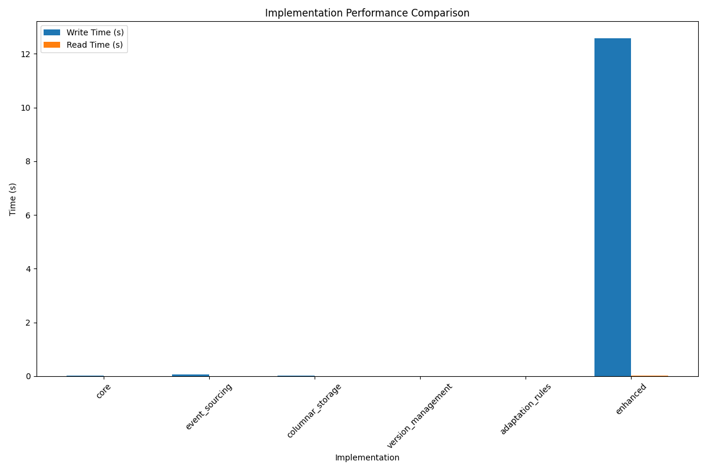
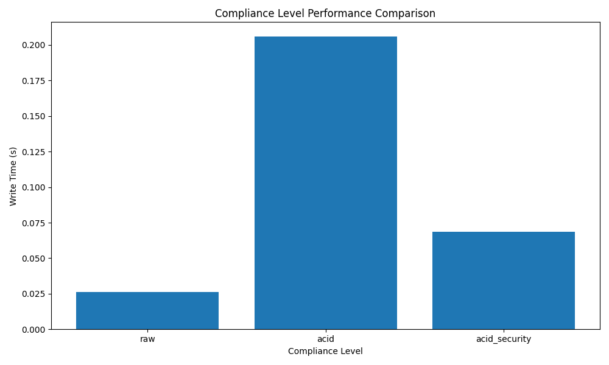
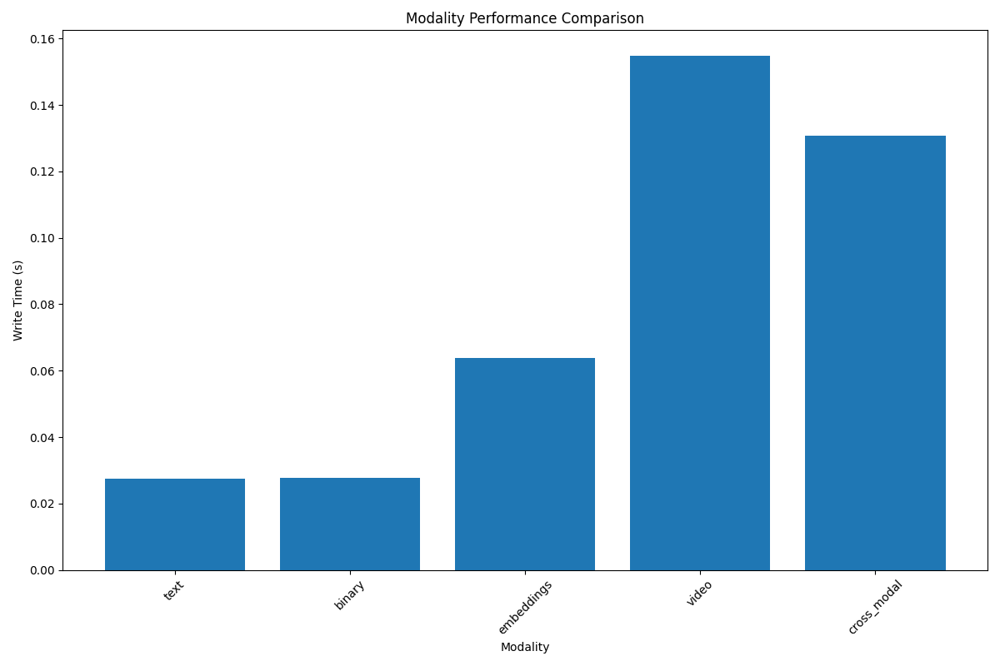

# MAIF Performance Benchmark Report

## Implementation Benchmarks

### Implementation Performance

| Implementation     | Operation   |   Time (s) |   Memory (MB) |   Throughput (ops/s) |
|:-------------------|:------------|-----------:|--------------:|---------------------:|
| core               | write       |     0.0296 |          5.75 |      33775           |
| core               | read        |     0.0002 |          0    |          5.59987e+06 |
| core               | search      |     0.0002 |          0    |          5.37502e+06 |
| core               | update      |     0.0002 |          0    |          5.92695e+06 |
| core               | delete      |     0.0002 |          0    |          5.94937e+06 |
| event_sourcing     | write       |     0.0722 |          0.09 |      13847.2         |
| event_sourcing     | read        |     0.0002 |          0    |          4.36755e+06 |
| event_sourcing     | search      |     0.0006 |          0    |          1.70801e+06 |
| event_sourcing     | update      |     0.0006 |          0    |          1.75862e+06 |
| event_sourcing     | delete      |     0.0013 |          0    |     760481           |
| columnar_storage   | write       |     0.0085 |          4.17 |     117573           |
| columnar_storage   | read        |     0.0028 |          0.88 |     351321           |
| columnar_storage   | search      |     0.0002 |          0    |          5.80393e+06 |
| columnar_storage   | update      |     0.0002 |          0    |          5.2825e+06  |
| columnar_storage   | delete      |     0.0002 |          0    |          6.12009e+06 |
| version_management | write       |     0.0002 |          0    |          5.26041e+06 |
| version_management | read        |     0.0002 |          0    |          6.13801e+06 |
| version_management | search      |     0.0002 |          0    |          5.89364e+06 |
| version_management | update      |     0.0002 |          0    |          6.48938e+06 |
| version_management | delete      |     0.0002 |          0    |          5.81465e+06 |
| adaptation_rules   | write       |     0.0001 |          0    |          6.76865e+06 |
| adaptation_rules   | read        |     0.0002 |          0    |          6.21993e+06 |
| adaptation_rules   | search      |     0.0002 |          0    |          5.38652e+06 |
| adaptation_rules   | update      |     0.0002 |          0    |          5.95218e+06 |
| adaptation_rules   | delete      |     0.0001 |          0    |          6.68237e+06 |
| enhanced           | write       |    12.5782 |          4.29 |         79.5         |
| enhanced           | read        |     0.0097 |          0    |     103462           |
| enhanced           | search      |     0.001  |          0.03 |          1.03725e+06 |
| enhanced           | update      |     0.0002 |          0    |          4.92868e+06 |
| enhanced           | delete      |     0.0002 |          0    |          5.28694e+06 |

## Compliance Level Benchmarks

### Compliance Level Performance

| Compliance Level   | Operation   |   Time (s) |   Memory (MB) |   Throughput (ops/s) |
|:-------------------|:------------|-----------:|--------------:|---------------------:|
| raw                | write       |     0.0263 |          0.02 |      38037           |
| raw                | read        |     0.0002 |          0    |          5.30925e+06 |
| raw                | search      |     0.0002 |          0    |          5.44951e+06 |
| raw                | update      |     0.0002 |          0    |          5.70654e+06 |
| raw                | delete      |     0.0002 |          0    |          5.28916e+06 |
| acid               | write       |     0.2058 |          0.99 |       4858.54        |
| acid               | read        |     0.0002 |          0    |          5.54313e+06 |
| acid               | search      |     0.0002 |          0    |          5.3476e+06  |
| acid               | update      |     0.0002 |          0    |          5.85524e+06 |
| acid               | delete      |     0.0002 |          0    |          5.92695e+06 |
| acid_security      | write       |     0.0687 |          2.35 |      14554.1         |
| acid_security      | read        |     0.0002 |          0    |          6.19543e+06 |
| acid_security      | search      |     0.0002 |          0    |          5.64003e+06 |
| acid_security      | update      |     0.0002 |          0    |          5.43538e+06 |
| acid_security      | delete      |     0.0002 |          0    |          4.60913e+06 |

## Modality Benchmarks

### Modality Performance

| Modality    | Operation   |   Time (s) |   Memory (MB) |   Throughput (ops/s) |
|:------------|:------------|-----------:|--------------:|---------------------:|
| text        | write       |     0.0274 |          0.7  |      36494.4         |
| text        | read        |     0.0002 |          0    |          5.50434e+06 |
| binary      | write       |     0.0276 |          0.56 |      36206.7         |
| binary      | read        |     0.0002 |          0    |          5.53582e+06 |
| embeddings  | write       |     0.0637 |          7.35 |      15692.8         |
| embeddings  | read        |     0.0002 |          0    |          5.1296e+06  |
| video       | write       |     0.1548 |         -0.05 |       6460.91        |
| video       | read        |     0.0002 |          0    |          5.42367e+06 |
| cross_modal | write       |     0.1309 |          1.17 |       7641.5         |
| cross_modal | read        |     0.0002 |          0    |          5.8964e+06  |

## Performance Comparisons

