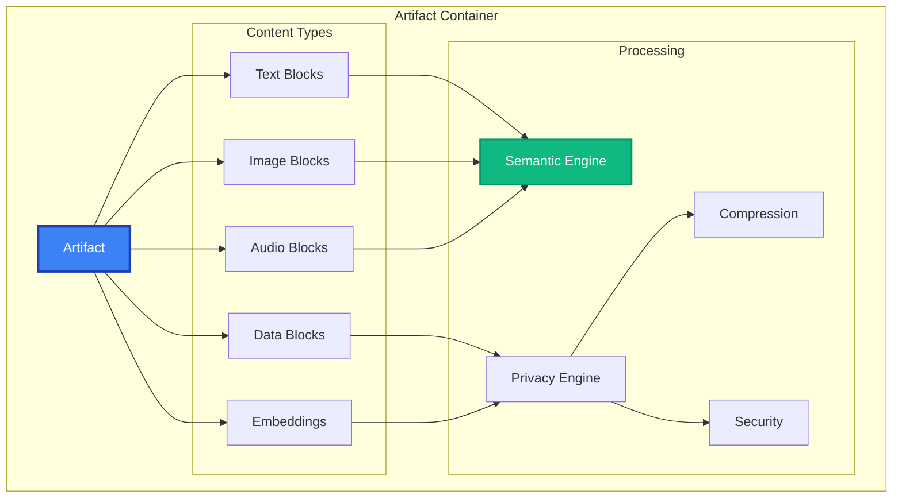

# Artifact API Reference

The `Artifact` class is MAIF's intelligent data container, providing structured storage for agent memory with built-in privacy, security, and semantic capabilities.

## Overview

Artifacts manage:
- **Multi-modal Content**: Text, images, audio, structured data
- **Semantic Processing**: Automatic embedding generation and similarity search  
- **Privacy & Security**: Encryption, anonymization, digital signatures
- **Performance**: Compression, memory-mapped I/O, streaming
- **Data Integrity**: Checksums, audit trails, version control



## Quick Start

This example provides a brief overview of the `Artifact`'s core functionality: creating an artifact, adding content, searching, and saving.

```python
from maif_sdk import create_client

# 1. Create a client and then an artifact associated with it.
client = create_client("my-agent")
artifact = client.create_artifact("agent-memory")

# 2. Add different types of content to the artifact.
text_id = artifact.add_text("User prefers dark theme")
image_id = artifact.add_image("avatar.jpg", caption="User profile")

# 3. Perform a semantic search on the artifact's content.
results = artifact.search("user preferences", top_k=5)

# 4. Save the artifact to a file and load it back.
artifact.save("memory.maif")
loaded = client.load_artifact("memory.maif")
```

## Constructor Options

The `create_artifact` function accepts a wide range of options to pre-configure the artifact for specific use cases, from high-performance computing to enterprise security.

```python
artifact = client.create_artifact(
    name="advanced-memory",
    
    # --- Privacy & Security ---
    privacy_level=PrivacyLevel.CONFIDENTIAL, # Set a default privacy level for all blocks.
    enable_encryption=True, # Encrypt all new blocks by default.
    enable_signing=True, # Add a digital signature on every save.
    
    # --- Performance ---
    enable_compression=True, # Enable compression for all new blocks.
    enable_mmap=True, # Use memory-mapped I/O for file access.
    buffer_size=64*1024, # Set the write buffer size to 64 KB.
    
    # --- Semantic Processing ---
    enable_semantic_search=True, # Automatically generate and index embeddings.
    embedding_model="all-MiniLM-L6-v2", # Specify the default embedding model.
    semantic_threshold=0.75, # Set the default similarity threshold for search.
    
    # --- Multi-modal ---
    enable_cross_modal=True, # Enable cross-modal understanding and search.
    auto_generate_captions=True, # Automatically generate captions for images.
    
    # --- Metadata ---
    metadata={
        "version": "1.0",
        "tags": ["production"],
        "description": "Agent memory container"
    }
)
```

## Content Management

### Text Operations

#### `add_text(content, **options) -> str`

Adds a text block to the artifact. This method can also trigger advanced processing like encryption, PII anonymization, and entity extraction.

```python
# Add a simple text block.
text_id = artifact.add_text("User completed onboarding")

# Add a text block with advanced options.
text_id = artifact.add_text(
    content="Confidential project information", # The text content to store.
    title="Project Alpha Notes", # A title for the block.
    tags=["project", "confidential"], # Add filterable tags.
    encrypt=True, # Encrypt this specific block.
    anonymize_pii=True, # Automatically detect and redact PII.
    privacy_level=PrivacyLevel.RESTRICTED, # Set a high privacy level.
    generate_embedding=True, # Ensure a semantic embedding is generated.
    extract_entities=True, # Extract named entities (e.g., people, organizations).
    metadata={ # Attach custom structured metadata.
        "client_id": "CLIENT_001",
        "priority": "high",
        "author": "alice@company.com"
    }
)
```

#### `get_text(text_id) -> TextBlock`

Retrieves a text block by its unique ID.

```python
# Retrieve the block from the artifact.
text_block = artifact.get_text(text_id)

# Access the block's content and processed attributes.
print(f"Content: {text_block.content}")
print(f"Entities: {text_block.extracted_entities}")
print(f"Embedding: {text_block.embedding}")
```

### Image Operations

#### `add_image(image_path, **options) -> str`

Adds an image block to the artifact, with options for advanced image processing like OCR, feature extraction, and privacy-enhancing blurs.

```python
# Add a simple image block from a file path.
image_id = artifact.add_image("photo.jpg")

# Add an image with advanced processing options.
image_id = artifact.add_image(
    image_path="diagram.png", # The path to the image file.
    caption="System architecture", # A user-provided caption.
    tags=["architecture", "diagram"], # Add filterable tags.
    generate_caption=True, # Automatically generate a caption using an AI model.
    extract_text=True,        # Perform OCR to extract text from the image.
    extract_features=True,    # Extract visual features (e.g., objects, faces).
    encrypt=True, # Encrypt the image data.
    blur_faces=True,         # Automatically detect and blur faces for privacy.
    compress=True, # Compress the image data.
    metadata={
        "project": "System Design",
        "created_by": "architect@company.com"
    }
)
```

#### `get_image(image_id) -> ImageBlock`

Retrieves an image block by its unique ID.

```python
# Retrieve the image block.
image_block = artifact.get_image(image_id)

# Access the image's attributes and processed data.
print(f"Caption: {image_block.caption}")
print(f"Dimensions: {image_block.width}x{image_block.height}")
print(f"OCR Text: {image_block.ocr_text}")

# Access the raw image data or a generated thumbnail.
image_data = image_block.get_image_data()
thumbnail = image_block.get_thumbnail()
```

### Audio Operations

#### `add_audio(audio_path, **options) -> str`

Adds an audio block, with options for transcription, speaker identification, and other audio analysis tasks.

```python
# Add a simple audio block from a file path.
audio_id = artifact.add_audio("recording.wav")

# Add an audio block with advanced processing.
audio_id = artifact.add_audio(
    audio_path="meeting.mp3",
    title="Strategy Meeting",
    transcribe=True, # Transcribe the audio to text.
    identify_speakers=True, # Identify different speakers in the audio.
    extract_sentiment=True, # Analyze the sentiment of the conversation.
    generate_summary=True, # Generate a summary of the transcript.
    encrypt=True, # Encrypt the audio data.
    anonymize_speakers=True, # Anonymize speaker identities in the transcript.
    metadata={
        "meeting_date": "2024-01-15",
        "participants": ["Alice", "Bob"],
        "duration_minutes": 45
    }
)
```

#### `get_audio(audio_id) -> AudioBlock`

Retrieves an audio block by its unique ID.

```python
# Retrieve the audio block.
audio_block = artifact.get_audio(audio_id)

# Access the audio's attributes and processed data.
print(f"Duration: {audio_block.duration_seconds}s")
print(f"Transcript: {audio_block.transcript}")
print(f"Speakers: {audio_block.identified_speakers}")
print(f"Summary: {audio_block.summary}")
```

### Structured Data Operations

#### `add_data(data, **options) -> str`

Adds a structured data block, such as JSON or CSV, with options for indexing specific fields for later querying.

```python
# Add a JSON data block.
data_id = artifact.add_data(
    data={ # The JSON data can be a Python dictionary.
        "user_id": "U123",
        "preferences": {"theme": "dark", "language": "en"},
        "activity": [
            {"action": "login", "timestamp": "2024-01-15T10:00:00Z"}
        ]
    },
    data_type="json",
    index_fields=["user_id"], # Index specific fields for fast lookups.
    encrypt_fields=["user_id"], # Encrypt specific fields within the JSON structure.
    generate_embedding=True # Generate a semantic embedding for the entire JSON object.
)

# Add a CSV data block from a file.
csv_id = artifact.add_data(
    data="analytics.csv", # The path to the CSV file.
    data_type="csv",
    has_header=True,
    index_columns=["user_id", "date"], # Index specific columns.
    encrypt_columns=["email", "phone"] # Encrypt specific columns.
)
```

## Search & Query Operations

### Semantic Search

#### `search(query, **options) -> List[SearchResult]`

Performs a semantic search across all content in the artifact.

```python
# Perform a simple semantic search.
results = artifact.search("user preferences")

# Perform an advanced search with multiple options.
results = artifact.search(
    query="project planning meetings", # The semantic query.
    top_k=20, # Return the top 20 results.
    similarity_threshold=0.7, # Set a minimum similarity score.
    search_types=["text", "audio"], # Limit the search to specific content types.
    filters={ # Apply filters based on metadata.
        "tags": ["project", "meeting"],
        "date_range": ("2024-01-01", "2024-01-31"),
        "privacy_level": [PrivacyLevel.INTERNAL]
    },
    include_metadata=True, # Include full metadata in the results.
    highlight_matches=True, # Highlight the parts of the content that match the query.
    boost_recent=True # Give a higher score to more recent content.
)

# Process the search results.
for result in results:
    print(f"Content: {result.content}")
    print(f"Similarity: {result.similarity:.3f}")
    print(f"Type: {result.content_type}")
    print(f"Highlights: {result.highlights}")
```

### Cross-Modal Search

#### `search_cross_modal(query, **options) -> List[SearchResult]`

Performs a semantic search that can cross data modalities, such as using a text query to find images.

```python
# Use a text query to find relevant images and text.
results = artifact.search_cross_modal(
    query="system architecture", # The text query.
    source_modality="text", # The modality of the query.
    target_modalities=["image", "text"], # The modalities to search within.
    cross_modal_weight=0.3, # Adjust the importance of cross-modal relationships.
    top_k=15
)

# Use an image query to find related text and audio content.
results = artifact.search_cross_modal(
    query="diagram.png", # The path to the query image.
    source_modality="image", # The modality of the query.
    target_modalities=["text", "audio"], # The modalities to search within.
    similarity_threshold=0.6
)
```

### Structured Queries

#### `query_structured(query_spec) -> List[SearchResult]`

Performs a complex, structured query on the artifact's content, combining semantic search with precise filtering.

```python
# Define a complex query using a dictionary-based specification.
results = artifact.query_structured({
    "select": ["content", "metadata", "similarity"], # The fields to return.
    "where": { # The filtering conditions.
        "and": [
            {"content_type": {"in": ["text", "audio"]}},
            {"tags": {"contains": "meeting"}},
            {"created_date": {"gte": "2024-01-01"}},
            {"similarity": {"gte": 0.7}}
        ]
    },
    "semantic_query": "project deadlines", # The semantic part of the query.
    "order_by": [{"similarity": "desc"}], # How to order the results.
    "limit": 25 # The maximum number of results to return.
})
```

## Advanced Operations

### Batch Operations

#### `add_batch(items, **options) -> List[str]`

Efficiently adds a batch of items to the artifact, with options for parallel processing.

```python
# A list of items to be added in a batch.
items = [
    {"type": "text", "content": "First item", "tags": ["batch"]},
    {"type": "text", "content": "Second item", "tags": ["batch"]},
    {"type": "image", "path": "image.jpg", "caption": "Batch image"}
]

# Add the items in a single batch operation.
item_ids = artifact.add_batch(
    items,
    batch_size=100, # The size of each mini-batch for processing.
    parallel_processing=True, # Use multiple threads to process the batch.
    generate_embeddings=True, # Generate embeddings for all items in the batch.
    progress_callback=lambda p: print(f"Progress: {p:.1%}") # A callback to monitor progress.
)
```

### Export & Import

#### `export(format, **options) -> Union[str, bytes, dict]`

Exports the artifact's content to various formats, such as JSON, Parquet, or a raw embedding matrix.

```python
# Export the artifact's content to a JSON object.
json_data = artifact.export("json", include_embeddings=False)

# Export the artifact to a Parquet file for big data processing.
parquet_path = artifact.export(
    "parquet",
    output_path="export.parquet",
    include_embeddings=True, # Include embeddings in the export.
    partition_by=["content_type"] # Partition the data by content type.
)

# Export just the embeddings as a NumPy array.
embeddings = artifact.export(
    "embeddings",
    format="numpy",
    normalize=True # Normalize the embeddings before exporting.
)
```

#### `import_data(source, **options) -> List[str]`

Imports data from various sources, such as JSON or CSV files, into the artifact.

```python
# Import data from a JSON file.
item_ids = artifact.import_data(
    "data.json",
    format="json",
    validate_schema=True, # Validate the data against a schema before importing.
    generate_embeddings=True # Generate embeddings for the imported data.
)

# Import data from a CSV file.
csv_ids = artifact.import_data(
    "data.csv",
    format="csv",
    text_columns=["description"], # Specify which columns contain text content.
    metadata_columns=["category"], # Specify which columns should be treated as metadata.
    encrypt_columns=["email"] # Specify columns to encrypt.
)
```

## Storage & Persistence

### Save Operations

#### `save(path, **options) -> bool`

Saves the artifact to a file, with numerous options for compression, encryption, and integrity verification.

```python
# Save the artifact to a file with default settings.
artifact.save("memory.maif")

# Save the artifact with advanced security and performance options.
success = artifact.save(
    path="secure-memory.maif",
    compress=True, # Enable compression.
    compression_level=CompressionLevel.HIGH, # Use a high compression level.
    encrypt=True, # Encrypt the artifact.
    sign=True, # Add a digital signature.
    generate_checksum=True, # Generate a checksum for integrity verification.
    include_audit_log=True, # Include the full audit log in the saved file.
    metadata={"saved_by": "user123"} # Add save-time metadata.
)
```

### Load Operations

#### `load(path, **options) -> bool`

Loads an artifact from a file, with options to verify its integrity and decrypt its content.

```python
# Load an artifact from a file with default settings.
artifact.load("memory.maif")

# Load an artifact with advanced security and performance options.
success = artifact.load(
    path="secure-memory.maif",
    verify_signature=True, # Verify the digital signature.
    verify_checksum=True, # Verify the file's checksum.
    decrypt_key="user-key", # Provide a key to decrypt the content.
    lazy_load=True, # Lazily load data to reduce initial memory usage.
    mmap=True, # Use memory-mapped I/O.
    validate_integrity=True # Perform a full integrity validation of all blocks.
)
```

## Properties & Information

### Artifact Information

Access various properties and detailed information about the artifact.

```python
# Access basic properties of the artifact.
print(f"Name: {artifact.name}")
print(f"Size (in bytes): {artifact.size}")
print(f"Total number of items: {artifact.count}")
print(f"Is the artifact encrypted? {artifact.is_encrypted}")
print(f"Is the artifact compressed? {artifact.is_compressed}")

# Get counts of specific content types.
print(f"Number of text items: {artifact.text_count}")
print(f"Number of image items: {artifact.image_count}")
print(f"Number of audio items: {artifact.audio_count}")

# Access artifact-level metadata.
print(f"Tags: {artifact.tags}")
print(f"Default privacy level: {artifact.privacy_level}")

# Get a detailed information object.
info = artifact.get_info()
print(f"Created on: {info.created_date}")
print(f"Artifact version: {info.version}")
print(f"Performance statistics: {info.statistics}")
```

## Iteration & Access

### Content Iteration

Iterate over the content of the artifact in various ways.

```python
# Iterate over all items in the artifact.
for item in artifact:
    print(f"ID: {item.id}, Type: {item.content_type}")

# Iterate over items of a specific type.
for text_item in artifact.iter_text():
    print(f"Text: {text_item.content}")

for image_item in artifact.iter_images():
    print(f"Image caption: {image_item.caption}")

# Iterate with filters applied.
for item in artifact.iter_filtered(
    content_types=["text", "audio"],
    tags=["meeting"],
    date_range=("2024-01-01", "2024-01-31")
):
    process_item(item)
```

### Block Access

Access the underlying data blocks directly for low-level operations.

```python
# Access a single block by its unique ID.
block = artifact.get_block("block-id")
print(f"Block type: {block.block_type}")

# Access a batch of blocks by their IDs.
blocks = artifact.get_blocks(["id1", "id2", "id3"])

# Stream blocks for large artifacts to conserve memory.
for block in artifact.stream_blocks(batch_size=100):
    process_block(block)
```

## Error Handling

The `Artifact` class raises specific exceptions to allow for fine-grained error handling.

```python
from maif.exceptions import (
    ArtifactError,     # Base exception for artifact-related errors.
    ContentError,      # Raised on errors related to content management.
    SearchError,       # Raised on errors during search operations.
    EncryptionError,   # Raised on encryption/decryption failures.
    IntegrityError     # Raised on data integrity verification failures.
)

try:
    artifact = client.create_artifact("test")
    text_id = artifact.add_text("content")
    results = artifact.search("query")
    
except ContentError as e:
    logger.error(f"Content error: {e}")
except SearchError as e:
    logger.error(f"Search error: {e}")
except EncryptionError as e:
    logger.error(f"Encryption error: {e}")
except IntegrityError as e:
    logger.error(f"Integrity error: {e}")
except ArtifactError as e:
    logger.error(f"General artifact error: {e}")
```

## Best Practices

### Performance

Follow these best practices to maximize the performance of your artifacts.

```python
# 1. Use batch operations for bulk data ingestion.
item_ids = artifact.add_batch(items, batch_size=1000)

# 2. Enable compression where appropriate.
artifact.configure(enable_compression=True)

# 3. Use lazy loading for large artifacts to reduce initial memory usage.
artifact = client.load_artifact("large.maif", lazy_load=True)

# 4. Stream content from large artifacts instead of loading everything into memory.
for batch in artifact.stream_blocks(batch_size=500):
    process_batch(batch)
```

### Security

Follow these best practices to ensure the security of your artifacts.

```python
# 1. Encrypt all sensitive content.
text_id = artifact.add_text("sensitive", encrypt=True)

# 2. Use digital signatures to protect against tampering.
artifact.save("critical.maif", sign=True)

# 3. Always verify the integrity of critical artifacts upon loading.
artifact.load("critical.maif", verify_signature=True)

# 4. Configure the artifact to automatically anonymize PII.
artifact.configure(anonymize_pii=True)
```

### Memory Management

Follow these best practices to manage the memory usage of your artifacts.

```python
# 1. Use context managers to ensure resources are cleaned up properly.
with client.create_artifact("temp") as artifact:
    pass  # The artifact's resources are automatically cleaned up here.

# 2. Manually clear internal caches if memory usage becomes an issue.
artifact.clear_caches()

# 3. Monitor memory usage and use the optimization function when needed.
info = artifact.get_info()
if info.memory_usage_mb > 1000:
    artifact.optimize_memory()
```

## Related APIs

- **[MAIFClient](/api/core/client)** - Client operations
- **[Encoder/Decoder](/api/core/encoder-decoder)** - Binary operations  
- **[Privacy Engine](/api/privacy/engine)** - Privacy features 