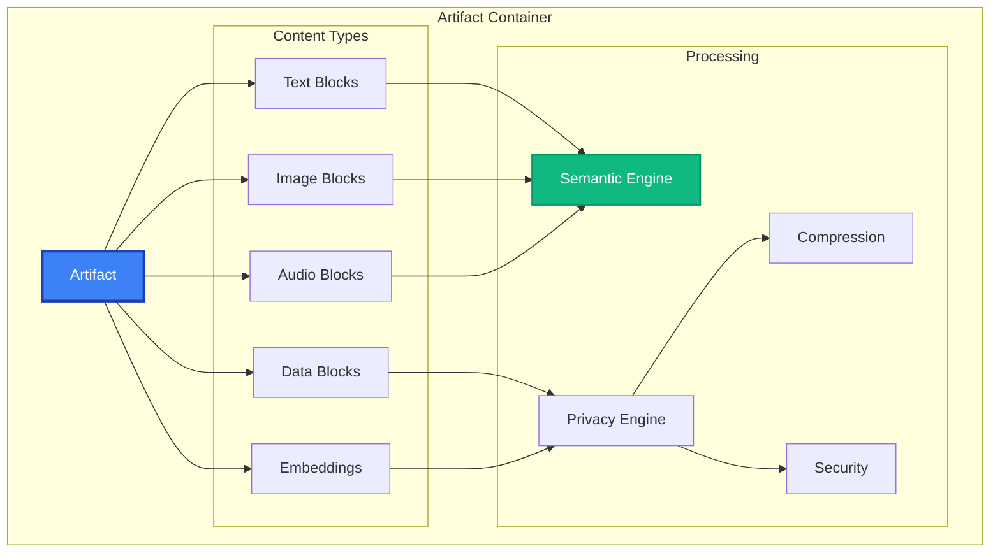

# Artifact API Reference

The `Artifact` class is MAIF's intelligent data container, providing structured storage for agent memory with built-in privacy, security, and semantic capabilities.

## Overview

Artifacts manage:
- **Multi-modal Content**: Text, images, audio, structured data
- **Semantic Processing**: Automatic embedding generation and similarity search  
- **Privacy & Security**: Encryption, anonymization, digital signatures
- **Performance**: Compression, memory-mapped I/O, streaming
- **Data Integrity**: Checksums, audit trails, version control



## Quick Start

```python
from maif_sdk import create_client

# Create artifact
client = create_client("my-agent")
artifact = client.create_artifact("agent-memory")

# Add content
text_id = artifact.add_text("User prefers dark theme")
image_id = artifact.add_image("avatar.jpg", caption="User profile")

# Search semantically
results = artifact.search("user preferences", top_k=5)

# Save and load
artifact.save("memory.maif")
loaded = client.load_artifact("memory.maif")
```

## Constructor Options

```python
artifact = client.create_artifact(
    name="advanced-memory",
    
    # Privacy & Security
    privacy_level=PrivacyLevel.CONFIDENTIAL,
    enable_encryption=True,
    enable_signing=True,
    
    # Performance  
    enable_compression=True,
    enable_mmap=True,
    buffer_size=64*1024,
    
    # Semantic Processing
    enable_semantic_search=True,
    embedding_model="all-MiniLM-L6-v2",
    semantic_threshold=0.75,
    
    # Multi-modal
    enable_cross_modal=True,
    auto_generate_captions=True,
    
    # Metadata
    metadata={
        "version": "1.0",
        "tags": ["production"],
        "description": "Agent memory container"
    }
)
```

## Content Management

### Text Operations

#### `add_text(content, **options) -> str`

```python
# Simple text
text_id = artifact.add_text("User completed onboarding")

# Advanced text with options
text_id = artifact.add_text(
    content="Confidential project information",
    title="Project Alpha Notes",
    tags=["project", "confidential"],
    encrypt=True,
    anonymize_pii=True,
    privacy_level=PrivacyLevel.RESTRICTED,
    generate_embedding=True,
    extract_entities=True,
    metadata={
        "client_id": "CLIENT_001",
        "priority": "high",
        "author": "alice@company.com"
    }
)
```

#### `get_text(text_id) -> TextBlock`

```python
text_block = artifact.get_text(text_id)
print(f"Content: {text_block.content}")
print(f"Entities: {text_block.extracted_entities}")
print(f"Embedding: {text_block.embedding}")
```

### Image Operations

#### `add_image(image_path, **options) -> str`

```python
# Simple image
image_id = artifact.add_image("photo.jpg")

# Advanced image processing
image_id = artifact.add_image(
    image_path="diagram.png",
    caption="System architecture",
    tags=["architecture", "diagram"],
    generate_caption=True,
    extract_text=True,        # OCR
    extract_features=True,    # Visual features
    encrypt=True,
    blur_faces=True,         # Privacy
    compress=True,
    metadata={
        "project": "System Design",
        "created_by": "architect@company.com"
    }
)
```

#### `get_image(image_id) -> ImageBlock`

```python
image_block = artifact.get_image(image_id)
print(f"Caption: {image_block.caption}")
print(f"Dimensions: {image_block.width}x{image_block.height}")
print(f"OCR Text: {image_block.ocr_text}")

# Access image data
image_data = image_block.get_image_data()
thumbnail = image_block.get_thumbnail()
```

### Audio Operations

#### `add_audio(audio_path, **options) -> str`

```python
# Simple audio
audio_id = artifact.add_audio("recording.wav")

# Advanced audio processing
audio_id = artifact.add_audio(
    audio_path="meeting.mp3",
    title="Strategy Meeting",
    transcribe=True,
    identify_speakers=True,
    extract_sentiment=True,
    generate_summary=True,
    encrypt=True,
    anonymize_speakers=True,
    metadata={
        "meeting_date": "2024-01-15",
        "participants": ["Alice", "Bob"],
        "duration_minutes": 45
    }
)
```

#### `get_audio(audio_id) -> AudioBlock`

```python
audio_block = artifact.get_audio(audio_id)
print(f"Duration: {audio_block.duration_seconds}s")
print(f"Transcript: {audio_block.transcript}")
print(f"Speakers: {audio_block.identified_speakers}")
print(f"Summary: {audio_block.summary}")
```

### Structured Data Operations

#### `add_data(data, **options) -> str`

```python
# JSON data
data_id = artifact.add_data(
    data={
        "user_id": "U123",
        "preferences": {"theme": "dark", "language": "en"},
        "activity": [
            {"action": "login", "timestamp": "2024-01-15T10:00:00Z"}
        ]
    },
    data_type="json",
    index_fields=["user_id"],
    encrypt_fields=["user_id"],
    generate_embedding=True
)

# CSV data
csv_id = artifact.add_data(
    data="analytics.csv",
    data_type="csv",
    has_header=True,
    index_columns=["user_id", "date"],
    encrypt_columns=["email", "phone"]
)
```

## Search & Query Operations

### Semantic Search

#### `search(query, **options) -> List[SearchResult]`

```python
# Simple search
results = artifact.search("user preferences")

# Advanced search
results = artifact.search(
    query="project planning meetings",
    top_k=20,
    similarity_threshold=0.7,
    search_types=["text", "audio"],
    filters={
        "tags": ["project", "meeting"],
        "date_range": ("2024-01-01", "2024-01-31"),
        "privacy_level": [PrivacyLevel.INTERNAL]
    },
    include_metadata=True,
    highlight_matches=True,
    boost_recent=True
)

# Process results
for result in results:
    print(f"Content: {result.content}")
    print(f"Similarity: {result.similarity:.3f}")
    print(f"Type: {result.content_type}")
    print(f"Highlights: {result.highlights}")
```

### Cross-Modal Search

#### `search_cross_modal(query, **options) -> List[SearchResult]`

```python
# Text query finding images
results = artifact.search_cross_modal(
    query="system architecture",
    source_modality="text",
    target_modalities=["image", "text"],
    cross_modal_weight=0.3,
    top_k=15
)

# Image query finding related content
results = artifact.search_cross_modal(
    query="diagram.png",
    source_modality="image",
    target_modalities=["text", "audio"],
    similarity_threshold=0.6
)
```

### Structured Queries

#### `query_structured(query_spec) -> List[SearchResult]`

```python
# Complex structured query
results = artifact.query_structured({
    "select": ["content", "metadata", "similarity"],
    "where": {
        "and": [
            {"content_type": {"in": ["text", "audio"]}},
            {"tags": {"contains": "meeting"}},
            {"created_date": {"gte": "2024-01-01"}},
            {"similarity": {"gte": 0.7}}
        ]
    },
    "semantic_query": "project deadlines",
    "order_by": [{"similarity": "desc"}],
    "limit": 25
})
```

## Advanced Operations

### Batch Operations

#### `add_batch(items, **options) -> List[str]`

```python
items = [
    {"type": "text", "content": "First item", "tags": ["batch"]},
    {"type": "text", "content": "Second item", "tags": ["batch"]},
    {"type": "image", "path": "image.jpg", "caption": "Batch image"}
]

item_ids = artifact.add_batch(
    items,
    batch_size=100,
    parallel_processing=True,
    generate_embeddings=True,
    progress_callback=lambda p: print(f"Progress: {p:.1%}")
)
```

### Export & Import

#### `export(format, **options) -> Union[str, bytes, dict]`

```python
# Export to JSON
json_data = artifact.export("json", include_embeddings=False)

# Export to Parquet
parquet_path = artifact.export(
    "parquet",
    output_path="export.parquet",
    include_embeddings=True,
    partition_by=["content_type"]
)

# Export embeddings
embeddings = artifact.export(
    "embeddings",
    format="numpy",
    normalize=True
)
```

#### `import_data(source, **options) -> List[str]`

```python
# Import from JSON
item_ids = artifact.import_data(
    "data.json",
    format="json",
    validate_schema=True,
    generate_embeddings=True
)

# Import from CSV
csv_ids = artifact.import_data(
    "data.csv",
    format="csv",
    text_columns=["description"],
    metadata_columns=["category"],
    encrypt_columns=["email"]
)
```

## Storage & Persistence

### Save Operations

#### `save(path, **options) -> bool`

```python
# Simple save
artifact.save("memory.maif")

# Advanced save
success = artifact.save(
    path="secure-memory.maif",
    compress=True,
    encryption_level=CompressionLevel.HIGH,
    encrypt=True,
    sign=True,
    generate_checksum=True,
    include_audit_log=True,
    metadata={"saved_by": "user123"}
)
```

### Load Operations

#### `load(path, **options) -> bool`

```python
# Simple load
artifact.load("memory.maif")

# Advanced load with verification
success = artifact.load(
    path="secure-memory.maif",
    verify_signature=True,
    verify_checksum=True,
    decrypt_key="user-key",
    lazy_load=True,
    mmap=True,
    validate_integrity=True
)
```

## Properties & Information

### Artifact Information

```python
# Basic properties
print(f"Name: {artifact.name}")
print(f"Size: {artifact.size}")
print(f"Item count: {artifact.count}")
print(f"Encrypted: {artifact.is_encrypted}")
print(f"Compressed: {artifact.is_compressed}")

# Content counts
print(f"Text items: {artifact.text_count}")
print(f"Image items: {artifact.image_count}")
print(f"Audio items: {artifact.audio_count}")

# Metadata
print(f"Tags: {artifact.tags}")
print(f"Privacy level: {artifact.privacy_level}")

# Detailed info
info = artifact.get_info()
print(f"Created: {info.created_date}")
print(f"Version: {info.version}")
print(f"Statistics: {info.statistics}")
```

## Iteration & Access

### Content Iteration

```python
# Iterate all items
for item in artifact:
    print(f"ID: {item.id}, Type: {item.content_type}")

# Iterate by type
for text_item in artifact.iter_text():
    print(f"Text: {text_item.content}")

for image_item in artifact.iter_images():
    print(f"Image: {image_item.caption}")

# Filtered iteration
for item in artifact.iter_filtered(
    content_types=["text", "audio"],
    tags=["meeting"],
    date_range=("2024-01-01", "2024-01-31")
):
    process_item(item)
```

### Block Access

```python
# Direct block access
block = artifact.get_block("block-id")
print(f"Block type: {block.block_type}")

# Batch access
blocks = artifact.get_blocks(["id1", "id2", "id3"])

# Streaming for large artifacts
for block in artifact.stream_blocks(batch_size=100):
    process_block(block)
```

## Error Handling

```python
from maif.exceptions import (
    ArtifactError,
    ContentError,
    SearchError,
    EncryptionError,
    IntegrityError
)

try:
    artifact = client.create_artifact("test")
    text_id = artifact.add_text("content")
    results = artifact.search("query")
    
except ContentError as e:
    logger.error(f"Content error: {e}")
except SearchError as e:
    logger.error(f"Search error: {e}")
except EncryptionError as e:
    logger.error(f"Encryption error: {e}")
except IntegrityError as e:
    logger.error(f"Integrity error: {e}")
except ArtifactError as e:
    logger.error(f"Artifact error: {e}")
```

## Best Practices

### Performance

```python
# Use batch operations
item_ids = artifact.add_batch(items, batch_size=1000)

# Enable compression
artifact.configure(enable_compression=True)

# Use lazy loading
artifact = client.load_artifact("large.maif", lazy_load=True)

# Stream large datasets
for batch in artifact.stream_blocks(batch_size=500):
    process_batch(batch)
```

### Security

```python
# Encrypt sensitive content
text_id = artifact.add_text("sensitive", encrypt=True)

# Use digital signatures
artifact.save("critical.maif", sign=True)

# Verify integrity
artifact.load("critical.maif", verify_signature=True)

# Anonymize PII
artifact.configure(anonymize_pii=True)
```

### Memory Management

```python
# Use context managers
with client.create_artifact("temp") as artifact:
    pass  # Auto cleanup

# Clear caches
artifact.clear_caches()

# Monitor usage
info = artifact.get_info()
if info.memory_usage_mb > 1000:
    artifact.optimize_memory()
```

## Related APIs

- **[MAIFClient](/api/core/client)** - Client operations
- **[Encoder/Decoder](/api/core/encoder-decoder)** - Binary operations  
- **[Privacy Engine](/api/privacy/engine)** - Privacy features 