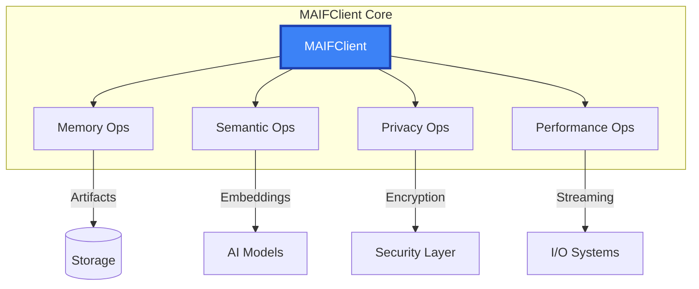

# MAIFClient API Reference

The `MAIFClient` is the primary interface for MAIF operations, providing high-level access to agent memory, semantic processing, privacy protection, and performance optimization.

## Overview

MAIFClient manages:
- **Agent Memory**: Persistent storage and retrieval
- **Semantic Processing**: AI-powered understanding and search
- **Privacy & Security**: Enterprise-grade encryption and access control
- **Performance**: Memory-mapped I/O and streaming operations
- **Multi-modal Data**: Text, images, audio, and structured data



## Quick Start

This example provides a brief overview of the `MAIFClient`'s core functionality: creating a client, storing information with `remember`, retrieving it with `recall`, and configuring advanced features.

```python
from maif_sdk import create_client, ContentType

# Create a basic client instance with a unique agent ID.
client = create_client("my-agent")

# Write content to a MAIF file
client.write_content(
    "agent_memory.maif",
    b"User prefers dark theme",
    content_type=ContentType.TEXT,
    metadata={"topic": "preferences"}
)

# Read content from a MAIF file
content = client.read_content("agent_memory.maif")

# Create a client with more advanced configurations for an enterprise-grade agent.
client = create_client(
    "enterprise-agent",
    enable_mmap=True,         # Enable memory-mapped I/O for performance
    enable_compression=True,  # Enable automatic compression
    use_aws=True             # Enable AWS backend integration
)
```

## Constructor

### `MAIFClient(agent_id, **config)`

The `MAIFClient` constructor accepts a wide range of configuration options to fine-tune its behavior for performance, security, privacy, and more.

```python
client = MAIFClient(
    agent_id="my-agent",
    
    # --- Performance Tuning ---
    enable_mmap=True,                    # Use memory-mapped I/O for high-performance file access.
    buffer_size=128*1024,                # Set the write buffer size to 128 KB.
    max_concurrent_writers=8,            # Allow up to 8 parallel write operations.
    
    # --- Security Configuration ---
    default_security_level=SecurityLevel.CONFIDENTIAL, # Set a default security level for all data.
    enable_signing=True,                 # Automatically add digital signatures when saving artifacts.
    require_authentication=True,         # Require authentication for client operations.
    
    # --- Privacy Configuration ---
    enable_privacy=True,                 # Enable the privacy engine.
    default_encryption=True,             # Encrypt all new data by default.
    anonymization_patterns=["ssn", "email"], # Define custom patterns for PII detection.
    
    # --- Semantic Configuration ---
    embedding_model="all-MiniLM-L6-v2",  # Specify the default model for generating embeddings.
    enable_semantic_search=True,         # Automatically index new data for semantic search.
    semantic_threshold=0.75,             # Set the default similarity threshold for search.
    
    # --- Compression Configuration ---
    default_compression=CompressionLevel.BALANCED, # Set the default compression level.
    semantic_compression=True,           # Use the novel HSC algorithm for semantic-aware compression.
    compression_threshold=1024           # Only compress data blocks larger than 1 KB.
)
```

## Core Methods

### Memory Operations

These methods provide the primary interface for an agent's memory, allowing it to remember, recall, and forget information.

#### `remember(content, **options) -> str`

Stores a piece of information in the agent's memory. This method handles semantic indexing, encryption, and metadata attachment automatically.

```python
# Store a simple string. MAIF returns a unique ID for the memory block.
memory_id = client.remember("User prefers dark theme")

# Store a more complex piece of information with additional options.
memory_id = client.remember(
    content="Important client meeting notes", # The data to be stored.
    tags=["meeting", "client", "important"], # Add tags for filtering.
    privacy_level=PrivacyLevel.CONFIDENTIAL, # Set a specific privacy level for this block.
    encrypt=True, # Explicitly encrypt this block.
    metadata={ # Attach structured metadata.
        "meeting_date": "2024-01-15",
        "participants": ["Alice", "Bob"],
        "duration_minutes": 60
    }
)
```

#### `recall(query, **options) -> List[SearchResult]`

Performs a semantic search across the agent's memory to find the most relevant information based on the meaning of the query.

```python
# Perform a simple semantic search.
results = client.recall("user preferences")

# Perform an advanced search with filtering and a similarity threshold.
results = client.recall(
    query="client meetings", # The semantic query.
    top_k=10, # Retrieve the top 10 most relevant results.
    similarity_threshold=0.7, # Only return results with a similarity score of 0.7 or higher.
    filters={ # Filter results based on metadata.
        "tags": ["meeting"],
        "date_range": ("2024-01-01", "2024-01-31")
    },
    include_metadata=True # Include the full metadata in the search results.
)

# Iterate through the search results.
for result in results:
    print(f"Content: {result.content}")
    print(f"Similarity: {result.similarity:.3f}")
    print(f"Metadata: {result.metadata}")
```

#### `forget(memory_id) -> bool`

Permanently removes a specific piece of information from the agent's memory using its unique ID.

```python
# The method returns True if the operation was successful.
success = client.forget("memory-id-123")
```

### Artifact Management

These methods allow you to create and load `Artifacts`, which are the underlying containers for agent memory.

#### `create_artifact(name, **options) -> Artifact`

Creates a new, empty artifact with the specified name and configuration options.

```python
# Create a basic artifact.
artifact = client.create_artifact("agent-memory")

# Create an artifact with advanced configuration.
artifact = client.create_artifact(
    name="secure-memory",
    privacy_level=PrivacyLevel.CONFIDENTIAL, # Set a default privacy level for the artifact.
    enable_encryption=True, # Encrypt all blocks in this artifact by default.
    enable_compression=True, # Compress all blocks in this artifact by default.
    metadata={"version": "1.0", "tags": ["production"]} # Add artifact-level metadata.
)
```

#### `load_artifact(path, **options) -> Artifact`

Loads an existing artifact from a file, with options to verify its integrity and decrypt its content.

```python
# Load an artifact from a .maif file.
artifact = client.load_artifact("agent-memory.maif")

# Load an artifact with security and performance options.
artifact = client.load_artifact(
    path="secure-memory.maif",
    verify_signature=True, # Verify the artifact's digital signature to ensure it hasn't been tampered with.
    decrypt_key="user-key", # Provide a key to decrypt the artifact's content.
    lazy_load=True, # Lazily load data blocks to reduce initial memory usage.
    mmap=True # Use memory-mapped I/O for faster access to the file.
)
```

### Streaming Operations

These methods are designed for high-performance processing of large datasets that may not fit into memory.

#### `stream_write(data_stream, output_path, **options) -> StreamStats`

Writes a stream of data to a MAIF artifact with high throughput, handling batching, compression, and encryption on the fly.

```python
# A generator function that yields data items.
def data_generator():
    for i in range(1000000):
        yield f"Data item {i}"

# Write the stream to a file and get performance statistics.
stats = client.stream_write(
    data_stream=data_generator(), # The stream of data to write.
    output_path="large-dataset.maif", # The path to the output artifact file.
    batch_size=1000, # The number of items to batch together for each write operation.
    compression=True, # Enable real-time compression.
    encryption=True, # Enable real-time encryption.
    progress_callback=lambda p: print(f"Progress: {p:.1%}") # A callback to monitor progress.
)

print(f"Throughput: {stats.throughput_mbps:.1f} MB/s")
```

#### `stream_read(input_path, **options) -> Iterator[Any]`

Reads data from a MAIF artifact in a streaming fashion, yielding batches of items to conserve memory.

```python
# Iterate over batches of data from the artifact.
for batch in client.stream_read("large-dataset.maif", batch_size=100):
    process_batch(batch)
```

### Multi-modal Operations

These methods enable agents to understand and process data across different modalities, such as text, images, and audio.

#### `add_multimodal(content, **options) -> str`

Stores a collection of multi-modal content, enabling cross-modal understanding and search.

```python
# Store an image along with its textual description.
content_id = client.add_multimodal(
    content={
        "image": "product-photo.jpg",
        "text": "Wireless headphones with noise cancellation",
        "metadata": {"product_id": "P123", "price": 299.99}
    },
    enable_cross_modal_search=True, # Enable semantic search across the image and text.
    generate_captions=True # Automatically generate a caption for the image.
)

# Store an audio file with its transcript and speaker information.
audio_id = client.add_multimodal(
    content={
        "audio": "meeting.wav",
        "transcript": "Meeting transcript...",
        "speakers": ["Alice", "Bob"]
    },
    enable_speaker_identification=True # Enable speaker identification on the audio.
)
```

#### `search_multimodal(query, **options) -> List[SearchResult]`

Performs a semantic search across multiple data modalities.

```python
# Use a text query to search for both text and images.
results = client.search_multimodal(
    query="wireless headphones",
    modalities=["text", "image"], # Specify the modalities to search across.
    cross_modal_weight=0.3, # Adjust the weight given to cross-modal relationships.
    top_k=20
)

# Use an image query to find other visually similar images.
results = client.search_multimodal(
    query="query-image.jpg",
    query_type="image", # Specify that the query is an image.
    similarity_threshold=0.8
)
```

## Advanced Features

### Batch Operations

These context managers provide an efficient way to perform bulk read and write operations.

```python
# Use the batch writer for efficient bulk ingestion of data.
with client.batch_writer("output.maif") as writer:
    for item in large_dataset:
        writer.add_text(item.text, metadata=item.metadata)

# Use the batch reader to process content from multiple artifacts.
with client.batch_reader(["file1.maif", "file2.maif"]) as reader:
    for artifact_name, content in reader:
        process_content(content)
```

### Transaction Support

MAIF supports ACID-compliant transactions to ensure data consistency, even in the case of errors.

```python
# Group multiple operations into a single atomic transaction.
with client.transaction() as tx:
    memory_id1 = tx.remember("First information")
    memory_id2 = tx.remember("Second information")
    
    if condition:
        tx.forget(old_memory_id)
    # The transaction is automatically committed if the block exits without an exception.
    # It is automatically rolled back if an exception occurs.
```

### Performance Monitoring

MAIF provides tools to monitor the performance of your agents and identify bottlenecks.

```python
# Retrieve a snapshot of the client's performance metrics.
stats = client.get_performance_stats()
print(f"Ops/sec: {stats.ops_per_second}")
print(f"Latency: {stats.avg_latency_ms}ms")
print(f"Memory: {stats.memory_usage_mb}MB")
print(f"Cache hit rate: {stats.cache_hit_rate:.1%}")

# Enable profiling to capture detailed performance data over a period of time.
client.enable_profiling("profile.json")
# ... perform some operations ...
client.disable_profiling()
```

## Configuration Management

### Runtime Configuration

You can update the client's configuration at runtime to adapt to changing conditions.

```python
# Update specific configuration settings on the fly.
client.configure(
    buffer_size=256*1024,
    max_concurrent_writers=16,
    semantic_threshold=0.8
)

# Retrieve the current configuration of the client.
config = client.get_config()
print(f"Agent ID: {config.agent_id}")
```

## Error Handling

MAIF provides a rich set of custom exceptions to allow for robust error handling.

```python
from maif.exceptions import (
    MAIFClientError,      # Base exception for client-side errors.
    ConfigurationError,   # Raised on invalid configuration.
    AuthenticationError,  # Raised on authentication failures.
    PermissionError,      # Raised on authorization failures.
    StorageError,         # Raised on storage-related issues.
    EncryptionError,      # Raised on encryption/decryption failures.
    SemanticError         # Raised on semantic processing failures.
)

try:
    client = MAIFClient("my-agent")
    memory_id = client.remember("content")
    
except ConfigurationError as e:
    logger.error(f"Config error: {e}")
except AuthenticationError as e:
    logger.error(f"Auth failed: {e}")
except PermissionError as e:
    logger.error(f"Access denied: {e}")
except StorageError as e:
    logger.error(f"Storage error: {e}")
except MAIFClientError as e:
    logger.error(f"Client error: {e}")
```

## Context Managers

MAIF makes extensive use of context managers to ensure that resources are properly managed.

```python
# The `create_client` function can be used as a context manager to ensure cleanup.
with create_client("my-agent") as client:
    artifact = client.create_artifact("memory")
    # The client's resources will be cleaned up automatically upon exiting the block.

# Use a temporary configuration for a specific block of code.
with client.temporary_config(enable_compression=False):
    # Within this block, compression is disabled.
    pass
# The original configuration is automatically restored here.
```

## Integration Examples

### Web API Integration

This example shows how to integrate MAIF with a Flask web server to create a simple memory API.

```python
from flask import Flask, request, jsonify

app = Flask(__name__)
# Initialize the MAIF client when the application starts.
client = create_client("web-agent")

@app.route('/api/remember', methods=['POST'])
def remember():
    content = request.json['content']
    # Use the client to store the content from the API request.
    memory_id = client.remember(content)
    return jsonify({'memory_id': memory_id})

@app.route('/api/recall')
def recall():
    query = request.args.get('q')
    # Use the client to perform a semantic search based on the query parameter.
    results = client.recall(query, top_k=10)
    return jsonify([{
        'content': r.content,
        'similarity': r.similarity
    } for r in results])
```

### Async Operations

MAIF provides an async client for use with `asyncio`.

```python
import asyncio
from maif_sdk import create_async_client

async def async_operations():
    # Use the async client within an async context manager.
    async with create_async_client("async-agent") as client:
        # Run multiple `remember` operations concurrently.
        tasks = [client.remember(f"Message {i}") for i in range(100)]
        memory_ids = await asyncio.gather(*tasks)
        
        # Perform an async search.
        results = await client.recall("message", top_k=50)
        return results
```

## Best Practices

### Performance

Follow these best practices to maximize the performance of your MAIF-powered applications.

```python
# 1. Use a larger buffer size for bulk write operations.
client.configure(buffer_size=1024*1024) # 1 MB buffer

# 2. Enable memory-mapped I/O when working with large files to reduce memory overhead.
artifact = client.load_artifact("large.maif", mmap=True)

# 3. Use batch operations for ingesting large datasets.
with client.batch_writer("output.maif") as writer:
    for item in dataset:
        writer.add_text(item)

# 4. Configure the cache sizes based on your application's needs.
client.configure(
    embedding_cache_size=50000, # Cache up to 50,000 embeddings.
    block_cache_size=10000 # Cache up to 10,000 data blocks.
)
```

### Security

Follow these best practices to ensure the security of your MAIF agents and data.

```python
# 1. Always enable encryption for sensitive data.
client.configure(default_encryption=True)

# 2. Use strong authentication and key derivation settings.
client = MAIFClient(
    "secure-agent",
    require_authentication=True,
    key_derivation_rounds=100000 # Use a high number of rounds for PBKDF2.
)

# 3. Enable the audit log to track all operations.
client.configure(enable_audit_log=True)

# 4. Always verify the signature of critical artifacts to detect tampering.
artifact = client.load_artifact("critical.maif", verify_signature=True)
```

## Related APIs

- **[Artifact](/api/core/artifact)** - Data container operations
- **[Privacy Engine](/api/privacy/engine)** - Privacy features
- **[Security](/api/security/index)** - Security and access control 