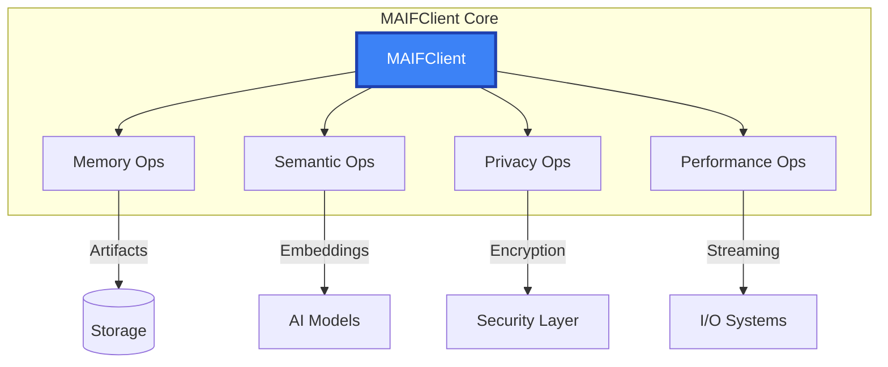

# MAIFClient API Reference

The `MAIFClient` is the primary interface for MAIF operations, providing high-level access to agent memory, semantic processing, privacy protection, and performance optimization.

## Overview

MAIFClient manages:
- **Agent Memory**: Persistent storage and retrieval
- **Semantic Processing**: AI-powered understanding and search
- **Privacy & Security**: Enterprise-grade encryption and access control
- **Performance**: Memory-mapped I/O and streaming operations
- **Multi-modal Data**: Text, images, audio, and structured data



## Quick Start

```python
from maif_sdk import create_client

# Basic usage
client = create_client("my-agent")

# Store information
memory_id = client.remember("User prefers dark theme")

# Search semantically
results = client.recall("user preferences")

# Advanced configuration
client = create_client(
    "enterprise-agent",
    enable_privacy=True,
    default_encryption=True,
    semantic_model="all-MiniLM-L6-v2"
)
```

## Constructor

### `MAIFClient(agent_id, **config)`

```python
client = MAIFClient(
    agent_id="my-agent",
    
    # Performance
    enable_mmap=True,                    # Memory-mapped I/O
    buffer_size=128*1024,                # 128KB buffer
    max_concurrent_writers=8,            # Parallel operations
    
    # Security
    default_security_level=SecurityLevel.CONFIDENTIAL,
    enable_signing=True,                 # Digital signatures
    require_authentication=True,         # Access control
    
    # Privacy
    enable_privacy=True,                 # Privacy engine
    default_encryption=True,             # Encrypt by default
    anonymization_patterns=["ssn", "email"],
    
    # Semantic
    embedding_model="all-MiniLM-L6-v2",  # Default model
    enable_semantic_search=True,         # Auto indexing
    semantic_threshold=0.75,             # Similarity threshold
    
    # Compression
    default_compression=CompressionLevel.BALANCED,
    semantic_compression=True,           # HSC algorithm
    compression_threshold=1024           # Min size (bytes)
)
```

## Core Methods

### Memory Operations

#### `remember(content, **options) -> str`

Store information in agent memory with semantic indexing.

```python
# Simple storage
memory_id = client.remember("User prefers dark theme")

# Advanced storage
memory_id = client.remember(
    content="Important client meeting notes",
    tags=["meeting", "client", "important"],
    privacy_level=PrivacyLevel.CONFIDENTIAL,
    encrypt=True,
    metadata={
        "meeting_date": "2024-01-15",
        "participants": ["Alice", "Bob"],
        "duration_minutes": 60
    }
)
```

#### `recall(query, **options) -> List[SearchResult]`

Semantic search across agent memory.

```python
# Simple search
results = client.recall("user preferences")

# Advanced search
results = client.recall(
    query="client meetings",
    top_k=10,
    similarity_threshold=0.7,
    filters={
        "tags": ["meeting"],
        "date_range": ("2024-01-01", "2024-01-31")
    },
    include_metadata=True
)

# Process results
for result in results:
    print(f"Content: {result.content}")
    print(f"Similarity: {result.similarity:.3f}")
    print(f"Metadata: {result.metadata}")
```

#### `forget(memory_id) -> bool`

Remove specific memory from storage.

```python
success = client.forget("memory-id-123")
```

### Artifact Management

#### `create_artifact(name, **options) -> Artifact`

Create new artifact container.

```python
# Basic creation
artifact = client.create_artifact("agent-memory")

# Advanced options
artifact = client.create_artifact(
    name="secure-memory",
    privacy_level=PrivacyLevel.CONFIDENTIAL,
    enable_encryption=True,
    enable_compression=True,
    metadata={"version": "1.0", "tags": ["production"]}
)
```

#### `load_artifact(path, **options) -> Artifact`

Load existing artifact from storage.

```python
# Basic loading
artifact = client.load_artifact("agent-memory.maif")

# Advanced loading
artifact = client.load_artifact(
    path="secure-memory.maif",
    verify_signature=True,
    decrypt_key="user-key",
    lazy_load=True,
    mmap=True
)
```

### Streaming Operations

#### `stream_write(data_stream, output_path, **options) -> StreamStats`

High-performance streaming write.

```python
def data_generator():
    for i in range(1000000):
        yield f"Data item {i}"

stats = client.stream_write(
    data_stream=data_generator(),
    output_path="large-dataset.maif",
    batch_size=1000,
    compression=True,
    encryption=True,
    progress_callback=lambda p: print(f"Progress: {p:.1%}")
)

print(f"Throughput: {stats.throughput_mbps:.1f} MB/s")
```

#### `stream_read(input_path, **options) -> Iterator[Any]`

High-performance streaming read.

```python
for batch in client.stream_read("large-dataset.maif", batch_size=100):
    process_batch(batch)
```

### Multi-modal Operations

#### `add_multimodal(content, **options) -> str`

Store multi-modal content with cross-modal understanding.

```python
# Image with text
content_id = client.add_multimodal(
    content={
        "image": "product-photo.jpg",
        "text": "Wireless headphones with noise cancellation",
        "metadata": {"product_id": "P123", "price": 299.99}
    },
    enable_cross_modal_search=True,
    generate_captions=True
)

# Audio with transcript
audio_id = client.add_multimodal(
    content={
        "audio": "meeting.wav",
        "transcript": "Meeting transcript...",
        "speakers": ["Alice", "Bob"]
    },
    enable_speaker_identification=True
)
```

#### `search_multimodal(query, **options) -> List[SearchResult]`

Cross-modal semantic search.

```python
# Text query across modalities
results = client.search_multimodal(
    query="wireless headphones",
    modalities=["text", "image"],
    cross_modal_weight=0.3,
    top_k=20
)

# Image query (find similar images)
results = client.search_multimodal(
    query="query-image.jpg",
    query_type="image",
    similarity_threshold=0.8
)
```

## Advanced Features

### Batch Operations

```python
# Batch writing
with client.batch_writer("output.maif") as writer:
    for item in large_dataset:
        writer.add_text(item.text, metadata=item.metadata)

# Batch reading
with client.batch_reader(["file1.maif", "file2.maif"]) as reader:
    for artifact_name, content in reader:
        process_content(content)
```

### Transaction Support

```python
# ACID transactions
with client.transaction() as tx:
    memory_id1 = tx.remember("First information")
    memory_id2 = tx.remember("Second information")
    
    if condition:
        tx.forget(old_memory_id)
    # Auto-commit on success, rollback on exception
```

### Performance Monitoring

```python
# Get performance metrics
stats = client.get_performance_stats()
print(f"Ops/sec: {stats.ops_per_second}")
print(f"Latency: {stats.avg_latency_ms}ms")
print(f"Memory: {stats.memory_usage_mb}MB")
print(f"Cache hit rate: {stats.cache_hit_rate:.1%}")

# Enable profiling
client.enable_profiling("profile.json")
# ... operations ...
client.disable_profiling()
```

## Configuration Management

### Runtime Configuration

```python
# Update settings
client.configure(
    buffer_size=256*1024,
    max_concurrent_writers=16,
    semantic_threshold=0.8
)

# Get current config
config = client.get_config()
print(f"Agent ID: {config.agent_id}")
```

## Error Handling

```python
from maif.exceptions import (
    MAIFClientError,
    ConfigurationError,
    AuthenticationError,
    PermissionError,
    StorageError,
    EncryptionError,
    SemanticError
)

try:
    client = MAIFClient("my-agent")
    memory_id = client.remember("content")
    
except ConfigurationError as e:
    logger.error(f"Config error: {e}")
except AuthenticationError as e:
    logger.error(f"Auth failed: {e}")
except PermissionError as e:
    logger.error(f"Access denied: {e}")
except StorageError as e:
    logger.error(f"Storage error: {e}")
except MAIFClientError as e:
    logger.error(f"Client error: {e}")
```

## Context Managers

```python
# Automatic resource cleanup
with create_client("my-agent") as client:
    artifact = client.create_artifact("memory")
    # Resources cleaned up automatically

# Temporary configuration
with client.temporary_config(enable_compression=False):
    # Operations with compression disabled
    pass
# Configuration restored
```

## Integration Examples

### Web API Integration

```python
from flask import Flask, request, jsonify

app = Flask(__name__)
client = create_client("web-agent")

@app.route('/api/remember', methods=['POST'])
def remember():
    content = request.json['content']
    memory_id = client.remember(content)
    return jsonify({'memory_id': memory_id})

@app.route('/api/recall')
def recall():
    query = request.args.get('q')
    results = client.recall(query, top_k=10)
    return jsonify([{
        'content': r.content,
        'similarity': r.similarity
    } for r in results])
```

### Async Operations

```python
import asyncio
from maif_sdk import create_async_client

async def async_operations():
    async with create_async_client("async-agent") as client:
        # Concurrent operations
        tasks = [client.remember(f"Message {i}") for i in range(100)]
        memory_ids = await asyncio.gather(*tasks)
        
        # Async search
        results = await client.recall("message", top_k=50)
        return results
```

## Best Practices

### Performance

```python
# 1. Use appropriate buffer sizes
client.configure(buffer_size=1024*1024)

# 2. Enable memory-mapped I/O for large files
artifact = client.load_artifact("large.maif", mmap=True)

# 3. Use batch operations for bulk data
with client.batch_writer("output.maif") as writer:
    for item in dataset:
        writer.add_text(item)

# 4. Configure caching
client.configure(
    embedding_cache_size=50000,
    block_cache_size=10000
)
```

### Security

```python
# Always enable encryption for sensitive data
client.configure(default_encryption=True)

# Use strong authentication
client = MAIFClient(
    "secure-agent",
    require_authentication=True,
    key_derivation_rounds=100000
)

# Enable audit logging
client.configure(enable_audit_log=True)

# Verify signatures
artifact = client.load_artifact("critical.maif", verify_signature=True)
```

## Related APIs

- **[Artifact](/api/core/artifact)** - Data container operations
- **[Privacy Engine](/api/privacy/engine)** - Privacy features
- **[Security](/api/security/index)** - Security and access control 