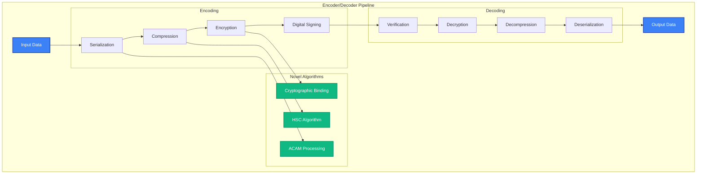

# Encoder/Decoder API Reference

The `MAIFEncoder` and `MAIFDecoder` classes provide low-level binary operations for MAIF artifacts, offering fine-grained control over serialization, compression, encryption, and streaming operations.

## Overview

Encoder/Decoder features:
- **Binary Serialization**: Efficient data encoding/decoding with custom formats
- **Compression**: Advanced algorithms including HSC (Hierarchical Semantic Compression)
- **Encryption**: Industry-standard encryption with privacy-preserving features
- **Streaming**: High-throughput operations with memory-mapped I/O (400+ MB/s)
- **Performance**: Optimized for <50ms latency with parallel processing



## Quick Start

```python
from maif import MAIFEncoder, MAIFDecoder

# Basic encoding/decoding
encoder = MAIFEncoder()
decoder = MAIFDecoder()

# Encode data
data = {"text": "Hello world", "metadata": {"type": "greeting"}}
encoded = encoder.encode(data)

# Decode data
decoded = decoder.decode(encoded)

# Advanced configuration
encoder = MAIFEncoder(
    compression=CompressionLevel.HIGH,
    encryption=True,
    enable_signing=True,
    use_semantic_compression=True
)
```

## MAIFEncoder Class

### Constructor

```python
encoder = MAIFEncoder(
    # Compression settings
    compression=CompressionLevel.BALANCED,
    compression_algorithm="zstd",
    semantic_compression=True,          # HSC algorithm
    compression_threshold=1024,
    
    # Encryption settings
    encryption=True,
    encryption_algorithm="ChaCha20-Poly1305",
    key_derivation_rounds=100000,
    
    # Performance settings
    buffer_size=128*1024,               # 128KB buffer
    use_mmap=True,                      # Memory-mapped I/O
    parallel_processing=True,
    worker_threads=4,
    
    # Security settings
    enable_signing=True,
    hash_algorithm="sha256",
    
    # Advanced features
    enable_deduplication=True,
    enable_delta_encoding=True,
    preserve_metadata=True,
    
    # Validation
    validate_input=True,
    strict_mode=False
)
```

### Core Encoding Methods

#### `encode(data, **options) -> bytes`

```python
# Simple encoding
data = {"message": "Hello", "timestamp": "2024-01-15"}
encoded = encoder.encode(data)

# Advanced encoding
encoded = encoder.encode(
    data=complex_data,
    
    # Compression options
    force_compression=True,
    compression_level=9,
    
    # Encryption options
    encryption_key="custom-key",
    
    # Metadata options
    include_schema=True,
    include_timestamps=True,
    custom_metadata={"version": "1.0"},
    
    # Performance options
    streaming=True,
    chunk_size=64*1024,
    
    # Validation options
    validate_before_encode=True,
    generate_checksum=True
)
```

#### `encode_stream(data_stream, output_stream, **options) -> EncodingStats`

```python
# High-performance streaming encoding
def data_generator():
    for i in range(1000000):
        yield {"id": i, "data": f"Item {i}"}

with open("output.maif", "wb") as output:
    stats = encoder.encode_stream(
        data_stream=data_generator(),
        output_stream=output,
        
        # Streaming options
        batch_size=1000,
        buffer_size=1024*1024,
        
        # Progress tracking
        progress_callback=lambda p: print(f"Progress: {p:.1%}"),
        
        # Performance options
        parallel_chunks=True,
        compression_level=CompressionLevel.FAST,
        
        # Memory management
        max_memory_usage=512*1024*1024,  # 512MB limit
        flush_interval=10000
    )

print(f"Throughput: {stats.throughput_mbps:.1f} MB/s")
print(f"Compression ratio: {stats.compression_ratio:.2f}")
```

### Specialized Encoding Methods

#### `encode_text(text, **options) -> bytes`

```python
# Optimized text encoding
encoded_text = encoder.encode_text(
    text="Long document content...",
    
    # Text processing
    extract_entities=True,
    generate_summary=True,
    detect_language=True,
    
    # Semantic processing
    generate_embeddings=True,
    embedding_model="all-MiniLM-L6-v2",
    
    # Compression
    use_semantic_compression=True,
    dictionary_compression=True,
    
    # Privacy
    anonymize_pii=True,
    redact_sensitive=True
)
```

#### `encode_embeddings(embeddings, **options) -> bytes`

```python
# Efficient embedding encoding
embedding = [0.1, 0.2, 0.3, ...]  # 384-dimensional vector
encoded = encoder.encode_embeddings(
    embeddings=embedding,
    
    # Compression options
    quantization_bits=8,            # Reduce precision
    use_pca_compression=True,       # Dimensionality reduction
    compression_ratio=0.5,
    
    # Metadata
    model_name="all-MiniLM-L6-v2",
    vector_dimensions=384,
    normalization="l2"
)

# Batch embeddings
embeddings_batch = [
    {"vector": [0.1, 0.2, ...], "id": "text-1"},
    {"vector": [0.3, 0.4, ...], "id": "text-2"}
]

encoded_batch = encoder.encode_embeddings(
    embeddings=embeddings_batch,
    batch_compression=True,
    deduplicate_similar=True,
    similarity_threshold=0.95
)
```

#### `encode_multimodal(content, **options) -> bytes`

```python
# Multi-modal content encoding
multimodal_content = {
    "text": "Product description",
    "image": "product-photo.jpg",
    "audio": "product-demo.wav",
    "metadata": {"product_id": "P123"}
}

encoded = encoder.encode_multimodal(
    content=multimodal_content,
    
    # Cross-modal options
    enable_cross_modal_compression=True,
    semantic_alignment=True,
    
    # Processing options
    extract_features=True,
    generate_embeddings=True,
    
    # Optimization
    optimize_for_search=True,
    deduplicate_features=True
)
```

## MAIFDecoder Class

### Constructor

```python
decoder = MAIFDecoder(
    # Decryption settings
    encryption_key=None,                # Auto-detect or provide key
    key_derivation_rounds=100000,
    
    # Performance settings
    buffer_size=128*1024,
    use_mmap=True,
    parallel_processing=True,
    
    # Validation settings
    verify_checksums=True,
    verify_signatures=True,
    strict_validation=True,
    
    # Memory management
    lazy_loading=True,
    cache_decompressed=True,
    max_cache_size=256*1024*1024,       # 256MB cache
    
    # Error handling
    error_recovery=True,
    skip_corrupted_blocks=False,
    
    # Compatibility
    backward_compatibility=True,
    version_tolerance=True
)
```

### Core Decoding Methods

#### `decode(encoded_data, **options) -> Any`

```python
# Simple decoding
decoded = decoder.decode(encoded_data)

# Advanced decoding
decoded = decoder.decode(
    encoded_data=encoded_bytes,
    
    # Decryption options
    encryption_key="custom-key",
    verify_signature=True,
    
    # Validation options
    verify_integrity=True,
    validate_schema=True,
    
    # Performance options
    lazy_load=True,
    preload_metadata=True,
    
    # Content options
    include_metadata=True,
    include_embeddings=False,
    
    # Error handling
    ignore_errors=False,
    repair_corruption=True
)
```

#### `decode_stream(input_stream, **options) -> Iterator[Any]`

```python
# High-performance streaming decoding
with open("large-file.maif", "rb") as input_file:
    for batch in decoder.decode_stream(
        input_stream=input_file,
        
        # Streaming options
        batch_size=1000,
        buffer_size=1024*1024,
        
        # Memory management
        max_memory_usage=256*1024*1024,
        clear_cache_interval=10000,
        
        # Processing options
        parallel_decoding=True,
        validate_each_batch=True,
        
        # Progress tracking
        progress_callback=lambda p: print(f"Decoded: {p:.1%}")
    ):
        for item in batch:
            process_item(item)
```

#### `decode_partial(encoded_data, block_ids, **options) -> Dict[str, Any]`

```python
# Selective decoding of specific blocks
specific_blocks = decoder.decode_partial(
    encoded_data=encoded_bytes,
    block_ids=["text-block-1", "metadata-block", "embedding-block-5"],
    
    # Options
    verify_selected_only=True,
    include_dependencies=True,
    lazy_load_references=True
)
```

### Specialized Decoding Methods

#### `decode_metadata(encoded_data) -> Dict[str, Any]`

```python
# Fast metadata-only decoding
metadata = decoder.decode_metadata(encoded_data)
print(f"Content type: {metadata['content_type']}")
print(f"Size: {metadata['size']}")
print(f"Created: {metadata['created_date']}")
```

#### `decode_embeddings(encoded_embeddings, **options) -> Union[List[float], List[Dict]]`

```python
# Decode embeddings with decompression
embeddings = decoder.decode_embeddings(
    encoded_embeddings=encoded_data,
    
    # Decompression options
    decompress_quantized=True,
    restore_full_precision=True,
    
    # Format options
    output_format="numpy",          # or "list", "dict"
    normalize=True,
    
    # Batch options
    return_metadata=True,
    include_ids=True
)
```

## Advanced Features

### Hierarchical Semantic Compression (HSC)

```python
# Enable HSC for semantic-aware compression
encoder = MAIFEncoder(
    semantic_compression=True,
    hsc_config={
        "embedding_model": "all-MiniLM-L6-v2",
        "compression_ratio": 0.3,
        "preserve_similarity": True,
        "hierarchical_levels": 3,
        "semantic_threshold": 0.8
    }
)

# HSC provides better compression for text with preserved semantics
text_data = "Long technical document with repeated concepts..."
encoded = encoder.encode_text(text_data, use_semantic_compression=True)

# Decoding restores semantic relationships
decoded = decoder.decode(encoded)
```

### Delta Encoding

```python
# Efficient encoding of incremental changes
encoder = MAIFEncoder(enable_delta_encoding=True)

# First version
version_1 = {"data": "Original content", "version": 1}
encoded_v1 = encoder.encode(version_1)

# Second version (delta encoded against first)
version_2 = {"data": "Modified content", "version": 2}
encoded_v2 = encoder.encode(version_2, delta_base=encoded_v1)
```

### Streaming Operations

#### `create_stream_encoder(output_stream) -> StreamEncoder`

```python
# Create streaming encoder for continuous operations
with open("continuous-output.maif", "wb") as output:
    stream_encoder = encoder.create_stream_encoder(output)
    
    # Continuous encoding
    for data_chunk in continuous_data_stream():
        stream_encoder.encode_chunk(data_chunk)
        
        # Periodic flush
        if stream_encoder.should_flush():
            stream_encoder.flush()
    
    # Final statistics
    stats = stream_encoder.get_stats()
    print(f"Throughput: {stats.avg_throughput_mbps:.1f} MB/s")
```

### Performance Optimization

#### Memory-Mapped Operations

```python
# Enable memory-mapped I/O for large files
encoder = MAIFEncoder(use_mmap=True, buffer_size=1024*1024)
decoder = MAIFDecoder(use_mmap=True, lazy_loading=True)

# Memory-mapped encoding without loading entire file
with open("large-input.json", "r") as input_file:
    large_data = json.load(input_file)
    encoded = encoder.encode(large_data, streaming=True)
```

#### Parallel Processing

```python
# Configure parallel processing
encoder = MAIFEncoder(
    parallel_processing=True,
    worker_threads=8,
    chunk_size=64*1024
)

# Parallel encoding automatically splits work
large_dataset = [{"id": i, "data": f"Item {i}"} for i in range(1000000)]
encoded = encoder.encode(large_dataset, parallel_chunks=True)
```

## Performance Monitoring

### Encoding Statistics

```python
# Get detailed encoding statistics
stats = encoder.get_stats()

print(f"Items encoded: {stats.items_encoded}")
print(f"Input size: {stats.input_size_bytes}")
print(f"Output size: {stats.output_size_bytes}")
print(f"Compression ratio: {stats.compression_ratio:.2f}")
print(f"Throughput: {stats.avg_throughput_mbps:.1f} MB/s")
print(f"Encoding time: {stats.total_time_seconds:.2f}s")

# Algorithm-specific stats
print(f"HSC compression: {stats.hsc_compression_ratio:.2f}")
print(f"Delta savings: {stats.delta_savings_percent:.1f}%")
```

### Profiling

```python
# Enable detailed profiling
encoder.enable_profiling()
decoder.enable_profiling()

# Perform operations
encoded = encoder.encode(data)
decoded = decoder.decode(encoded)

# Get profiling results
encoding_profile = encoder.get_profile()
decoding_profile = decoder.get_profile()

print("Encoding breakdown:")
for operation, timing in encoding_profile.items():
    print(f"  {operation}: {timing.avg_ms:.2f}ms")
```

## Error Handling

```python
from maif.exceptions import (
    EncodingError,
    DecodingError,
    CompressionError,
    EncryptionError,
    CorruptionError
)

try:
    encoded = encoder.encode(data)
    decoded = decoder.decode(encoded)
    
except EncodingError as e:
    logger.error(f"Encoding failed: {e}")
except DecodingError as e:
    logger.error(f"Decoding failed: {e}")
except CompressionError as e:
    logger.error(f"Compression error: {e}")
except EncryptionError as e:
    logger.error(f"Encryption error: {e}")
except CorruptionError as e:
    logger.error(f"Data corruption: {e}")
    
    # Attempt recovery
    if e.recoverable:
        recovered = decoder.recover_corrupted(encoded, e.corruption_info)
```

## Best Practices

### Performance Optimization

```python
# 1. Use appropriate buffer sizes
encoder = MAIFEncoder(buffer_size=1024*1024)  # 1MB for large files

# 2. Enable memory-mapped I/O for large datasets
encoder = MAIFEncoder(use_mmap=True)

# 3. Use streaming for continuous operations
stream_encoder = encoder.create_stream_encoder(output_stream)

# 4. Configure parallel processing
encoder = MAIFEncoder(parallel_processing=True, worker_threads=cpu_count())

# 5. Choose compression level based on use case
encoder = MAIFEncoder(compression=CompressionLevel.FAST)  # For real-time
```

### Security Best Practices

```python
# 1. Always verify signatures for critical data
decoder = MAIFDecoder(verify_signatures=True)

# 2. Use strong encryption
encoder = MAIFEncoder(
    encryption=True,
    encryption_algorithm="ChaCha20-Poly1305"
)

# 3. Enable integrity checking
encoder = MAIFEncoder(generate_checksums=True)
decoder = MAIFDecoder(verify_checksums=True)
```

### Memory Management

```python
# 1. Use lazy loading for large files
decoder = MAIFDecoder(lazy_loading=True)

# 2. Configure appropriate cache sizes
decoder = MAIFDecoder(max_cache_size=256*1024*1024)  # 256MB

# 3. Clear caches periodically
decoder.clear_cache()

# 4. Use streaming for memory-efficient processing
for chunk in decoder.decode_stream(input_stream):
    process_chunk(chunk)
```

## Related APIs

- **[MAIFClient](/api/core/client)** - High-level client operations
- **[Artifact](/api/core/artifact)** - Data container operations
- **[Privacy Engine](/api/privacy/engine)** - Privacy and encryption features 