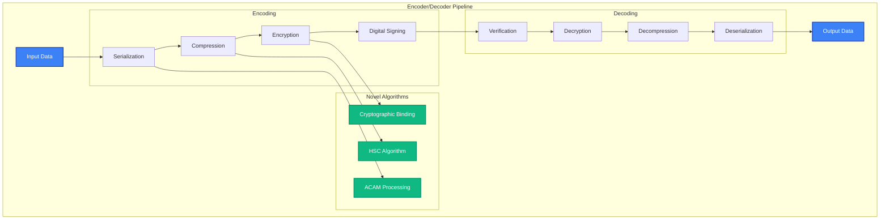

# Encoder/Decoder API Reference

The `MAIFEncoder` and `MAIFDecoder` classes provide low-level binary operations for MAIF artifacts, offering fine-grained control over serialization, compression, encryption, and streaming operations.

## Overview

Encoder/Decoder features:
- **Binary Serialization**: Efficient data encoding/decoding with custom formats
- **Compression**: Advanced algorithms including HSC (Hierarchical Semantic Compression)
- **Encryption**: Industry-standard encryption with privacy-preserving features
- **Streaming**: High-throughput operations with memory-mapped I/O (400+ MB/s)
- **Performance**: Optimized for <50ms latency with parallel processing



## Quick Start

This example shows the basic usage pattern for the `MAIFEncoder` and `MAIFDecoder`, including simple encoding/decoding and advanced configuration.

```python
from maif import MAIFEncoder, MAIFDecoder, CompressionLevel

# Create a basic encoder and decoder with default settings.
encoder = MAIFEncoder()
decoder = MAIFDecoder()

# Encode a simple Python dictionary.
data = {"text": "Hello world", "metadata": {"type": "greeting"}}
encoded = encoder.encode(data)

# Decode the binary data back into a Python dictionary.
decoded = decoder.decode(encoded)

# Create an encoder with advanced features enabled.
encoder = MAIFEncoder(
    compression=CompressionLevel.HIGH, # Use a high compression level.
    encryption=True, # Enable encryption.
    enable_signing=True, # Add a digital signature.
    use_semantic_compression=True # Use the novel HSC algorithm.
)
```

## MAIFEncoder Class

### Constructor

The `MAIFEncoder` constructor is highly configurable, allowing you to fine-tune the encoding process for your specific needs.

```python
encoder = MAIFEncoder(
    # --- Compression Settings ---
    compression=CompressionLevel.BALANCED, # The default compression level.
    compression_algorithm="zstd", # The compression algorithm to use (e.g., zstd, lz4, gzip).
    semantic_compression=True,          # Enable the novel HSC algorithm for text.
    compression_threshold=1024, # Only compress data larger than 1 KB.
    
    # --- Encryption Settings ---
    encryption=True, # Enable encryption by default.
    encryption_algorithm="ChaCha20-Poly1305", # A fast and secure encryption cipher.
    key_derivation_rounds=100000, # The number of rounds for key derivation (PBKDF2).
    
    # --- Performance Settings ---
    buffer_size=128*1024,               # The size of the write buffer (128 KB).
    use_mmap=True,                      # Use memory-mapped I/O for large data.
    parallel_processing=True, # Enable multi-threaded processing.
    worker_threads=4, # The number of worker threads to use.
    
    # --- Security Settings ---
    enable_signing=True, # Add a digital signature to the encoded data.
    hash_algorithm="sha256", # The hash algorithm for checksums and signatures.
    
    # --- Advanced Features ---
    enable_deduplication=True, # Enable block-level deduplication to save space.
    enable_delta_encoding=True, # Enable delta encoding for versioned data.
    preserve_metadata=True, # Ensure all metadata is preserved during encoding.
    
    # --- Validation ---
    validate_input=True, # Validate input data before encoding.
    strict_mode=False # If True, will raise errors on minor issues.
)
```

### Core Encoding Methods

#### `encode(data, **options) -> bytes`

Encodes a Python object into a binary `bytes` object. This is the primary method for encoding single data items.

```python
# Encode a simple Python dictionary.
data = {"message": "Hello", "timestamp": "2024-01-15"}
encoded = encoder.encode(data)

# Encode a more complex object with override options.
encoded = encoder.encode(
    data=complex_data,
    
    # --- Override Compression Options ---
    force_compression=True, # Force compression even if the data is small.
    compression_level=9, # Use a specific compression level for this operation.
    
    # --- Override Encryption Options ---
    encryption_key="custom-key", # Provide a custom encryption key.
    
    # --- Override Metadata Options ---
    include_schema=True, # Include the data schema in the encoded output.
    include_timestamps=True, # Add timestamps to the metadata.
    custom_metadata={"version": "1.0"}, # Add custom metadata.
    
    # --- Override Performance Options ---
    streaming=True, # Use a streaming approach for large data.
    chunk_size=64*1024, # The chunk size for streaming.
    
    # --- Override Validation Options ---
    validate_before_encode=True, # Validate this specific input before encoding.
    generate_checksum=True # Generate a checksum for this block.
)
```

#### `encode_stream(data_stream, output_stream, **options) -> EncodingStats`

Encodes a stream of data items with high performance, writing the output to a target stream. This is ideal for very large datasets.

```python
# A generator that yields data items.
def data_generator():
    for i in range(1000000):
        yield {"id": i, "data": f"Item {i}"}

# Open a file to write the binary output.
with open("output.maif", "wb") as output:
    # Encode the stream and get performance statistics.
    stats = encoder.encode_stream(
        data_stream=data_generator(), # The input stream.
        output_stream=output, # The output stream.
        
        # --- Streaming Options ---
        batch_size=1000, # The number of items to process in each batch.
        buffer_size=1024*1024, # The buffer size for the output stream (1 MB).
        
        # --- Progress Tracking ---
        progress_callback=lambda p: print(f"Progress: {p:.1%}"), # A function to call with progress updates.
        
        # --- Performance Options ---
        parallel_chunks=True, # Process chunks in parallel.
        compression_level=CompressionLevel.FAST, # Use fast compression for real-time speed.
        
        # --- Memory Management ---
        max_memory_usage=512*1024*1024,  # Set a 512MB memory limit for the operation.
        flush_interval=10000 # The number of items after which to flush the stream.
    )

print(f"Throughput: {stats.throughput_mbps:.1f} MB/s")
print(f"Compression ratio: {stats.compression_ratio:.2f}")
```

### Specialized Encoding Methods

#### `encode_text(text, **options) -> bytes`

A specialized method for encoding text, with options for advanced text processing and semantic-aware compression.

```python
# Encode a long text document with several processing options.
encoded_text = encoder.encode_text(
    text="Long document content...",
    
    # --- Text Processing Options ---
    extract_entities=True, # Extract named entities from the text.
    generate_summary=True, # Generate a summary of the text.
    detect_language=True, # Detect the language of the text.
    
    # --- Semantic Processing Options ---
    generate_embeddings=True, # Generate a semantic embedding for the text.
    embedding_model="all-MiniLM-L6-v2", # Specify the embedding model.
    
    # --- Compression Options ---
    use_semantic_compression=True, # Use the novel HSC algorithm.
    dictionary_compression=True, # Use dictionary-based compression for this text.
    
    # --- Privacy Options ---
    anonymize_pii=True, # Automatically detect and redact PII.
    redact_sensitive=True # Redact other sensitive information based on patterns.
)
```

#### `encode_embeddings(embeddings, **options) -> bytes`

A specialized method for efficiently encoding vector embeddings, with options for quantization and dimensionality reduction.

```python
# Encode a single 384-dimensional embedding vector.
embedding = [0.1, 0.2, 0.3, ...]
encoded = encoder.encode_embeddings(
    embeddings=embedding,
    
    # --- Compression Options ---
    quantization_bits=8,            # Reduce precision to 8 bits per value.
    use_pca_compression=True,       # Use PCA for dimensionality reduction.
    compression_ratio=0.5, # The target compression ratio for PCA.
    
    # --- Metadata Options ---
    model_name="all-MiniLM-L6-v2", # The name of the model that generated the embedding.
    vector_dimensions=384, # The original dimensions of the vector.
    normalization="l2" # The normalization method used.
)

# Encode a batch of embeddings with deduplication.
embeddings_batch = [
    {"vector": [0.1, 0.2, ...], "id": "text-1"},
    {"vector": [0.3, 0.4, ...], "id": "text-2"}
]

encoded_batch = encoder.encode_embeddings(
    embeddings=embeddings_batch,
    batch_compression=True, # Apply compression across the entire batch.
    deduplicate_similar=True, # Deduplicate embeddings that are very similar.
    similarity_threshold=0.95 # The threshold for deduplication.
)
```

#### `encode_multimodal(content, **options) -> bytes`

A specialized method for encoding multi-modal content, with options for cross-modal compression and semantic alignment.

```python
# A dictionary representing multi-modal content.
multimodal_content = {
    "text": "Product description",
    "image": "product-photo.jpg",
    "audio": "product-demo.wav",
    "metadata": {"product_id": "P123"}
}

# Encode the multi-modal content.
encoded = encoder.encode_multimodal(
    content=multimodal_content,
    
    # --- Cross-modal Options ---
    enable_cross_modal_compression=True, # Use cross-modal relationships to improve compression.
    semantic_alignment=True, # Align the semantic representations of the different modalities.
    
    # --- Processing Options ---
    extract_features=True, # Extract features from all modalities.
    generate_embeddings=True, # Generate embeddings for all modalities.
    
    # --- Optimization ---
    optimize_for_search=True, # Optimize the encoded structure for fast search.
    deduplicate_features=True # Deduplicate common features across modalities.
)
```

## MAIFDecoder Class

### Constructor

The `MAIFDecoder` constructor is also highly configurable, allowing you to control validation, memory management, and error handling.

```python
decoder = MAIFDecoder(
    # --- Decryption Settings ---
    encryption_key=None,                # The default decryption key. If None, it may be auto-detected.
    key_derivation_rounds=100000, # The number of rounds for PBKDF2.
    
    # --- Performance Settings ---
    buffer_size=128*1024, # The size of the read buffer.
    use_mmap=True, # Use memory-mapped I/O for file access.
    parallel_processing=True, # Enable multi-threaded decoding.
    
    # --- Validation Settings ---
    verify_checksums=True, # Verify the checksum of each block.
    verify_signatures=True, # Verify the digital signature of the artifact.
    strict_validation=True, # Fail on any validation error, no matter how small.
    
    # --- Memory Management ---
    lazy_loading=True, # Lazily load data to reduce initial memory usage.
    cache_decompressed=True, # Cache decompressed blocks to speed up repeated access.
    max_cache_size=256*1024*1024,       # Set a 256MB limit for the cache.
    
    # --- Error Handling ---
    error_recovery=True, # Attempt to recover from errors where possible.
    skip_corrupted_blocks=False, # If False, an error on one block will stop the process.
    
    # --- Compatibility ---
    backward_compatibility=True, # Support decoding of older MAIF formats.
    version_tolerance=True # Tolerate minor version mismatches.
)
```

### Core Decoding Methods

#### `decode(encoded_data, **options) -> Any`

Decodes a binary `bytes` object back into a Python object. This is the primary method for decoding single data items.

```python
# Decode a simple binary object.
decoded = decoder.decode(encoded_data)

# Decode an object with advanced options.
decoded = decoder.decode(
    encoded_data=encoded_bytes,
    
    # --- Decryption Options ---
    encryption_key="custom-key", # Provide the decryption key.
    verify_signature=True, # Verify the digital signature.
    
    # --- Validation Options ---
    verify_integrity=True, # Perform a full integrity check.
    validate_schema=True, # Validate the decoded data against its schema.
    
    # --- Performance Options ---
    lazy_load=True, # Lazily load nested data.
    preload_metadata=True, # Preload all metadata for fast access.
    
    # --- Content Options ---
    include_metadata=True, # Include metadata in the decoded object.
    include_embeddings=False, # Exclude embeddings from the decoded object.
    
    # --- Error Handling ---
    ignore_errors=False, # Do not ignore any errors during decoding.
    repair_corruption=True # Attempt to repair any detected corruption.
)
```

#### `decode_stream(input_stream, **options) -> Iterator[Any]`

Decodes a stream of binary data, yielding decoded objects. This is ideal for processing large files without loading them into memory.

```python
# Open a MAIF file for reading in binary mode.
with open("large-file.maif", "rb") as input_file:
    # Iterate over the decoded items from the stream.
    for batch in decoder.decode_stream(
        input_stream=input_file,
        
        # --- Streaming Options ---
        batch_size=1000, # The number of items to yield in each batch.
        buffer_size=1024*1024, # The read buffer size (1 MB).
        
        # --- Memory Management ---
        max_memory_usage=256*1024*1024, # The memory limit for the operation.
        clear_cache_interval=10000, # The number of items after which to clear the cache.
        
        # --- Processing Options ---
        parallel_decoding=True, # Use multiple threads to decode in parallel.
        validate_each_batch=True, # Validate each batch as it's decoded.
        
        # --- Progress Tracking ---
        progress_callback=lambda p: print(f"Decoded: {p:.1%}") # A function to call with progress updates.
    ):
        for item in batch:
            process_item(item)
```

#### `decode_partial(encoded_data, block_ids, **options) -> Dict[str, Any]`

Selectively decodes specific blocks from a larger binary object, which is useful for quickly accessing a subset of data.

```python
# Decode only the specified blocks from the binary data.
specific_blocks = decoder.decode_partial(
    encoded_data=encoded_bytes,
    block_ids=["text-block-1", "metadata-block", "embedding-block-5"],
    
    # --- Options ---
    verify_selected_only=True, # Only verify the signatures of the selected blocks.
    include_dependencies=True, # Also decode any blocks that the selected blocks depend on.
    lazy_load_references=True # Lazily load any references within the selected blocks.
)
```

### Specialized Decoding Methods

#### `decode_metadata(encoded_data) -> Dict[str, Any]`

Quickly decodes only the metadata from a binary object without processing the full data payload.

```python
# This is a very fast operation, as it doesn't need to decompress or decrypt the main data.
metadata = decoder.decode_metadata(encoded_data)
print(f"Content type: {metadata['content_type']}")
print(f"Size: {metadata['size']}")
print(f"Created: {metadata['created_date']}")
```

#### `decode_embeddings(encoded_embeddings, **options) -> Union[List[float], List[Dict]]`

A specialized method for decoding vector embeddings, with options to decompress and format the output.

```python
# Decode a block of encoded embeddings.
embeddings = decoder.decode_embeddings(
    encoded_embeddings=encoded_data,
    
    # --- Decompression Options ---
    decompress_quantized=True, # Decompress quantized embeddings.
    restore_full_precision=True, # Restore the original precision of the embeddings.
    
    # --- Format Options ---
    output_format="numpy",          # The desired output format (e.g., "numpy", "list", "dict").
    normalize=True, # Normalize the decoded embeddings.
    
    # --- Batch Options ---
    return_metadata=True, # Include metadata in the output.
    include_ids=True # Include the original IDs of the embeddings.
)
```

## Advanced Features

### Hierarchical Semantic Compression (HSC)

This example shows how to configure the encoder to use HSC, a novel algorithm that provides better compression for text while preserving its semantic meaning.

```python
# Configure the encoder to use HSC.
encoder = MAIFEncoder(
    semantic_compression=True,
    hsc_config={
        "embedding_model": "all-MiniLM-L6-v2", # The embedding model to use for semantic understanding.
        "compression_ratio": 0.3, # The target compression ratio.
        "preserve_similarity": True, # Ensure that semantic similarity is preserved.
        "hierarchical_levels": 3, # The number of hierarchical levels to use.
        "semantic_threshold": 0.8 # The similarity threshold for semantic deduplication.
    }
)

# HSC is particularly effective for long documents with repeated concepts.
text_data = "Long technical document with repeated concepts..."
encoded = encoder.encode_text(text_data, use_semantic_compression=True)

# The decoder will automatically use the HSC model to decompress the data.
decoded = decoder.decode(encoded)
```

### Delta Encoding

This example shows how to use delta encoding to efficiently store incremental changes to data.

```python
# Enable delta encoding on the encoder.
encoder = MAIFEncoder(enable_delta_encoding=True)

# Encode the first version of the data.
version_1 = {"data": "Original content", "version": 1}
encoded_v1 = encoder.encode(version_1)

# Encode the second version as a delta of the first.
# This will only store the differences, saving significant space.
version_2 = {"data": "Modified content", "version": 2}
encoded_v2 = encoder.encode(version_2, delta_base=encoded_v1)
```

### Streaming Operations

#### `create_stream_encoder(output_stream) -> StreamEncoder`

This method creates a `StreamEncoder` object for a more stateful, continuous encoding process, which is useful for applications like logging or real-time data feeds.

```python
# Create a streaming encoder that writes to a file.
with open("continuous-output.maif", "wb") as output:
    stream_encoder = encoder.create_stream_encoder(output)
    
    # In a real application, this would be a continuous stream of data.
    for data_chunk in continuous_data_stream():
        stream_encoder.encode_chunk(data_chunk)
        
        # Periodically flush the buffer to ensure data is written.
        if stream_encoder.should_flush():
            stream_encoder.flush()
    
    # Get the final statistics for the entire stream.
    stats = stream_encoder.get_stats()
    print(f"Throughput: {stats.avg_throughput_mbps:.1f} MB/s")
```

### Performance Optimization

#### Memory-Mapped Operations

This example shows how to use memory-mapped I/O to handle large files without loading their entire content into memory.

```python
# Configure the encoder and decoder to use memory-mapped files.
encoder = MAIFEncoder(use_mmap=True, buffer_size=1024*1024)
decoder = MAIFDecoder(use_mmap=True, lazy_loading=True)

# This will encode the large JSON file without loading it all into memory at once.
with open("large-input.json", "r") as input_file:
    large_data = json.load(input_file)
    encoded = encoder.encode(large_data, streaming=True)
```

#### Parallel Processing

This example shows how to configure the encoder to use multiple threads to speed up the encoding of large datasets.

```python
# Configure the encoder for parallel processing with 8 worker threads.
encoder = MAIFEncoder(
    parallel_processing=True,
    worker_threads=8,
    chunk_size=64*1024 # The size of the chunks to be processed by each thread.
)

# The encoder will automatically split the dataset into chunks and process them in parallel.
large_dataset = [{"id": i, "data": f"Item {i}"} for i in range(1000000)]
encoded = encoder.encode(large_dataset, parallel_chunks=True)
```

## Performance Monitoring

### Encoding Statistics

The encoder keeps track of detailed statistics about its operations.

```python
# Get a snapshot of the encoder's performance statistics.
stats = encoder.get_stats()

print(f"Number of items encoded: {stats.items_encoded}")
print(f"Total input size (bytes): {stats.input_size_bytes}")
print(f"Total output size (bytes): {stats.output_size_bytes}")
print(f"Overall compression ratio: {stats.compression_ratio:.2f}")
print(f"Average throughput (MB/s): {stats.avg_throughput_mbps:.1f}")
print(f"Total encoding time (seconds): {stats.total_time_seconds:.2f}s")

# Access statistics for specific algorithms.
print(f"HSC compression ratio: {stats.hsc_compression_ratio:.2f}")
print(f"Savings from delta encoding: {stats.delta_savings_percent:.1f}%")
```

### Profiling

Enable profiling to get a detailed breakdown of the time spent in each part of the encoding and decoding process.

```python
# Enable profiling on both the encoder and decoder.
encoder.enable_profiling()
decoder.enable_profiling()

# Perform some operations to be profiled.
encoded = encoder.encode(data)
decoded = decoder.decode(encoded)

# Get the profiling results.
encoding_profile = encoder.get_profile()
decoding_profile = decoder.get_profile()

print("Encoding breakdown:")
for operation, timing in encoding_profile.items():
    print(f"  {operation}: {timing.avg_ms:.2f}ms")
```

## Error Handling

The Encoder/Decoder API has a rich set of custom exceptions for robust error handling.

```python
from maif.exceptions import (
    EncodingError,     # Base exception for encoding errors.
    DecodingError,     # Base exception for decoding errors.
    CompressionError,  # Raised on compression/decompression failures.
    EncryptionError,   # Raised on encryption/decryption failures.
    CorruptionError    # Raised when data corruption is detected.
)

try:
    encoded = encoder.encode(data)
    decoded = decoder.decode(encoded)
    
except EncodingError as e:
    logger.error(f"Encoding failed: {e}")
except DecodingError as e:
    logger.error(f"Decoding failed: {e}")
except CompressionError as e:
    logger.error(f"Compression error: {e}")
except EncryptionError as e:
    logger.error(f"Encryption error: {e}")
except CorruptionError as e:
    logger.error(f"Data corruption detected: {e}")
    
    # If the error is recoverable, attempt to recover the data.
    if e.recoverable:
        recovered = decoder.recover_corrupted(encoded, e.corruption_info)
```

## Best Practices

### Performance Optimization

Follow these best practices to maximize the performance of the Encoder and Decoder.

```python
# 1. Use larger buffer sizes for large files to reduce the number of I/O operations.
encoder = MAIFEncoder(buffer_size=1024*1024)  # 1MB buffer

# 2. Enable memory-mapped I/O when working with large datasets.
encoder = MAIFEncoder(use_mmap=True)

# 3. Use streaming for continuous data feeds or very large files.
stream_encoder = encoder.create_stream_encoder(output_stream)

# 4. Configure parallel processing to match the number of available CPU cores.
encoder = MAIFEncoder(parallel_processing=True, worker_threads=cpu_count())

# 5. Choose the compression level based on your use case (speed vs. size).
encoder = MAIFEncoder(compression=CompressionLevel.FAST)  # For real-time applications.
```

### Security Best Practices

Follow these best practices to ensure the security of your encoded data.

```python
# 1. Always verify signatures for critical data to protect against tampering.
decoder = MAIFDecoder(verify_signatures=True)

# 2. Use a strong encryption algorithm like ChaCha20-Poly1305.
encoder = MAIFEncoder(
    encryption=True,
    encryption_algorithm="ChaCha20-Poly1305"
)

# 3. Enable integrity checking with checksums.
encoder = MAIFEncoder(generate_checksums=True)
decoder = MAIFDecoder(verify_checksums=True)
```

### Memory Management

Follow these best practices to manage the memory usage of the Encoder and Decoder.

```python
# 1. Use lazy loading when decoding large files to avoid loading everything into memory.
decoder = MAIFDecoder(lazy_loading=True)

# 2. Configure appropriate cache sizes for your application's access patterns.
decoder = MAIFDecoder(max_cache_size=256*1024*1024)  # 256MB cache

# 3. Clear the decoder's cache periodically if you are processing many different files.
decoder.clear_cache()

# 4. Use streaming for memory-efficient processing of large datasets.
for chunk in decoder.decode_stream(input_stream):
    process_chunk(chunk)
```

## Related APIs

- **[MAIFClient](/api/core/client)** - High-level client operations
- **[Artifact](/api/core/artifact)** - Data container operations
- **[Privacy Engine](/api/privacy/engine)** - Privacy and encryption features 