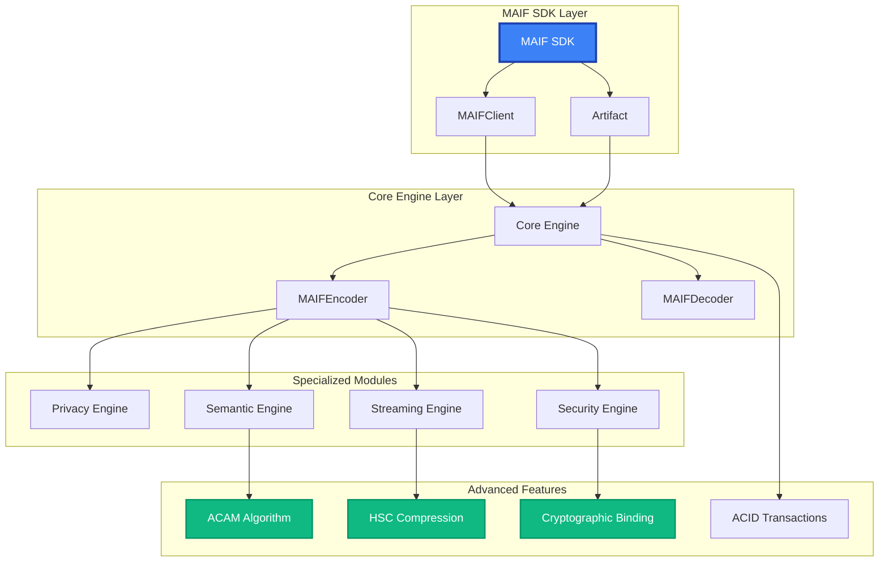

# API Reference

MAIF provides a comprehensive API for building enterprise-grade AI agents with built-in privacy, security, and semantic understanding. The API is designed for both simplicity and power, supporting everything from basic agent memory to advanced multi-modal processing.

## API Architecture Overview

MAIF's API is organized into logical modules that build upon each other:



## Quick Start Reference

### Essential Imports

```python
# High-level SDK (recommended for most users)
from maif_sdk import (
    create_client,          # Create MAIF client
    create_artifact,        # Create artifact container
    load_artifact,          # Load existing artifact
    quick_write,            # One-line write operations
    quick_read              # One-line read operations
)

# Core components (for advanced users)
from maif import (
    MAIFEncoder,            # Low-level encoding
    MAIFDecoder,            # Low-level decoding
    PrivacyEngine,          # Privacy operations
    SecurityEngine,         # Security operations
    SemanticEmbedder        # Semantic processing
)

# Novel algorithms (cutting-edge AI)
from maif.semantic_optimized import (
    AdaptiveCrossModalAttention,      # ACAM
    HierarchicalSemanticCompression,  # HSC
    CryptographicSemanticBinding      # CSB
)
```

### Basic Usage Pattern

```python
# 1. Create client and artifact
client = create_client("my-agent")
artifact = create_artifact("agent-memory", client)

# 2. Add content with built-in features
text_id = artifact.add_text(
    "Important data",
    encrypt=True,                    # Privacy
    anonymize=True,                  # PII protection
    compress=True                    # Performance
)

# 3. Save with cryptographic signature
artifact.save("memory.maif", sign=True)

# 4. Load and search semantically
loaded = load_artifact("memory.maif")
results = loaded.search("query", top_k=5)
```

## API Modules

### 🏗️ Core API

The foundation of MAIF operations:

- **[MAIFClient](/api/core/client)** - High-performance client with memory-mapped I/O
- **[Artifact](/api/core/artifact)** - Container for agent data and memory
- **[Encoder/Decoder](/api/core/encoder-decoder)** - Low-level binary operations
- **[Block Types](/api/core/blocks)** - Data structure definitions

```python
from maif_sdk import MAIFClient, Artifact
from maif import MAIFEncoder, MAIFDecoder
```

### 🔒 Privacy & Security API

Enterprise-grade privacy and security:

- **[Privacy Engine](/api/privacy/engine)** - Encryption, anonymization, differential privacy
- **[Security](/api/security/index)** - Digital signatures, tamper detection
- **[Access Control](/api/security/access-control)** - Granular permissions
- **[Cryptography](/api/security/crypto)** - Low-level cryptographic operations

```python
from maif import PrivacyEngine, SecurityEngine
from maif.security import MAIFSigner, AccessController
```

### 🧠 Semantic Processing API

AI-native semantic understanding:

- **[Semantic Embedder](/api/semantic/embedder)** - Generate and manage embeddings
- **[Novel Algorithms](/api/semantic/algorithms)** - ACAM, HSC, CSB implementations
- **[Knowledge Graphs](/api/semantic/knowledge-graphs)** - Structured knowledge representation
- **[Cross-Modal Attention](/api/semantic/attention)** - Multi-modal AI processing

```python
from maif.semantic import SemanticEmbedder, KnowledgeGraph
from maif.semantic_optimized import AdaptiveCrossModalAttention
```

### ⚡ Streaming & Performance API

High-throughput operations:

- **[Stream Reader/Writer](/api/streaming/streams)** - Memory-efficient streaming
- **[Compression](/api/streaming/compression)** - Advanced compression algorithms
- **[Optimization](/api/streaming/optimization)** - Performance tuning
- **[ACID Transactions](/api/streaming/acid)** - Data consistency guarantees

```python
from maif.streaming import MAIFStreamReader, MAIFStreamWriter
from maif.acid_optimized import ACIDTransaction
```

## Configuration Options

### Client Configuration

```python
from maif_sdk import create_client
from maif import SecurityLevel, CompressionLevel

client = create_client(
    agent_id="my-agent",
    
    # Performance options
    enable_mmap=True,                    # Memory-mapped I/O
    buffer_size=128*1024,                # Write buffer size
    max_concurrent_writers=8,            # Parallel operations
    
    # Security options
    default_security_level=SecurityLevel.CONFIDENTIAL,
    enable_signing=True,                 # Automatic signatures
    key_derivation_rounds=100000,        # PBKDF2 rounds
    
    # Privacy options
    enable_privacy=True,                 # Privacy engine
    default_encryption=True,             # Encrypt by default
    anonymization_patterns=["ssn", "email", "phone"],
    
    # Semantic options
    embedding_model="all-MiniLM-L6-v2",  # Default model
    enable_semantic_search=True,         # Automatic indexing
    semantic_threshold=0.75,             # Similarity threshold
    
    # Compression options
    default_compression=CompressionLevel.BALANCED,
    semantic_compression=True,           # Use HSC algorithm
    compression_threshold=1024           # Min size to compress
)
```

### Privacy Policies

```python
from maif import PrivacyPolicy, PrivacyLevel, EncryptionMode

# Predefined policies
public_policy = PrivacyPolicy.PUBLIC
internal_policy = PrivacyPolicy.INTERNAL
confidential_policy = PrivacyPolicy.CONFIDENTIAL
restricted_policy = PrivacyPolicy.RESTRICTED

# Custom policy
custom_policy = PrivacyPolicy(
    privacy_level=PrivacyLevel.CONFIDENTIAL,
    encryption_mode=EncryptionMode.CHACHA20_POLY1305,
    anonymization_required=True,
    differential_privacy=True,
    audit_required=True,
    retention_days=365
)
```

### Error Handling

```python
from maif.exceptions import (
    MAIFError,                    # Base exception
    PrivacyViolationError,        # Privacy policy violation
    SecurityError,                # Security verification failure
    CompressionError,             # Compression/decompression failure
    SemanticError,                # Semantic processing failure
    IntegrityError                # Data integrity failure
)

try:
    artifact.add_text("sensitive data", encrypt=True)
except PrivacyViolationError as e:
    logger.error(f"Privacy violation: {e}")
except SecurityError as e:
    logger.error(f"Security error: {e}")
except MAIFError as e:
    logger.error(f"General MAIF error: {e}")
```

## Performance Guidelines

### Memory Management

```python
# Efficient memory usage
with client.open_artifact("large-file.maif") as artifact:
    # Streaming processing
    for batch in artifact.stream_blocks(batch_size=1000):
        process_batch(batch)
    
    # Memory-mapped access
    data = artifact.get_block_data("block-id", mmap=True)
    
    # Lazy loading
    results = artifact.search("query", lazy_load=True)
```

### Batch Operations

```python
# Batch writing for performance
with client.batch_writer("output.maif") as writer:
    for item in large_dataset:
        writer.add_text(item.text, metadata=item.metadata)
        
        # Periodic flush
        if writer.batch_size > 1000:
            writer.flush()

# Batch reading
artifacts = client.load_artifacts_batch([
    "file1.maif", "file2.maif", "file3.maif"
], parallel=True)
```

### Caching Strategies

```python
# Enable caching for repeated operations
client.configure_cache(
    embedding_cache_size=10000,     # Cache embeddings
    block_cache_size=1000,          # Cache blocks
    search_cache_size=500,          # Cache search results
    cache_ttl=3600                  # 1 hour TTL
)

# Preload frequently accessed data
artifact.preload_blocks(["block1", "block2", "block3"])
artifact.build_search_index()  # Pre-build search index
```

## Type System

MAIF uses Python type hints extensively for better IDE support and runtime validation:

```python
from typing import Dict, List, Optional, Union, Iterator
from maif.types import (
    BlockID,              # Type alias for block identifiers
    ContentType,          # Enum for content types
    SecurityLevel,        # Enum for security levels
    PrivacyLevel,         # Enum for privacy levels
    CompressionLevel,     # Enum for compression levels
    SearchResult,         # Type for search results
    AuditEntry,          # Type for audit log entries
    EmbeddingVector      # Type for embedding vectors
)

# Type-annotated function example
def process_artifact(
    artifact: Artifact,
    query: str,
    filters: Optional[Dict[str, str]] = None,
    top_k: int = 10
) -> List[SearchResult]:
    """Type-safe artifact processing."""
    return artifact.search(query, filters=filters, top_k=top_k)
```

## Environment Variables

Configure MAIF behavior through environment variables:

```bash
# Performance tuning
export MAIF_ENABLE_MMAP=true
export MAIF_BUFFER_SIZE=131072
export MAIF_WORKER_THREADS=8

# Security settings
export MAIF_DEFAULT_ENCRYPTION=AES_GCM
export MAIF_KEY_DERIVATION_ROUNDS=100000
export MAIF_REQUIRE_SIGNATURES=true

# Privacy settings
export MAIF_ENABLE_ANONYMIZATION=true
export MAIF_DIFFERENTIAL_PRIVACY=true
export MAIF_AUDIT_ALL_OPERATIONS=true

# Semantic processing
export MAIF_EMBEDDING_MODEL=all-MiniLM-L6-v2
export MAIF_SEMANTIC_THRESHOLD=0.75
export MAIF_ENABLE_FAISS=true

# Logging and debugging
export MAIF_LOG_LEVEL=INFO
export MAIF_ENABLE_PROFILING=false
export MAIF_DEBUG_MODE=false
```

## Advanced Topics

### Custom Block Types

```python
from maif.block_types import BlockType, register_block_type

# Register custom block type
@register_block_type("CUST")
class CustomBlock:
    def __init__(self, data: dict):
        self.data = data
    
    def serialize(self) -> bytes:
        return json.dumps(self.data).encode('utf-8')
    
    @classmethod
    def deserialize(cls, data: bytes):
        return cls(json.loads(data.decode('utf-8')))

# Use custom block
artifact.add_custom_block("CUST", {"custom": "data"})
```

### Plugin System

```python
from maif.plugins import register_plugin, MAIFPlugin

@register_plugin("my_processor")
class MyCustomProcessor(MAIFPlugin):
    def process_text(self, text: str, metadata: dict) -> str:
        # Custom text processing logic
        return processed_text
    
    def process_embeddings(self, embeddings: list) -> list:
        # Custom embedding processing
        return processed_embeddings

# Use plugin
client.enable_plugin("my_processor")
```

## Testing Support

MAIF provides comprehensive testing utilities:

```python
from maif.testing import (
    MockMAIFClient,       # Mock client for testing
    create_test_artifact, # Create test artifacts
    assert_privacy_compliance,  # Privacy assertions
    assert_security_valid      # Security assertions
)

def test_my_agent():
    # Use mock client for testing
    with MockMAIFClient() as client:
        artifact = create_test_artifact(client)
        
        # Test operations
        artifact.add_text("test data")
        
        # Assert privacy compliance
        assert_privacy_compliance(artifact, PrivacyLevel.CONFIDENTIAL)
        
        # Assert security
        assert_security_valid(artifact)
```

---

## Next Steps

Choose the API module that matches your needs:

::: info Module Guide

**🚀 New Users**: Start with **[MAIFClient](/api/core/client)** and **[Artifact](/api/core/artifact)**

**🔒 Privacy/Security Focus**: Explore **[Privacy Engine](/api/privacy/engine)** and **[Security API](/api/security/index)**

**🧠 AI/ML Focus**: Check out **[Semantic Processing](/api/semantic/embedder)** and **[Novel Algorithms](/api/semantic/algorithms)**

**⚡ Performance Focus**: See **[Streaming API](/api/streaming/streams)** and **[Optimization](/api/streaming/optimization)**

:::

---

*The MAIF API is designed to grow with your needs - start simple and add advanced features as required.* 