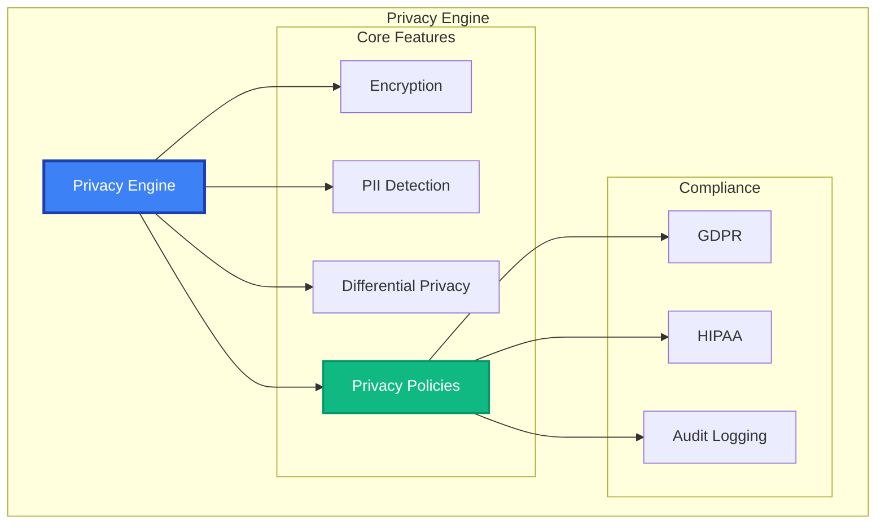

# Privacy Engine API Reference

The `PrivacyEngine` provides enterprise-grade privacy protection including encryption, anonymization, differential privacy, and PII detection with configurable policies.

## Overview

Privacy Engine features:
- **Encryption**: AES-GCM, ChaCha20-Poly1305 with key management
- **Anonymization**: PII detection and smart replacement strategies
- **Differential Privacy**: Mathematical privacy guarantees (DP-SGD)
- **Privacy Policies**: Configurable GDPR/HIPAA compliance frameworks
- **Audit Trails**: Complete operation logging for compliance



## Quick Start

This example provides a brief overview of the `PrivacyEngine`'s core capabilities: encrypting data, anonymizing PII, and applying comprehensive privacy policies.

```python
from maif import PrivacyEngine, PrivacyPolicy, PrivacyLevel

# Create a default privacy engine.
privacy = PrivacyEngine()

# Encrypt a piece of sensitive information.
encrypted = privacy.encrypt("Sensitive information")
# Decrypt the data to retrieve the original content.
decrypted = privacy.decrypt(encrypted)

# Anonymize a string containing Personally Identifiable Information (PII).
text = "Contact John Doe at john.doe@email.com or 555-123-4567"
anonymized = privacy.anonymize(text)
# The result will be something like: "Contact [PERSON] at [EMAIL] or [PHONE]"

# Define and apply a privacy policy to a piece of data.
policy = PrivacyPolicy(
    level=PrivacyLevel.CONFIDENTIAL,
    encrypt_all=True,
    anonymize_pii=True
)
protected = privacy.apply_policy(data, policy)
```

## Constructor & Configuration

The `PrivacyEngine` constructor allows you to configure its behavior for encryption, anonymization, compliance, and performance.

```python
privacy = PrivacyEngine(
    # --- Encryption Settings ---
    default_algorithm="ChaCha20-Poly1305", # A fast and secure default encryption algorithm.
    key_derivation_rounds=100000, # Use 100,000 rounds for key derivation to enhance security.
    
    # --- Anonymization Settings ---
    pii_patterns=["email", "phone", "ssn"], # The types of PII to detect by default.
    replacement_strategy="semantic", # Use semantic placeholders (e.g., [PERSON]) for anonymization.
    
    # --- Differential Privacy Settings ---
    enable_differential_privacy=True, # Enable differential privacy features.
    epsilon=1.0, # The epsilon value, controlling the privacy/utility trade-off.
    delta=1e-5, # The delta value, for (epsilon, delta)-differential privacy.
    
    # --- Compliance Settings ---
    compliance_frameworks=["GDPR", "HIPAA"], # Enable helpers and checks for specific regulations.
    audit_all_operations=True, # Ensure all privacy-related operations are audited.
    
    # --- Performance Settings ---
    parallel_processing=True, # Use multiple threads for performance.
    cache_encrypted_keys=True # Cache encrypted keys to speed up repeated operations.
)
```

## Core Operations

### Encryption

#### `encrypt(data, **options) -> EncryptedData`

Encrypts a piece of data using the configured or specified algorithm.

```python
# Encrypt a simple string with default settings.
encrypted = privacy.encrypt("Sensitive data")

# Encrypt data with advanced, per-operation options.
encrypted = privacy.encrypt(
    data="Highly sensitive information",
    algorithm="ChaCha20-Poly1305", # Override the default encryption algorithm.
    key_id="user-key", # Specify a key ID for key management purposes.
    compress_before_encrypt=True, # Compress the data before encrypting it to save space.
    audit_reason="data_protection" # Provide a reason for the operation to be stored in the audit log.
)
```

#### `decrypt(encrypted_data, **options) -> bytes`

Decrypts data and verifies its integrity.

```python
# Decrypt the data and verify its integrity.
decrypted = privacy.decrypt(
    encrypted_data=encrypted,
    verify_integrity=True, # Ensure the data has not been tampered with since encryption.
    secure_memory=True # Use secure memory allocation for the decrypted data.
)
```

#### `encrypt_field(data, field_path, **options) -> dict`

Encrypts a specific field within a nested dictionary.

```python
# Selectively encrypt fields within a structured data object.
user_data = {
    "name": "John Doe",
    "email": "john@example.com",
    "ssn": "123-45-6789"
}

# Encrypt the 'email' and 'ssn' fields, leaving 'name' as plaintext.
encrypted_data = privacy.encrypt_field(user_data, "email")
encrypted_data = privacy.encrypt_field(encrypted_data, "ssn")
```

### Anonymization

#### `anonymize(text, **options) -> str`

Detects and anonymizes PII in a string of text.

```python
# Anonymize PII in a string using several advanced options.
text = "Contact Dr. Sarah Johnson at sarah.j@hospital.com"
anonymized = privacy.anonymize(
    text=text,
    pii_types=["person", "email", "phone"], # Specify which PII types to look for.
    replacement_strategy="semantic", # Use semantic placeholders like [PERSON].
    preserve_format=True, # Preserve the original format of the redacted data (e.g., xxx-xx-xxxx for SSN).
    track_replacements=True # Keep a record of the replacements made.
)
```

#### `detect_pii(text, **options) -> PIIDetectionResult`

Detects PII in a string without anonymizing it, returning detailed information about the findings.

```python
# Detect PII in a string and get a detailed report.
pii_result = privacy.detect_pii(
    text=sensitive_text,
    pii_types=["person", "email", "phone", "ssn"], # The PII types to detect.
    confidence_threshold=0.8, # The minimum confidence score for a detection to be reported.
    custom_patterns={"employee_id": r"EMP\d{6}"} # Add custom regex patterns for detection.
)

# Iterate through the detected PII.
for detection in pii_result.detections:
    print(f"Type: {detection.pii_type}")
    print(f"Text: {detection.matched_text}")
    print(f"Confidence: {detection.confidence:.2f}")
```

#### `k_anonymize(dataset, **options) -> List[dict]`

Applies k-anonymity to a dataset to prevent re-identification of individuals.

```python
# Apply k-anonymity to a list of user records, where k=3.
k_anonymous = privacy.k_anonymize(
    dataset=user_records,
    k=3, # The k-anonymity factor. At least 3 records must share the same quasi-identifiers.
    quasi_identifiers=["age", "zipcode"], # The fields that could be used to re-identify individuals.
    sensitive_attributes=["condition"], # The sensitive information to be protected.
    generalization_strategies={ # How to generalize the quasi-identifiers.
        "age": "age_range", # Generalize age to a range (e.g., 30-40).
        "zipcode": "zip_prefix" # Generalize zipcode to a prefix (e.g., 902**).
    }
)
```

### Differential Privacy

#### `add_noise(data, **options) -> Any`

Adds calibrated noise to a numerical value or aggregation to provide differential privacy guarantees.

```python
# Add Laplace noise to a single numerical value.
noisy_count = privacy.add_noise(
    data=1500, # The original value.
    epsilon=1.0, # The privacy budget.
    mechanism="laplace", # The noise-adding mechanism.
    sensitivity=1 # The sensitivity of the query.
)

# Add noise to multiple fields in a dictionary.
noisy_result = privacy.add_noise(
    data={"total_users": 5000, "avg_age": 32.5},
    epsilon=0.5,
    field_sensitivities={"total_users": 1, "avg_age": 0.1} # The sensitivity of each field.
)
```

#### `private_aggregation(data, query, **options) -> Any`

Performs a differentially private aggregation on a dataset.

```python
# Calculate a differentially private sum.
private_sum = privacy.private_aggregation(
    data=user_ages,
    query="sum",
    epsilon=1.0
)

# Calculate a differentially private histogram.
private_histogram = privacy.private_aggregation(
    data=categories,
    query="histogram",
    epsilon=2.0,
    categories=["A", "B", "C"] # The categories for the histogram.
)
```

## Privacy Policies

### Policy Definition

Define reusable privacy policies to enforce consistent rules across your application.

```python
# Use one of the predefined policies for common use cases.
public_policy = PrivacyPolicy.PUBLIC
confidential_policy = PrivacyPolicy.CONFIDENTIAL

# Create a custom policy for specific compliance needs.
custom_policy = PrivacyPolicy(
    level=PrivacyLevel.CONFIDENTIAL, # The privacy level of the policy.
    name="Healthcare Policy", # A human-readable name for the policy.
    
    # --- Encryption Rules ---
    encryption_required=True, # Mandate that data under this policy be encrypted.
    encryption_algorithm="AES-GCM", # Specify the required encryption algorithm.
    key_rotation_days=90, # Require that encryption keys be rotated every 90 days.
    
    # --- Anonymization Rules ---
    anonymization_required=True, # Mandate that PII be anonymized.
    pii_detection_enabled=True, # Ensure PII detection is run on the data.
    
    # --- Compliance Rules ---
    compliance_frameworks=["HIPAA", "GDPR"], # Associate the policy with compliance frameworks.
    data_residency="US", # Specify a data residency requirement.
    
    # --- Retention Rules ---
    retention_period_days=2555, # Set a data retention period (approx. 7 years).
    auto_deletion_enabled=True, # Enable automatic deletion of data after the retention period.
    
    # --- Audit Rules ---
    audit_all_access=True # Ensure that all access to data under this policy is audited.
)
```

### Policy Application

#### `apply_policy(data, policy, **options) -> PolicyResult`

Applies a privacy policy to a piece of data, enforcing all its rules.

```python
# Apply the custom healthcare policy to a medical record.
protected = privacy.apply_policy(
    data=medical_record,
    policy=custom_policy,
    user_role="nurse", # Provide the user's role for access control checks.
    access_purpose="treatment", # Provide the purpose of access for auditing.
    strict_enforcement=True # Fail the operation if any policy rule cannot be met.
)

print(f"Protections applied: {protected.protections_applied}")
print(f"Audit ID: {protected.audit_id}")
```

#### `validate_policy_compliance(data, policy) -> ComplianceResult`

Checks if a piece of data is compliant with a given policy.

```python
# Validate a piece of data against a policy.
compliance = privacy.validate_policy_compliance(
    data=sensitive_data,
    policy=confidential_policy
)

# If the data is not compliant, print the violations and suggested fixes.
if not compliance.is_compliant:
    for violation in compliance.violations:
        print(f"Violation: {violation.description}")
        print(f"Suggested Fix: {violation.suggested_fix}")
```

## Advanced Features

### Privacy-Preserving Analytics

Perform aggregate queries on sensitive datasets with differential privacy guarantees.

```python
# Perform a differentially private count of users over 18.
user_count = privacy.private_query(
    dataset=user_dataset,
    query={
        "type": "count",
        "filter": {"age": {"gte": 18}},
        "epsilon": 1.0 # The privacy budget for this query.
    }
)

# Calculate a differentially private average income with clipping to limit the influence of outliers.
avg_income = privacy.private_query(
    dataset=user_dataset,
    query={
        "type": "average",
        "field": "income",
        "epsilon": 0.5,
        "clipping_bound": 200000 # The upper bound for clipping income values.
    }
)
```

### Homomorphic Encryption

Perform computations directly on encrypted data without decrypting it first.

```python
# Encrypt a list of numbers using a homomorphic encryption scheme.
encrypted_numbers = privacy.homomorphic_encrypt(
    data=[100, 200, 300],
    scheme="CKKS" # The homomorphic encryption scheme to use.
)

# Perform a sum operation on the encrypted data.
encrypted_sum = encrypted_numbers.sum()
# Decrypt the result to get the actual sum.
actual_sum = privacy.homomorphic_decrypt(encrypted_sum)
```

## Audit & Compliance

### Audit Logging

Retrieve detailed audit logs of all privacy-related operations.

```python
# Retrieve audit logs with specific filters.
audits = privacy.get_audit_log(
    start_date="2024-01-01",
    operation_types=["encrypt", "decrypt", "anonymize"], # Filter by operation type.
    user_ids=["user123"] # Filter by user ID.
)

# Iterate through the audit log entries.
for entry in audits:
    print(f"Operation: {entry.operation}")
    print(f"User: {entry.user_id}")
    print(f"Success: {entry.success}")
```

### Compliance Reporting

Generate reports to help with compliance audits for frameworks like GDPR and HIPAA.

```python
# Generate a GDPR compliance report for January 2024 in PDF format.
gdpr_report = privacy.generate_compliance_report(
    framework="GDPR",
    start_date="2024-01-01",
    end_date="2024-01-31",
    format="pdf"
)

print(f"Overall compliance score: {gdpr_report.compliance_score:.1%}")
```

## Error Handling

The `PrivacyEngine` raises specific exceptions for different types of privacy-related errors.

```python
from maif.exceptions import (
    PrivacyError,        # Base exception for privacy-related errors.
    EncryptionError,     # Raised on encryption/decryption failures.
    PolicyViolationError,# Raised when a privacy policy is violated.
    PIIDetectionError    # Raised on errors during PII detection.
)

try:
    encrypted = privacy.encrypt(data)
    anonymized = privacy.anonymize(text)
    
except PolicyViolationError as e:
    logger.error(f"Policy violation: {e}")
except EncryptionError as e:
    logger.error(f"Encryption failed: {e}")
except PIIDetectionError as e:
    logger.error(f"PII detection failed: {e}")
```

## Best Practices

### Security

Follow these best practices to ensure the security of your privacy-preserving systems.

```python
# 1. Use a strong encryption algorithm and a high number of key derivation rounds.
privacy = PrivacyEngine(
    default_algorithm="ChaCha20-Poly1305",
    key_derivation_rounds=100000
)

# 2. Implement a key rotation policy.
privacy.rotate_keys(rotation_policy="90_days")

# 3. Enable comprehensive auditing for all operations.
privacy.configure(audit_all_operations=True)
```

### Performance

Follow these best practices to optimize the performance of the `PrivacyEngine`.

```python
# 1. Enable parallel processing and key caching for high-throughput applications.
privacy = PrivacyEngine(
    parallel_processing=True,
    cache_encrypted_keys=True
)

# 2. Use batch operations where possible.
encrypted_batch = privacy.encrypt_batch(data_list)
```

### Compliance

Follow these best practices to maintain compliance with regulations like GDPR and HIPAA.

```python
# 1. Define clear, explicit privacy policies.
policy = PrivacyPolicy(
    compliance_frameworks=["GDPR", "HIPAA"],
    audit_required=True
)

# 2. Regularly validate your data against your policies.
compliance = privacy.validate_policy_compliance(data, policy)

# 3. Set a long retention period for audit trails to meet legal requirements.
privacy.configure(audit_retention_days=2555)
```

## Related APIs

- **[Security](/api/security/index)** - Security and access control
- **[Access Control](/api/security/access-control)** - Permission management
- **[Cryptography](/api/security/crypto)** - Cryptographic operations 