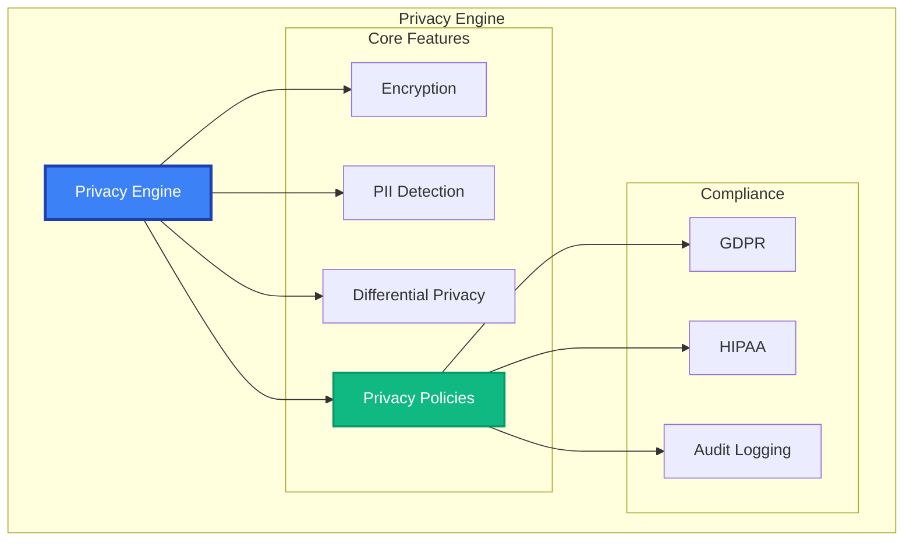

# Privacy Engine API Reference

The `PrivacyEngine` provides enterprise-grade privacy protection including encryption, anonymization, differential privacy, and PII detection with configurable policies.

## Overview

Privacy Engine features:
- **Encryption**: AES-GCM, ChaCha20-Poly1305 with key management
- **Anonymization**: PII detection and smart replacement strategies
- **Differential Privacy**: Mathematical privacy guarantees (DP-SGD)
- **Privacy Policies**: Configurable GDPR/HIPAA compliance frameworks
- **Audit Trails**: Complete operation logging for compliance



## Quick Start

```python
from maif import PrivacyEngine, PrivacyPolicy, PrivacyLevel

# Create privacy engine
privacy = PrivacyEngine()

# Encrypt sensitive data
encrypted = privacy.encrypt("Sensitive information")
decrypted = privacy.decrypt(encrypted)

# Anonymize PII
text = "Contact John Doe at john.doe@email.com or 555-123-4567"
anonymized = privacy.anonymize(text)
# Result: "Contact [PERSON] at [EMAIL] or [PHONE]"

# Apply privacy policy
policy = PrivacyPolicy(
    level=PrivacyLevel.CONFIDENTIAL,
    encrypt_all=True,
    anonymize_pii=True
)
protected = privacy.apply_policy(data, policy)
```

## Constructor & Configuration

```python
privacy = PrivacyEngine(
    # Encryption
    default_algorithm="ChaCha20-Poly1305",
    key_derivation_rounds=100000,
    
    # Anonymization
    pii_patterns=["email", "phone", "ssn"],
    replacement_strategy="semantic",
    
    # Differential Privacy
    enable_differential_privacy=True,
    epsilon=1.0,
    delta=1e-5,
    
    # Compliance
    compliance_frameworks=["GDPR", "HIPAA"],
    audit_all_operations=True,
    
    # Performance
    parallel_processing=True,
    cache_encrypted_keys=True
)
```

## Core Operations

### Encryption

#### `encrypt(data, **options) -> EncryptedData`

```python
# Simple encryption
encrypted = privacy.encrypt("Sensitive data")

# Advanced encryption
encrypted = privacy.encrypt(
    data="Highly sensitive information",
    algorithm="ChaCha20-Poly1305",
    key_id="user-key",
    compress_before_encrypt=True,
    audit_reason="data_protection"
)
```

#### `decrypt(encrypted_data, **options) -> bytes`

```python
# Decrypt with verification
decrypted = privacy.decrypt(
    encrypted_data=encrypted,
    verify_integrity=True,
    secure_memory=True
)
```

#### `encrypt_field(data, field_path, **options) -> dict`

```python
# Selective field encryption
user_data = {
    "name": "John Doe",
    "email": "john@example.com",
    "ssn": "123-45-6789"
}

encrypted_data = privacy.encrypt_field(user_data, "email")
encrypted_data = privacy.encrypt_field(encrypted_data, "ssn")
```

### Anonymization

#### `anonymize(text, **options) -> str`

```python
# PII anonymization
text = "Contact Dr. Sarah Johnson at sarah.j@hospital.com"
anonymized = privacy.anonymize(
    text=text,
    pii_types=["person", "email", "phone"],
    replacement_strategy="semantic",
    preserve_format=True,
    track_replacements=True
)
```

#### `detect_pii(text, **options) -> PIIDetectionResult`

```python
# Detect PII in text
pii_result = privacy.detect_pii(
    text=sensitive_text,
    pii_types=["person", "email", "phone", "ssn"],
    confidence_threshold=0.8,
    custom_patterns={"employee_id": r"EMP\d{6}"}
)

for detection in pii_result.detections:
    print(f"Type: {detection.pii_type}")
    print(f"Text: {detection.matched_text}")
    print(f"Confidence: {detection.confidence:.2f}")
```

#### `k_anonymize(dataset, **options) -> List[dict]`

```python
# K-anonymity for datasets
k_anonymous = privacy.k_anonymize(
    dataset=user_records,
    k=3,
    quasi_identifiers=["age", "zipcode"],
    sensitive_attributes=["condition"],
    generalization_strategies={
        "age": "age_range",
        "zipcode": "zip_prefix"
    }
)
```

### Differential Privacy

#### `add_noise(data, **options) -> Any`

```python
# Add calibrated noise
noisy_count = privacy.add_noise(
    data=1500,
    epsilon=1.0,
    mechanism="laplace",
    sensitivity=1
)

# Noisy aggregations
noisy_result = privacy.add_noise(
    data={"total_users": 5000, "avg_age": 32.5},
    epsilon=0.5,
    field_sensitivities={"total_users": 1, "avg_age": 0.1}
)
```

#### `private_aggregation(data, query, **options) -> Any`

```python
# Private statistics
private_sum = privacy.private_aggregation(
    data=user_ages,
    query="sum",
    epsilon=1.0
)

private_histogram = privacy.private_aggregation(
    data=categories,
    query="histogram",
    epsilon=2.0,
    categories=["A", "B", "C"]
)
```

## Privacy Policies

### Policy Definition

```python
# Predefined policies
public_policy = PrivacyPolicy.PUBLIC
confidential_policy = PrivacyPolicy.CONFIDENTIAL

# Custom policy
custom_policy = PrivacyPolicy(
    level=PrivacyLevel.CONFIDENTIAL,
    name="Healthcare Policy",
    
    # Encryption
    encryption_required=True,
    encryption_algorithm="AES-GCM",
    key_rotation_days=90,
    
    # Anonymization
    anonymization_required=True,
    pii_detection_enabled=True,
    
    # Compliance
    compliance_frameworks=["HIPAA", "GDPR"],
    data_residency="US",
    
    # Retention
    retention_period_days=2555,
    auto_deletion_enabled=True,
    
    # Audit
    audit_all_access=True
)
```

### Policy Application

#### `apply_policy(data, policy, **options) -> PolicyResult`

```python
# Apply comprehensive privacy policy
protected = privacy.apply_policy(
    data=medical_record,
    policy=custom_policy,
    user_role="nurse",
    access_purpose="treatment",
    strict_enforcement=True
)

print(f"Protections: {protected.protections_applied}")
print(f"Audit ID: {protected.audit_id}")
```

#### `validate_policy_compliance(data, policy) -> ComplianceResult`

```python
# Check compliance
compliance = privacy.validate_policy_compliance(
    data=sensitive_data,
    policy=confidential_policy
)

if not compliance.is_compliant:
    for violation in compliance.violations:
        print(f"Violation: {violation.description}")
        print(f"Fix: {violation.suggested_fix}")
```

## Advanced Features

### Privacy-Preserving Analytics

```python
# Private queries on sensitive datasets
user_count = privacy.private_query(
    dataset=user_dataset,
    query={
        "type": "count",
        "filter": {"age": {"gte": 18}},
        "epsilon": 1.0
    }
)

avg_income = privacy.private_query(
    dataset=user_dataset,
    query={
        "type": "average",
        "field": "income",
        "epsilon": 0.5,
        "clipping_bound": 200000
    }
)
```

### Homomorphic Encryption

```python
# Computation on encrypted data
encrypted_numbers = privacy.homomorphic_encrypt(
    data=[100, 200, 300],
    scheme="CKKS"
)

encrypted_sum = encrypted_numbers.sum()
actual_sum = privacy.homomorphic_decrypt(encrypted_sum)
```

## Audit & Compliance

### Audit Logging

```python
# Retrieve audit logs
audits = privacy.get_audit_log(
    start_date="2024-01-01",
    operation_types=["encrypt", "decrypt", "anonymize"],
    user_ids=["user123"]
)

for entry in audits:
    print(f"Operation: {entry.operation}")
    print(f"User: {entry.user_id}")
    print(f"Success: {entry.success}")
```

### Compliance Reporting

```python
# Generate compliance reports
gdpr_report = privacy.generate_compliance_report(
    framework="GDPR",
    start_date="2024-01-01",
    end_date="2024-01-31",
    format="pdf"
)

print(f"Compliance score: {gdpr_report.compliance_score:.1%}")
```

## Error Handling

```python
from maif.exceptions import (
    PrivacyError,
    EncryptionError,
    PolicyViolationError,
    PIIDetectionError
)

try:
    encrypted = privacy.encrypt(data)
    anonymized = privacy.anonymize(text)
    
except PolicyViolationError as e:
    logger.error(f"Policy violation: {e}")
except EncryptionError as e:
    logger.error(f"Encryption failed: {e}")
except PIIDetectionError as e:
    logger.error(f"PII detection failed: {e}")
```

## Best Practices

### Security
```python
# Strong encryption
privacy = PrivacyEngine(
    default_algorithm="ChaCha20-Poly1305",
    key_derivation_rounds=100000
)

# Key rotation
privacy.rotate_keys(rotation_policy="90_days")

# Audit everything
privacy.configure(audit_all_operations=True)
```

### Performance
```python
# Optimize for large datasets
privacy = PrivacyEngine(
    parallel_processing=True,
    cache_encrypted_keys=True
)

# Batch operations
encrypted_batch = privacy.encrypt_batch(data_list)
```

### Compliance
```python
# Clear policies
policy = PrivacyPolicy(
    compliance_frameworks=["GDPR", "HIPAA"],
    audit_required=True
)

# Regular validation
compliance = privacy.validate_policy_compliance(data, policy)

# Maintain audit trails
privacy.configure(audit_retention_days=2555)
```

## Related APIs

- **[Security](/api/security/index)** - Security and access control
- **[Access Control](/api/security/access-control)** - Permission management
- **[Cryptography](/api/security/crypto)** - Cryptographic operations 