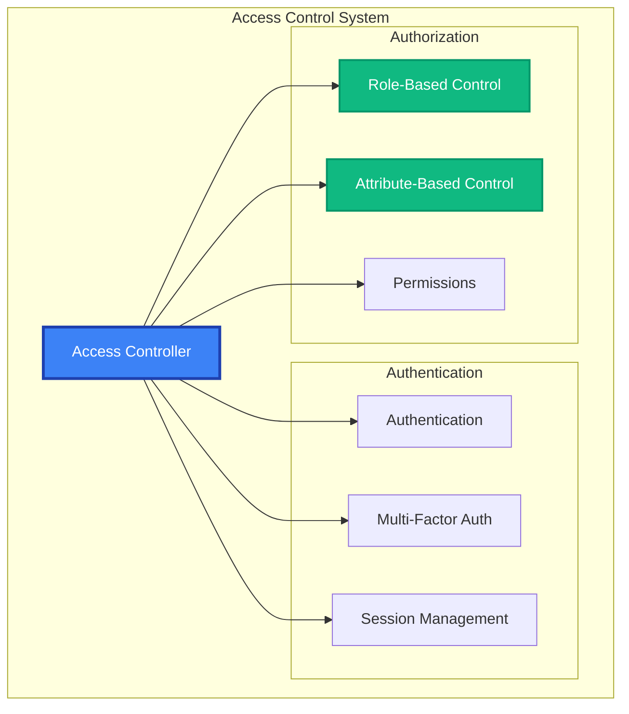

# Access Control API Reference

The Access Control module provides granular permission management, role-based access control (RBAC), attribute-based access control (ABAC), and comprehensive authorization for MAIF resources.

## Overview

Access Control features:
- **Role-Based Access Control (RBAC)**: Users, roles, and permissions
- **Attribute-Based Access Control (ABAC)**: Context-aware authorization
- **Resource Protection**: Fine-grained access to artifacts and operations
- **Session Management**: Secure session handling and timeouts
- **Multi-Factor Authentication**: Enhanced security verification



## Quick Start

```python
from maif.security import AccessController, Role, Permission

# Create access controller
access_control = AccessController()

# Define roles
admin_role = Role("admin", permissions=["read", "write", "delete"])
user_role = Role("user", permissions=["read", "write"])

# Create user
user = access_control.create_user(
    user_id="alice",
    roles=[user_role],
    attributes={"department": "engineering"}
)

# Check access
can_access = access_control.check_access(
    user_id="alice",
    resource="artifact:financial-data",
    action="read"
)
```

## Constructor & Configuration

```python
access_control = AccessController(
    # Authentication
    enable_multi_factor_auth=True,
    session_timeout_minutes=30,
    max_failed_attempts=3,
    
    # Authorization
    authorization_model="RBAC",  # or "ABAC", "hybrid"
    default_deny=True,
    
    # Policy enforcement
    strict_enforcement=True,
    cache_decisions=True,
    
    # Audit
    audit_all_access=True,
    audit_retention_days=365,
    
    # Integration
    ldap_integration=True,
    sso_enabled=True,
    
    # Performance
    parallel_authorization=True
)
```

## User Management

### User Operations

#### `create_user(user_id, **options) -> User`

```python
# Create user with roles and attributes
user = access_control.create_user(
    user_id="alice.smith",
    display_name="Alice Smith",
    email="alice@company.com",
    
    # Authentication
    password="secure-password",
    enable_mfa=True,
    
    # Authorization
    roles=["developer", "analyst"],
    groups=["engineering_team"],
    
    # Attributes for ABAC
    attributes={
        "clearance_level": "secret",
        "department": "engineering",
        "location": "headquarters"
    },
    
    # Account settings
    account_expires="2024-12-31",
    max_sessions=3
)
```

#### `authenticate_user(user_id, credentials, **options) -> AuthResult`

```python
# Authentication with MFA
auth_result = access_control.authenticate_user(
    user_id="alice.smith",
    credentials={
        "password": "user-password",
        "mfa_token": "123456"
    },
    require_mfa=True,
    session_duration_hours=8,
    client_ip="192.168.1.100"
)

if auth_result.success:
    print(f"Session ID: {auth_result.session_id}")
else:
    print(f"Auth failed: {auth_result.failure_reason}")
```

## Role & Permission Management

### Role Definition

#### `create_role(role_name, **options) -> Role`

```python
# System administrator role
admin_role = access_control.create_role(
    role_name="system_admin",
    permissions=[
        "artifact:*:read",
        "artifact:*:write", 
        "artifact:*:delete",
        "user:*:manage"
    ],
    description="System administrator",
    max_users=5,
    requires_approval=True
)

# Data analyst role
analyst_role = access_control.create_role(
    role_name="data_analyst",
    permissions=[
        "artifact:analytics:read",
        "artifact:reports:write"
    ],
    resource_permissions={
        "artifact:financial": ["read"],
        "artifact:public": ["read", "write"]
    }
)
```

### Permission Management

#### `create_permission(permission_name, **options) -> Permission`

```python
# Basic permission
read_permission = access_control.create_permission(
    permission_name="artifact:read",
    description="Read access to artifacts",
    resource_type="artifact",
    action="read"
)

# Complex permission with conditions
sensitive_access = access_control.create_permission(
    permission_name="artifact:sensitive:read",
    conditions={
        "and": [
            {"user.clearance_level": {"gte": "secret"}},
            {"user.department": {"in": ["security"]}},
            {"context.location": {"eq": "secure_facility"}}
        ]
    },
    requires_mfa=True,
    audit_level="detailed"
)
```

## Authorization

### Access Control Checks

#### `check_access(user_id, resource, action, **options) -> AccessResult`

```python
# Simple access check
can_read = access_control.check_access(
    user_id="alice.smith",
    resource="artifact:financial-report",
    action="read"
)

# Comprehensive check with context
access_result = access_control.check_access(
    user_id="alice.smith",
    resource="artifact:sensitive-data",
    action="read",
    
    # Context for ABAC
    context={
        "time": datetime.now(),
        "location": "office",
        "ip_address": "192.168.1.100",
        "purpose": "analysis"
    },
    
    # Resource attributes
    resource_attributes={
        "classification": "confidential",
        "owner": "finance_team"
    },
    
    include_reasoning=True,
    audit_access_check=True
)

if access_result.allowed:
    print("Access granted")
    print(f"Permissions: {access_result.effective_permissions}")
else:
    print(f"Access denied: {access_result.denial_reason}")
```

#### `batch_check_access(requests) -> List[AccessResult]`

```python
# Batch authorization
requests = [
    {"user_id": "alice", "resource": "artifact:A", "action": "read"},
    {"user_id": "alice", "resource": "artifact:B", "action": "write"},
    {"user_id": "bob", "resource": "artifact:C", "action": "delete"}
]

results = access_control.batch_check_access(
    requests=requests,
    parallel_processing=True
)
```

### Delegation & Temporary Access

#### `delegate_access(delegator, delegatee, permissions, **options) -> DelegationResult`

```python
# Delegate permissions temporarily
delegation = access_control.delegate_access(
    delegator="manager.alice",
    delegatee="analyst.bob",
    permissions=["artifact:reports:read", "artifact:reports:write"],
    duration_hours=24,
    conditions={"purpose": "quarterly_analysis"},
    requires_approval=True
)
```

#### `grant_temporary_access(user_id, resource, **options) -> TemporaryAccess`

```python
# Emergency access
temp_access = access_control.grant_temporary_access(
    user_id="emergency.responder",
    resource="artifact:incident-data",
    permissions=["read", "analyze"],
    duration_minutes=60,
    emergency_justification="security incident",
    continuous_monitoring=True
)
```

## Session Management

### Session Operations

#### `create_session(user_id, **options) -> Session`

```python
# Create authenticated session
session = access_control.create_session(
    user_id="alice.smith",
    duration_hours=8,
    max_idle_minutes=30,
    bind_to_device=True,
    device_fingerprint="device-123",
    security_level="high"
)
```

#### `validate_session(session_id, **options) -> SessionValidation`

```python
# Validate session
validation = access_control.validate_session(
    session_id="sess_abc123",
    check_expiry=True,
    check_device_binding=True,
    current_ip="192.168.1.100",
    extend_on_activity=True
)

if validation.valid:
    print(f"Session valid for: {validation.user_id}")
else:
    print(f"Invalid: {validation.invalid_reason}")
```

## Multi-Factor Authentication

### MFA Setup

#### `setup_mfa(user_id, mfa_method, **options) -> MFASetup`

```python
# Setup TOTP
totp_setup = access_control.setup_mfa(
    user_id="alice.smith",
    mfa_method="totp",
    issuer="Company MAIF",
    generate_backup_codes=True
)

print(f"QR Code: {totp_setup.qr_code_url}")
print(f"Backup codes: {totp_setup.backup_codes}")

# Setup SMS MFA
sms_setup = access_control.setup_mfa(
    user_id="bob.jones",
    mfa_method="sms",
    phone_number="+1-555-123-4567"
)
```

### MFA Verification

#### `verify_mfa(user_id, mfa_token, **options) -> MFAResult`

```python
# Verify MFA token
mfa_result = access_control.verify_mfa(
    user_id="alice.smith",
    mfa_token="123456",
    mfa_method="totp",
    allow_backup_codes=True,
    check_replay_attack=True
)

if mfa_result.verified:
    print("MFA verification successful")
else:
    print(f"Failed: {mfa_result.failure_reason}")
```

## Access Policies

### Policy Definition

#### `create_access_policy(policy_name, **options) -> AccessPolicy`

```python
# Comprehensive access policy
policy = access_control.create_access_policy(
    policy_name="financial_data_policy",
    rules=[
        {
            "effect": "allow",
            "principals": ["role:financial_analyst"],
            "resources": ["artifact:financial:*"],
            "actions": ["read", "analyze"],
            "conditions": {
                "time_of_day": "business_hours",
                "location": "office",
                "mfa_verified": True
            }
        }
    ],
    compliance_frameworks=["SOX"],
    enforcement_mode="strict"
)
```

### Policy Evaluation

#### `evaluate_policy(policy, request) -> PolicyResult`

```python
# Evaluate access request
result = access_control.evaluate_policy(
    policy=financial_data_policy,
    request={
        "user_id": "alice.smith",
        "resource": "artifact:financial:budget",
        "action": "read",
        "context": {"location": "office", "mfa_verified": True}
    },
    include_explanation=True
)

print(f"Decision: {result.decision}")
print(f"Explanation: {result.explanation}")
```

## Audit & Monitoring

### Access Audit

#### `get_access_audit_log(**filters) -> List[AccessAuditEntry]`

```python
# Get audit logs
audits = access_control.get_access_audit_log(
    start_date="2024-01-01",
    user_ids=["alice.smith"],
    resources=["artifact:financial:*"],
    access_results=["denied"],
    include_context=True
)

for entry in audits:
    print(f"User: {entry.user_id}")
    print(f"Resource: {entry.resource}")
    print(f"Result: {entry.result}")
    if entry.result == "denied":
        print(f"Reason: {entry.denial_reason}")
```

### Access Analytics

#### `generate_access_report(**options) -> AccessReport`

```python
# Generate access report
report = access_control.generate_access_report(
    period="monthly",
    start_date="2024-01-01",
    include_violations=True,
    identify_anomalies=True,
    risk_assessment=True,
    format="pdf"
)

print(f"Access attempts: {report.total_access_attempts}")
print(f"Violations: {report.policy_violations}")
print(f"Risk score: {report.risk_score}")
```

## Error Handling

```python
from maif.exceptions import (
    AccessControlError,
    AuthenticationError,
    AuthorizationError,
    SessionError,
    MFAError
)

try:
    auth_result = access_control.authenticate_user(user_id, credentials)
    access_result = access_control.check_access(user_id, resource, action)
    
except AuthenticationError as e:
    logger.error(f"Authentication failed: {e}")
except AuthorizationError as e:
    logger.error(f"Authorization denied: {e}")
except SessionError as e:
    logger.error(f"Session error: {e}")
except MFAError as e:
    logger.error(f"MFA error: {e}")
```

## Best Practices

### Security
```python
# Enable MFA for sensitive operations
access_control.configure(require_mfa_for_sensitive=True)

# Strong session security
access_control.configure(
    session_timeout_minutes=30,
    bind_sessions_to_device=True
)

# Comprehensive auditing
access_control.configure(audit_all_access=True)
```

### Performance
```python
# Cache authorization decisions
access_control.configure(
    cache_decisions=True,
    decision_cache_ttl=300
)

# Batch operations
results = access_control.batch_check_access(requests)
```

### Compliance
```python
# Clear policies with compliance frameworks
policy = access_control.create_access_policy(
    "compliance_policy",
    compliance_frameworks=["SOX", "GDPR"]
)

# Regular access reviews
access_control.generate_access_report(
    period="monthly",
    compliance_check=True
)
```

## Related APIs

- **[Security](/api/security/index)** - Security and digital signatures
- **[Privacy Engine](/api/privacy/engine)** - Privacy protection
- **[Cryptography](/api/security/crypto)** - Cryptographic operations 