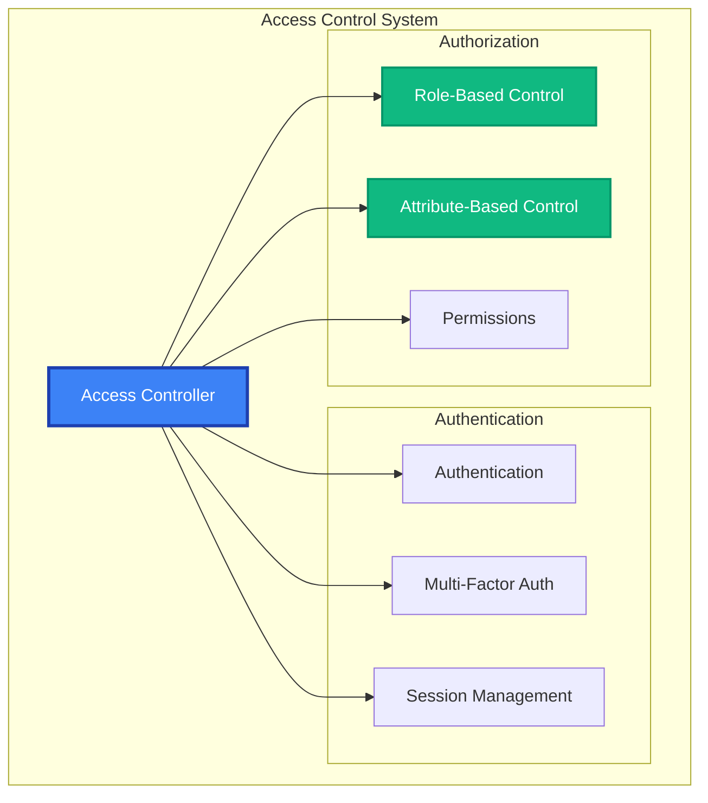

# Access Control API Reference

The Access Control module provides granular permission management, role-based access control (RBAC), attribute-based access control (ABAC), and comprehensive authorization for MAIF resources.

## Overview

Access Control features:
- **Role-Based Access Control (RBAC)**: Users, roles, and permissions
- **Attribute-Based Access Control (ABAC)**: Context-aware authorization
- **Resource Protection**: Fine-grained access to artifacts and operations
- **Session Management**: Secure session handling and timeouts
- **Multi-Factor Authentication**: Enhanced security verification



## Quick Start

This example provides a brief overview of the Access Control module's core functionality: creating roles and users, and checking access permissions.

```python
from maif.security import AccessController, Role, Permission

# Create a new access controller instance.
access_control = AccessController()

# Define roles with specific permissions.
admin_role = Role("admin", permissions=["read", "write", "delete"])
user_role = Role("user", permissions=["read", "write"])

# Create a new user, assign them a role, and add attributes for ABAC.
user = access_control.create_user(
    user_id="alice",
    roles=[user_role],
    attributes={"department": "engineering"}
)

# Check if the user has permission to perform an action on a resource.
can_access = access_control.check_access(
    user_id="alice",
    resource="artifact:financial-data", # The resource being accessed.
    action="read" # The action being performed.
)
```

## Constructor & Configuration

The `AccessController` constructor allows you to configure its behavior for authentication, authorization, auditing, and performance.

```python
access_control = AccessController(
    # --- Authentication Settings ---
    enable_multi_factor_auth=True, # Enable MFA for all users.
    session_timeout_minutes=30, # The default session timeout.
    max_failed_attempts=3, # Lock accounts after 3 failed login attempts.
    
    # --- Authorization Settings ---
    authorization_model="RBAC",  # The authorization model to use (RBAC, ABAC, or hybrid).
    default_deny=True, # Deny access by default if no explicit allow rule is found.
    
    # --- Policy Enforcement ---
    strict_enforcement=True, # Strictly enforce all policies.
    cache_decisions=True, # Cache authorization decisions to improve performance.
    
    # --- Audit Settings ---
    audit_all_access=True, # Audit all access attempts (both allowed and denied).
    audit_retention_days=365, # The retention period for audit logs.
    
    # --- Integration ---
    ldap_integration=True, # Enable integration with an LDAP directory.
    sso_enabled=True, # Enable Single Sign-On (SSO).
    
    # --- Performance ---
    parallel_authorization=True # Use multiple threads for parallel authorization checks.
)
```

## User Management

### User Operations

#### `create_user(user_id, **options) -> User`

Creates a new user with specified roles, attributes, and authentication settings.

```python
# Create a new user with a comprehensive set of options.
user = access_control.create_user(
    user_id="alice.smith",
    display_name="Alice Smith",
    email="alice@company.com",
    
    # --- Authentication Details ---
    password="secure-password", # The user's initial password.
    enable_mfa=True, # Enable Multi-Factor Authentication for this user.
    
    # --- Authorization Details ---
    roles=["developer", "analyst"], # The roles assigned to the user.
    groups=["engineering_team"], # The groups the user belongs to.
    
    # --- Attributes for ABAC ---
    attributes={
        "clearance_level": "secret",
        "department": "engineering",
        "location": "headquarters"
    },
    
    # --- Account Settings ---
    account_expires="2024-12-31", # The date the user's account expires.
    max_sessions=3 # The maximum number of concurrent sessions for the user.
)
```

#### `authenticate_user(user_id, credentials, **options) -> AuthResult`

Authenticates a user with their credentials and, if successful, creates a new session.

```python
# Authenticate a user with a password and MFA token.
auth_result = access_control.authenticate_user(
    user_id="alice.smith",
    credentials={
        "password": "user-password",
        "mfa_token": "123456" # The user's MFA token.
    },
    require_mfa=True, # Require MFA for this authentication attempt.
    session_duration_hours=8, # The duration of the session if authentication is successful.
    client_ip="192.168.1.100" # The client's IP address for session binding.
)

# Check the authentication result.
if auth_result.success:
    print(f"Session ID: {auth_result.session_id}")
else:
    print(f"Authentication failed: {auth_result.failure_reason}")
```

## Role & Permission Management

### Role Definition

#### `create_role(role_name, **options) -> Role`

Creates a new role with a set of associated permissions.

```python
# Create a system administrator role with wide-ranging permissions.
admin_role = access_control.create_role(
    role_name="system_admin",
    permissions=[
        "artifact:*:read", # Read access to all artifacts.
        "artifact:*:write", # Write access to all artifacts.
        "artifact:*:delete", # Delete access to all artifacts.
        "user:*:manage" # Management access to all users.
    ],
    description="System administrator with full permissions.",
    max_users=5, # The maximum number of users that can have this role.
    requires_approval=True # Require approval before assigning this role to a user.
)

# Create a data analyst role with more specific permissions.
analyst_role = access_control.create_role(
    role_name="data_analyst",
    permissions=[
        "artifact:analytics:read",
        "artifact:reports:write"
    ],
    # Grant specific permissions on specific resources.
    resource_permissions={
        "artifact:financial": ["read"],
        "artifact:public": ["read", "write"]
    }
)
```

### Permission Management

#### `create_permission(permission_name, **options) -> Permission`

Creates a new permission, which can be a simple action on a resource or a complex rule with conditions.

```python
# Create a basic permission for reading artifacts.
read_permission = access_control.create_permission(
    permission_name="artifact:read",
    description="Allows reading the content of an artifact.",
    resource_type="artifact",
    action="read"
)

# Create a complex permission with conditions for accessing sensitive data.
sensitive_access = access_control.create_permission(
    permission_name="artifact:sensitive:read",
    # Define the conditions under which this permission is granted.
    conditions={
        "and": [
            {"user.clearance_level": {"gte": "secret"}},
            {"user.department": {"in": ["security"]}},
            {"context.location": {"eq": "secure_facility"}}
        ]
    },
    requires_mfa=True, # Require that the user has verified with MFA in their session.
    audit_level="detailed" # Use a detailed audit level for this permission.
)
```

## Authorization

### Access Control Checks

#### `check_access(user_id, resource, action, **options) -> AccessResult`

Checks if a user has permission to perform a specific action on a resource, taking into account their roles, attributes, and the current context.

```python
# Perform a simple access check.
can_read = access_control.check_access(
    user_id="alice.smith",
    resource="artifact:financial-report",
    action="read"
)

# Perform a comprehensive check with context for ABAC.
access_result = access_control.check_access(
    user_id="alice.smith",
    resource="artifact:sensitive-data",
    action="read",
    
    # --- Context for Attribute-Based Access Control (ABAC) ---
    context={
        "time": datetime.now(),
        "location": "office",
        "ip_address": "192.168.1.100",
        "purpose": "analysis"
    },
    
    # --- Attributes of the resource being accessed ---
    resource_attributes={
        "classification": "confidential",
        "owner": "finance_team"
    },
    
    include_reasoning=True, # Include an explanation of why access was allowed or denied.
    audit_access_check=True # Ensure this access check is audited.
)

# Check the result.
if access_result.allowed:
    print("Access granted.")
    print(f"Effective permissions: {access_result.effective_permissions}")
else:
    print(f"Access denied. Reason: {access_result.denial_reason}")
```

#### `batch_check_access(requests) -> List[AccessResult]`

Performs a batch of access control checks for multiple requests in a single call.

```python
# A list of access control requests to be checked in a batch.
requests = [
    {"user_id": "alice", "resource": "artifact:A", "action": "read"},
    {"user_id": "alice", "resource": "artifact:B", "action": "write"},
    {"user_id": "bob", "resource": "artifact:C", "action": "delete"}
]

# Perform the batch check with parallel processing enabled.
results = access_control.batch_check_access(
    requests=requests,
    parallel_processing=True
)
```

### Delegation & Temporary Access

#### `delegate_access(delegator, delegatee, permissions, **options) -> DelegationResult`

Allows a user to temporarily delegate some of their permissions to another user.

```python
# Delegate read and write permissions for reports from a manager to an analyst for 24 hours.
delegation = access_control.delegate_access(
    delegator="manager.alice",
    delegatee="analyst.bob",
    permissions=["artifact:reports:read", "artifact:reports:write"],
    duration_hours=24, # The duration of the delegation.
    conditions={"purpose": "quarterly_analysis"}, # Conditions under which the delegated permissions can be used.
    requires_approval=True # Require another manager to approve the delegation.
)
```

#### `grant_temporary_access(user_id, resource, **options) -> TemporaryAccess`

Grants temporary, emergency access to a resource, with detailed justification and monitoring.

```python
# Grant a user emergency access to incident data for 60 minutes.
temp_access = access_control.grant_temporary_access(
    user_id="emergency.responder",
    resource="artifact:incident-data",
    permissions=["read", "analyze"],
    duration_minutes=60, # The duration of the temporary access.
    emergency_justification="security incident response", # The reason for the emergency access.
    continuous_monitoring=True # Enable continuous monitoring of all actions taken with this temporary access.
)
```

## Session Management

### Session Operations

#### `create_session(user_id, **options) -> Session`

Creates a new authenticated session for a user.

```python
# Create a new session for a user with several security options.
session = access_control.create_session(
    user_id="alice.smith",
    duration_hours=8, # The total duration of the session.
    max_idle_minutes=30, # The maximum idle time before the session expires.
    bind_to_device=True, # Bind the session to the user's device.
    device_fingerprint="device-123", # A fingerprint of the user's device.
    security_level="high" # The security level of the session.
)
```

#### `validate_session(session_id, **options) -> SessionValidation`

Validates an existing session to ensure it is still active and valid.

```python
# Validate a session, checking for expiry and device binding.
validation = access_control.validate_session(
    session_id="sess_abc123",
    check_expiry=True, # Check if the session has expired.
    check_device_binding=True, # Check if the session is still bound to the original device.
    current_ip="192.168.1.100", # The current IP address of the client.
    extend_on_activity=True # Extend the session's idle timeout on activity.
)

if validation.valid:
    print(f"Session is valid for user: {validation.user_id}")
else:
    print(f"Session is invalid. Reason: {validation.invalid_reason}")
```

## Multi-Factor Authentication

### MFA Setup

#### `setup_mfa(user_id, mfa_method, **options) -> MFASetup`

Sets up a new Multi-Factor Authentication method for a user.

```python
# Set up Time-based One-Time Password (TOTP) for a user.
totp_setup = access_control.setup_mfa(
    user_id="alice.smith",
    mfa_method="totp", # The MFA method to set up.
    issuer="Company MAIF", # The issuer name to display in the authenticator app.
    generate_backup_codes=True # Generate backup codes for the user.
)

# Display the QR code for the user to scan.
print(f"QR Code URL: {totp_setup.qr_code_url}")
print(f"Backup codes: {totp_setup.backup_codes}")

# Set up SMS-based MFA for another user.
sms_setup = access_control.setup_mfa(
    user_id="bob.jones",
    mfa_method="sms",
    phone_number="+1-555-123-4567" # The user's phone number for SMS codes.
)
```

### MFA Verification

#### `verify_mfa(user_id, mfa_token, **options) -> MFAResult`

Verifies an MFA token provided by a user.

```python
# Verify a TOTP token provided by a user.
mfa_result = access_control.verify_mfa(
    user_id="alice.smith",
    mfa_token="123456", # The token from the user's authenticator app.
    mfa_method="totp",
    allow_backup_codes=True, # Allow the use of backup codes for verification.
    check_replay_attack=True # Check for replay attacks by ensuring the token has not been used before.
)

if mfa_result.verified:
    print("MFA verification was successful.")
else:
    print(f"MFA verification failed. Reason: {mfa_result.failure_reason}")
```

## Access Policies

### Policy Definition

#### `create_access_policy(policy_name, **options) -> AccessPolicy`

Creates a comprehensive, human-readable access policy that combines roles, attributes, and conditions.

```python
# Create an access policy for financial data.
policy = access_control.create_access_policy(
    policy_name="financial_data_policy",
    rules=[
        {
            "effect": "allow", # The effect of the rule (allow or deny).
            "principals": ["role:financial_analyst"], # The principals this rule applies to.
            "resources": ["artifact:financial:*"], # The resources this rule applies to.
            "actions": ["read", "analyze"], # The actions this rule allows.
            "conditions": { # The conditions under which this rule is active.
                "time_of_day": "business_hours",
                "location": "office",
                "mfa_verified": True
            }
        }
    ],
    compliance_frameworks=["SOX"], # The compliance frameworks this policy helps to enforce.
    enforcement_mode="strict" # The enforcement mode (strict or permissive).
)
```

### Policy Evaluation

#### `evaluate_policy(policy, request) -> PolicyResult`

Evaluates an access request against a specific policy.

```python
# Evaluate an access request against the financial data policy.
result = access_control.evaluate_policy(
    policy=financial_data_policy,
    request={
        "user_id": "alice.smith",
        "resource": "artifact:financial:budget",
        "action": "read",
        "context": {"location": "office", "mfa_verified": True}
    },
    include_explanation=True # Include a detailed explanation of the evaluation logic.
)

print(f"Policy evaluation decision: {result.decision}")
print(f"Explanation: {result.explanation}")
```

## Audit & Monitoring

### Access Audit

#### `get_access_audit_log(**filters) -> List[AccessAuditEntry]`

Retrieves detailed access audit logs with filtering capabilities.

```python
# Retrieve audit logs for denied access attempts to financial artifacts by a specific user.
audits = access_control.get_access_audit_log(
    start_date="2024-01-01",
    user_ids=["alice.smith"], # Filter by user ID.
    resources=["artifact:financial:*"], # Filter by resource.
    access_results=["denied"], # Filter by the result of the access check.
    include_context=True # Include the full context of the access attempt.
)

# Iterate through the audit log entries.
for entry in audits:
    print(f"User: {entry.user_id}")
    print(f"Resource: {entry.resource}")
    print(f"Result: {entry.result}")
    if entry.result == "denied":
        print(f"Denial Reason: {entry.denial_reason}")
```

### Access Analytics

#### `generate_access_report(**options) -> AccessReport`

Generates a comprehensive report on access patterns, violations, and potential risks.

```python
# Generate a monthly access report with risk assessment.
report = access_control.generate_access_report(
    period="monthly",
    start_date="2024-01-01",
    include_violations=True, # Include a summary of policy violations.
    identify_anomalies=True, # Use ML to identify anomalous access patterns.
    risk_assessment=True, # Include a risk assessment score.
    format="pdf" # The output format of the report.
)

print(f"Total access attempts: {report.total_access_attempts}")
print(f"Number of policy violations: {report.policy_violations}")
print(f"Overall risk score: {report.risk_score}")
```

## Error Handling

The Access Control module raises specific exceptions for different types of access-related errors.

```python
from maif.exceptions import (
    AccessControlError,  # Base exception for access control errors.
    AuthenticationError, # Raised on authentication failures.
    AuthorizationError,  # Raised on authorization failures.
    SessionError,        # Raised on session management errors.
    MFAError             # Raised on MFA-related errors.
)

try:
    auth_result = access_control.authenticate_user(user_id, credentials)
    access_result = access_control.check_access(user_id, resource, action)
    
except AuthenticationError as e:
    logger.error(f"Authentication failed: {e}")
except AuthorizationError as e:
    logger.error(f"Authorization denied: {e}")
except SessionError as e:
    logger.error(f"Session error: {e}")
except MFAError as e:
    logger.error(f"MFA error: {e}")
```

## Best Practices

### Security
```python
# Enable MFA for sensitive operations
access_control.configure(require_mfa_for_sensitive=True)

# Strong session security
access_control.configure(
    session_timeout_minutes=30,
    bind_sessions_to_device=True
)

# Comprehensive auditing
access_control.configure(audit_all_access=True)
```

### Performance
```python
# Cache authorization decisions
access_control.configure(
    cache_decisions=True,
    decision_cache_ttl=300
)

# Batch operations
results = access_control.batch_check_access(requests)
```

### Compliance
```python
# Clear policies with compliance frameworks
policy = access_control.create_access_policy(
    "compliance_policy",
    compliance_frameworks=["SOX", "GDPR"]
)

# Regular access reviews
access_control.generate_access_report(
    period="monthly",
    compliance_check=True
)
```

## Related APIs

- **[Security](/api/security/index)** - Security and digital signatures
- **[Privacy Engine](/api/privacy/engine)** - Privacy protection
- **[Cryptography](/api/security/crypto)** - Cryptographic operations 