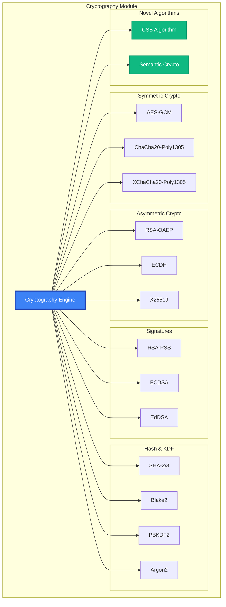

# Cryptography API Reference

The Cryptography module provides low-level cryptographic operations including encryption, hashing, key derivation, and digital signatures with support for industry-standard algorithms and MAIF's novel cryptographic innovations.

## Overview

Cryptographic features:
- **Symmetric Encryption**: AES-GCM, ChaCha20-Poly1305, XChaCha20-Poly1305
- **Asymmetric Encryption**: RSA-OAEP, ECDH, X25519
- **Digital Signatures**: RSA-PSS, ECDSA, EdDSA (Ed25519/Ed448)
- **Hash Functions**: SHA-2, SHA-3, Blake2, Argon2
- **Key Derivation**: PBKDF2, scrypt, Argon2, HKDF
- **Novel Algorithms**: CSB (Cryptographic Semantic Binding)



## Quick Start

This example provides a brief overview of the `CryptographyEngine`'s core functionality: symmetric and asymmetric encryption, digital signatures, and hashing.

```python
from maif.crypto import CryptographyEngine, SymmetricKey, AsymmetricKeyPair

# Create a default cryptography engine.
crypto = CryptographyEngine()

# --- Symmetric Encryption ---
# Generate a symmetric key, encrypt data, and then decrypt it.
key = crypto.generate_symmetric_key("ChaCha20-Poly1305")
ciphertext = crypto.encrypt_symmetric(b"secret data", key)
plaintext = crypto.decrypt_symmetric(ciphertext, key)

# --- Asymmetric Encryption ---
# Generate an asymmetric key pair, encrypt with the public key, and decrypt with the private key.
keypair = crypto.generate_asymmetric_keypair("RSA", key_size=2048)
encrypted = crypto.encrypt_asymmetric(b"secret", keypair.public_key)
decrypted = crypto.decrypt_asymmetric(encrypted, keypair.private_key)

# --- Digital Signatures ---
# Sign a document with the private key and verify the signature with the public key.
signature = crypto.sign(b"document", keypair.private_key)
valid = crypto.verify_signature(b"document", signature, keypair.public_key)

# --- Cryptographic Hashing ---
# Generate a secure hash of a piece of data.
hash_value = crypto.hash(b"data", algorithm="SHA-256")
```

## CryptographyEngine Class

### Constructor

The `CryptographyEngine` constructor allows you to configure its default algorithms, security settings, and performance characteristics.

```python
crypto = CryptographyEngine(
    # --- Default Algorithms ---
    default_symmetric_algorithm="ChaCha20-Poly1305",
    default_asymmetric_algorithm="RSA",
    default_hash_algorithm="SHA-256",
    default_signature_algorithm="RSA-PSS",
    
    # --- Security Settings ---
    secure_random_source="system",  # The source for random number generation (e.g., system, hardware).
    constant_time_operations=True, # Use constant-time algorithms to protect against timing attacks.
    side_channel_protection=True, # Enable protections against side-channel attacks.
    
    # --- Key Management ---
    key_derivation_algorithm="Argon2id", # The default key derivation function.
    key_derivation_iterations=100000, # The default number of iterations for key derivation.
    key_derivation_memory_kb=65536, # The default memory usage for Argon2.
    
    # --- Performance ---
    hardware_acceleration=True,     # Use hardware acceleration (e.g., AES-NI) where available.
    parallel_operations=True, # Use multiple threads for parallel cryptographic operations.
    
    # --- Compliance ---
    fips_mode=True,                # Enable FIPS 140-2 compliance mode.
    quantum_resistant_mode=False,   # Enable experimental post-quantum cryptography algorithms.
    
    # --- Novel Features ---
    enable_semantic_binding=True,   # Enable the novel CSB algorithm.
    semantic_binding_strength=128   # The security strength (in bits) for semantic binding.
)
```

## Symmetric Encryption

### Key Generation

#### `generate_symmetric_key(algorithm, **options) -> SymmetricKey`

Generates a new symmetric key for use with algorithms like AES and ChaCha20.

```python
# Generate a 256-bit key for ChaCha20-Poly1305.
chacha_key = crypto.generate_symmetric_key(
    algorithm="ChaCha20-Poly1305",
    key_size=256,                   # The size of the key in bits.
    
    # --- Key Metadata ---
    key_id="data-encryption-key", # A unique identifier for the key.
    purpose="data_encryption", # The intended purpose of the key.
    
    # --- Security Options ---
    secure_generation=True, # Ensure the key is generated with a secure random source.
    hardware_random=True, # Use a hardware random number generator if available.
    
    # --- Key Derivation (if generating from a password) ---
    derive_from_password=False, # If True, the key will be derived from the provided password.
    password="strong-password",
    salt_size=32, # The size of the salt to use for key derivation.
    iterations=100000 # The number of iterations for the KDF.
)

# Generate a 256-bit key for AES-GCM.
aes_key = crypto.generate_symmetric_key(
    algorithm="AES-GCM",
    key_size=256,
    key_id="file-encryption-key"
)

# Generate a 256-bit key for XChaCha20-Poly1305, which supports extended nonces.
xchacha_key = crypto.generate_symmetric_key(
    algorithm="XChaCha20-Poly1305",
    key_size=256,
    key_id="stream-encryption-key"
)
```

### Encryption Operations

#### `encrypt_symmetric(data, key, **options) -> SymmetricCiphertext`

Encrypts data using a symmetric key.

```python
# Encrypt a simple plaintext message.
plaintext = b"Sensitive information"
ciphertext = crypto.encrypt_symmetric(plaintext, chacha_key)

# Encrypt with advanced options.
ciphertext = crypto.encrypt_symmetric(
    data=plaintext,
    key=chacha_key,
    
    # --- Encryption Options ---
    associated_data=b"metadata",    # Provide additional data to be authenticated but not encrypted.
    nonce=None,                     # A unique nonce for each encryption; auto-generated if None.
    
    # --- Security Options ---
    constant_time=True, # Use a constant-time implementation to prevent timing attacks.
    secure_memory=True, # Use secure memory allocation for sensitive data.
    
    # --- Compression ---
    compress_before_encrypt=True, # Compress the data before encrypting it.
    compression_algorithm="zstd",
    
    # --- Metadata ---
    include_metadata=True, # Include metadata (like the algorithm and nonce) in the output.
    custom_metadata={"purpose": "data_protection"}
)

# The result is a structured object containing the ciphertext and metadata.
print(f"Algorithm: {ciphertext.algorithm}")
print(f"Ciphertext size: {len(ciphertext.ciphertext)} bytes")
print(f"Nonce: {ciphertext.nonce.hex()}")
print(f"Authentication Tag: {ciphertext.tag.hex()}")
```

#### `decrypt_symmetric(ciphertext, key, **options) -> bytes`

Decrypts data using a symmetric key and verifies its integrity.

```python
# Decrypt a simple ciphertext object.
decrypted = crypto.decrypt_symmetric(ciphertext, chacha_key)

# Decrypt with advanced verification options.
decrypted = crypto.decrypt_symmetric(
    ciphertext=ciphertext,
    key=chacha_key,
    
    # --- Verification Options ---
    verify_associated_data=True, # Verify the integrity of the associated data.
    expected_associated_data=b"metadata",
    
    # --- Security Options ---
    constant_time=True,
    secure_memory=True,
    clear_plaintext_after_use=False, # If True, the decrypted plaintext will be cleared from memory after use.
    
    # --- Decompression ---
    decompress_after_decrypt=True, # Decompress the data after decrypting it.
    
    # --- Validation ---
    verify_metadata=True, # Verify the metadata embedded in the ciphertext.
    expected_metadata={"purpose": "data_protection"}
)
```

### Stream Encryption

#### `create_symmetric_stream_cipher(key, **options) -> StreamCipher`

Creates a stream cipher for encrypting large files or data streams without loading the entire content into memory.

```python
# Create a stream cipher for a large data stream.
stream_cipher = crypto.create_symmetric_stream_cipher(
    key=xchacha_key,
    algorithm="XChaCha20-Poly1305",
    
    # --- Stream Options ---
    chunk_size=64*1024,             # Process the stream in 64KB chunks.
    buffer_size=1024*1024,          # Use a 1MB buffer.
    
    # --- Security Options ---
    unique_nonce_per_chunk=True, # Ensure each chunk is encrypted with a unique nonce.
    authenticate_chunks=True # Authenticate each chunk to prevent tampering.
)

# Encrypt a large file by streaming it.
with open("large_file.bin", "rb") as input_file:
    with open("encrypted_file.bin", "wb") as output_file:
        for chunk in input_file:
            encrypted_chunk = stream_cipher.encrypt_chunk(chunk)
            output_file.write(encrypted_chunk)

# Finalize the stream to get the final authentication tag.
final_tag = stream_cipher.finalize()
```

## Asymmetric Encryption

### Key Pair Generation

#### `generate_asymmetric_keypair(algorithm, **options) -> AsymmetricKeyPair`

Generates a new asymmetric key pair (public and private keys).

```python
# Generate a 2048-bit RSA key pair.
rsa_keypair = crypto.generate_asymmetric_keypair(
    algorithm="RSA",
    key_size=2048,                  # The size of the key (e.g., 2048, 3072, 4096).
    public_exponent=65537,
    
    # --- Key Metadata ---
    key_id="document-encryption-key",
    usage=["encryption", "signature"], # The intended usage of the key pair.
    
    # --- Security Options ---
    secure_generation=True,
    hardware_backed=False, # If True, the key will be generated in an HSM.
    
    # --- Storage Options ---
    password_protect_private_key=True, # Encrypt the private key with a password.
    private_key_password="strong-password"
)

# Generate an ECDH key pair for key exchange.
ecdh_keypair = crypto.generate_asymmetric_keypair(
    algorithm="ECDH",
    curve="P-256",                  # The elliptic curve to use (e.g., "P-256", "P-384").
    key_id="key-exchange-key"
)

# Generate an X25519 key pair, a modern and fast key exchange algorithm.
x25519_keypair = crypto.generate_asymmetric_keypair(
    algorithm="X25519",
    key_id="modern-encryption-key"
)

# Generate an Ed25519 key pair for digital signatures.
ed25519_keypair = crypto.generate_asymmetric_keypair(
    algorithm="Ed25519",
    key_id="signature-key"
)
```

### Asymmetric Encryption

#### `encrypt_asymmetric(data, public_key, **options) -> AsymmetricCiphertext`

Encrypts data using a public key.

```python
# Encrypt a message using RSA-OAEP padding.
plaintext = b"Secret message"
encrypted = crypto.encrypt_asymmetric(
    data=plaintext,
    public_key=rsa_keypair.public_key,
    
    # --- Encryption Options ---
    padding="OAEP",                 # The padding scheme to use (OAEP is recommended).
    hash_algorithm="SHA-256",       # The hash algorithm for OAEP.
    mgf_hash="SHA-256",            # The mask generation function for OAEP.
    
    # --- Hybrid Encryption for Large Data ---
    use_hybrid_encryption=True,     # Use a hybrid approach (e.g., RSA-KEM + AES-GCM) for large data.
    symmetric_algorithm="AES-GCM",
    
    # --- Security Options ---
    secure_memory=True
)
```

#### `decrypt_asymmetric(ciphertext, private_key, **options) -> bytes`

Decrypts data using a private key.

```python
# Decrypt the message using the private key.
decrypted = crypto.decrypt_asymmetric(
    ciphertext=encrypted,
    private_key=rsa_keypair.private_key,
    
    # --- Decryption Options ---
    padding="OAEP",
    hash_algorithm="SHA-256",
    
    # --- Security Options ---
    constant_time=True, # Use a constant-time implementation to prevent timing attacks.
    secure_memory=True,
    
    # --- Private Key Protection ---
    private_key_password="strong-password" # The password to decrypt the private key, if it's protected.
)
```

### Key Exchange

#### `perform_key_exchange(private_key, public_key, **options) -> SharedSecret`

Performs a key exchange (e.g., Diffie-Hellman) to establish a shared secret between two parties.

```python
# Example of an ECDH key exchange between Alice and Bob.
alice_keypair = crypto.generate_asymmetric_keypair("ECDH", curve="P-256")
bob_keypair = crypto.generate_asymmetric_keypair("ECDH", curve="P-256")

# Alice computes the shared secret using her private key and Bob's public key.
alice_shared = crypto.perform_key_exchange(
    private_key=alice_keypair.private_key,
    public_key=bob_keypair.public_key,
    
    # --- Key Derivation ---
    derive_key=True, # Derive a key from the shared secret.
    key_derivation_function="HKDF", # The KDF to use.
    hash_algorithm="SHA-256",
    salt=b"unique-salt", # A unique salt for the derivation.
    info=b"key-exchange-context", # Contextual information for the derivation.
    derived_key_length=32 # The desired length of the derived key.
)

# Bob computes the same shared secret using his private key and Alice's public key.
bob_shared = crypto.perform_key_exchange(
    private_key=bob_keypair.private_key,
    public_key=alice_keypair.public_key,
    derive_key=True,
    key_derivation_function="HKDF",
    hash_algorithm="SHA-256",
    salt=b"unique-salt",
    info=b"key-exchange-context",
    derived_key_length=32
)

# Both Alice and Bob will now have the same shared secret key.
assert alice_shared.key == bob_shared.key
```

## Digital Signatures

### Signature Generation

#### `sign(data, private_key, **options) -> Signature`

Creates a digital signature for a piece of data using a private key.

```python
# Create an RSA-PSS signature.
document = b"Important contract terms..."
signature = crypto.sign(
    data=document,
    private_key=rsa_keypair.private_key,
    
    # --- Signature Algorithm Options ---
    algorithm="RSA-PSS", # The signature scheme to use (PSS is recommended for RSA).
    hash_algorithm="SHA-256",
    salt_length="auto",             # The length of the salt for PSS.
    
    # --- Security Options ---
    deterministic=False,            # If False, the signature will be probabilistic (e.g., using a random salt).
    secure_memory=True,
    
    # --- Metadata ---
    include_timestamp=True, # Include a trusted timestamp in the signature.
    custom_attributes={"signer": "alice", "purpose": "approval"}
)

# Create a deterministic ECDSA signature.
ecdsa_signature = crypto.sign(
    data=document,
    private_key=ecdsa_keypair.private_key,
    algorithm="ECDSA",
    hash_algorithm="SHA-256",
    deterministic=True              # Use RFC 6979 for a deterministic signature, which avoids the need for a good random number source.
)

# Create an EdDSA (Ed25519) signature.
ed25519_signature = crypto.sign(
    data=document,
    private_key=ed25519_keypair.private_key,
    algorithm="EdDSA"               # Pure EdDSA does not require a separate hash function.
)
```

### Signature Verification

#### `verify_signature(data, signature, public_key, **options) -> bool`

Verifies a digital signature using a public key.

```python
# Verify an RSA-PSS signature.
is_valid = crypto.verify_signature(
    data=document,
    signature=signature,
    public_key=rsa_keypair.public_key,
    
    # --- Verification Options ---
    algorithm="RSA-PSS",
    hash_algorithm="SHA-256",
    
    # --- Security Options ---
    constant_time=True, # Use a constant-time implementation to prevent timing attacks.
    
    # --- Metadata Verification ---
    verify_timestamp=True, # Verify that the timestamp is recent and valid.
    verify_attributes=True, # Verify any custom attributes embedded in the signature.
    expected_attributes={"signer": "alice"}
)

print(f"Is the signature valid? {is_valid}")
```

## Cryptographic Hashing

### Hash Functions

#### `hash(data, algorithm, **options) -> bytes`

Computes a cryptographic hash of a piece of data.

```python
# Compute a SHA-256 hash.
sha256_hash = crypto.hash(
    data=b"Data to hash",
    algorithm="SHA-256"
)

# Compute a SHA-3 hash.
sha3_hash = crypto.hash(
    data=b"Data to hash",
    algorithm="SHA3-256"
)

# Compute a keyed Blake2b hash (which can be used as a MAC).
blake2_hash = crypto.hash(
    data=b"Data to hash",
    algorithm="Blake2b",
    digest_size=32,                 # The desired output size in bytes.
    key=b"secret-key",              # An optional secret key.
    salt=b"unique-salt",            # An optional salt.
    person=b"application-id"        # An optional personalization string.
)
```

### Password Hashing

#### `hash_password(password, **options) -> PasswordHash`

```python
# Argon2id password hashing (recommended)
password_hash = crypto.hash_password(
    password="user-password",
    algorithm="Argon2id",
    
    # Argon2 parameters
    time_cost=3,                    # Iterations
    memory_cost=65536,              # Memory in KB
    parallelism=4,                  # Parallel threads
    
    # Salt
    salt_size=32,                   # Random salt size
    salt=None,                      # Auto-generate if None
    
    # Output
    hash_length=32                  # Hash output length
)

# scrypt password hashing
scrypt_hash = crypto.hash_password(
    password="user-password",
    algorithm="scrypt",
    n=32768,                        # CPU/memory cost
    r=8,                            # Block size
    p=1,                            # Parallelization
    salt_size=32,
    hash_length=32
)

# PBKDF2 password hashing
pbkdf2_hash = crypto.hash_password(
    password="user-password",
    algorithm="PBKDF2",
    hash_algorithm="SHA-256",
    iterations=100000,
    salt_size=32,
    hash_length=32
)
```

#### `verify_password(password, password_hash) -> bool`

```python
# Verify password against hash
is_correct = crypto.verify_password(
    password="user-password",
    password_hash=password_hash
)
```

## Key Derivation

### Key Derivation Functions

#### `derive_key(input_key_material, **options) -> DerivedKey`

```python
# HKDF (HMAC-based Key Derivation Function)
derived_key = crypto.derive_key(
    input_key_material=b"shared-secret",
    algorithm="HKDF",
    
    # HKDF parameters
    hash_algorithm="SHA-256",
    salt=b"unique-salt",
    info=b"encryption-key",         # Context information
    length=32                       # Output key length
)

# PBKDF2 key derivation
pbkdf2_key = crypto.derive_key(
    input_key_material=b"password",
    algorithm="PBKDF2",
    hash_algorithm="SHA-256",
    salt=b"random-salt",
    iterations=100000,
    length=32
)

# Argon2 key derivation
argon2_key = crypto.derive_key(
    input_key_material=b"password",
    algorithm="Argon2id",
    salt=b"random-salt",
    time_cost=3,
    memory_cost=65536,
    parallelism=4,
    length=32
)
```

## Novel Cryptographic Algorithms

### Cryptographic Semantic Binding (CSB)

#### `create_semantic_binding(content, **options) -> SemanticBinding`

```python
# Create semantic binding for content
semantic_binding = crypto.create_semantic_binding(
    content="Sensitive document content",
    
    # Semantic parameters
    embedding_model="all-MiniLM-L6-v2",
    semantic_threshold=0.8,
    
    # Cryptographic parameters
    binding_strength=128,           # Security level in bits
    encryption_algorithm="ChaCha20-Poly1305",
    
    # Binding options
    bind_to_semantic_meaning=True,
    bind_to_syntactic_structure=False,
    preserve_privacy=True,
    
    # Context binding
    context_data="document-classification",
    temporal_binding=True,
    spatial_binding=False
)

print(f"Binding ID: {semantic_binding.binding_id}")
print(f"Semantic fingerprint: {semantic_binding.semantic_fingerprint}")
```

#### `verify_semantic_binding(content, binding, **options) -> bool`

```python
# Verify semantic binding
is_semantically_bound = crypto.verify_semantic_binding(
    content="Modified document content",
    binding=semantic_binding,
    
    # Verification options
    semantic_threshold=0.8,
    allow_minor_changes=True,
    context_verification=True,
    
    # Security options
    constant_time=True
)

print(f"Semantic binding valid: {is_semantically_bound}")
```

### Privacy-Preserving Cryptography

#### `encrypt_with_semantic_preservation(data, **options) -> SemanticCiphertext`

```python
# Encrypt while preserving semantic searchability
semantic_ciphertext = crypto.encrypt_with_semantic_preservation(
    data="Confidential business document",
    
    # Encryption
    encryption_key=chacha_key,
    encryption_algorithm="ChaCha20-Poly1305",
    
    # Semantic preservation
    preserve_semantic_search=True,
    semantic_granularity="sentence",  # or "word", "paragraph"
    
    # Privacy parameters
    differential_privacy=True,
    epsilon=1.0,                    # Privacy budget
    
    # Search parameters
    enable_fuzzy_search=True,
    search_precision=0.8
)
```

## Random Number Generation

### Secure Random Generation

#### `generate_random_bytes(length, **options) -> bytes`

```python
# Generate cryptographically secure random bytes
random_bytes = crypto.generate_random_bytes(
    length=32,
    
    # Randomness source
    source="system",                # or "hardware", "fortuna"
    
    # Quality requirements
    entropy_requirement="high",
    reseed_interval=1000000,        # Reseed after N bytes
    
    # Testing
    statistical_tests=True,
    fips_tests=True
)

# Generate random integers
random_int = crypto.generate_random_int(
    min_value=1000,
    max_value=9999,
    source="hardware"
)

# Generate random string
random_string = crypto.generate_random_string(
    length=16,
    alphabet="ABCDEFGHIJKLMNOPQRSTUVWXYZabcdefghijklmnopqrstuvwxyz0123456789"
)
```

## Error Handling

```python
from maif.exceptions import (
    CryptographyError,
    EncryptionError,
    DecryptionError,
    SignatureError,
    KeyGenerationError,
    HashError,
    RandomnessError
)

try:
    # Cryptographic operations
    key = crypto.generate_symmetric_key("ChaCha20-Poly1305")
    ciphertext = crypto.encrypt_symmetric(data, key)
    signature = crypto.sign(data, private_key)
    
except KeyGenerationError as e:
    logger.error(f"Key generation failed: {e}")
    # Handle key generation issues
    
except EncryptionError as e:
    logger.error(f"Encryption failed: {e}")
    # Handle encryption failures
    
except DecryptionError as e:
    logger.error(f"Decryption failed: {e}")
    # Handle decryption failures
    
except SignatureError as e:
    logger.error(f"Signature operation failed: {e}")
    # Handle signature issues
    
except HashError as e:
    logger.error(f"Hashing failed: {e}")
    # Handle hashing problems
    
except RandomnessError as e:
    logger.error(f"Random generation failed: {e}")
    # Handle randomness issues
    
except CryptographyError as e:
    logger.error(f"Cryptography error: {e}")
    # Handle general crypto errors
```

## Best Practices

### Algorithm Selection
```python
# Use modern, secure algorithms
crypto = CryptographyEngine(
    default_symmetric_algorithm="ChaCha20-Poly1305",  # Fast, secure
    default_asymmetric_algorithm="X25519",            # Modern ECC
    default_hash_algorithm="SHA-256",                 # Widely supported
    default_signature_algorithm="Ed25519"             # Fast, secure
)
```

### Key Management
```python
# Generate keys securely
key = crypto.generate_symmetric_key(
    "ChaCha20-Poly1305",
    secure_generation=True,
    hardware_random=True
)

# Protect private keys
keypair = crypto.generate_asymmetric_keypair(
    "RSA",
    key_size=2048,
    password_protect_private_key=True,
    hardware_backed=True
)

# Regular key rotation
crypto.schedule_key_rotation(key_id, rotation_interval_days=90)
```

### Security
```python
# Enable constant-time operations
crypto.configure(
    constant_time_operations=True,
    side_channel_protection=True,
    secure_memory=True
)

# Use strong randomness
random_bytes = crypto.generate_random_bytes(
    32,
    source="hardware",
    entropy_requirement="high"
)

# Verify all signatures
is_valid = crypto.verify_signature(
    data, signature, public_key,
    constant_time=True
)
```

## Related APIs

- **[Security](/api/security/index)** - High-level security operations
- **[Privacy Engine](/api/privacy/engine)** - Privacy protection features
- **[Access Control](/api/security/access-control)** - Permission management 