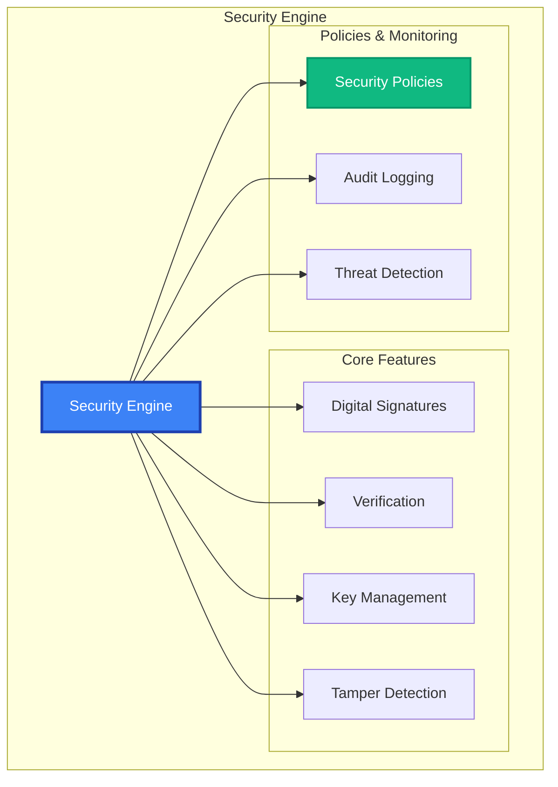

# Security API Reference

The MAIF Security module provides enterprise-grade security including digital signatures, tamper detection, key management, and security policies for data integrity and authenticity.

## Overview

Security features:
- **Digital Signatures**: RSA, ECDSA, EdDSA with certificate management
- **Tamper Detection**: Integrity verification and corruption detection
- **Key Management**: Secure generation, storage, and rotation
- **Security Policies**: Configurable levels and compliance frameworks
- **Monitoring**: Security event logging and threat detection



## Quick Start

```python
from maif.security import SecurityEngine, SecurityLevel

# Create security engine
security = SecurityEngine()

# Generate signing key
signing_key = security.generate_key("RSA", key_size=2048)

# Sign data
data = b"Important document"
signature = security.sign(data, signing_key)

# Verify signature
is_valid = security.verify(data, signature, signing_key.public_key)

# Apply security policy
secured = security.apply_security_policy(
    data=sensitive_data,
    level=SecurityLevel.CONFIDENTIAL,
    require_signature=True
)
```

## Constructor & Configuration

```python
security = SecurityEngine(
    # Security settings
    default_security_level=SecurityLevel.INTERNAL,
    require_signatures=True,
    enable_tamper_detection=True,
    
    # Key management
    key_storage_backend="secure_enclave",
    key_rotation_policy="90_days",
    
    # Algorithms
    default_signature_algorithm="RSA-PSS",
    hash_algorithm="SHA-256",
    
    # Policies
    strict_policy_enforcement=True,
    
    # Monitoring
    audit_all_operations=True,
    enable_threat_detection=True,
    
    # Performance
    parallel_verification=True,
    signature_cache_size=10000
)
```

## Digital Signatures

### Key Generation

#### `generate_key(algorithm, **options) -> SigningKey`

```python
# RSA key
rsa_key = security.generate_key(
    algorithm="RSA",
    key_size=2048,
    key_id="doc-signing-key",
    hardware_backed=True,
    store_securely=True
)

# ECDSA key
ecdsa_key = security.generate_key(
    algorithm="ECDSA",
    curve="P-256",
    key_id="fast-signing-key"
)

# EdDSA key (Ed25519)
eddsa_key = security.generate_key(
    algorithm="EdDSA",
    curve="Ed25519",
    key_id="modern-key"
)
```

### Signing Operations

#### `sign(data, signing_key, **options) -> Signature`

```python
# Simple signing
signature = security.sign(document, signing_key)

# Advanced signing
signature = security.sign(
    data=document,
    signing_key=signing_key,
    algorithm="RSA-PSS",
    hash_algorithm="SHA-256",
    include_timestamp=True,
    include_certificate_chain=True,
    signing_purpose="document_approval",
    custom_attributes={"department": "legal"}
)
```

#### `sign_detached(data, signing_key, **options) -> DetachedSignature`

```python
# Detached signature (separate from data)
detached_sig = security.sign_detached(
    data=large_file,
    signing_key=signing_key,
    output_format="PKCS7",
    base64_encode=True
)
```

### Verification Operations

#### `verify(data, signature, public_key, **options) -> VerificationResult`

```python
# Simple verification
is_valid = security.verify(document, signature, public_key)

# Advanced verification
verification = security.verify(
    data=document,
    signature=signature,
    public_key=public_key,
    strict_verification=True,
    check_certificate_chain=True,
    verify_timestamp=True,
    require_trusted_ca=True
)

if verification.is_valid:
    print(f"Signer: {verification.signer_info.common_name}")
    print(f"Signed at: {verification.signing_time}")
else:
    for error in verification.errors:
        print(f"Error: {error.description}")
```

## Tamper Detection

### Integrity Verification

#### `generate_integrity_hash(data, **options) -> IntegrityHash`

```python
# Generate integrity hash
integrity_hash = security.generate_integrity_hash(
    data=sensitive_document,
    algorithm="SHA-256",
    include_timestamp=True,
    use_merkle_tree=True,
    chunk_size=64*1024,
    bind_to_context=True
)
```

#### `verify_integrity(data, integrity_hash, **options) -> IntegrityResult`

```python
# Verify data integrity
result = security.verify_integrity(
    data=current_document,
    integrity_hash=stored_hash,
    detect_modifications=True,
    identify_changed_regions=True
)

if not result.is_intact:
    print("TAMPERING DETECTED!")
    for change in result.detected_changes:
        print(f"Change at offset {change.offset}")
```

## Security Policies

### Policy Definition

```python
# Predefined policies
confidential_policy = SecurityPolicy.CONFIDENTIAL

# Custom policy
custom_policy = SecurityPolicy(
    name="Financial Security Policy",
    level=SecurityLevel.RESTRICTED,
    
    # Signature requirements
    require_digital_signature=True,
    minimum_signature_strength="RSA-2048",
    require_certificate_chain=True,
    
    # Integrity requirements
    require_integrity_hash=True,
    enable_tamper_detection=True,
    
    # Access control
    authorized_roles=["analyst", "manager"],
    require_multi_factor_auth=True,
    
    # Compliance
    compliance_frameworks=["SOX", "PCI-DSS"],
    audit_all_access=True
)
```

### Policy Application

#### `apply_security_policy(data, policy, **options) -> SecuredData`

```python
# Apply security policy
secured = security.apply_security_policy(
    data=financial_report,
    policy=custom_policy,
    user_id="analyst123",
    user_role="financial_analyst",
    strict_enforcement=True
)
```

#### `validate_security_compliance(data, policy) -> ComplianceResult`

```python
# Validate compliance
compliance = security.validate_security_compliance(data, policy)

if not compliance.is_compliant:
    for violation in compliance.violations:
        print(f"Violation: {violation.description}")
        print(f"Fix: {violation.suggested_remediation}")
```

## Key Management

### Key Storage & Retrieval

#### `store_key(key, **options) -> str`

```python
# Store key securely
key_id = security.store_key(
    key=signing_key,
    storage_backend="secure_enclave",
    key_name="document-signing-2024",
    hardware_backed=True,
    access_policy="restricted"
)
```

#### `retrieve_key(key_id, **options) -> SigningKey`

```python
# Retrieve stored key
key = security.retrieve_key(
    key_id="document-signing-2024",
    password="strong-password",
    require_user_presence=True,
    verify_key_integrity=True
)
```

### Key Rotation

#### `rotate_key(key_id, **options) -> KeyRotationResult`

```python
# Rotate signing key
rotation = security.rotate_key(
    key_id="document-signing-2024",
    rotation_strategy="immediate",
    new_key_size=3072,
    update_certificates=True,
    verify_rotation=True
)
```

## Security Monitoring

### Audit Logging

#### `get_security_audit_log(**filters) -> List[SecurityAuditEntry]`

```python
# Get security audit logs
audits = security.get_security_audit_log(
    start_date="2024-01-01",
    event_types=["signature_created", "key_accessed"],
    security_levels=[SecurityLevel.CONFIDENTIAL],
    include_details=True
)

for entry in audits:
    print(f"Event: {entry.event_type}")
    print(f"User: {entry.user_id}")
    print(f"Result: {entry.result}")
    if entry.security_violation:
        print(f"VIOLATION: {entry.violation_details}")
```

### Threat Detection

#### `detect_security_threats(**options) -> ThreatDetectionResult`

```python
# Detect security threats
threats = security.detect_security_threats(
    time_window_hours=24,
    use_machine_learning=True,
    threat_sensitivity="high",
    monitor_key_access=True,
    monitor_signature_operations=True
)

if threats.threats_detected:
    for threat in threats.threats:
        print(f"Threat: {threat.type}")
        print(f"Severity: {threat.severity}")
        print(f"Actions: {threat.recommended_actions}")
```

### Security Alerts

#### `configure_security_alerts(**config)`

```python
# Configure alerting
security.configure_security_alerts(
    email_alerts=True,
    alert_on_policy_violations=True,
    alert_on_tamper_detection=True,
    security_team_email="security@company.com",
    webhook_url="https://company.com/security-webhook",
    max_alerts_per_hour=50
)
```

## Error Handling

```python
from maif.exceptions import (
    SecurityError,
    SignatureError,
    KeyManagementError,
    TamperDetectionError,
    PolicyViolationError
)

try:
    signature = security.sign(data, key)
    verification = security.verify(data, signature, public_key)
    
except SignatureError as e:
    logger.error(f"Signature failed: {e}")
except KeyManagementError as e:
    logger.error(f"Key error: {e}")
except TamperDetectionError as e:
    logger.error(f"Tamper detection failed: {e}")
except PolicyViolationError as e:
    logger.error(f"Policy violation: {e}")
```

## Best Practices

### Key Management
```python
# Hardware-backed keys for critical operations
key = security.generate_key("RSA", hardware_backed=True)

# Regular key rotation
security.configure_key_rotation(interval_days=90)

# Secure storage
security.store_key(key, storage_backend="secure_enclave")
```

### Signature Security
```python
# Strong algorithms
security.configure(default_signature_algorithm="RSA-PSS")

# Include timestamps
signature = security.sign(data, key, include_timestamp=True)

# Verify certificate chains
security.verify(data, signature, key, check_certificate_chain=True)
```

### Monitoring
```python
# Comprehensive auditing
security.configure(audit_all_operations=True)

# Real-time threat detection
security.enable_threat_detection(real_time=True)

# Automated alerts
security.configure_security_alerts(immediate_alerts=True)
```

## Related APIs

- **[Privacy Engine](/api/privacy/engine)** - Privacy and encryption
- **[Access Control](/api/security/access-control)** - Permission management
- **[Cryptography](/api/security/crypto)** - Cryptographic operations 