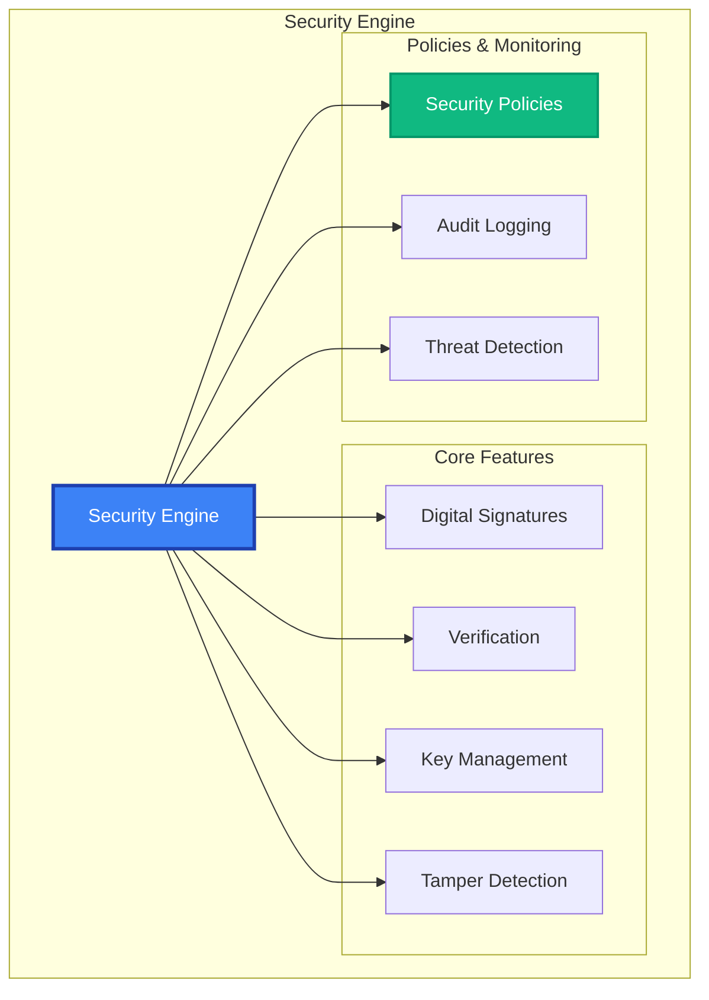

# Security API Reference

The MAIF Security module provides enterprise-grade security including digital signatures, tamper detection, key management, and security policies for data integrity and authenticity.

## Overview

Security features:
- **Digital Signatures**: RSA, ECDSA, EdDSA with certificate management
- **Tamper Detection**: Integrity verification and corruption detection
- **Key Management**: Secure generation, storage, and rotation
- **Security Policies**: Configurable levels and compliance frameworks
- **Monitoring**: Security event logging and threat detection



## Quick Start

This example provides a brief overview of the `SecurityEngine`'s core functionality: creating a key, signing data, verifying a signature, and applying a security policy.

```python
from maif.security import SecurityEngine, SecurityLevel

# Create a default security engine.
security = SecurityEngine()

# Generate a 2048-bit RSA key for signing.
signing_key = security.generate_key("RSA", key_size=2048)

# Sign a piece of data to create a digital signature.
data = b"Important document"
signature = security.sign(data, signing_key)

# Verify the signature to ensure the data is authentic and has not been tampered with.
is_valid = security.verify(data, signature, signing_key.public_key)

# Apply a security policy to a piece of data to enforce security rules.
secured = security.apply_security_policy(
    data=sensitive_data,
    level=SecurityLevel.CONFIDENTIAL,
    require_signature=True
)
```

## Constructor & Configuration

The `SecurityEngine` constructor allows you to configure its behavior for key management, algorithms, policies, and monitoring.

```python
security = SecurityEngine(
    # --- Security Settings ---
    default_security_level=SecurityLevel.INTERNAL, # Set the default security level for operations.
    require_signatures=True, # Require signatures for all relevant operations by default.
    enable_tamper_detection=True, # Enable tamper detection features by default.
    
    # --- Key Management ---
    key_storage_backend="secure_enclave", # The default backend for storing keys (e.g., HSM, secure enclave).
    key_rotation_policy="90_days", # The default policy for key rotation.
    
    # --- Algorithms ---
    default_signature_algorithm="RSA-PSS", # The default digital signature algorithm.
    hash_algorithm="SHA-256", # The default hash algorithm for hashing operations.
    
    # --- Policies ---
    strict_policy_enforcement=True, # Fail operations that violate security policies.
    
    # --- Monitoring ---
    audit_all_operations=True, # Audit all security-related operations.
    enable_threat_detection=True, # Enable automated threat detection.
    
    # --- Performance ---
    parallel_verification=True, # Use multiple threads to verify signatures in parallel.
    signature_cache_size=10000 # The number of signatures to cache for faster verification.
)
```

## Digital Signatures

### Key Generation

#### `generate_key(algorithm, **options) -> SigningKey`

Generates a new signing key using the specified algorithm.

```python
# Generate a 2048-bit RSA key.
rsa_key = security.generate_key(
    algorithm="RSA",
    key_size=2048, # The size of the key in bits.
    key_id="doc-signing-key", # A unique identifier for the key.
    hardware_backed=True, # If True, the key will be generated and stored in a hardware security module (HSM).
    store_securely=True # Automatically store the generated key in the configured key storage backend.
)

# Generate an ECDSA key using the P-256 curve.
ecdsa_key = security.generate_key(
    algorithm="ECDSA",
    curve="P-256", # The elliptic curve to use.
    key_id="fast-signing-key"
)

# Generate an EdDSA key using the Ed25519 curve.
eddsa_key = security.generate_key(
    algorithm="EdDSA",
    curve="Ed25519", # A modern and secure elliptic curve.
    key_id="modern-key"
)
```

### Signing Operations

#### `sign(data, signing_key, **options) -> Signature`

Signs a piece of data with a private key to create a digital signature.

```python
# Sign a document with default settings.
signature = security.sign(document, signing_key)

# Sign a document with advanced options.
signature = security.sign(
    data=document,
    signing_key=signing_key,
    algorithm="RSA-PSS", # Override the default signature algorithm.
    hash_algorithm="SHA-256", # Override the default hash algorithm.
    include_timestamp=True, # Include a trusted timestamp in the signature.
    include_certificate_chain=True, # Embed the certificate chain in the signature.
    signing_purpose="document_approval", # The purpose of the signature, for auditing.
    custom_attributes={"department": "legal"} # Add custom attributes to the signature metadata.
)
```

#### `sign_detached(data, signing_key, **options) -> DetachedSignature`

Creates a detached signature, which is stored separately from the data. This is useful for large files.

```python
# Create a detached signature for a large file.
detached_sig = security.sign_detached(
    data=large_file,
    signing_key=signing_key,
    output_format="PKCS7", # The format of the detached signature.
    base64_encode=True # Base64-encode the signature for easy transport.
)
```

### Verification Operations

#### `verify(data, signature, public_key, **options) -> VerificationResult`

Verifies a digital signature to ensure the data's authenticity and integrity.

```python
# Perform a simple verification.
is_valid = security.verify(document, signature, public_key)

# Perform an advanced verification with a detailed result object.
verification = security.verify(
    data=document,
    signature=signature,
    public_key=public_key,
    strict_verification=True, # Perform a strict verification of all parameters.
    check_certificate_chain=True, # Validate the full certificate chain.
    verify_timestamp=True, # Verify that the signature's timestamp is valid.
    require_trusted_ca=True # Require that the certificate be issued by a trusted CA.
)

# Check the verification result.
if verification.is_valid:
    print(f"Signer: {verification.signer_info.common_name}")
    print(f"Signed at: {verification.signing_time}")
else:
    for error in verification.errors:
        print(f"Error: {error.description}")
```

## Tamper Detection

### Integrity Verification

#### `generate_integrity_hash(data, **options) -> IntegrityHash`

Generates a secure hash of the data to be used for later integrity verification.

```python
# Generate a secure integrity hash for a document.
integrity_hash = security.generate_integrity_hash(
    data=sensitive_document,
    algorithm="SHA-256", # The hash algorithm to use.
    include_timestamp=True, # Include a timestamp in the hash.
    use_merkle_tree=True, # Use a Merkle tree for efficient verification of large files.
    chunk_size=64*1024, # The chunk size for the Merkle tree.
    bind_to_context=True # Bind the hash to the current context (e.g., user, session).
)
```

#### `verify_integrity(data, integrity_hash, **options) -> IntegrityResult`

Verifies the integrity of a piece of data by comparing it to a previously generated integrity hash.

```python
# Verify the integrity of a document against its stored hash.
result = security.verify_integrity(
    data=current_document,
    integrity_hash=stored_hash,
    detect_modifications=True, # Detect if any modifications have been made.
    identify_changed_regions=True # Identify the specific regions of the data that have changed.
)

if not result.is_intact:
    print("TAMPERING DETECTED!")
    for change in result.detected_changes:
        print(f"Change at offset {change.offset}")
```

## Security Policies

### Policy Definition

Define reusable security policies to enforce consistent rules across your application.

```python
# Use one of the predefined policies.
confidential_policy = SecurityPolicy.CONFIDENTIAL

# Create a custom security policy for a specific use case.
custom_policy = SecurityPolicy(
    name="Financial Security Policy",
    level=SecurityLevel.RESTRICTED, # The security level of the policy.
    
    # --- Signature Requirements ---
    require_digital_signature=True, # Mandate that data under this policy be signed.
    minimum_signature_strength="RSA-2048", # The minimum required strength for signatures.
    require_certificate_chain=True, # Mandate that signatures include a certificate chain.
    
    # --- Integrity Requirements ---
    require_integrity_hash=True, # Mandate that data have an integrity hash.
    enable_tamper_detection=True, # Enable tamper detection for data under this policy.
    
    # --- Access Control ---
    authorized_roles=["analyst", "manager"], # The user roles authorized to access this data.
    require_multi_factor_auth=True, # Require MFA for access.
    
    # --- Compliance ---
    compliance_frameworks=["SOX", "PCI-DSS"], # The compliance frameworks associated with this policy.
    audit_all_access=True # Mandate that all access be audited.
)
```

### Policy Application

#### `apply_security_policy(data, policy, **options) -> SecuredData`

Applies a security policy to a piece of data, enforcing all its rules.

```python
# Apply the financial security policy to a report.
secured = security.apply_security_policy(
    data=financial_report,
    policy=custom_policy,
    user_id="analyst123", # The user ID for access control and auditing.
    user_role="financial_analyst", # The user's role.
    strict_enforcement=True # Fail the operation if any policy rule cannot be met.
)
```

#### `validate_security_compliance(data, policy) -> ComplianceResult`

Checks if a piece of data is compliant with a given security policy.

```python
# Validate a piece of data against the policy.
compliance = security.validate_security_compliance(data, policy)

# If not compliant, print the violations and suggested fixes.
if not compliance.is_compliant:
    for violation in compliance.violations:
        print(f"Violation: {violation.description}")
        print(f"Suggested Remediation: {violation.suggested_remediation}")
```

## Key Management

### Key Storage & Retrieval

#### `store_key(key, **options) -> str`

Securely stores a signing key in the configured key management backend.

```python
# Store a signing key in a secure enclave.
key_id = security.store_key(
    key=signing_key,
    storage_backend="secure_enclave", # The storage backend to use.
    key_name="document-signing-2024", # A human-readable name for the key.
    hardware_backed=True, # Indicate that the key is hardware-backed.
    access_policy="restricted" # An access policy for the key itself.
)
```

#### `retrieve_key(key_id, **options) -> SigningKey`

Retrieves a signing key from the key management backend.

```python
# Retrieve a key from storage, requiring a password and user presence.
key = security.retrieve_key(
    key_id="document-signing-2024",
    password="strong-password", # A password to decrypt the key, if required.
    require_user_presence=True, # Require user presence (e.g., a hardware key tap).
    verify_key_integrity=True # Verify the integrity of the key before returning it.
)
```

### Key Rotation

#### `rotate_key(key_id, **options) -> KeyRotationResult`

Rotates a signing key, generating a new key and updating associated metadata.

```python
# Rotate a signing key and generate a new 3072-bit key.
rotation = security.rotate_key(
    key_id="document-signing-2024",
    rotation_strategy="immediate", # The strategy for rotation (e.g., immediate, scheduled).
    new_key_size=3072, # The size of the new key.
    update_certificates=True, # Automatically update associated certificates.
    verify_rotation=True # Verify that the rotation was successful.
)
```

## Security Monitoring

### Audit Logging

#### `get_security_audit_log(**filters) -> List[SecurityAuditEntry]`

Retrieves detailed security audit logs with filtering capabilities.

```python
# Retrieve security audit logs for specific events and security levels.
audits = security.get_security_audit_log(
    start_date="2024-01-01",
    event_types=["signature_created", "key_accessed"], # Filter by event type.
    security_levels=[SecurityLevel.CONFIDENTIAL], # Filter by security level.
    include_details=True # Include detailed information in the log entries.
)

# Iterate through the audit log entries.
for entry in audits:
    print(f"Event: {entry.event_type}")
    print(f"User: {entry.user_id}")
    print(f"Result: {entry.result}")
    if entry.security_violation:
        print(f"VIOLATION: {entry.violation_details}")
```

### Threat Detection

#### `detect_security_threats(**options) -> ThreatDetectionResult`

Automatically detects potential security threats based on operational patterns.

```python
# Detect potential security threats over the last 24 hours.
threats = security.detect_security_threats(
    time_window_hours=24, # The time window to analyze.
    use_machine_learning=True, # Use an ML model to detect anomalous patterns.
    threat_sensitivity="high", # The sensitivity level for threat detection.
    monitor_key_access=True, # Monitor for suspicious key access patterns.
    monitor_signature_operations=True # Monitor for suspicious signature operations.
)

# If threats are detected, print the details.
if threats.threats_detected:
    for threat in threats.threats:
        print(f"Threat Type: {threat.type}")
        print(f"Severity: {threat.severity}")
        print(f"Recommended Actions: {threat.recommended_actions}")
```

### Security Alerts

#### `configure_security_alerts(**config)`

Configures the security engine to send alerts when specific events occur.

```python
# Configure security alerts to be sent via email and webhook.
security.configure_security_alerts(
    email_alerts=True, # Enable email alerts.
    alert_on_policy_violations=True, # Send an alert on any policy violation.
    alert_on_tamper_detection=True, # Send an alert if tampering is detected.
    security_team_email="security@company.com", # The email address for alerts.
    webhook_url="https://company.com/security-webhook", # The webhook URL for alerts.
    max_alerts_per_hour=50 # The maximum number of alerts to send per hour.
)
```

## Error Handling

The Security module raises specific exceptions for different types of security-related errors.

```python
from maif.exceptions import (
    SecurityError,          # Base exception for security errors.
    SignatureError,         # Raised on signature creation or verification failures.
    KeyManagementError,     # Raised on errors related to key management.
    TamperDetectionError,   # Raised when tampering is detected.
    PolicyViolationError    # Raised when a security policy is violated.
)

try:
    signature = security.sign(data, key)
    verification = security.verify(data, signature, public_key)
    
except SignatureError as e:
    logger.error(f"Signature operation failed: {e}")
except KeyManagementError as e:
    logger.error(f"Key management error: {e}")
except TamperDetectionError as e:
    logger.error(f"Tamper detection failed: {e}")
except PolicyViolationError as e:
    logger.error(f"Security policy violation: {e}")
```

## Best Practices

### Key Management

Follow these best practices to ensure the security of your signing keys.

```python
# 1. Use hardware-backed keys for critical operations to protect against key theft.
key = security.generate_key("RSA", hardware_backed=True)

# 2. Implement a policy for regular key rotation.
security.configure_key_rotation(interval_days=90)

# 3. Store keys in a secure, hardware-based backend like an HSM or secure enclave.
security.store_key(key, storage_backend="secure_enclave")
```

### Signature Security

Follow these best practices to ensure the strength and validity of your digital signatures.

```python
# 1. Use strong, modern signature algorithms like RSA-PSS or EdDSA.
security.configure(default_signature_algorithm="RSA-PSS")

# 2. Include trusted timestamps in your signatures to prevent backdating.
signature = security.sign(data, key, include_timestamp=True)

# 3. Always verify the full certificate chain to establish trust.
security.verify(data, signature, key, check_certificate_chain=True)
```

### Monitoring

Follow these best practices to monitor the security of your system.

```python
# 1. Enable comprehensive auditing for all security-related operations.
security.configure(audit_all_operations=True)

# 2. Enable real-time threat detection to quickly identify suspicious activity.
security.enable_threat_detection(real_time=True)

# 3. Configure automated alerts to be notified of security events immediately.
security.configure_security_alerts(immediate_alerts=True)
```

## Related APIs

- **[Privacy Engine](/api/privacy/engine)** - Privacy and encryption
- **[Access Control](/api/security/access-control)** - Permission management
- **[Cryptography](/api/security/crypto)** - Cryptographic operations 