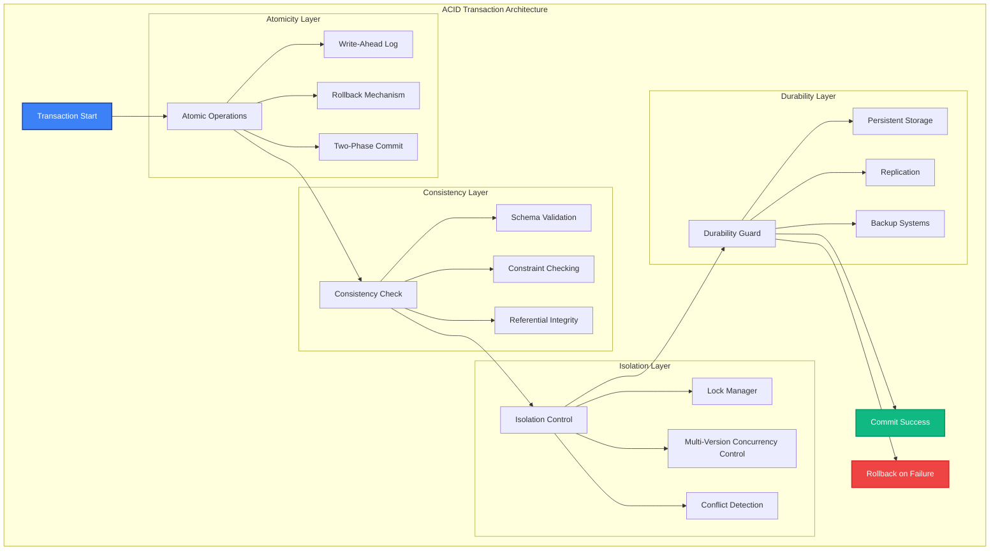

# ACID Transactions

MAIF provides enterprise-grade ACID (Atomicity, Consistency, Isolation, Durability) transaction support for reliable data operations across distributed systems. This guide covers transaction management, consistency models, and enterprise deployment patterns.

## Overview

ACID transactions in MAIF ensure:

- **Atomicity**: All operations in a transaction succeed or fail together
- **Consistency**: Data remains in a valid state before and after transactions
- **Isolation**: Concurrent transactions don't interfere with each other
- **Durability**: Committed transactions persist even after system failures



## Transaction Management

### 1. Basic Transactions

Simple transaction operations:

```python
from maif_sdk import create_client, Transaction

# Create client with transaction support
client = create_client(
    endpoint="https://api.maif.ai",
    api_key="your-api-key",
    transaction_mode="strict_acid"
)

# Basic transaction
async def basic_transaction_example():
    # Start transaction
    async with Transaction(client) as tx:
        # Create artifact within transaction
        artifact = await tx.create_artifact("transaction-demo")
        
        # Add multiple blocks atomically
        text_id = await artifact.add_text("Important document")
        image_id = await artifact.add_image(document_image)
        
        # Add metadata
        await artifact.add_metadata({
            "document_type": "contract",
            "status": "draft",
            "created_by": "user123"
        })
        
        # Transaction automatically commits on success
        # or rolls back on any exception
        
    print("Transaction completed successfully")

# Run the transaction
await basic_transaction_example()
```

### 2. Complex Multi-Artifact Transactions

Coordinate operations across multiple artifacts:

```python
async def multi_artifact_transaction():
    async with Transaction(client, isolation_level="SERIALIZABLE") as tx:
        # Create multiple related artifacts
        user_artifact = await tx.create_artifact("user-profile")
        document_artifact = await tx.create_artifact("user-documents")
        analytics_artifact = await tx.create_artifact("user-analytics")
        
        # Add user profile data
        profile_id = await user_artifact.add_structured_data({
            "user_id": "user123",
            "name": "John Doe",
            "email": "john@example.com",
            "status": "active"
        })
        
        # Add user documents
        doc_id = await document_artifact.add_text(
            "User agreement document",
            metadata={"user_id": "user123", "type": "agreement"}
        )
        
        # Create relationships between artifacts
        await tx.create_relationship(
            source_artifact=user_artifact,
            source_block=profile_id,
            target_artifact=document_artifact,
            target_block=doc_id,
            relationship_type="owns"
        )
        
        # Update analytics
        await analytics_artifact.add_structured_data({
            "user_id": "user123",
            "documents_count": 1,
            "last_activity": "2024-01-15T10:30:00Z"
        })
        
        # All operations commit together or roll back together

await multi_artifact_transaction()
```

## Consistency Models

### 1. Strong Consistency

Ensure immediate consistency across all operations:

```python
# Strong consistency configuration
strong_client = create_client(
    endpoint="https://api.maif.ai",
    consistency_model="strong",
    read_preference="primary",
    write_concern="majority"
)

async def strong_consistency_example():
    async with Transaction(strong_client) as tx:
        artifact = await tx.create_artifact("strong-consistency")
        
        # Write data
        block_id = await artifact.add_text("Critical financial data")
        
        # Immediate read will see the write
        retrieved_block = await artifact.get_block(block_id)
        assert retrieved_block.content == "Critical financial data"
        
        # All replicas are immediately consistent
        await tx.ensure_global_consistency()

await strong_consistency_example()
```

### 2. Eventual Consistency

Optimize for performance with eventual consistency:

```python
# Eventual consistency configuration
eventual_client = create_client(
    endpoint="https://api.maif.ai",
    consistency_model="eventual",
    consistency_timeout="5s"
)

async def eventual_consistency_example():
    async with Transaction(eventual_client) as tx:
        artifact = await tx.create_artifact("eventual-consistency")
        
        # Write data
        block_id = await artifact.add_text("High-volume analytics data")
        
        # May need to wait for consistency
        await tx.wait_for_consistency(block_id, timeout="5s")
        
        # Now guaranteed to be consistent across replicas
        retrieved_block = await artifact.get_block(block_id)
        assert retrieved_block is not None

await eventual_consistency_example()
```

### 3. Causal Consistency

Maintain causal relationships between operations:

```python
# Causal consistency for related operations
causal_client = create_client(
    endpoint="https://api.maif.ai",
    consistency_model="causal",
    vector_clock=True
)

async def causal_consistency_example():
    async with Transaction(causal_client) as tx:
        artifact = await tx.create_artifact("causal-consistency")
        
        # First operation
        user_id = await artifact.add_structured_data({
            "user_id": "user123",
            "name": "John Doe"
        })
        
        # Causally dependent operation
        # This will always see the user creation
        profile_id = await artifact.add_structured_data({
            "user_id": "user123",  # References the user
            "preferences": {"theme": "dark"},
            "depends_on": user_id  # Explicit causal dependency
        })
        
        # Causal consistency ensures proper ordering
        await tx.enforce_causal_ordering([user_id, profile_id])

await causal_consistency_example()
```

## Isolation Levels

### 1. Read Uncommitted

Lowest isolation level for maximum performance:

```python
async def read_uncommitted_example():
    async with Transaction(client, isolation_level="READ_UNCOMMITTED") as tx:
        artifact = await tx.create_artifact("read-uncommitted")
        
        # Can read uncommitted changes from other transactions
        # Fastest but may see dirty reads
        blocks = await artifact.search("recent data", 
                                     include_uncommitted=True)
        
        for block in blocks:
            print(f"Block: {block.content} (committed: {block.is_committed})")

await read_uncommitted_example()
```

### 2. Read Committed

Prevent dirty reads:

```python
async def read_committed_example():
    async with Transaction(client, isolation_level="READ_COMMITTED") as tx:
        artifact = await tx.create_artifact("read-committed")
        
        # Only reads committed data
        # Prevents dirty reads but allows non-repeatable reads
        committed_blocks = await artifact.search("stable data")
        
        # Data is guaranteed to be committed
        for block in committed_blocks:
            assert block.is_committed == True

await read_committed_example()
```

### 3. Repeatable Read

Ensure consistent reads within a transaction:

```python
async def repeatable_read_example():
    async with Transaction(client, isolation_level="REPEATABLE_READ") as tx:
        artifact = await tx.get_artifact("existing-artifact")
        
        # First read
        first_read = await artifact.search("important data")
        
        # ... other operations ...
        
        # Second read will return the same results
        # even if other transactions have committed changes
        second_read = await artifact.search("important data")
        
        assert first_read == second_read  # Guaranteed to be the same

await repeatable_read_example()
```

### 4. Serializable

Highest isolation level:

```python
async def serializable_example():
    async with Transaction(client, isolation_level="SERIALIZABLE") as tx:
        artifact = await tx.create_artifact("serializable")
        
        # Complete isolation from other transactions
        # Equivalent to serial execution
        
        # Complex operations that must be fully isolated
        data = await artifact.search("sensitive data")
        processed_data = await process_sensitive_data(data)
        
        await artifact.add_structured_data({
            "processed_results": processed_data,
            "processing_time": "2024-01-15T10:30:00Z"
        })
        
        # No other transaction can interfere

await serializable_example()
```

## Error Handling and Recovery

### 1. Automatic Rollback

Handle transaction failures gracefully:

```python
async def automatic_rollback_example():
    try:
        async with Transaction(client) as tx:
            artifact = await tx.create_artifact("rollback-demo")
            
            # Successful operations
            text_id = await artifact.add_text("First document")
            image_id = await artifact.add_image(sample_image)
            
            # This operation might fail
            await artifact.add_structured_data(invalid_data)  # Raises exception
            
            # If we reach here, all operations commit
            
    except ValidationError as e:
        # Transaction automatically rolled back
        print(f"Transaction failed and rolled back: {e}")
        
        # All operations are undone
        # artifact, text_id, and image_id don't exist

await automatic_rollback_example()
```

### 2. Manual Rollback

Explicit transaction control:

```python
async def manual_rollback_example():
    tx = Transaction(client)
    await tx.begin()
    
    try:
        artifact = await tx.create_artifact("manual-rollback")
        
        # Add some data
        block_id = await artifact.add_text("Test data")
        
        # Check some condition
        if not await validate_business_logic(block_id):
            # Manually rollback
            await tx.rollback()
            print("Transaction rolled back due to business logic")
            return
        
        # Commit if everything is OK
        await tx.commit()
        print("Transaction committed successfully")
        
    except Exception as e:
        # Rollback on any error
        await tx.rollback()
        print(f"Transaction rolled back due to error: {e}")
    
    finally:
        await tx.close()

await manual_rollback_example()
```

### 3. Savepoints

Create intermediate checkpoints:

```python
async def savepoint_example():
    async with Transaction(client) as tx:
        artifact = await tx.create_artifact("savepoint-demo")
        
        # Initial operations
        user_id = await artifact.add_structured_data({"user": "john"})
        
        # Create savepoint
        savepoint1 = await tx.create_savepoint("after_user")
        
        try:
            # Risky operations
            profile_id = await artifact.add_structured_data(risky_profile_data)
            preferences_id = await artifact.add_structured_data(risky_preferences)
            
            # Create another savepoint
            savepoint2 = await tx.create_savepoint("after_profile")
            
            # More risky operations
            await artifact.add_structured_data(very_risky_data)
            
        except ValidationError:
            # Rollback to savepoint2, keeping user and profile
            await tx.rollback_to_savepoint(savepoint2)
            print("Rolled back to after_profile savepoint")
            
        except DataError:
            # Rollback to savepoint1, keeping only user
            await tx.rollback_to_savepoint(savepoint1)
            print("Rolled back to after_user savepoint")
        
        # Transaction commits with whatever succeeded

await savepoint_example()
```

## Performance Optimization

### 1. Batch Operations

Optimize transaction performance with batching:

```python
async def batch_transaction_example():
    async with Transaction(client, batch_size=1000) as tx:
        artifact = await tx.create_artifact("batch-operations")
        
        # Prepare batch operations
        batch_operations = []
        
        for i in range(10000):
            operation = {
                "type": "add_text",
                "content": f"Document {i}",
                "metadata": {"index": i, "batch": "bulk_import"}
            }
            batch_operations.append(operation)
        
        # Execute batch atomically
        results = await artifact.execute_batch(batch_operations)
        
        print(f"Processed {len(results)} operations in single transaction")

await batch_transaction_example()
```

### 2. Connection Pooling

Manage database connections efficiently:

```python
# Configure connection pooling for transactions
pool_client = create_client(
    endpoint="https://api.maif.ai",
    connection_pool={
        "min_connections": 5,
        "max_connections": 50,
        "connection_timeout": "30s",
        "idle_timeout": "300s"
    }
)

async def pooled_transaction_example():
    # Transactions use pooled connections automatically
    async with Transaction(pool_client) as tx:
        artifact = await tx.create_artifact("pooled-transaction")
        
        # Operations use connection from pool
        await artifact.add_text("Efficient connection usage")
        
    # Connection returned to pool automatically

await pooled_transaction_example()
```

### 3. Read-Only Transactions

Optimize read-heavy workloads:

```python
async def read_only_transaction_example():
    # Read-only transactions can use read replicas
    async with Transaction(client, read_only=True) as tx:
        artifact = await tx.get_artifact("existing-artifact")
        
        # Read operations are optimized
        search_results = await artifact.search("query terms")
        block_data = await artifact.get_block("block_id")
        metadata = await artifact.get_metadata()
        
        # Can perform complex read operations
        analytics = await artifact.analyze_content(
            analysis_types=["sentiment", "topics", "entities"]
        )
        
        # No write operations allowed in read-only transaction
        # This would raise an exception:
        # await artifact.add_text("new content")  # Error!

await read_only_transaction_example()
```

## Advanced Features

### 1. Nested Transactions

Handle complex business logic with nested transactions:

```python
async def nested_transaction_example():
    async with Transaction(client) as outer_tx:
        artifact = await outer_tx.create_artifact("nested-transactions")
        
        # Outer transaction operations
        user_id = await artifact.add_structured_data({"user": "john"})
        
        # Nested transaction for profile creation
        async with outer_tx.nested_transaction() as inner_tx:
            try:
                profile_data = await fetch_external_profile_data("john")
                profile_id = await artifact.add_structured_data(profile_data)
                
                # Nested transaction commits to outer transaction
                await inner_tx.commit()
                
            except ExternalAPIError:
                # Nested transaction rolls back, outer continues
                await inner_tx.rollback()
                print("Profile creation failed, using default")
                
                # Create default profile in outer transaction
                default_profile = {"user": "john", "profile": "default"}
                profile_id = await artifact.add_structured_data(default_profile)
        
        # Outer transaction includes successful operations
        await artifact.add_metadata({"user_id": user_id, "profile_id": profile_id})

await nested_transaction_example()
```

### 2. Cross-System Transactions

Coordinate with external systems:

```python
from maif_sdk import XATransaction  # Extended Architecture Transaction

async def cross_system_transaction_example():
    # Configure external systems
    external_systems = [
        {"type": "database", "connection": "postgresql://..."},
        {"type": "message_queue", "connection": "amqp://..."},
        {"type": "cache", "connection": "redis://..."}
    ]
    
    async with XATransaction(client, external_systems) as xa_tx:
        # MAIF operations
        artifact = await xa_tx.create_artifact("cross-system")
        maif_id = await artifact.add_text("Transaction data")
        
        # External database operation
        db_id = await xa_tx.execute_sql(
            "INSERT INTO transactions (maif_id, data) VALUES (?, ?)",
            (maif_id, "transaction data")
        )
        
        # Message queue operation
        await xa_tx.send_message(
            queue="transaction_events",
            message={"maif_id": maif_id, "db_id": db_id}
        )
        
        # Cache operation
        await xa_tx.cache_set(
            key=f"transaction:{maif_id}",
            value={"status": "committed", "db_id": db_id}
        )
        
        # All systems commit together or rollback together

await cross_system_transaction_example()
```

### 3. Long-Running Transactions

Handle transactions that span extended time periods:

```python
async def long_running_transaction_example():
    # Configure for long-running transaction
    long_tx_client = create_client(
        endpoint="https://api.maif.ai",
        transaction_timeout="1h",  # 1 hour timeout
        heartbeat_interval="60s",  # Keep alive every minute
        checkpoint_interval="300s"  # Checkpoint every 5 minutes
    )
    
    async with Transaction(long_tx_client) as tx:
        artifact = await tx.create_artifact("long-running")
        
        # Process large dataset
        dataset = await load_large_dataset()
        
        for i, batch in enumerate(dataset.batches()):
            # Process batch
            results = await process_batch(batch)
            
            # Add results to artifact
            for result in results:
                await artifact.add_structured_data(result)
            
            # Periodic checkpoint to prevent timeout
            if i % 100 == 0:
                await tx.checkpoint(f"processed_batch_{i}")
                print(f"Checkpoint created at batch {i}")
            
            # Heartbeat to keep transaction alive
            await tx.heartbeat()
        
        # Final commit after all processing

await long_running_transaction_example()
```

## Monitoring and Observability

### 1. Transaction Metrics

Monitor transaction performance and health:

```python
from maif_sdk import TransactionMetrics

# Enable transaction monitoring
metrics = TransactionMetrics(client)

async def monitored_transaction_example():
    async with Transaction(client) as tx:
        # Transaction is automatically monitored
        artifact = await tx.create_artifact("monitored")
        
        # Add some operations
        await artifact.add_text("Monitored operation 1")
        await artifact.add_text("Monitored operation 2")
        
    # Get transaction metrics
    tx_metrics = await metrics.get_transaction_metrics(tx.transaction_id)
    
    print(f"Transaction duration: {tx_metrics.duration}ms")
    print(f"Operations count: {tx_metrics.operations_count}")
    print(f"Bytes processed: {tx_metrics.bytes_processed}")
    print(f"Lock wait time: {tx_metrics.lock_wait_time}ms")

await monitored_transaction_example()

# Get overall transaction statistics
overall_stats = await metrics.get_overall_stats()
print(f"Average transaction duration: {overall_stats.avg_duration}ms")
print(f"Transaction success rate: {overall_stats.success_rate:.2%}")
print(f"Deadlock rate: {overall_stats.deadlock_rate:.2%}")
```

### 2. Transaction Logging

Comprehensive transaction logging:

```python
import logging
from maif_sdk import TransactionLogger

# Configure transaction logging
tx_logger = TransactionLogger(
    level=logging.INFO,
    include_operations=True,
    include_performance=True,
    log_format="json"
)

async def logged_transaction_example():
    async with Transaction(client, logger=tx_logger) as tx:
        artifact = await tx.create_artifact("logged-transaction")
        
        # All operations are automatically logged
        text_id = await artifact.add_text("Logged operation")
        
        # Manual log entries
        await tx.log("Custom log entry", level="INFO")
        
        # Log business context
        await tx.log_context({
            "user_id": "user123",
            "operation_type": "document_creation",
            "business_unit": "finance"
        })

await logged_transaction_example()
```

### 3. Distributed Tracing

Trace transactions across distributed systems:

```python
from maif_sdk import DistributedTracing
import opentelemetry.trace as trace

# Configure distributed tracing
tracer = trace.get_tracer(__name__)
distributed_tracing = DistributedTracing(tracer)

async def traced_transaction_example():
    with tracer.start_as_current_span("business_operation") as span:
        async with Transaction(client, tracing=distributed_tracing) as tx:
            span.set_attribute("transaction.id", tx.transaction_id)
            
            artifact = await tx.create_artifact("traced-transaction")
            
            # Operations are automatically traced
            with tracer.start_as_current_span("add_document"):
                text_id = await artifact.add_text("Traced document")
                span.set_attribute("document.id", text_id)
            
            with tracer.start_as_current_span("add_metadata"):
                await artifact.add_metadata({"traced": True})

await traced_transaction_example()
```

## Best Practices

### 1. Transaction Design

Design efficient transactions:

```python
# Good: Short transaction scope
async def good_transaction_design():
    # Prepare data outside transaction
    processed_data = await prepare_data_outside_transaction()
    
    # Short transaction
    async with Transaction(client) as tx:
        artifact = await tx.create_artifact("efficient")
        
        # Quick operations only
        for item in processed_data:
            await artifact.add_structured_data(item)
    
    # Post-processing outside transaction
    await post_process_results()
```

### 2. Error Recovery

Implement robust error recovery:

```python
async def robust_error_recovery():
    max_retries = 3
    retry_delay = 1.0
    
    for attempt in range(max_retries):
        try:
            async with Transaction(client) as tx:
                artifact = await tx.create_artifact("retry-demo")
                
                # Perform operations
                await artifact.add_text("Important data")
                
                # Success - break out of retry loop
                break
                
        except DeadlockError:
            if attempt < max_retries - 1:
                # Exponential backoff
                await asyncio.sleep(retry_delay * (2 ** attempt))
                print(f"Deadlock detected, retrying (attempt {attempt + 1})")
                continue
            else:
                print("Max retries exceeded, giving up")
                raise
```

## Troubleshooting

### Common Issues

1. **Transaction Timeout**
   ```python
   # Increase timeout for long operations
   long_client = create_client(
       endpoint="https://api.maif.ai",
       transaction_timeout="300s"  # 5 minutes
   )
   ```

2. **Deadlock Detection**
   ```python
   # Enable deadlock detection and logging
   deadlock_client = create_client(
       endpoint="https://api.maif.ai",
       deadlock_detection=True,
       deadlock_logging=True
   )
   ```

3. **Performance Issues**
   ```python
   # Optimize transaction performance
   perf_client = create_client(
       endpoint="https://api.maif.ai",
       batch_size=1000,
       connection_pool_size=20,
       read_preference="secondary"  # For read-heavy workloads
   )
   ```

## Next Steps

- Explore [Performance Optimization](performance.md) for transaction tuning
- Learn about [Distributed Deployment](distributed.md) for scaling ACID across clusters
- Check out [Monitoring & Observability](monitoring.md) for transaction monitoring
- See [Examples](../examples/) for complete ACID transaction applications 