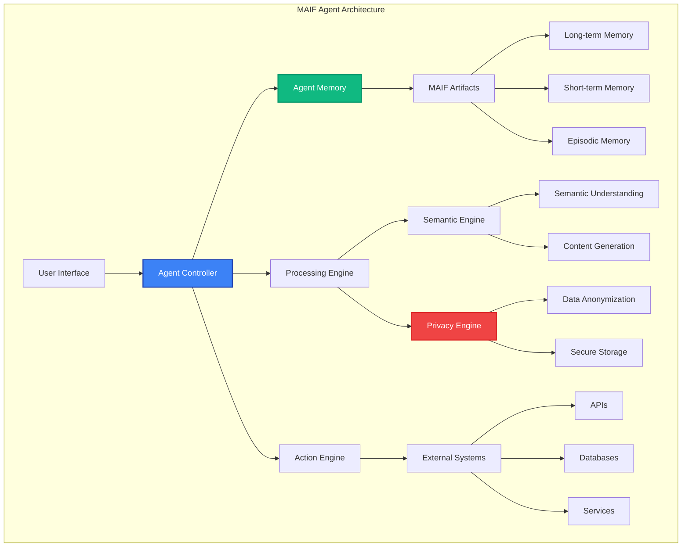

# Agent Development

This guide covers how to develop sophisticated AI agents using MAIF's advanced features. From basic agent architecture to complex multi-modal systems, you'll learn to build production-ready AI agents with built-in privacy, security, and performance.

## Agent Architecture Overview

MAIF agents follow a modular architecture that separates concerns while maintaining high performance:



## Basic Agent Implementation

### Simple Conversational Agent

The following example implements a `ConversationalAgent` that can handle conversations, remember context, and manage user profiles using separate MAIF artifacts for different types of memory.

```python
from maif_sdk import create_client, create_artifact
from datetime import datetime
import json

class ConversationalAgent:
    """A basic agent for handling text-based conversations."""
    def __init__(self, agent_id: str):
        # Initialize the MAIF client with performance-oriented settings.
        self.client = create_client(
            agent_id,
            enable_mmap=True,
            enable_compression=True,
            default_encryption=True
        )
        
        # Create separate artifacts for different memory functions.
        self.conversation_memory = create_artifact("conversations", self.client)
        self.knowledge_base = create_artifact("knowledge", self.client)
        self.user_profiles = create_artifact("user_profiles", self.client)
        
        # Load the agent's initial knowledge base.
        self._initialize_knowledge()
    
    def _initialize_knowledge(self):
        """Initializes the agent's knowledge base with a system prompt."""
        system_prompt = """
        You are a helpful AI assistant powered by MAIF. You have access to:
        - Persistent conversation memory
        - Semantic search capabilities
        - Privacy-preserving data handling
        - Multi-modal understanding
        
        Always be helpful, accurate, and respect user privacy.
        """
        # Store the system prompt in the knowledge base.
        self.knowledge_base.add_text(
            system_prompt,
            title="System Prompt",
            metadata={"type": "system", "priority": "high"}
        )
    
    def process_message(self, user_id: str, message: str) -> str:
        """Processes a user message, retrieves context, generates a response, and stores the interaction."""
        
        # Store the incoming user message in the conversation memory.
        self.conversation_memory.add_text(
            f"User ({user_id}): {message}",
            title="User Message",
            metadata={
                "user_id": user_id,
                "timestamp": datetime.now().isoformat(),
                "type": "user_input"
            }
        )
        
        # Retrieve relevant context from both conversation history and the knowledge base.
        relevant_context = self._get_relevant_context(message, user_id)
        
        # Generate a response based on the message and the retrieved context.
        response = self._generate_response(message, relevant_context, user_id)
        
        # Store the agent's response to maintain a complete conversation history.
        self.conversation_memory.add_text(
            f"Assistant: {response}",
            title="Agent Response",
            metadata={
                "user_id": user_id,
                "timestamp": datetime.now().isoformat(),
                "type": "agent_response"
            }
        )
        
        return response
    
    def _get_relevant_context(self, message: str, user_id: str) -> list:
        """Retrieves relevant context by searching conversation history and the knowledge base."""
        
        # Search the user's past conversations for relevant messages.
        conversation_context = self.conversation_memory.search(
            query=message,
            top_k=3,
            filters={"metadata.user_id": user_id}
        )
        
        # Search the knowledge base for relevant information.
        knowledge_context = self.knowledge_base.search(
            query=message,
            top_k=2
        )
        
        # Combine and return the context.
        return conversation_context + knowledge_context
    
    def _generate_response(self, message: str, context: list, user_id: str) -> str:
        """Generates a response using the message, context, and user profile."""
        
        # Retrieve the user's profile for personalization.
        user_profile = self._get_user_profile(user_id)
        
        # This is a simplified response generation logic. In a real application,
        # you would likely integrate a Large Language Model (LLM) here.
        context_text = "\n".join([item['content'] for item in context])
        
        if "hello" in message.lower():
            return f"Hello, {user_profile.get('name', 'there')}! How can I help you today?"
        elif "remember" in message.lower():
            return f"I remember our previous conversations. Based on our history: {context_text[:100]}..."
        else:
            return f"I understand you're asking about: '{message}'. Let me find some information for you."
    
    def _get_user_profile(self, user_id: str) -> dict:
        """Gets or creates a user profile to store preferences and interaction history."""
        try:
            # Search for an existing profile for the user.
            profiles = self.user_profiles.search(
                query=user_id,
                filters={"metadata.user_id": user_id},
                top_k=1
            )
            
            if profiles:
                # If a profile exists, load and return it.
                return json.loads(profiles[0]['content'])
            else:
                # If no profile exists, create a new one.
                profile = {"user_id": user_id, "created_at": datetime.now().isoformat()}
                self.user_profiles.add_structured_data(
                    profile,
                    title=f"Profile: {user_id}",
                    metadata={"user_id": user_id, "type": "profile"}
                )
                return profile
        except Exception:
            # Return a default profile in case of an error.
            return {"user_id": user_id, "preferences": {}}

# --- Usage Example ---
agent = ConversationalAgent("helpful-assistant")
response1 = agent.process_message("user123", "Hello!")
print(f"Agent: {response1}")
response2 = agent.process_message("user123", "Can you remember what we talked about?")
print(f"Agent: {response2}")
```

## Advanced Agent Features

### Multi-Modal Agent

This example demonstrates a `MultiModalAgent` capable of processing text, image, and audio inputs. It uses different artifacts for each modality and a combined artifact for cross-modal understanding.

```python
from maif_sdk import create_client, create_artifact
import numpy as np
from datetime import datetime

class MultiModalAgent:
    """An agent that can process and understand text, image, and audio data."""
    def __init__(self, agent_id: str):
        self.client = create_client(agent_id)
        
        # Create specialized memory artifacts for each data modality.
        self.text_memory = create_artifact("text_memory", self.client)
        self.image_memory = create_artifact("image_memory", self.client)
        self.audio_memory = create_artifact("audio_memory", self.client)
        # This artifact stores relationships and unified embeddings.
        self.multimodal_memory = create_artifact("multimodal_memory", self.client)
    
    def process_text(self, text: str, user_id: str):
        """Processes a text input and stores it."""
        text_id = self.text_memory.add_text(
            text,
            metadata={"user_id": user_id, "timestamp": datetime.now().isoformat()}
        )
        print(f"Processed text input with ID: {text_id}")
        return text_id

    def process_image(self, image_data: np.ndarray, user_id: str):
        """Processes an image input and stores it."""
        image_id = self.image_memory.add_image(
            image_data,
            metadata={"user_id": user_id, "timestamp": datetime.now().isoformat()}
        )
        print(f"Processed image input with ID: {image_id}")
        return image_id

    def process_audio(self, audio_data: np.ndarray, user_id: str):
        """Processes an audio input and stores it."""
        audio_id = self.audio_memory.add_audio(
            audio_data,
            metadata={"user_id": user_id, "timestamp": datetime.now().isoformat()}
        )
        print(f"Processed audio input with ID: {audio_id}")
        return audio_id
    
    def generate_multimodal_response(self, query: str, user_id: str) -> str:
        """Generates a response by searching across all modalities."""
        # Search each modality's memory for relevant context.
        text_context = self.text_memory.search(query, top_k=2, filters={"metadata.user_id": user_id})
        image_context = self.image_memory.search(query, top_k=1, filters={"metadata.user_id": user_id})
        audio_context = self.audio_memory.search(query, top_k=1, filters={"metadata.user_id": user_id})

        # Combine the context (a real implementation would be more sophisticated).
        full_context = text_context + image_context + audio_context
        
        if not full_context:
            return "I don't have enough information to respond to that."
            
        return f"Based on the information I have across different formats, I can tell you this..."

# --- Usage Example ---
multimodal_agent = MultiModalAgent("multimodal-assistant")

# Simulate multi-modal inputs from a user.
multimodal_agent.process_text("Can you find a picture of a sunset I sent?", "user456")
multimodal_agent.process_image(np.random.rand(100, 100, 3), "user456")
multimodal_agent.process_audio(np.random.rand(44100), "user456")

# Generate a response based on a query that spans modalities.
response = multimodal_agent.generate_multimodal_response("sunset", "user456")
print(f"Agent Response: {response}")
```

## Agent Lifecycle Management

### Agent State Management

```python
from enum import Enum
from typing import Dict, Any
import json

class AgentState(Enum):
    INITIALIZING = "initializing"
    READY = "ready"
    PROCESSING = "processing"
    LEARNING = "learning"
    MAINTENANCE = "maintenance"
    ERROR = "error"

class StatefulAgent:
    def __init__(self, agent_id: str):
        self.agent_id = agent_id
        self.client = create_client(agent_id)
        self.state = AgentState.INITIALIZING
        
        # Create state management artifact
        self.state_memory = create_artifact("agent_state", self.client)
        
        # Initialize agent
        self._initialize()
    
    def _initialize(self):
        """Initialize the agent"""
        try:
            # Load previous state if exists
            self._load_state()
            
            # Perform initialization tasks
            self._setup_memory_systems()
            self._load_knowledge_base()
            self._verify_system_health()
            
            self.state = AgentState.READY
            self._save_state()
            
        except Exception as e:
            self.state = AgentState.ERROR
            self._log_error(f"Initialization failed: {str(e)}")
    
    def _load_state(self):
        """Load agent state from memory"""
        try:
            state_data = self.state_memory.search(
                query="current_state",
                top_k=1,
                filters={"metadata.type": "current_state"}
            )
            
            if state_data:
                state_info = json.loads(state_data[0]['content'])
                self.state = AgentState(state_info.get('state', 'initializing'))
        except Exception:
            # Start fresh if no previous state
            pass
    
    def _save_state(self):
        """Save current agent state"""
        state_info = {
            "agent_id": self.agent_id,
            "state": self.state.value,
            "timestamp": datetime.now().isoformat(),
            "memory_stats": self._get_memory_stats(),
            "performance_metrics": self._get_performance_metrics()
        }
        
        self.state_memory.add_structured_data(
            state_info,
            title="Agent State",
            metadata={
                "type": "current_state",
                "timestamp": datetime.now().isoformat()
            }
        )
    
    def process_request(self, request: Dict[str, Any]) -> Dict[str, Any]:
        """Process a request with state management"""
        
        if self.state != AgentState.READY:
            return {
                "error": f"Agent not ready. Current state: {self.state.value}",
                "state": self.state.value
            }
        
        try:
            self.state = AgentState.PROCESSING
            self._save_state()
            
            # Process the request
            result = self._handle_request(request)
            
            self.state = AgentState.READY
            self._save_state()
            
            return {
                "result": result,
                "state": self.state.value,
                "timestamp": datetime.now().isoformat()
            }
            
        except Exception as e:
            self.state = AgentState.ERROR
            self._save_state()
            self._log_error(f"Request processing failed: {str(e)}")
            
            return {
                "error": str(e),
                "state": self.state.value
            }
    
    def enter_learning_mode(self):
        """Enter learning mode for model updates"""
        if self.state == AgentState.READY:
            self.state = AgentState.LEARNING
            self._save_state()
            return True
        return False
    
    def enter_maintenance_mode(self):
        """Enter maintenance mode"""
        self.state = AgentState.MAINTENANCE
        self._save_state()
        
        # Perform maintenance tasks
        self._cleanup_old_data()
        self._optimize_memory()
        self._update_knowledge_base()
        
        self.state = AgentState.READY
        self._save_state()
    
    def _get_memory_stats(self) -> Dict[str, Any]:
        """Get memory usage statistics"""
        # Placeholder for actual memory stats
        return {
            "total_artifacts": 3,
            "total_blocks": 100,
            "memory_usage": "50MB"
        }
    
    def _get_performance_metrics(self) -> Dict[str, Any]:
        """Get performance metrics"""
        # Placeholder for actual performance metrics
        return {
            "avg_response_time": "150ms",
            "requests_processed": 1000,
            "error_rate": "0.1%"
        }
```

## Specialized Agent Types

### Research Assistant Agent

```python
class ResearchAssistantAgent:
    def __init__(self, agent_id: str):
        self.client = create_client(
            agent_id,
            enable_mmap=True,
            enable_compression=True,
            default_encryption=True
        )
        
        # Specialized memory systems
        self.research_memory = create_artifact("research_papers", self.client)
        self.citation_memory = create_artifact("citations", self.client)
        self.hypothesis_memory = create_artifact("hypotheses", self.client)
        self.experiment_memory = create_artifact("experiments", self.client)
    
    def add_research_paper(self, paper_content: str, metadata: dict) -> str:
        """Add a research paper to the knowledge base"""
        
        paper_id = self.research_memory.add_text(
            paper_content,
            title=metadata.get("title", "Research Paper"),
            metadata={
                **metadata,
                "type": "research_paper",
                "added_at": datetime.now().isoformat()
            }
        )
        
        # Extract and store citations
        citations = self._extract_citations(paper_content)
        for citation in citations:
            self.citation_memory.add_text(
                citation,
                title="Citation",
                metadata={
                    "source_paper_id": paper_id,
                    "type": "citation"
                }
            )
        
        return paper_id
    
    def research_query(self, query: str, research_type: str = "general") -> dict:
        """Perform a research query"""
        
        # Search across different memory systems
        paper_results = self.research_memory.search(query, top_k=5)
        citation_results = self.citation_memory.search(query, top_k=3)
        hypothesis_results = self.hypothesis_memory.search(query, top_k=2)
        
        # Synthesize results
        synthesis = self._synthesize_research_results(
            paper_results, citation_results, hypothesis_results, query
        )
        
        return {
            "query": query,
            "research_type": research_type,
            "papers_found": len(paper_results),
            "citations_found": len(citation_results),
            "hypotheses_found": len(hypothesis_results),
            "synthesis": synthesis,
            "timestamp": datetime.now().isoformat()
        }
    
    def generate_hypothesis(self, research_context: str) -> str:
        """Generate a research hypothesis"""
        
        # Search for related research
        related_research = self.research_memory.search(research_context, top_k=10)
        
        # Generate hypothesis based on gaps in research
        hypothesis = self._generate_hypothesis_from_context(related_research, research_context)
        
        # Store hypothesis
        hypothesis_id = self.hypothesis_memory.add_text(
            hypothesis,
            title="Generated Hypothesis",
            metadata={
                "context": research_context,
                "type": "generated_hypothesis",
                "timestamp": datetime.now().isoformat()
            }
        )
        
        return hypothesis
    
    def _extract_citations(self, paper_content: str) -> list:
        """Extract citations from paper content"""
        # Placeholder for citation extraction logic
        return ["Citation 1", "Citation 2", "Citation 3"]
    
    def _synthesize_research_results(self, papers, citations, hypotheses, query) -> str:
        """Synthesize research results into a coherent summary"""
        # Placeholder for research synthesis
        return f"Based on {len(papers)} papers and {len(citations)} citations, " \
               f"research on '{query}' shows emerging trends in..."
    
    def _generate_hypothesis_from_context(self, related_research, context) -> str:
        """Generate hypothesis from research context"""
        # Placeholder for hypothesis generation
        return f"Based on current research, I hypothesize that {context} may be influenced by..."

# Usage example
research_agent = ResearchAssistantAgent("research-assistant")

# Add research papers
paper_id = research_agent.add_research_paper(
    "This paper explores the effects of...",
    {
        "title": "Effects of AI on Research",
        "authors": ["Dr. Smith", "Dr. Jones"],
        "journal": "AI Research Journal",
        "year": 2024
    }
)

# Perform research query
results = research_agent.research_query("artificial intelligence in healthcare")
print(f"Research results: {results}")
```

### Customer Service Agent

```python
class CustomerServiceAgent:
    def __init__(self, agent_id: str):
        self.client = create_client(
            agent_id,
            enable_mmap=True,
            default_encryption=True,
            compliance_framework="GDPR"
        )
        
        # Customer service specific memory
        self.customer_memory = create_artifact("customers", self.client)
        self.ticket_memory = create_artifact("support_tickets", self.client)
        self.knowledge_base = create_artifact("kb", self.client)
        self.escalation_memory = create_artifact("escalations", self.client)
        
        # Initialize knowledge base
        self._load_knowledge_base()
    
    def handle_customer_inquiry(self, customer_id: str, inquiry: str, priority: str = "normal") -> dict:
        """Handle a customer inquiry"""
        
        # Create support ticket
        ticket_id = self._create_support_ticket(customer_id, inquiry, priority)
        
        # Get customer history
        customer_history = self._get_customer_history(customer_id)
        
        # Search knowledge base for solutions
        solutions = self.knowledge_base.search(inquiry, top_k=5)
        
        # Generate response
        response = self._generate_customer_response(inquiry, solutions, customer_history)
        
        # Update ticket with response
        self._update_support_ticket(ticket_id, response)
        
        # Check if escalation is needed
        escalation_needed = self._check_escalation_criteria(inquiry, priority, customer_history)
        
        result = {
            "ticket_id": ticket_id,
            "customer_id": customer_id,
            "response": response,
            "escalation_needed": escalation_needed,
            "confidence_score": self._calculate_confidence(solutions),
            "timestamp": datetime.now().isoformat()
        }
        
        if escalation_needed:
            result["escalation_reason"] = self._get_escalation_reason(inquiry, priority)
        
        return result
    
    def _create_support_ticket(self, customer_id: str, inquiry: str, priority: str) -> str:
        """Create a new support ticket"""
        
        ticket_data = {
            "customer_id": customer_id,
            "inquiry": inquiry,
            "priority": priority,
            "status": "open",
            "created_at": datetime.now().isoformat(),
            "assigned_agent": "ai_agent"
        }
        
        ticket_id = self.ticket_memory.add_structured_data(
            ticket_data,
            title=f"Support Ticket - {customer_id}",
            metadata={
                "type": "support_ticket",
                "customer_id": customer_id,
                "priority": priority
            }
        )
        
        return ticket_id
    
    def _get_customer_history(self, customer_id: str) -> list:
        """Get customer interaction history"""
        
        history = self.customer_memory.search(
            query=customer_id,
            filters={"metadata.customer_id": customer_id},
            top_k=10
        )
        
        return history
    
    def _generate_customer_response(self, inquiry: str, solutions: list, history: list) -> str:
        """Generate a customer service response"""
        
        # Analyze inquiry sentiment and urgency
        sentiment = self._analyze_sentiment(inquiry)
        urgency = self._analyze_urgency(inquiry)
        
        # Personalize based on history
        personalization = self._get_personalization_context(history)
        
        # Generate response based on solutions found
        if solutions:
            primary_solution = solutions[0]['content']
            response = f"Thank you for contacting us{personalization}. " \
                      f"Based on your inquiry, I can help you with: {primary_solution[:200]}..."
        else:
            response = f"Thank you for contacting us{personalization}. " \
                      f"I understand your concern and I'm here to help. " \
                      f"Let me connect you with a specialist who can assist you better."
        
        return response
    
    def _check_escalation_criteria(self, inquiry: str, priority: str, history: list) -> bool:
        """Check if the inquiry needs human escalation"""
        
        # Escalation criteria
        if priority == "urgent":
            return True
        
        if "complaint" in inquiry.lower() or "angry" in inquiry.lower():
            return True
        
        if len(history) > 5:  # Frequent customer
            return True
        
        return False
    
    def _analyze_sentiment(self, text: str) -> str:
        """Analyze sentiment of customer inquiry"""
        # Placeholder for sentiment analysis
        return "neutral"
    
    def _analyze_urgency(self, text: str) -> str:
        """Analyze urgency level"""
        urgent_keywords = ["urgent", "immediately", "asap", "emergency"]
        if any(keyword in text.lower() for keyword in urgent_keywords):
            return "high"
        return "normal"
    
    def _get_personalization_context(self, history: list) -> str:
        """Get personalization context from history"""
        if len(history) > 0:
            return ", valued customer,"
        return ""
    
    def _calculate_confidence(self, solutions: list) -> float:
        """Calculate confidence in the response"""
        if not solutions:
            return 0.3
        
        # Simple confidence based on search relevance
        return min(0.9, 0.5 + len(solutions) * 0.1)

# Usage example
cs_agent = CustomerServiceAgent("customer-service-bot")

# Handle customer inquiry
result = cs_agent.handle_customer_inquiry(
    customer_id="CUST_12345",
    inquiry="I can't log into my account and I need help urgently",
    priority="urgent"
)

print(f"Support result: {result}")
```

## Agent Performance Optimization

### Caching and Memory Management

```python
from functools import lru_cache
import weakref

class OptimizedAgent:
    def __init__(self, agent_id: str):
        self.client = create_client(
            agent_id,
            enable_mmap=True,
            buffer_size=256*1024,
            cache_size="1GB",
            max_concurrent_writers=8
        )
        
        # Memory artifacts with optimization
        self.memory = create_artifact("optimized_memory", self.client)
        
        # Response cache
        self._response_cache = {}
        self._cache_max_size = 1000
        
        # Weak references for garbage collection
        self._weak_refs = weakref.WeakValueDictionary()
    
    @lru_cache(maxsize=100)
    def get_cached_response(self, query_hash: str) -> str:
        """Get cached response for similar queries"""
        return self._response_cache.get(query_hash)
    
    def process_with_optimization(self, query: str, user_id: str) -> str:
        """Process query with performance optimizations"""
        
        # Create query hash for caching
        query_hash = hash(f"{query}:{user_id}")
        
        # Check cache first
        cached_response = self.get_cached_response(query_hash)
        if cached_response:
            return cached_response
        
        # Batch similar queries
        batched_queries = self._get_batched_queries(query)
        
        if batched_queries:
            # Process in batch for efficiency
            responses = self._process_batch(batched_queries)
            response = responses.get(query, self._generate_response(query))
        else:
            response = self._generate_response(query)
        
        # Cache the response
        self._cache_response(query_hash, response)
        
        return response
    
    def _get_batched_queries(self, query: str) -> list:
        """Get similar queries that can be batched"""
        # Placeholder for query batching logic
        return []
    
    def _process_batch(self, queries: list) -> dict:
        """Process multiple queries in batch"""
        responses = {}
        
        # Use batch operations for efficiency
        search_results = self.memory.search_batch([
            {"query": query, "top_k": 3} for query in queries
        ])
        
        for i, query in enumerate(queries):
            responses[query] = self._generate_response_from_results(
                query, search_results[i]
            )
        
        return responses
    
    def _cache_response(self, query_hash: str, response: str):
        """Cache response with size management"""
        if len(self._response_cache) >= self._cache_max_size:
            # Remove oldest entries
            oldest_keys = list(self._response_cache.keys())[:100]
            for key in oldest_keys:
                del self._response_cache[key]
        
        self._response_cache[query_hash] = response

# Usage example
optimized_agent = OptimizedAgent("optimized-assistant")
response = optimized_agent.process_with_optimization("What is AI?", "user123")
```

## Best Practices for Agent Development

### 1. Memory Organization

```python
# Good: Organize memory by purpose and access patterns
class WellOrganizedAgent:
    def __init__(self, agent_id: str):
        self.client = create_client(agent_id)
        
        # Separate memory by access patterns
        self.hot_memory = create_artifact("hot_data", self.client)      # Frequently accessed
        self.warm_memory = create_artifact("warm_data", self.client)    # Occasionally accessed
        self.cold_memory = create_artifact("cold_data", self.client)    # Rarely accessed
        
        # Separate by data type
        self.user_data = create_artifact("users", self.client)
        self.system_data = create_artifact("system", self.client)
        self.temp_data = create_artifact("temporary", self.client)
```

### 2. Error Handling and Resilience

```python
class ResilientAgent:
    def __init__(self, agent_id: str):
        self.client = create_client(agent_id)
        self.memory = create_artifact("resilient_memory", self.client)
        self.error_count = 0
        self.max_errors = 5
    
    def process_with_resilience(self, request: dict) -> dict:
        """Process request with error handling and recovery"""
        
        try:
            return self._process_request(request)
        
        except Exception as e:
            self.error_count += 1
            
            # Log error
            self._log_error(e, request)
            
            # Attempt recovery
            if self.error_count < self.max_errors:
                return self._attempt_recovery(request, e)
            else:
                return self._graceful_degradation(request, e)
    
    def _attempt_recovery(self, request: dict, error: Exception) -> dict:
        """Attempt to recover from error"""
        try:
            # Simplified request processing
            simplified_request = self._simplify_request(request)
            return self._process_request(simplified_request)
        except:
            return self._graceful_degradation(request, error)
    
    def _graceful_degradation(self, request: dict, error: Exception) -> dict:
        """Provide graceful degradation when all else fails"""
        return {
            "error": "Service temporarily unavailable",
            "fallback_response": "I'm experiencing technical difficulties. Please try again later.",
            "error_id": str(hash(str(error))),
            "timestamp": datetime.now().isoformat()
        }
```

### 3. Privacy and Security Integration

```python
class PrivacyAwareAgent:
    def __init__(self, agent_id: str):
        self.client = create_client(
            agent_id,
            default_encryption=True,
            privacy_level="CONFIDENTIAL",
            compliance_framework="GDPR"
        )
        
        self.memory = create_artifact("private_memory", self.client)
        
        # Privacy settings
        self.pii_detector = PIIDetector()
        self.anonymizer = Anonymizer()
    
    def process_private_data(self, data: str, user_id: str) -> str:
        """Process data with privacy protection"""
        
        # Detect PII
        pii_detected = self.pii_detector.detect(data)
        
        if pii_detected:
            # Anonymize before processing
            anonymized_data = self.anonymizer.anonymize(data)
            
            # Store with privacy metadata
            self.memory.add_text(
                anonymized_data,
                encrypt=True,
                metadata={
                    "user_id": user_id,
                    "pii_detected": True,
                    "privacy_level": "high",
                    "anonymized": True
                }
            )
            
            return "I've processed your request while protecting your privacy."
        else:
            # Regular processing
            return self._process_regular_data(data, user_id)
```

## Next Steps

- **[Multi-modal Data →](/guide/multimodal)** - Working with different data types
- **[Semantic Understanding →](/guide/semantic)** - Advanced semantic processing
- **[Real-time Processing →](/guide/realtime)** - Building real-time agents
- **[Performance →](/guide/performance)** - Optimizing agent performance
- **[Examples →](/examples/)** - Real-world agent implementations 