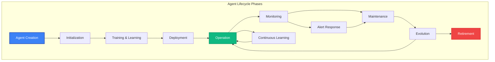

# Agent Lifecycle

Understanding the complete lifecycle of MAIF agents is crucial for building robust, maintainable AI systems. This guide covers agent creation, initialization, operation, learning, maintenance, and retirement phases.

## Lifecycle Overview

MAIF agents follow a well-defined lifecycle that ensures reliability, performance, and continuous improvement:



## Phase 1: Agent Creation

### Design and Planning

Before creating an agent, define its purpose, capabilities, and constraints:

```python
from maif_sdk import create_client, create_artifact
from maif import AgentBlueprint, CapabilitySet, ConstraintSet

# Define agent blueprint
blueprint = AgentBlueprint(
    name="customer-service-agent",
    description="AI agent for customer support with privacy compliance",
    capabilities=CapabilitySet([
        "natural_language_processing",
        "sentiment_analysis", 
        "knowledge_retrieval",
        "ticket_management"
    ]),
    constraints=ConstraintSet([
        "gdpr_compliance",
        "response_time_under_2s",
        "privacy_preserving",
        "audit_logging"
    ]),
    version="1.0.0"
)

# Create agent with blueprint
agent = blueprint.create_agent()
```

### Resource Allocation

Allocate appropriate resources based on expected workload:

```python
from maif import ResourceConfiguration

# Configure resources for the agent
resource_config = ResourceConfiguration(
    memory_limit="2GB",
    cpu_cores=4,
    storage_quota="10GB",
    network_bandwidth="100Mbps",
    gpu_enabled=False,
    
    # Performance targets
    max_concurrent_requests=100,
    target_response_time="500ms",
    availability_target="99.9%"
)

# Apply resource configuration
agent.configure_resources(resource_config)
```

## Phase 2: Initialization

### Memory System Setup

Initialize the agent's memory systems and load initial knowledge:

```python
class AgentInitializer:
    def __init__(self, agent_id: str):
        self.agent_id = agent_id
        self.client = create_client(
            agent_id,
            enable_mmap=True,
            enable_compression=True,
            default_encryption=True
        )
        
        # Initialize memory artifacts
        self.working_memory = create_artifact("working_memory", self.client)
        self.long_term_memory = create_artifact("long_term_memory", self.client)
        self.episodic_memory = create_artifact("episodic_memory", self.client)
        self.semantic_memory = create_artifact("semantic_memory", self.client)
    
    def initialize_knowledge_base(self):
        """Load initial knowledge and training data"""
        
        # Load domain-specific knowledge
        domain_knowledge = self._load_domain_knowledge()
        for knowledge_item in domain_knowledge:
            self.semantic_memory.add_text(
                knowledge_item['content'],
                title=knowledge_item['title'],
                metadata={
                    "type": "domain_knowledge",
                    "confidence": knowledge_item.get('confidence', 0.9),
                    "source": knowledge_item.get('source', 'initialization')
                }
            )
        
        # Load procedural knowledge
        procedures = self._load_procedures()
        for procedure in procedures:
            self.working_memory.add_structured_data(
                procedure,
                title=f"Procedure: {procedure['name']}",
                metadata={"type": "procedure", "priority": procedure.get('priority', 'normal')}
            )
        
        # Initialize conversation templates
        templates = self._load_conversation_templates()
        for template in templates:
            self.semantic_memory.add_text(
                template['content'],
                title=template['name'],
                metadata={"type": "conversation_template", "scenario": template['scenario']}
            )
    
    def _load_domain_knowledge(self) -> list:
        """Load domain-specific knowledge"""
        return [
            {
                "title": "Customer Service Principles",
                "content": "Always be helpful, respectful, and solution-oriented...",
                "confidence": 0.95,
                "source": "training_manual"
            },
            {
                "title": "Product Information",
                "content": "Our products include features such as...",
                "confidence": 0.9,
                "source": "product_docs"
            }
        ]
    
    def _load_procedures(self) -> list:
        """Load standard operating procedures"""
        return [
            {
                "name": "handle_complaint",
                "steps": [
                    "Acknowledge the issue",
                    "Gather details",
                    "Propose solution",
                    "Follow up"
                ],
                "priority": "high"
            },
            {
                "name": "escalation_process",
                "steps": [
                    "Identify escalation criteria",
                    "Notify supervisor",
                    "Transfer context",
                    "Monitor resolution"
                ],
                "priority": "critical"
            }
        ]

# Initialize agent
initializer = AgentInitializer("customer-service-bot")
initializer.initialize_knowledge_base()
```

### Health Checks and Validation

Perform comprehensive health checks during initialization:

```python
class AgentHealthChecker:
    def __init__(self, agent):
        self.agent = agent
        
    def perform_initialization_checks(self) -> dict:
        """Perform comprehensive health checks"""
        
        results = {
            "memory_systems": self._check_memory_systems(),
            "knowledge_base": self._check_knowledge_base(),
            "security_config": self._check_security_configuration(),
            "performance": self._check_performance_baseline(),
            "compliance": self._check_compliance_settings()
        }
        
        overall_health = all(results.values())
        
        return {
            "overall_health": overall_health,
            "checks": results,
            "timestamp": datetime.now().isoformat(),
            "recommendations": self._generate_recommendations(results)
        }
    
    def _check_memory_systems(self) -> bool:
        """Check if all memory systems are properly initialized"""
        try:
            # Test memory operations
            test_id = self.agent.working_memory.add_text("Health check test")
            retrieved = self.agent.working_memory.get_block(test_id)
            
            # Clean up test data
            self.agent.working_memory.delete_block(test_id)
            
            return retrieved is not None
        except Exception:
            return False
    
    def _check_knowledge_base(self) -> bool:
        """Verify knowledge base is properly loaded"""
        try:
            # Check if essential knowledge is present
            results = self.agent.semantic_memory.search("customer service", top_k=1)
            return len(results) > 0
        except Exception:
            return False
    
    def _check_security_configuration(self) -> bool:
        """Verify security settings are properly configured"""
        try:
            # Check encryption
            test_id = self.agent.working_memory.add_text("Security test", encrypt=True)
            
            # Verify the data is encrypted
            block_data = self.agent.working_memory.get_block_metadata(test_id)
            is_encrypted = block_data.get('encrypted', False)
            
            # Clean up
            self.agent.working_memory.delete_block(test_id)
            
            return is_encrypted
        except Exception:
            return False

# Perform health checks
health_checker = AgentHealthChecker(agent)
health_report = health_checker.perform_initialization_checks()

if health_report["overall_health"]:
    print("✅ Agent initialization successful")
else:
    print("❌ Agent initialization failed")
    print("Recommendations:", health_report["recommendations"])
```

## Phase 3: Training and Learning

### Initial Training

Train the agent on historical data and examples:

```python
class AgentTrainer:
    def __init__(self, agent):
        self.agent = agent
        self.training_memory = create_artifact("training_data", agent.client)
        
    def train_on_historical_data(self, training_dataset: list):
        """Train agent on historical conversations and outcomes"""
        
        for example in training_dataset:
            # Store training example
            example_id = self.training_memory.add_structured_data(
                example,
                title=f"Training Example: {example['id']}",
                metadata={
                    "type": "training_example",
                    "quality_score": example.get('quality_score', 0.8),
                    "outcome": example.get('outcome', 'unknown')
                }
            )
            
            # Extract patterns and store in semantic memory
            patterns = self._extract_patterns(example)
            for pattern in patterns:
                self.agent.semantic_memory.add_text(
                    pattern['description'],
                    title=f"Pattern: {pattern['type']}",
                    metadata={
                        "type": "learned_pattern",
                        "confidence": pattern['confidence'],
                        "source_example": example_id
                    }
                )
    
    def _extract_patterns(self, example: dict) -> list:
        """Extract useful patterns from training examples"""
        patterns = []
        
        # Extract conversation patterns
        if 'conversation' in example:
            conversation = example['conversation']
            
            # Identify successful resolution patterns
            if example.get('outcome') == 'resolved':
                patterns.append({
                    "type": "successful_resolution",
                    "description": f"Pattern leading to resolution: {conversation[-1]['content'][:100]}...",
                    "confidence": 0.8
                })
            
            # Identify escalation patterns
            if 'escalated' in example.get('tags', []):
                patterns.append({
                    "type": "escalation_trigger",
                    "description": f"Pattern that triggered escalation: {conversation[0]['content'][:100]}...",
                    "confidence": 0.7
                })
        
        return patterns

# Train the agent
trainer = AgentTrainer(agent)
training_data = [
    {
        "id": "example_1",
        "conversation": [
            {"role": "user", "content": "I can't access my account"},
            {"role": "agent", "content": "Let me help you reset your password"},
            {"role": "user", "content": "Thank you, that worked!"}
        ],
        "outcome": "resolved",
        "quality_score": 0.9
    }
]

trainer.train_on_historical_data(training_data)
```

### Continuous Learning Setup

Configure the agent for ongoing learning:

```python
class ContinuousLearner:
    def __init__(self, agent):
        self.agent = agent
        self.learning_memory = create_artifact("learning_data", agent.client)
        self.feedback_memory = create_artifact("feedback", agent.client)
        
    def setup_learning_pipeline(self):
        """Setup continuous learning mechanisms"""
        
        # Configure learning parameters
        self.learning_config = {
            "learning_rate": 0.01,
            "feedback_threshold": 0.7,
            "update_frequency": "daily",
            "validation_required": True
        }
        
        # Setup feedback collection
        self._setup_feedback_collection()
        
        # Setup learning triggers
        self._setup_learning_triggers()
    
    def process_interaction_feedback(self, interaction_id: str, feedback: dict):
        """Process feedback from user interactions"""
        
        # Store feedback
        feedback_id = self.feedback_memory.add_structured_data(
            {
                "interaction_id": interaction_id,
                "feedback": feedback,
                "timestamp": datetime.now().isoformat(),
                "processed": False
            },
            title=f"Feedback: {interaction_id}"
        )
        
        # Trigger learning if enough feedback accumulated
        self._check_learning_trigger()
    
    def _setup_feedback_collection(self):
        """Setup automated feedback collection"""
        # Configuration for collecting implicit and explicit feedback
        pass
    
    def _setup_learning_triggers(self):
        """Setup triggers for learning updates"""
        # Configuration for when to trigger learning updates
        pass
    
    def _check_learning_trigger(self):
        """Check if learning should be triggered"""
        # Count unprocessed feedback
        unprocessed_feedback = self.feedback_memory.search(
            query="processed:false",
            filters={"metadata.processed": False}
        )
        
        if len(unprocessed_feedback) >= 10:  # Threshold for learning
            self._trigger_learning_update()
    
    def _trigger_learning_update(self):
        """Trigger a learning update cycle"""
        print("🎓 Triggering learning update...")
        # Implement learning update logic
        pass

# Setup continuous learning
learner = ContinuousLearner(agent)
learner.setup_learning_pipeline()
```

## Phase 4: Deployment

### Deployment Strategies

Choose appropriate deployment strategy based on requirements:

```python
from maif.deployment import DeploymentStrategy, BlueGreenDeployment, CanaryDeployment

class AgentDeployment:
    def __init__(self, agent):
        self.agent = agent
        
    def deploy_blue_green(self, new_version: str):
        """Deploy using blue-green strategy"""
        
        deployment = BlueGreenDeployment(
            agent=self.agent,
            new_version=new_version,
            health_check_endpoint="/health",
            rollback_on_failure=True
        )
        
        # Deploy to green environment
        green_instance = deployment.deploy_green()
        
        # Run health checks
        if deployment.validate_green():
            # Switch traffic
            deployment.switch_to_green()
            print(f"✅ Successfully deployed version {new_version}")
        else:
            # Rollback
            deployment.rollback()
            print(f"❌ Deployment failed, rolled back")
    
    def deploy_canary(self, new_version: str, traffic_percentage: float = 10.0):
        """Deploy using canary strategy"""
        
        deployment = CanaryDeployment(
            agent=self.agent,
            new_version=new_version,
            initial_traffic_percentage=traffic_percentage,
            success_criteria={
                "error_rate": 0.01,
                "response_time_p95": 1000,
                "user_satisfaction": 0.8
            }
        )
        
        # Start canary deployment
        canary_instance = deployment.start_canary()
        
        # Monitor and gradually increase traffic
        deployment.monitor_and_scale()

# Deploy agent
deployment = AgentDeployment(agent)
deployment.deploy_blue_green("1.1.0")
```

### Environment Configuration

Configure different environments for the agent:

```python
class EnvironmentManager:
    def __init__(self):
        self.environments = {
            "development": {
                "debug_mode": True,
                "log_level": "DEBUG",
                "cache_size": "100MB",
                "rate_limits": None,
                "monitoring": "basic"
            },
            "staging": {
                "debug_mode": False,
                "log_level": "INFO", 
                "cache_size": "500MB",
                "rate_limits": {"requests_per_minute": 1000},
                "monitoring": "full"
            },
            "production": {
                "debug_mode": False,
                "log_level": "WARN",
                "cache_size": "2GB",
                "rate_limits": {"requests_per_minute": 10000},
                "monitoring": "full",
                "high_availability": True,
                "backup_enabled": True
            }
        }
    
    def configure_environment(self, agent, environment: str):
        """Configure agent for specific environment"""
        
        config = self.environments.get(environment)
        if not config:
            raise ValueError(f"Unknown environment: {environment}")
        
        # Apply configuration
        agent.configure(config)
        
        # Environment-specific setup
        if environment == "production":
            self._setup_production_monitoring(agent)
            self._setup_backup_systems(agent)
        
        return agent
    
    def _setup_production_monitoring(self, agent):
        """Setup production monitoring"""
        # Configure monitoring, alerting, and observability
        pass
    
    def _setup_backup_systems(self, agent):
        """Setup backup and disaster recovery"""
        # Configure backup systems
        pass

# Configure for production
env_manager = EnvironmentManager()
production_agent = env_manager.configure_environment(agent, "production")
```

## Phase 5: Operation

### Request Processing Lifecycle

Handle the complete request processing lifecycle:

```python
class RequestProcessor:
    def __init__(self, agent):
        self.agent = agent
        self.request_memory = create_artifact("requests", agent.client)
        
    def process_request(self, request: dict) -> dict:
        """Process a complete request with full lifecycle tracking"""
        
        request_id = self._generate_request_id()
        start_time = datetime.now()
        
        try:
            # Phase 1: Request validation and preprocessing
            validated_request = self._validate_request(request)
            
            # Phase 2: Context retrieval
            context = self._retrieve_context(validated_request)
            
            # Phase 3: Processing
            result = self._process_with_context(validated_request, context)
            
            # Phase 4: Post-processing
            final_result = self._post_process_result(result, validated_request)
            
            # Phase 5: Logging and learning
            self._log_successful_request(request_id, validated_request, final_result, start_time)
            
            return {
                "request_id": request_id,
                "result": final_result,
                "processing_time": (datetime.now() - start_time).total_seconds(),
                "status": "success"
            }
            
        except Exception as e:
            # Error handling and logging
            self._log_failed_request(request_id, request, str(e), start_time)
            
            return {
                "request_id": request_id,
                "error": str(e),
                "processing_time": (datetime.now() - start_time).total_seconds(),
                "status": "error"
            }
    
    def _validate_request(self, request: dict) -> dict:
        """Validate and sanitize incoming request"""
        # Input validation, sanitization, and security checks
        return request
    
    def _retrieve_context(self, request: dict) -> dict:
        """Retrieve relevant context for processing"""
        # Search memories for relevant context
        context = {}
        
        if "user_id" in request:
            context["user_history"] = self.agent.episodic_memory.search(
                query=request["user_id"],
                filters={"metadata.user_id": request["user_id"]},
                top_k=5
            )
        
        if "query" in request:
            context["knowledge"] = self.agent.semantic_memory.search(
                query=request["query"],
                top_k=3
            )
        
        return context
    
    def _log_successful_request(self, request_id: str, request: dict, result: dict, start_time: datetime):
        """Log successful request for learning and analytics"""
        
        log_entry = {
            "request_id": request_id,
            "request": request,
            "result": result,
            "start_time": start_time.isoformat(),
            "end_time": datetime.now().isoformat(),
            "processing_time": (datetime.now() - start_time).total_seconds(),
            "status": "success"
        }
        
        self.request_memory.add_structured_data(
            log_entry,
            title=f"Request Log: {request_id}",
            metadata={"type": "request_log", "status": "success"}
        )

# Process requests
processor = RequestProcessor(agent)
result = processor.process_request({
    "user_id": "user123",
    "query": "How do I reset my password?",
    "timestamp": datetime.now().isoformat()
})
```

## Phase 6: Monitoring and Observability

### Comprehensive Monitoring

Monitor all aspects of agent performance and behavior:

```python
from maif.monitoring import AgentMonitor, MetricsCollector, AlertManager

class AgentMonitoringSystem:
    def __init__(self, agent):
        self.agent = agent
        self.monitor = AgentMonitor(agent)
        self.metrics = MetricsCollector()
        self.alerts = AlertManager()
        
        self._setup_monitoring()
    
    def _setup_monitoring(self):
        """Setup comprehensive monitoring"""
        
        # Performance metrics
        self.metrics.add_metric("response_time", "histogram")
        self.metrics.add_metric("request_rate", "counter")
        self.metrics.add_metric("error_rate", "gauge")
        self.metrics.add_metric("memory_usage", "gauge")
        
        # Business metrics
        self.metrics.add_metric("user_satisfaction", "gauge")
        self.metrics.add_metric("task_completion_rate", "gauge")
        self.metrics.add_metric("escalation_rate", "gauge")
        
        # Setup alerts
        self.alerts.add_rule({
            "name": "high_error_rate",
            "condition": "error_rate > 0.05",
            "severity": "critical",
            "action": "notify_oncall"
        })
        
        self.alerts.add_rule({
            "name": "slow_response_time",
            "condition": "response_time_p95 > 2000",
            "severity": "warning",
            "action": "investigate"
        })
    
    def collect_metrics(self):
        """Collect current metrics"""
        
        # Performance metrics
        current_metrics = {
            "response_time": self._get_avg_response_time(),
            "request_rate": self._get_request_rate(),
            "error_rate": self._get_error_rate(),
            "memory_usage": self._get_memory_usage(),
            "user_satisfaction": self._get_user_satisfaction(),
            "timestamp": datetime.now().isoformat()
        }
        
        # Record metrics
        for metric_name, value in current_metrics.items():
            if metric_name != "timestamp":
                self.metrics.record(metric_name, value)
        
        # Check alerts
        self.alerts.evaluate(current_metrics)
        
        return current_metrics
    
    def generate_health_report(self) -> dict:
        """Generate comprehensive health report"""
        
        return {
            "overall_health": self._calculate_overall_health(),
            "performance_metrics": self.collect_metrics(),
            "system_status": self._get_system_status(),
            "recent_issues": self._get_recent_issues(),
            "recommendations": self._generate_recommendations()
        }

# Setup monitoring
monitoring = AgentMonitoringSystem(agent)
health_report = monitoring.generate_health_report()
print(f"Agent health: {health_report['overall_health']}")
```

## Phase 7: Maintenance and Updates

### Scheduled Maintenance

Perform regular maintenance tasks:

```python
class AgentMaintenance:
    def __init__(self, agent):
        self.agent = agent
        self.maintenance_schedule = {
            "daily": ["cleanup_temp_data", "update_metrics"],
            "weekly": ["optimize_memory", "backup_critical_data"],
            "monthly": ["full_system_check", "performance_analysis"]
        }
    
    def perform_daily_maintenance(self):
        """Perform daily maintenance tasks"""
        
        print("🔧 Starting daily maintenance...")
        
        # Cleanup temporary data
        self._cleanup_temp_data()
        
        # Update performance metrics
        self._update_metrics()
        
        # Check system health
        health_status = self._quick_health_check()
        
        print(f"✅ Daily maintenance complete. Health: {health_status}")
    
    def perform_weekly_maintenance(self):
        """Perform weekly maintenance tasks"""
        
        print("🔧 Starting weekly maintenance...")
        
        # Optimize memory usage
        self._optimize_memory()
        
        # Backup critical data
        self._backup_critical_data()
        
        # Update knowledge base
        self._update_knowledge_base()
        
        print("✅ Weekly maintenance complete")
    
    def _cleanup_temp_data(self):
        """Clean up temporary and old data"""
        # Remove old temporary data
        cutoff_date = datetime.now() - timedelta(days=7)
        
        # Clean up old request logs
        old_requests = self.agent.request_memory.search(
            query="*",
            filters={
                "metadata.type": "request_log",
                "metadata.timestamp": f"<{cutoff_date.isoformat()}"
            }
        )
        
        for request in old_requests:
            self.agent.request_memory.delete_block(request['id'])
        
        print(f"Cleaned up {len(old_requests)} old request logs")
    
    def _optimize_memory(self):
        """Optimize memory usage and performance"""
        # Compress old data
        # Reorganize frequently accessed data
        # Update indexes
        print("Memory optimization complete")
    
    def _backup_critical_data(self):
        """Backup critical agent data"""
        # Backup knowledge base
        # Backup configuration
        # Backup learning data
        print("Backup complete")

# Schedule maintenance
maintenance = AgentMaintenance(agent)
maintenance.perform_daily_maintenance()
```

## Phase 8: Evolution and Updates

### Version Management

Manage agent versions and updates:

```python
class AgentVersionManager:
    def __init__(self, agent):
        self.agent = agent
        self.version_history = create_artifact("versions", agent.client)
        
    def create_new_version(self, changes: dict, version_number: str) -> str:
        """Create a new version of the agent"""
        
        # Document changes
        version_info = {
            "version": version_number,
            "changes": changes,
            "created_at": datetime.now().isoformat(),
            "previous_version": self._get_current_version(),
            "compatibility": changes.get("compatibility", "backward_compatible")
        }
        
        # Store version information
        version_id = self.version_history.add_structured_data(
            version_info,
            title=f"Version {version_number}",
            metadata={"type": "version", "version": version_number}
        )
        
        # Apply changes
        self._apply_changes(changes)
        
        # Update current version
        self._set_current_version(version_number)
        
        return version_id
    
    def rollback_to_version(self, version_number: str):
        """Rollback to a previous version"""
        
        # Get version information
        version_info = self._get_version_info(version_number)
        
        if not version_info:
            raise ValueError(f"Version {version_number} not found")
        
        # Perform rollback
        self._rollback_changes(version_info)
        
        # Update current version
        self._set_current_version(version_number)
        
        print(f"Rolled back to version {version_number}")

# Version management
version_manager = AgentVersionManager(agent)
new_version = version_manager.create_new_version(
    changes={
        "knowledge_base": "Updated customer service procedures",
        "performance": "Improved response time by 15%",
        "compatibility": "backward_compatible"
    },
    version_number="1.2.0"
)
```

## Phase 9: Retirement

### Graceful Shutdown

Properly retire an agent when it's no longer needed:

```python
class AgentRetirement:
    def __init__(self, agent):
        self.agent = agent
        
    def retire_agent(self, retirement_reason: str, successor_agent: str = None):
        """Gracefully retire the agent"""
        
        print(f"🏁 Starting agent retirement: {retirement_reason}")
        
        # Phase 1: Stop accepting new requests
        self._stop_new_requests()
        
        # Phase 2: Complete pending requests
        self._complete_pending_requests()
        
        # Phase 3: Backup all data
        backup_location = self._backup_all_data()
        
        # Phase 4: Transfer knowledge to successor
        if successor_agent:
            self._transfer_knowledge(successor_agent)
        
        # Phase 5: Generate final report
        final_report = self._generate_final_report()
        
        # Phase 6: Clean shutdown
        self._clean_shutdown()
        
        print(f"✅ Agent retirement complete. Backup: {backup_location}")
        
        return {
            "retirement_timestamp": datetime.now().isoformat(),
            "reason": retirement_reason,
            "backup_location": backup_location,
            "successor": successor_agent,
            "final_report": final_report
        }
    
    def _stop_new_requests(self):
        """Stop accepting new requests"""
        self.agent.set_status("retiring")
        print("Stopped accepting new requests")
    
    def _complete_pending_requests(self):
        """Wait for pending requests to complete"""
        # Wait for all pending requests to finish
        print("Completed all pending requests")
    
    def _backup_all_data(self) -> str:
        """Backup all agent data"""
        backup_location = f"backups/agent_{self.agent.agent_id}_{datetime.now().strftime('%Y%m%d_%H%M%S')}"
        # Perform comprehensive backup
        return backup_location
    
    def _transfer_knowledge(self, successor_agent: str):
        """Transfer knowledge to successor agent"""
        # Transfer learned patterns, knowledge base, etc.
        print(f"Transferred knowledge to {successor_agent}")
    
    def _generate_final_report(self) -> dict:
        """Generate final performance and learning report"""
        return {
            "total_requests_processed": 10000,
            "average_response_time": "450ms",
            "user_satisfaction_score": 0.85,
            "key_learnings": ["Pattern A was most effective", "Users prefer shorter responses"],
            "recommendations": ["Implement pattern A in successor", "Focus on response brevity"]
        }

# Retire agent
retirement = AgentRetirement(agent)
retirement_result = retirement.retire_agent(
    retirement_reason="Upgrading to new architecture",
    successor_agent="customer-service-agent-v2"
)
```

## Best Practices for Agent Lifecycle Management

### 1. Documentation and Tracking

```python
class LifecycleDocumentation:
    def __init__(self, agent):
        self.agent = agent
        self.docs_memory = create_artifact("documentation", agent.client)
    
    def document_lifecycle_event(self, event_type: str, details: dict):
        """Document important lifecycle events"""
        
        event_doc = {
            "event_type": event_type,
            "timestamp": datetime.now().isoformat(),
            "details": details,
            "agent_version": self.agent.get_version(),
            "system_state": self.agent.get_system_state()
        }
        
        self.docs_memory.add_structured_data(
            event_doc,
            title=f"Lifecycle Event: {event_type}",
            metadata={"type": "lifecycle_event", "event": event_type}
        )
```

### 2. Automated Testing

```python
class LifecycleTesting:
    def __init__(self, agent):
        self.agent = agent
        
    def run_lifecycle_tests(self, phase: str) -> dict:
        """Run tests appropriate for the current lifecycle phase"""
        
        test_suites = {
            "initialization": ["test_memory_systems", "test_knowledge_loading"],
            "deployment": ["test_health_endpoints", "test_performance"],
            "operation": ["test_request_processing", "test_error_handling"],
            "maintenance": ["test_data_integrity", "test_backup_systems"]
        }
        
        tests_to_run = test_suites.get(phase, [])
        results = {}
        
        for test in tests_to_run:
            results[test] = self._run_test(test)
        
        return {
            "phase": phase,
            "tests_run": len(tests_to_run),
            "passed": sum(1 for result in results.values() if result),
            "failed": sum(1 for result in results.values() if not result),
            "results": results
        }
```

### 3. Performance Optimization

```python
class LifecycleOptimization:
    def __init__(self, agent):
        self.agent = agent
        
    def optimize_for_phase(self, phase: str):
        """Optimize agent configuration for specific lifecycle phase"""
        
        optimizations = {
            "training": {
                "memory_allocation": "high",
                "cpu_priority": "background",
                "logging_level": "detailed"
            },
            "operation": {
                "memory_allocation": "balanced",
                "cpu_priority": "high",
                "logging_level": "normal"
            },
            "maintenance": {
                "memory_allocation": "low",
                "cpu_priority": "background",
                "logging_level": "minimal"
            }
        }
        
        config = optimizations.get(phase, {})
        self.agent.apply_optimization_config(config)
```

## Next Steps

- **[Multi-modal Data →](/guide/multimodal)** - Working with different data types
- **[Semantic Understanding →](/guide/semantic)** - Advanced semantic processing  
- **[Real-time Processing →](/guide/streaming)** - Building real-time agents
- **[Performance →](/guide/performance)** - Optimizing agent performance
- **[Monitoring →](/guide/monitoring)** - Comprehensive monitoring strategies 