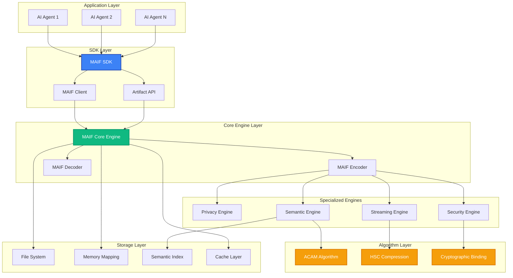
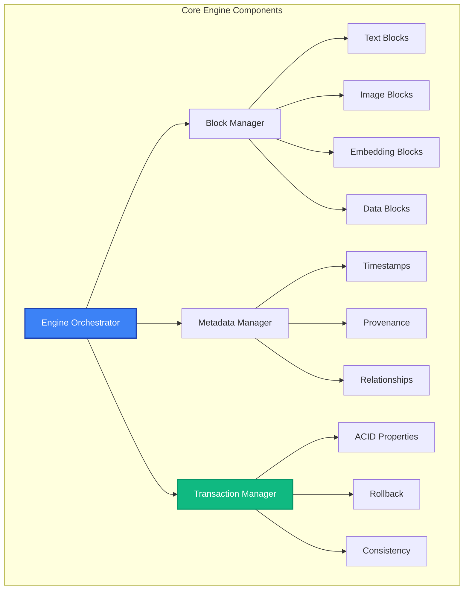
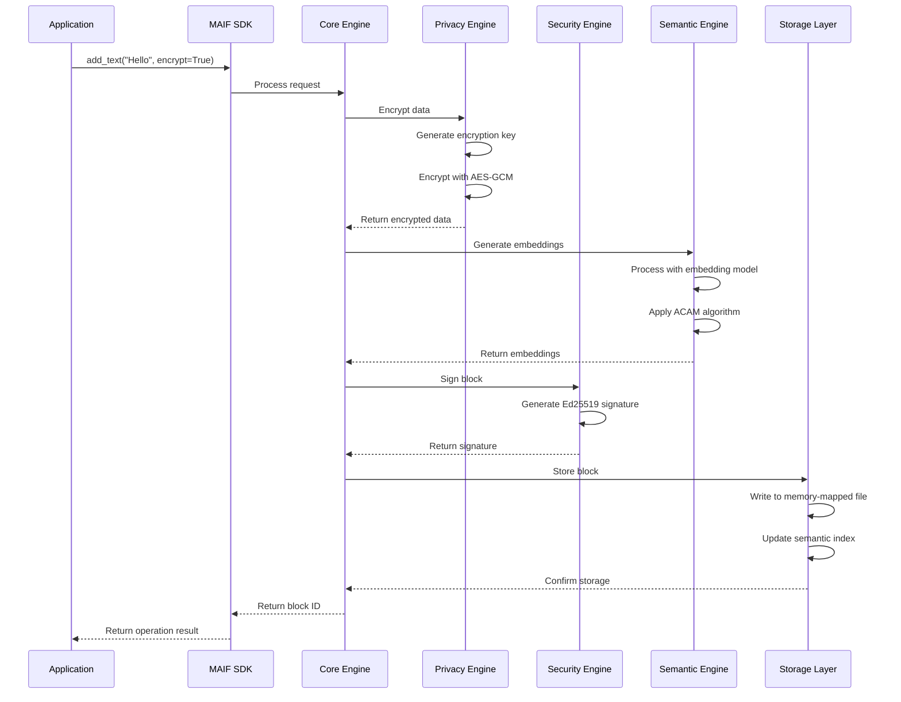
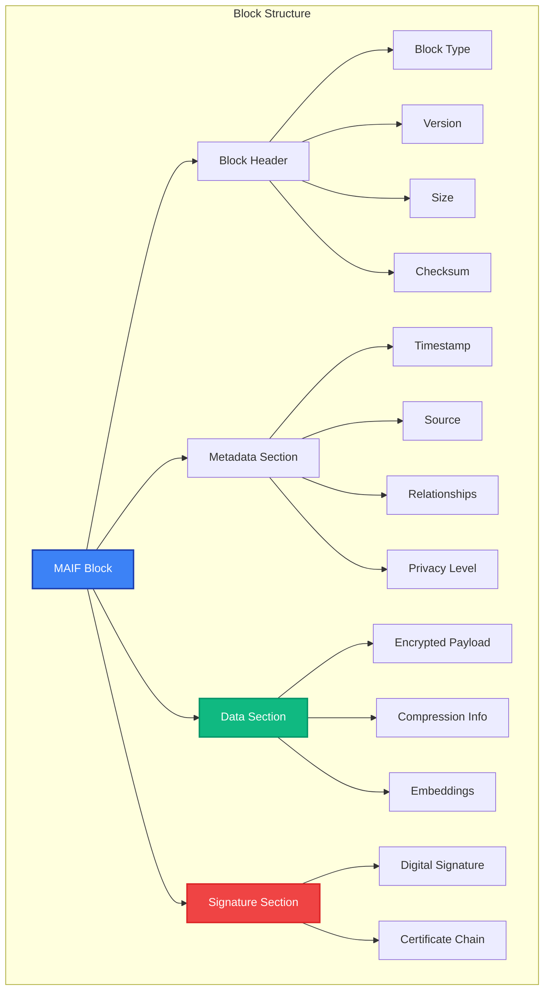
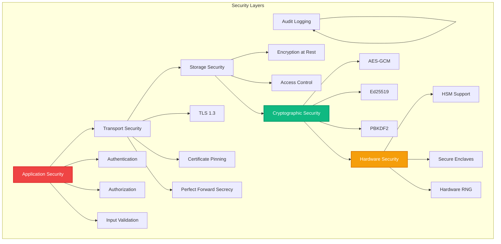
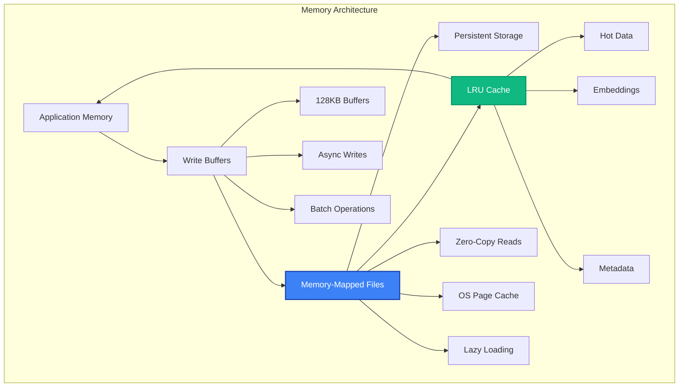
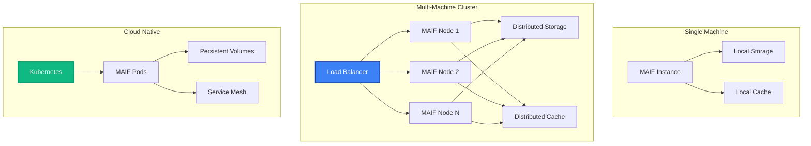
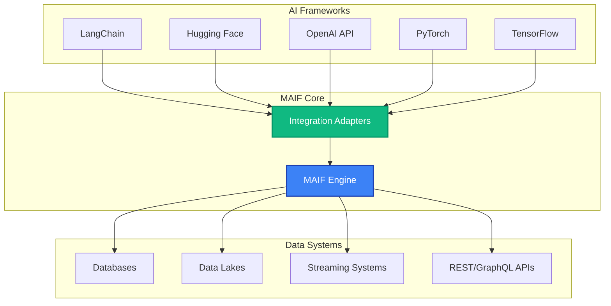
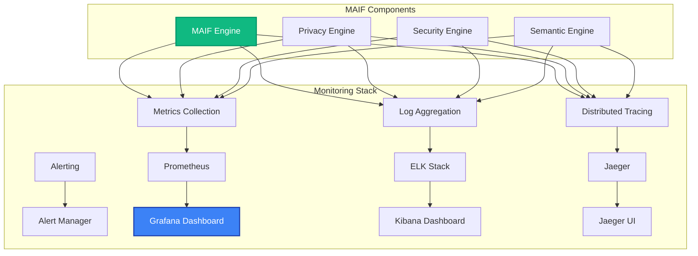

# System Architecture

MAIF's architecture is designed for enterprise-scale AI applications with built-in security, privacy, and performance. This guide provides a deep dive into the system's design, components, and data flow.

## High-Level Architecture

MAIF follows a layered architecture that separates concerns while maintaining high performance and security.



## Component Architecture

### 1. SDK Layer

The SDK provides high-level abstractions for AI developers:

```python
# High-level SDK usage
from maif_sdk import create_client, create_artifact

client = create_client("my-agent")
artifact = create_artifact("memory", client)
```

**Components:**
- **MAIFClient**: Connection management and configuration
- **Artifact**: Data container with built-in features
- **Quick Functions**: One-line operations for common tasks

### 2. Core Engine

The core engine handles low-level operations and orchestrates all subsystems:



### 3. Specialized Engines

Each engine handles specific aspects of data processing:

#### Privacy Engine
- **Encryption**: AES-GCM, ChaCha20, XChaCha20
- **Anonymization**: PII detection and replacement
- **Differential Privacy**: Mathematical privacy guarantees
- **Key Management**: Secure key derivation and rotation

```python
from maif import PrivacyEngine

privacy = PrivacyEngine(
    encryption_algorithm="AES-GCM",
    key_derivation_rounds=100000,
    differential_privacy_epsilon=1.0
)
```

#### Security Engine
- **Digital Signatures**: Ed25519, RSA-PSS
- **Access Control**: Role-based and attribute-based
- **Audit Logging**: Immutable operation logs
- **Tamper Detection**: Cryptographic integrity checks

```python
from maif import SecurityEngine

security = SecurityEngine(
    signature_algorithm="Ed25519",
    access_control="RBAC",
    audit_level="DETAILED"
)
```

#### Semantic Engine
- **Embedding Generation**: Multiple model support
- **Semantic Indexing**: High-performance vector search
- **Cross-Modal Processing**: Text, image, audio understanding
- **Relationship Discovery**: Automatic connection detection

```python
from maif.semantic import SemanticEngine

semantic = SemanticEngine(
    embedding_model="all-MiniLM-L6-v2",
    index_type="HNSW",
    cross_modal_enabled=True
)
```

#### Streaming Engine
- **High-Throughput I/O**: 400+ MB/s sustained writes
- **Memory-Mapped Files**: Zero-copy operations
- **Compression**: Real-time data compression
- **Buffering**: Intelligent write buffering

```python
from maif.streaming import StreamingEngine

streaming = StreamingEngine(
    buffer_size=128*1024,
    compression_algorithm="HSC",
    memory_mapping=True
)
```

## Data Flow Architecture

Understanding how data flows through MAIF helps optimize performance and understand security boundaries:



## Block Architecture

MAIF uses a sophisticated block system for data storage and management:



### Block Types

1. **TextBlock**: Natural language content
2. **ImageBlock**: Image data with metadata
3. **EmbeddingBlock**: Vector embeddings
4. **StructuredDataBlock**: JSON/structured data
5. **AudioBlock**: Audio content
6. **VideoBlock**: Video content
7. **MetadataBlock**: System metadata

Each block type has specialized handling:

```python
# Block type specific features
text_block = artifact.add_text("Hello", 
    language="en",
    sentiment_analysis=True
)

image_block = artifact.add_image(image_data,
    format="PNG",
    extract_features=True,
    generate_caption=True
)

embedding_block = artifact.add_embedding(vector,
    model="bert-base",
    dimension=768,
    normalize=True
)
```

## Security Architecture

Security is implemented at multiple layers with defense-in-depth principles:



## Performance Architecture

MAIF is designed for high-performance operations:

### Memory Management



### Parallel Processing

MAIF supports parallel operations for maximum throughput:

```python
# Parallel processing configuration
client = create_client(
    "high-performance-agent",
    max_concurrent_writers=8,      # Parallel writes
    max_concurrent_readers=16,     # Parallel reads
    thread_pool_size=32,           # Worker threads
    enable_async=True              # Async operations
)
```

## Scalability Architecture

MAIF scales from single-machine to distributed deployments:



## Integration Architecture

MAIF integrates with existing AI and data ecosystems:



## Deployment Architectures

### 1. Development Deployment

```python
# Simple development setup
from maif_sdk import create_client

client = create_client(
    "dev-agent",
    storage_path="./dev_data",
    cache_size="100MB",
    log_level="DEBUG"
)
```

### 2. Production Deployment

```python
# Production configuration
client = create_client(
    "prod-agent",
    storage_path="/data/maif",
    cache_size="10GB",
    enable_clustering=True,
    cluster_nodes=["node1", "node2", "node3"],
    enable_monitoring=True,
    metrics_endpoint="http://prometheus:9090"
)
```

### 3. Cloud Deployment

```yaml
# Kubernetes deployment
apiVersion: apps/v1
kind: Deployment
metadata:
  name: maif-agent
spec:
  replicas: 3
  selector:
    matchLabels:
      app: maif-agent
  template:
    metadata:
      labels:
        app: maif-agent
    spec:
      containers:
      - name: maif
        image: maif/maif:latest
        env:
        - name: MAIF_CLUSTER_MODE
          value: "true"
        - name: MAIF_STORAGE_CLASS
          value: "distributed"
        volumeMounts:
        - name: data
          mountPath: /data
      volumes:
      - name: data
        persistentVolumeClaim:
          claimName: maif-storage
```

## Monitoring and Observability

MAIF provides comprehensive monitoring capabilities:



## Best Practices

### 1. Performance Optimization

```python
# Optimize for your workload
client = create_client(
    "optimized-agent",
    # For write-heavy workloads
    buffer_size=256*1024,
    max_concurrent_writers=16,
    
    # For read-heavy workloads
    cache_size="5GB",
    max_concurrent_readers=32,
    
    # For memory-constrained environments
    enable_compression=True,
    compression_level=6
)
```

### 2. Security Hardening

```python
# Maximum security configuration
client = create_client(
    "secure-agent",
    default_security_level=SecurityLevel.TOP_SECRET,
    encryption_algorithm="XChaCha20-Poly1305",
    key_derivation_rounds=200000,
    require_signatures=True,
    enable_hsm=True
)
```

### 3. Scalability Planning

```python
# Design for scale
client = create_client(
    "scalable-agent",
    enable_clustering=True,
    shard_strategy="consistent_hash",
    replication_factor=3,
    enable_load_balancing=True
)
```

## Next Steps

- **[Block Structure →](/guide/blocks)** - Deep dive into block architecture
- **[Security Model →](/guide/security-model)** - Understand security implementation
- **[Performance →](/guide/performance)** - Optimization techniques
- **[Deployment →](/cookbook/cloud)** - Production deployment guides 