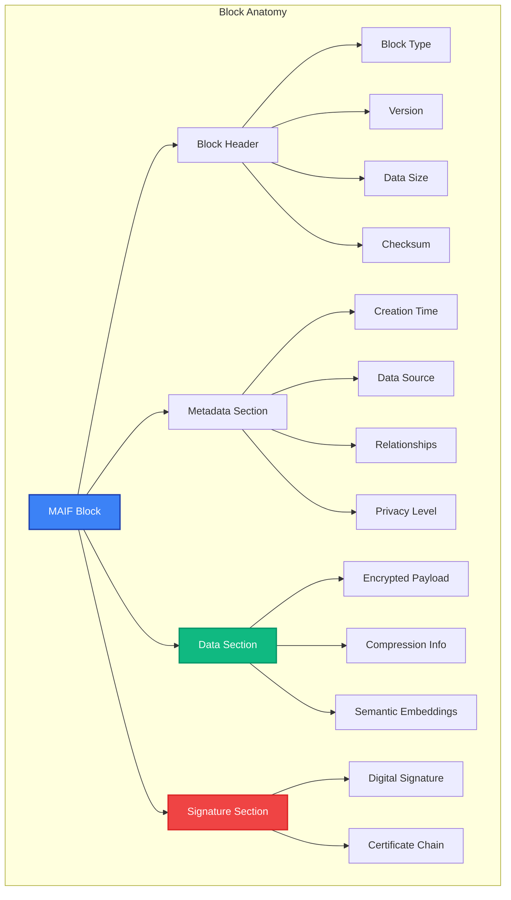
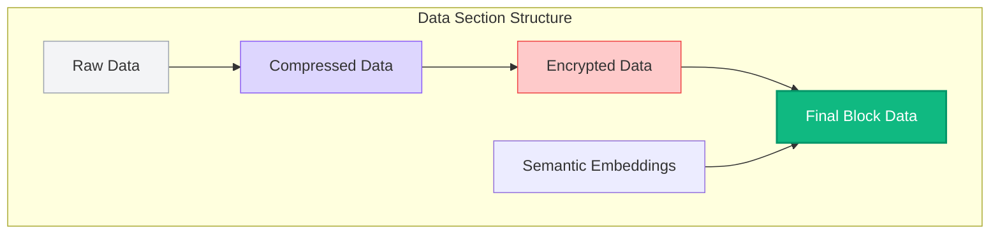
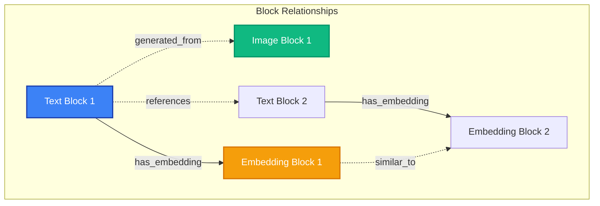

# Block Structure

MAIF's block-based architecture is the foundation for its security, performance, and semantic capabilities. This guide explains how blocks work, their structure, and how to use them effectively.

## Block Overview

A **block** is MAIF's fundamental unit of data storage. Every piece of data - whether text, images, embeddings, or structured data - is stored as a typed block with built-in security, metadata, and semantic features.



## Block Types

MAIF supports multiple block types, each optimized for specific data types and use cases:

### 1. TextBlock

Stores natural language text with linguistic metadata and semantic embeddings.

```python
from maif_sdk import create_artifact

artifact = create_artifact("text-demo", client)

# Basic text block
text_id = artifact.add_text("Hello, world!")

# Advanced text block with features
text_id = artifact.add_text(
    "The quick brown fox jumps over the lazy dog.",
    title="Sample Text",
    language="en",
    encrypt=True,
    metadata={
        "source": "user_input",
        "sentiment": "neutral",
        "topic": "animals"
    }
)
```

**TextBlock Features:**
- Automatic language detection
- Sentiment analysis
- Named entity recognition
- Semantic embedding generation
- PII detection and anonymization

### 2. ImageBlock

Stores image data with visual metadata and features.

```python
import numpy as np
from PIL import Image

# Load image
image = Image.open("photo.jpg")
image_data = np.array(image)

# Store image block
image_id = artifact.add_image(
    image_data,
    title="Sample Photo",
    format="JPEG",
    metadata={
        "camera": "iPhone 14",
        "location": "San Francisco",
        "timestamp": "2024-01-15T10:30:00Z"
    }
)
```

**ImageBlock Features:**
- Automatic format detection
- EXIF metadata extraction
- Visual feature extraction
- Caption generation
- Object detection
- Facial recognition (if enabled)

### 3. EmbeddingBlock

Stores vector embeddings with model information and semantic metadata.

```python
import numpy as np

# Generate or load embeddings
embedding_vector = np.random.rand(384).astype(np.float32)

# Store embedding block
embedding_id = artifact.add_embedding(
    embedding_vector,
    title="Text Embedding",
    model="all-MiniLM-L6-v2",
    metadata={
        "source_text": "Original text that generated this embedding",
        "model_version": "1.0.0",
        "dimension": 384
    }
)
```

**EmbeddingBlock Features:**
- Model provenance tracking
- Dimension validation
- Normalization options
- Similarity search optimization
- Cross-modal linking

### 4. StructuredDataBlock

Stores JSON-like structured data with schema validation.

```python
# Store structured data
data_id = artifact.add_structured_data({
    "user_profile": {
        "id": "user_123",
        "preferences": {
            "theme": "dark",
            "language": "en",
            "notifications": True
        },
        "usage_stats": {
            "sessions": 42,
            "total_time": "15h 30m",
            "last_active": "2024-01-15T10:30:00Z"
        }
    }
}, title="User Profile")
```

**StructuredDataBlock Features:**
- JSON schema validation
- Nested structure support
- Query optimization
- Type preservation
- Automatic indexing

### 5. AudioBlock

Stores audio data with acoustic metadata and features.

```python
# Load audio file
import librosa

audio_data, sample_rate = librosa.load("speech.wav")

# Store audio block
audio_id = artifact.add_audio(
    audio_data,
    sample_rate=sample_rate,
    title="Speech Sample",
    format="WAV",
    metadata={
        "duration": "30.5s",
        "speaker": "unknown",
        "language": "en"
    }
)
```

**AudioBlock Features:**
- Format detection
- Speech-to-text conversion
- Speaker identification
- Audio fingerprinting
- Noise analysis

### 6. VideoBlock

Stores video data with temporal metadata and scene analysis.

```python
# Store video block
video_id = artifact.add_video(
    video_data,
    title="Demo Video",
    format="MP4",
    metadata={
        "duration": "2m 15s",
        "resolution": "1920x1080",
        "fps": 30,
        "codec": "H.264"
    }
)
```

**VideoBlock Features:**
- Frame extraction
- Scene detection
- Object tracking
- Caption generation
- Thumbnail creation

## Block Structure Details

### Block Header

Every block starts with a standardized header:

```python
class BlockHeader:
    magic_number: bytes      # MAIF magic number
    version: int            # Block format version
    block_type: int         # Type identifier
    flags: int              # Feature flags
    data_size: int          # Size of data section
    metadata_size: int      # Size of metadata section
    checksum: bytes         # Header checksum
```

### Metadata Section

The metadata section contains structured information about the block:

```python
class BlockMetadata:
    creation_timestamp: datetime
    modification_timestamp: datetime
    creator_id: str
    source_info: dict
    relationships: list
    privacy_level: int
    security_flags: int
    custom_metadata: dict
```

### Data Section

The data section contains the actual payload, potentially encrypted and compressed:



### Signature Section

The signature section provides cryptographic integrity and authenticity:

```python
class BlockSignature:
    signature_algorithm: str    # e.g., "Ed25519"
    signature: bytes           # Digital signature
    certificate_chain: list   # X.509 certificates
    timestamp: datetime        # Signing timestamp
```

## Block Operations

### Creating Blocks

```python
# Create different types of blocks
text_block = artifact.add_text("Hello, MAIF!")
image_block = artifact.add_image(image_data)
data_block = artifact.add_structured_data({"key": "value"})

# All blocks automatically get:
# - Unique IDs
# - Timestamps
# - Semantic embeddings (if enabled)
# - Encryption (if configured)
# - Digital signatures (if enabled)
```

### Reading Blocks

```python
# Read block by ID
block_data = artifact.get_block(text_block)

# Read with metadata
block_data, metadata = artifact.get_block(text_block, include_metadata=True)

# Read multiple blocks
blocks = artifact.get_blocks([text_block, image_block, data_block])
```

### Searching Blocks

```python
# Semantic search across all blocks
results = artifact.search("machine learning", top_k=10)

# Search specific block types
text_results = artifact.search("AI", block_types=["text"])
image_results = artifact.search("cat", block_types=["image"])

# Search with filters
filtered_results = artifact.search(
    "python programming",
    filters={
        "metadata.language": "en",
        "metadata.topic": "programming"
    }
)
```

### Updating Blocks

```python
# Update block metadata
artifact.update_block_metadata(text_block, {
    "topic": "updated_topic",
    "tags": ["important", "reviewed"]
})

# Create new version of block
new_version = artifact.update_block_data(
    text_block,
    "Updated text content",
    create_version=True
)
```

## Block Relationships

MAIF automatically tracks relationships between blocks:



### Relationship Types

1. **Generated From**: Block created from another block
2. **Has Embedding**: Text/image linked to its embedding
3. **Similar To**: Semantically similar blocks
4. **References**: Explicit references between blocks
5. **Part Of**: Block is part of a larger structure
6. **Derived From**: Block derived through processing

```python
# Query relationships
relationships = artifact.get_relationships(text_block)

# Find similar blocks
similar_blocks = artifact.find_similar(text_block, similarity_threshold=0.8)

# Get block lineage
lineage = artifact.get_block_lineage(text_block)
```

## Performance Optimizations

### Block Caching

```python
# Configure block caching
client = create_client(
    "cached-agent",
    cache_size="1GB",           # Total cache size
    cache_policy="LRU",         # Cache eviction policy
    cache_hot_blocks=True,      # Keep frequently accessed blocks
    cache_embeddings=True       # Cache semantic embeddings
)
```

### Batch Operations

```python
# Batch block creation
blocks_data = [
    ("text", "First text"),
    ("text", "Second text"),
    ("structured", {"key": "value"})
]

block_ids = artifact.add_blocks_batch(blocks_data)

# Batch block retrieval
blocks = artifact.get_blocks_batch(block_ids)
```

### Streaming Large Blocks

```python
# Stream large blocks
with artifact.stream_block(large_video_block) as stream:
    for chunk in stream:
        process_chunk(chunk)

# Stream block creation
with artifact.create_streaming_block("video") as stream:
    for video_chunk in video_data_chunks:
        stream.write(video_chunk)
    
    block_id = stream.finalize()
```

## Security Features

### Encryption

```python
# Block-level encryption
encrypted_block = artifact.add_text(
    "Sensitive information",
    encrypt=True,
    encryption_algorithm="AES-GCM",
    key_derivation_rounds=100000
)

# Custom encryption keys
custom_key = generate_key()
encrypted_block = artifact.add_text(
    "Top secret data",
    encrypt=True,
    encryption_key=custom_key
)
```

### Access Control

```python
# Set access permissions
artifact.set_block_permissions(text_block, {
    "read": ["user1", "user2"],
    "write": ["admin"],
    "delete": ["admin"]
})

# Check permissions
can_read = artifact.check_permission(text_block, "read", "user1")
```

### Audit Trail

```python
# Get block audit trail
audit_log = artifact.get_block_audit_trail(text_block)

for entry in audit_log:
    print(f"{entry.timestamp}: {entry.operation} by {entry.user}")
```

## Best Practices

### 1. Block Organization

```python
# Good: Organize by purpose and type
user_texts = artifact.add_text(text, metadata={"category": "user_input"})
system_data = artifact.add_structured_data(data, metadata={"category": "system"})

# Good: Use descriptive titles
artifact.add_text("User question about pricing", title="Pricing Inquiry")
```

### 2. Metadata Strategy

```python
# Include rich metadata
artifact.add_text(
    content,
    title="Customer Support Conversation",
    metadata={
        "customer_id": "cust_123",
        "agent_id": "agent_456", 
        "category": "technical_support",
        "priority": "high",
        "resolved": False,
        "tags": ["bug_report", "ui_issue"]
    }
)
```

### 3. Performance Optimization

```python
# Batch related operations
texts = ["Text 1", "Text 2", "Text 3"]
block_ids = artifact.add_texts_batch(texts)

# Use appropriate block types
artifact.add_structured_data(json_data)  # Not add_text(json.dumps(data))
```

### 4. Security Configuration

```python
# Set security defaults at client level
client = create_client(
    "secure-agent",
    default_encryption=True,
    default_signing=True,
    default_privacy_level=PrivacyLevel.CONFIDENTIAL
)
```

## Advanced Features

### Custom Block Types

```python
# Define custom block type
class CustomBlock(BaseBlock):
    block_type = "custom"
    
    def validate_data(self, data):
        # Custom validation logic
        return True
    
    def process_data(self, data):
        # Custom processing logic
        return processed_data

# Register custom block type
artifact.register_block_type(CustomBlock)
```

### Block Compression

```python
# Configure compression
artifact.add_text(
    large_text,
    compress=True,
    compression_algorithm="HSC",  # Hierarchical Semantic Compression
    compression_level=6
)
```

### Block Versioning

```python
# Enable versioning
artifact.enable_versioning()

# Update with versioning
new_version = artifact.update_block(
    block_id,
    new_content,
    create_version=True,
    version_message="Fixed typos"
)

# Get version history
versions = artifact.get_block_versions(block_id)
```

## Next Steps

- **[Security Model →](/guide/security-model)** - Understanding MAIF's security implementation
- **[Privacy Framework →](/guide/privacy)** - Privacy features and compliance
- **[Performance →](/guide/performance)** - Optimization techniques
- **[API Reference →](/api/)** - Complete block API documentation 