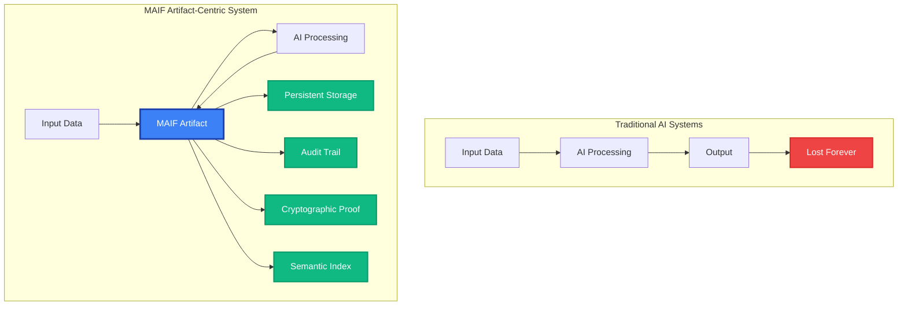
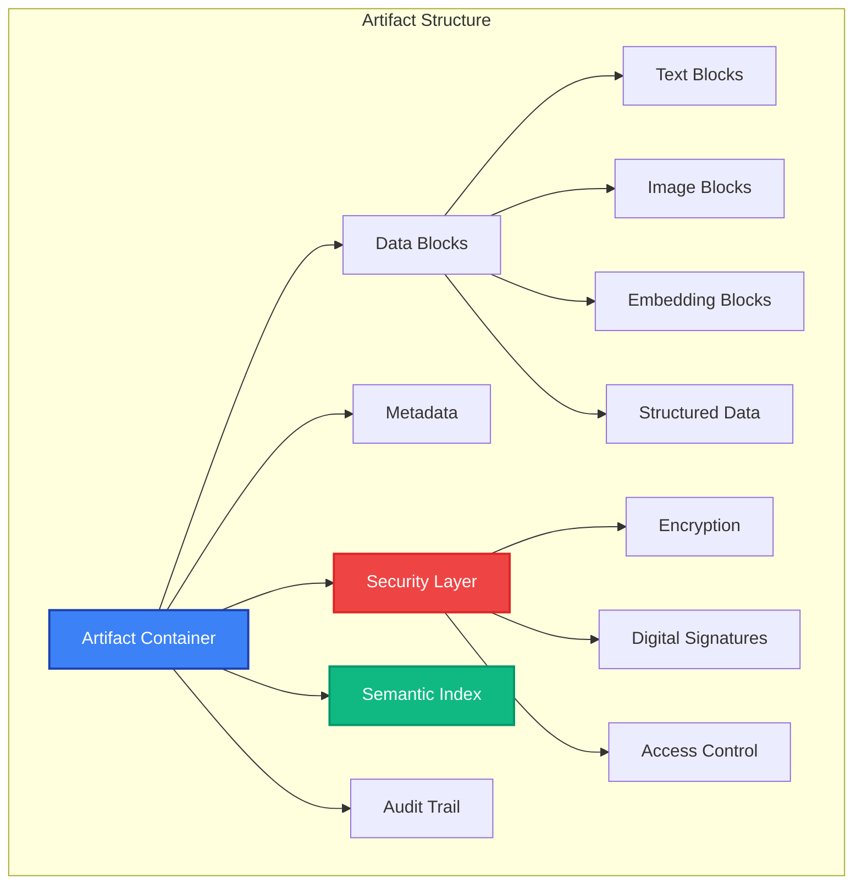
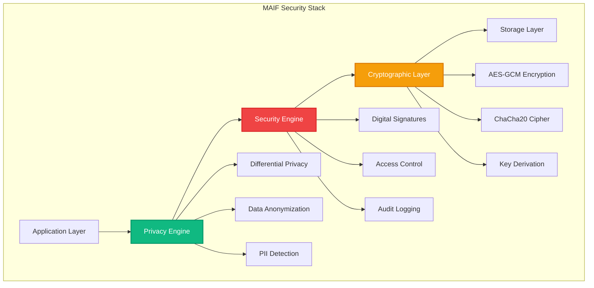
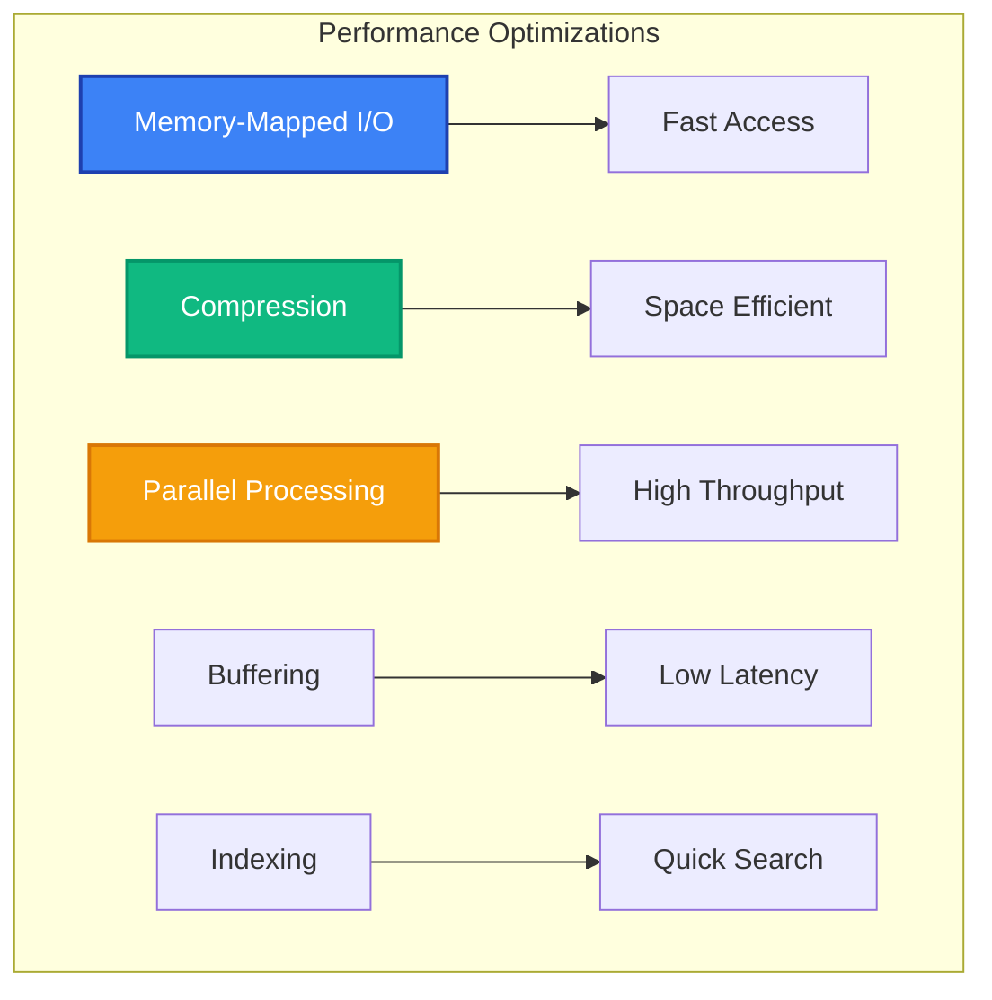
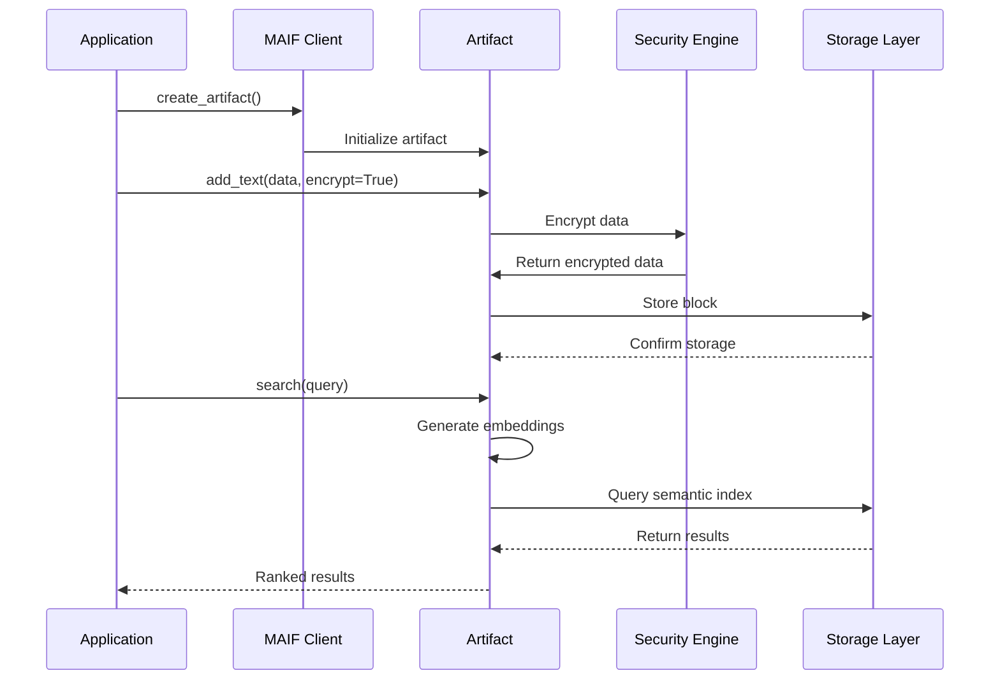

# Core Concepts

Understanding MAIF's fundamental concepts is key to building powerful, trustworthy AI agents. This guide covers the core architecture, paradigms, and principles that make MAIF unique.

## The Artifact-Centric Paradigm

Traditional AI systems operate on ephemeral data that disappears after processing. MAIF introduces a revolutionary **artifact-centric paradigm** where all AI operations center around persistent, verifiable data artifacts.



### What is an Artifact?

An **Artifact** is MAIF's core data structure - a container that holds all the essential components of intelligent, trustworthy data. This code snippet shows how to create an artifact and add various types of data to it.

```python
from maif_sdk import create_artifact

# Create a new artifact, associating it with an existing client.
# The client manages the connection and configuration.
artifact = create_artifact("my-data", client)

# Add different types of data blocks to the artifact.
text_id = artifact.add_text("Hello, world!")
image_id = artifact.add_image(image_data)
data_id = artifact.add_structured_data({"key": "value"})

# When you add data, MAIF automatically handles several critical operations:
# - Encryption: Data is encrypted based on the artifact's or block's security policy.
# - Timestamping: Every block is timestamped to maintain a verifiable history.
# - Semantic Indexing: Embeddings are generated and indexed for semantic search.
# - Auditing: An immutable record of the operation is added to the audit trail.
```

## Core Components

### 1. MAIF Client

The **MAIFClient** is your main entry point for interacting with the MAIF framework. This example shows how to create a client with some common performance and security configurations.

```python
from maif_sdk import create_client

# Create a client instance with a unique agent ID.
client = create_client(
    agent_id="my-agent",
    enable_mmap=True,        # Use memory-mapped I/O for high-performance file access.
    enable_compression=True,  # Automatically compress data blocks to reduce storage size.
    security_level="CONFIDENTIAL" # Set a default security level for all operations.
)
```

**Key Features:**
- **Memory-mapped I/O** for high performance
- **Connection pooling** for efficiency
- **Automatic compression** to save space
- **Security configurations** applied by default

### 2. Artifacts

**Artifacts** are the fundamental data containers in MAIF. They provide a unified interface for all data types while maintaining security, provenance, and semantic understanding.



### 3. Block System

MAIF uses a **block-based architecture**, where each piece of data is stored as a strongly-typed block. This allows MAIF to apply specific optimizations, security controls, and semantic processing based on the data type.

```python
# Each method for adding data creates a specific block type with relevant options.
# This creates a TextBlock and applies AES-GCM encryption.
artifact.add_text("Hello", encrypt=True)

# This creates an ImageBlock and stores the image format in its metadata.
artifact.add_image(img_data, format="png")

# This creates an EmbeddingBlock and records the model used to generate the embedding.
artifact.add_embedding(vector, model="bert")
```

## Security & Privacy Architecture

MAIF implements **security-by-design** and **privacy-by-design** principles at every layer.

### Security Layers



### Privacy Features

1. **Encryption**: AES-GCM and ChaCha20 for data at rest and in transit
2. **Anonymization**: Automatic PII detection and replacement
3. **Differential Privacy**: Mathematical privacy guarantees
4. **Zero-Knowledge Proofs**: Verify without revealing data

This example demonstrates how to apply multiple privacy features to a single piece of data.

```python
# Add a text block and apply several privacy-enhancing features at once.
artifact.add_text(
    "Customer John Smith called about his account",
    encrypt=True,           # 1. Encrypt the data at rest.
    anonymize=True,         # 2. Automatically detect and redact PII (e.g., "John Smith").
    differential_privacy=True  # 3. Add statistical noise to prevent re-identification.
)
```

## Semantic Understanding

MAIF provides **native semantic understanding** through advanced AI algorithms and embedding systems.

### Semantic Architecture

```mermaid
graph LR
    subgraph "Semantic Processing Pipeline"
        I[Input Data] --> E[Embedding Generation]
        E --> A[ACAM Processing]
        A --> C[Compression (HSC)]
        C --> S[Semantic Index]
        S --> Q[Query Processing]
    end
    
    subgraph "Novel Algorithms"
        ACAM[Adaptive Cross-Modal Attention]
        HSC[Hierarchical Semantic Compression]
        CSB[Cryptographic Semantic Binding]
    end
    
    A --> ACAM
    C --> HSC
    S --> CSB
    
    style ACAM fill:#10b981,stroke:#059669,stroke-width:2px,color:#fff
    style HSC fill:#10b981,stroke:#059669,stroke-width:2px,color:#fff
    style CSB fill:#10b981,stroke:#059669,stroke-width:2px,color:#fff
```

### Key Semantic Features

1. **Automatic Embeddings**: Generate embeddings for all data types
2. **Cross-Modal Understanding**: Connect text, images, and audio
3. **Semantic Search**: Find relevant content by meaning
4. **Relationship Discovery**: Identify connections between data

This code shows how semantic search works across different data modalities.

```python
# Add both text and image data to the same artifact.
artifact.add_text("The cat sat on the mat")
artifact.add_image(cat_image)

# Perform a semantic search using a query that is conceptually related to the stored data.
# MAIF's cross-modal understanding allows it to find both the text and the image.
results = artifact.search("feline animal", top_k=5)

# The search results will contain references to both the text and image blocks.
```

## Novel AI Algorithms

MAIF implements three cutting-edge algorithms that push the boundaries of AI capabilities:

### 1. ACAM (Adaptive Cross-Modal Attention)

Dynamically adjusts attention weights across different data modalities (text, image, audio) based on context and relevance. This example shows how to use the ACAM module to compute attention weights for a set of multi-modal embeddings.

```python
from maif.semantic_optimized import AdaptiveCrossModalAttention

# Initialize the ACAM module with the embedding dimension of your models.
acam = AdaptiveCrossModalAttention(embedding_dim=384)

# Compute attention weights for a set of embeddings from different modalities.
# The weights indicate the relative importance of each modality for the given data.
attention_weights = acam.compute_attention_weights({
    'text': text_embeddings,
    'image': image_embeddings,
    'audio': audio_embeddings
})
```

**Benefits:**
- Better multi-modal understanding
- Context-aware processing
- Improved accuracy in complex scenarios

### 2. HSC (Hierarchical Semantic Compression)

Three-tier compression algorithm that reduces storage while preserving semantic meaning.

```python
from maif.semantic_optimized import HierarchicalSemanticCompression

hsc = HierarchicalSemanticCompression(target_compression_ratio=0.4)
compressed = hsc.compress_embeddings(embeddings)  # 60% size, 95% fidelity
```

**Benefits:**
- 60% storage reduction
- 95% semantic fidelity maintained
- Faster search and retrieval

### 3. CSB (Cryptographic Semantic Binding)

Links semantic embeddings to their source data using cryptographic commitments, ensuring data integrity and preventing manipulation.

```python
from maif.semantic_optimized import CryptographicSemanticBinding

csb = CryptographicSemanticBinding()
binding = csb.create_semantic_commitment(embedding, source_data)
verified = csb.verify_semantic_binding(embedding, source_data, binding)
```

**Benefits:**
- Tamper-proof embeddings
- Verifiable AI processing
- Trust in semantic operations

## Performance Architecture

MAIF is designed for high-performance operations at scale.

### Performance Features



### Benchmark Performance

| Operation | MAIF Performance | Industry Standard |
|-----------|------------------|-------------------|
| **Streaming Write** | 400+ MB/s | ~100 MB/s |
| **Semantic Search** | <50ms (1M vectors) | 200-500ms |
| **Compression Ratio** | 60% with 95% fidelity | 30-40% |
| **Memory Efficiency** | Zero-copy operations | Multiple copies |

## Data Flow

Understanding how data flows through MAIF helps you build more efficient applications:



## Best Practices

### 1. Artifact Organization

```python
# Good: Organize by purpose
user_memory = create_artifact("user-conversations", client)
system_memory = create_artifact("system-knowledge", client)
temp_memory = create_artifact("session-data", client)

# Avoid: Single large artifact for everything
```

### 2. Security Configuration

```python
# Configure security at client level
client = create_client(
    "secure-agent",
    default_security_level=SecurityLevel.CONFIDENTIAL,
    enable_signing=True,
    enable_audit_trail=True
)
```

### 3. Performance Optimization

```python
# Enable performance features
client = create_client(
    "fast-agent",
    enable_mmap=True,           # Memory-mapped I/O
    buffer_size=128*1024,       # Large write buffer
    max_concurrent_writers=8,   # Parallel operations
    enable_compression=True     # Automatic compression
)
```

## Next Steps

Now that you understand MAIF's core concepts:

1. **[Architecture →](/guide/architecture)** - Deep dive into system architecture
2. **[Security Model →](/guide/security-model)** - Understand security implementation
3. **[API Reference →](/api/)** - Explore the complete API
4. **[Examples →](/examples/)** - See real-world implementations

## Key Takeaways

- **Artifacts** are persistent, verifiable data containers
- **Security and privacy** are built-in, not add-ons
- **Semantic understanding** is native and automatic
- **Performance** is optimized at every layer
- **Novel algorithms** provide cutting-edge capabilities
- **Trust and provenance** are maintained throughout the data lifecycle 