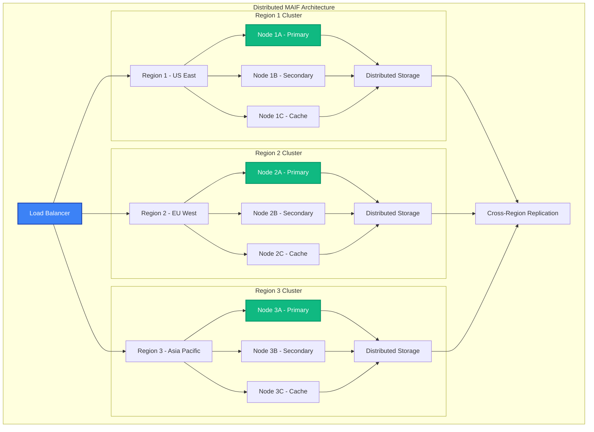

# Distributed Deployment

MAIF provides enterprise-grade distributed deployment capabilities for scaling across multiple nodes, regions, and cloud providers. This guide covers cluster management, load balancing, and fault tolerance for production deployments.

## Overview

MAIF's distributed deployment features:

- **Multi-Node Clustering**: Scale across multiple machines
- **Cross-Region Replication**: Global data distribution
- **Auto-Scaling**: Dynamic resource allocation
- **Load Balancing**: Intelligent request distribution
- **Fault Tolerance**: High availability and disaster recovery



## Cluster Setup

### 1. Basic Cluster Configuration

Set up a multi-node MAIF cluster. The following Python code demonstrates how to define a cluster configuration and use the `ClusterManager` to initialize, monitor, and verify the health of a distributed MAIF cluster.

```python
from maif_sdk import ClusterManager, NodeConfig
import asyncio

# Define the configuration for a three-node cluster with different roles.
cluster_config = {
    "cluster_name": "production-cluster",
    "nodes": [
        {
            "id": "node-1",
            "host": "10.0.1.10",
            "port": 8080,
            "role": "primary",  # Handles write operations and coordination.
            "resources": {"cpu": 8, "memory": "32GB", "storage": "1TB"}
        },
        {
            "id": "node-2", 
            "host": "10.0.1.11",
            "port": 8080,
            "role": "secondary", # Serves as a replica for high availability.
            "resources": {"cpu": 8, "memory": "32GB", "storage": "1TB"}
        },
        {
            "id": "node-3",
            "host": "10.0.1.12", 
            "port": 8080,
            "role": "cache", # Provides low-latency read access.
            "resources": {"cpu": 4, "memory": "64GB", "storage": "500GB"}
        }
    ],
    "replication_factor": 3, # Ensures data is replicated across 3 nodes.
    "consistency_level": "quorum" # Requires a majority of nodes to acknowledge a write.
}

# Initialize the cluster manager with the defined configuration.
cluster_manager = ClusterManager(cluster_config)

async def setup_cluster():
    # Start the cluster and all its nodes.
    await cluster_manager.start_cluster()
    
    # Wait for all nodes to join and the cluster to become operational.
    await cluster_manager.wait_for_cluster_ready(timeout="300s")
    
    # Perform a health check to verify the cluster's status.
    health_status = await cluster_manager.check_cluster_health()
    print(f"Cluster status: {health_status.status}")
    print(f"Active nodes: {health_status.active_nodes}")
    print(f"Replication status: {health_status.replication_status}")

# Run the asynchronous setup function.
asyncio.run(setup_cluster())
```

### 2. Kubernetes Deployment

Deploy MAIF on Kubernetes using a `StatefulSet` for stable, persistent storage and network identifiers. The following YAML configuration defines the necessary `ConfigMap`, `StatefulSet`, and `VolumeClaimTemplates`.

```yaml
# maif-cluster.yaml
apiVersion: v1
kind: ConfigMap
metadata:
  name: maif-config
data:
  # cluster.yaml provides configuration for the MAIF cluster.
  cluster.yaml: |
    cluster:
      name: "k8s-maif-cluster"
      replication_factor: 3
      consistency_level: "quorum"
    storage:
      type: "distributed"
      backend: "persistent-volume"
      size: "1Ti"
    networking:
      service_type: "ClusterIP"
      port: 8080
---
apiVersion: apps/v1
kind: StatefulSet
metadata:
  name: maif-cluster
spec:
  serviceName: maif-headless # Headless service for direct pod communication.
  replicas: 3 # Creates a 3-node cluster.
  selector:
    matchLabels:
      app: maif
  template:
    metadata:
      labels:
        app: maif
    spec:
      containers:
      - name: maif
        image: maif/maif-enterprise:latest
        ports:
        - containerPort: 8080
        env:
        # Each pod gets a unique ID from its metadata name.
        - name: MAIF_NODE_ID
          valueFrom:
            fieldRef:
              fieldPath: metadata.name
        # Mount the configuration from the ConfigMap.
        - name: MAIF_CLUSTER_CONFIG
          value: "/config/cluster.yaml"
        volumeMounts:
        - name: config
          mountPath: /config
        - name: data
          mountPath: /data # Mount for persistent data.
        resources:
          requests:
            cpu: 2
            memory: 8Gi
          limits:
            cpu: 8
            memory: 32Gi
      volumes:
      - name: config
        configMap:
          name: maif-config
  # Persistent storage for each pod.
  volumeClaimTemplates:
  - metadata:
      name: data
    spec:
      accessModes: ["ReadWriteOnce"]
      resources:
        requests:
          storage: 1Ti
```

You can then use the `KubernetesDeployer` to apply this configuration and manage the deployment.

```python
# Deploy to Kubernetes
from kubernetes import client, config
from maif_sdk import KubernetesDeployer
import asyncio

# Load Kubernetes configuration from within a cluster or from a local kubeconfig file.
try:
    config.load_incluster_config()
except config.ConfigException:
    config.load_kube_config()

# Initialize the MAIF Kubernetes deployer.
k8s_deployer = KubernetesDeployer()

async def deploy_to_kubernetes():
    # Deploy the cluster using the YAML file.
    deployment_result = await k8s_deployer.deploy_from_yaml("maif-cluster.yaml")
    
    # Wait for the StatefulSet to become ready.
    await k8s_deployer.wait_for_ready(
        namespace="default",
        statefulset="maif-cluster",
        timeout="600s"
    )
    
    # Retrieve the network endpoints for the cluster services.
    endpoints = await k8s_deployer.get_cluster_endpoints("maif-cluster")
    
    print("MAIF cluster deployed successfully")
    print(f"Endpoints: {endpoints}")

# Run the asynchronous deployment function.
asyncio.run(deploy_to_kubernetes())
```

### 3. Docker Swarm Deployment

Deploy MAIF on Docker Swarm using a `docker-compose.yml` file. This configuration sets up a 3-node MAIF cluster as a stack, with constraints to ensure proper node placement.

```yaml
# docker-compose.yml
version: '3.8'

services:
  maif-manager:
    image: maif/maif-enterprise:latest
    command: maif --role manager --join-token-file /data/join-token
    ports:
      - "8080:8080"
    volumes:
      - maif-data:/data
    environment:
      - MAIF_CLUSTER_NAME=swarm-cluster
      - MAIF_REPLICATION_FACTOR=3
    deploy:
      replicas: 1
      placement:
        constraints:
          - node.role == manager # Place the manager on a swarm manager node.
  
  maif-worker:
    image: maif/maif-enterprise:latest
    command: maif --role worker --join-token $$(cat /data/join-token)
    volumes:
      - maif-data:/data
    depends_on:
      - maif-manager
    deploy:
      replicas: 2 # Create two worker nodes.
      placement:
        constraints:
          - node.role == worker # Place workers on swarm worker nodes.

volumes:
  maif-data: # Shared volume for cluster state and data.
```

To deploy this stack to your Docker Swarm cluster, you would run the following command:

```bash
docker stack deploy -c docker-compose.yml maif_stack
```

## Load Balancing

### 1. Intelligent Load Balancing

Configure smart load balancing strategies:

```python
from maif_sdk import LoadBalancer, BalancingStrategy

# Configure load balancer
load_balancer = LoadBalancer(
    strategy=BalancingStrategy.ADAPTIVE,
    health_check_interval="30s",
    failure_threshold=3,
    recovery_threshold=2
)

async def configure_load_balancing():
    # Register cluster nodes
    nodes = [
        {"id": "node-1", "endpoint": "http://10.0.1.10:8080", "weight": 1.0},
        {"id": "node-2", "endpoint": "http://10.0.1.11:8080", "weight": 1.0},
        {"id": "node-3", "endpoint": "http://10.0.1.12:8080", "weight": 0.5}  # Cache node
    ]
    
    for node in nodes:
        await load_balancer.register_node(node)
    
    # Configure adaptive strategy
    await load_balancer.configure_strategy("adaptive", {
        "primary": "latency_aware",
        "fallback": "least_connections",
        "switch_threshold": "100ms"
    })
    
    # Start load balancer
    await load_balancer.start()
    
    print("Load balancer configured and started")

await configure_load_balancing()
```

### 2. Geographic Load Balancing

Route requests based on geographic location:

```python
from maif_sdk import GeographicLoadBalancer

# Geographic load balancer
geo_balancer = GeographicLoadBalancer(
    geo_routing=True,
    latency_optimization=True
)

# Define regional clusters
regions = {
    "us-east-1": {
        "nodes": ["node-us-1", "node-us-2", "node-us-3"],
        "location": {"lat": 39.0458, "lon": -76.6413},
        "capacity": 1000
    },
    "eu-west-1": {
        "nodes": ["node-eu-1", "node-eu-2", "node-eu-3"],
        "location": {"lat": 53.4084, "lon": -2.9916},
        "capacity": 800
    },
    "ap-southeast-1": {
        "nodes": ["node-ap-1", "node-ap-2", "node-ap-3"],
        "location": {"lat": 1.3521, "lon": 103.8198},
        "capacity": 600
    }
}

async def setup_geographic_balancing():
    # Register regions
    for region_id, region_config in regions.items():
        await geo_balancer.register_region(region_id, region_config)
    
    # Configure routing policies
    await geo_balancer.configure_routing({
        "primary": "closest_region",
        "fallback": "least_loaded_region",
        "data_locality": True,
        "compliance_aware": True  # GDPR, data residency
    })
    
    # Start geographic balancer
    await geo_balancer.start()

await setup_geographic_balancing()
```

## Auto-Scaling

### 1. Horizontal Auto-Scaling

Automatically scale cluster size based on load:

```python
from maif_sdk import AutoScaler, ScalingPolicy

# Configure auto-scaler
auto_scaler = AutoScaler(
    min_nodes=3,
    max_nodes=20,
    target_cpu_utilization=70,
    target_memory_utilization=80,
    scale_up_cooldown="300s",
    scale_down_cooldown="600s"
)

async def setup_auto_scaling():
    # Define scaling policies
    scaling_policies = [
        ScalingPolicy(
            name="cpu_scaling",
            metric="cpu_utilization",
            threshold=80,
            action="scale_up",
            adjustment=2  # Add 2 nodes
        ),
        ScalingPolicy(
            name="memory_scaling", 
            metric="memory_utilization",
            threshold=85,
            action="scale_up",
            adjustment=1
        ),
        ScalingPolicy(
            name="low_usage_scaling",
            metric="cpu_utilization",
            threshold=30,
            action="scale_down",
            adjustment=-1,
            duration="600s"  # Sustained low usage
        )
    ]
    
    # Register scaling policies
    for policy in scaling_policies:
        await auto_scaler.add_policy(policy)
    
    # Start auto-scaler
    await auto_scaler.start()
    
    print("Auto-scaling configured and enabled")

await setup_auto_scaling()
```

### 2. Vertical Auto-Scaling

Automatically adjust resource allocation:

```python
from maif_sdk import VerticalAutoScaler

# Vertical auto-scaler for resource optimization
vertical_scaler = VerticalAutoScaler(
    resource_optimization=True,
    recommendation_engine=True
)

async def setup_vertical_scaling():
    # Configure resource scaling policies
    await vertical_scaler.configure({
        "cpu": {
            "min": "1",
            "max": "16",
            "target_utilization": 70,
            "scaling_factor": 1.5
        },
        "memory": {
            "min": "4Gi",
            "max": "64Gi", 
            "target_utilization": 80,
            "scaling_factor": 1.3
        },
        "storage": {
            "min": "100Gi",
            "max": "10Ti",
            "growth_threshold": 85,
            "scaling_factor": 2.0
        }
    })
    
    # Enable automatic resource adjustment
    await vertical_scaler.enable_auto_adjustment(
        adjustment_interval="300s",
        safety_margin=0.2
    )
    
    # Start vertical scaler
    await vertical_scaler.start()

await setup_vertical_scaling()
```

## Fault Tolerance

### 1. High Availability Configuration

Configure for maximum uptime:

```python
from maif_sdk import HighAvailabilityManager

# HA configuration
ha_manager = HighAvailabilityManager(
    replication_factor=3,
    quorum_size=2,
    failure_detection_timeout="30s",
    automatic_failover=True
)

async def setup_high_availability():
    # Configure replication
    await ha_manager.configure_replication({
        "mode": "synchronous",
        "consistency": "strong",
        "backup_frequency": "1h",
        "retention_period": "30d"
    })
    
    # Set up failure detection
    await ha_manager.configure_failure_detection({
        "heartbeat_interval": "10s",
        "failure_threshold": 3,
        "network_partition_detection": True
    })
    
    # Configure automatic recovery
    await ha_manager.configure_recovery({
        "auto_restart": True,
        "data_recovery": True,
        "split_brain_protection": True
    })
    
    # Start HA manager
    await ha_manager.start()
    
    print("High availability configured")

await setup_high_availability()
```

### 2. Disaster Recovery

Implement comprehensive disaster recovery:

```python
from maif_sdk import DisasterRecoveryManager

# Disaster recovery configuration
dr_manager = DisasterRecoveryManager(
    backup_strategy="incremental",
    cross_region_replication=True,
    rto_target="15m",  # Recovery Time Objective
    rpo_target="5m"    # Recovery Point Objective
)

async def setup_disaster_recovery():
    # Configure backup locations
    backup_locations = [
        {
            "type": "s3",
            "bucket": "maif-backups-primary",
            "region": "us-east-1",
            "encryption": True
        },
        {
            "type": "s3", 
            "bucket": "maif-backups-secondary",
            "region": "eu-west-1",
            "encryption": True
        },
        {
            "type": "gcs",
            "bucket": "maif-backups-tertiary",
            "region": "asia-southeast1",
            "encryption": True
        }
    ]
    
    for location in backup_locations:
        await dr_manager.add_backup_location(location)
    
    # Configure backup schedule
    await dr_manager.configure_backup_schedule({
        "full_backup": "daily",
        "incremental_backup": "hourly",
        "transaction_log_backup": "5m"
    })
    
    # Set up cross-region replication
    await dr_manager.configure_replication({
        "primary_region": "us-east-1",
        "secondary_regions": ["eu-west-1", "ap-southeast-1"],
        "replication_lag_threshold": "30s"
    })
    
    # Enable automated recovery procedures
    await dr_manager.configure_recovery_procedures({
        "automated_failover": True,
        "data_validation": True,
        "rollback_capability": True
    })
    
    # Start disaster recovery
    await dr_manager.start()

await setup_disaster_recovery()
```

## Multi-Cloud Deployment

### 1. Cloud-Agnostic Deployment

Deploy across multiple cloud providers:

```python
from maif_sdk import MultiCloudDeployer

# Multi-cloud deployment configuration
multi_cloud = MultiCloudDeployer()

# Define cloud configurations
cloud_configs = {
    "aws": {
        "region": "us-east-1",
        "instance_type": "c5.4xlarge",
        "storage_type": "gp3",
        "networking": "vpc-12345"
    },
    "gcp": {
        "region": "us-central1",
        "machine_type": "c2-standard-16", 
        "storage_type": "pd-ssd",
        "networking": "vpc-network"
    },
    "azure": {
        "region": "East US",
        "vm_size": "Standard_D16s_v3",
        "storage_type": "Premium_LRS",
        "networking": "vnet-prod"
    }
}

async def deploy_multi_cloud():
    # Deploy to multiple clouds
    deployments = {}
    
    for cloud, config in cloud_configs.items():
        deployment = await multi_cloud.deploy_to_cloud(
            cloud_provider=cloud,
            config=config,
            cluster_size=3
        )
        deployments[cloud] = deployment
    
    # Configure cross-cloud networking
    await multi_cloud.setup_cross_cloud_networking(deployments)
    
    # Enable data synchronization
    await multi_cloud.enable_data_sync({
        "strategy": "eventual_consistency",
        "conflict_resolution": "last_write_wins",
        "sync_interval": "30s"
    })
    
    print("Multi-cloud deployment completed")

await deploy_multi_cloud()
```

### 2. Hybrid Cloud Integration

Integrate on-premises and cloud deployments:

```python
from maif_sdk import HybridCloudManager

# Hybrid cloud configuration
hybrid_manager = HybridCloudManager()

async def setup_hybrid_deployment():
    # Register on-premises cluster
    on_prem_cluster = {
        "location": "on_premises",
        "nodes": ["10.0.1.10", "10.0.1.11", "10.0.1.12"],
        "capacity": {"cpu": 96, "memory": "384GB", "storage": "10TB"},
        "network": "private"
    }
    
    await hybrid_manager.register_cluster("on-prem", on_prem_cluster)
    
    # Register cloud clusters
    cloud_clusters = {
        "aws-primary": {
            "location": "aws_us_east_1",
            "endpoint": "https://maif-aws.example.com",
            "capacity": {"cpu": 64, "memory": "256GB", "storage": "5TB"},
            "network": "public"
        },
        "gcp-secondary": {
            "location": "gcp_us_central1",
            "endpoint": "https://maif-gcp.example.com", 
            "capacity": {"cpu": 48, "memory": "192GB", "storage": "3TB"},
            "network": "public"
        }
    }
    
    for cluster_id, config in cloud_clusters.items():
        await hybrid_manager.register_cluster(cluster_id, config)
    
    # Configure data placement policies
    await hybrid_manager.configure_data_placement({
        "sensitive_data": "on_premises",
        "public_data": "cloud",
        "cached_data": "nearest_cluster",
        "compliance_data": "specific_region"
    })
    
    # Set up secure connectivity
    await hybrid_manager.setup_secure_connectivity({
        "vpn_tunnels": True,
        "encryption": "AES-256",
        "authentication": "mutual_tls"
    })
    
    print("Hybrid cloud setup completed")

await setup_hybrid_deployment()
```

## Monitoring and Observability

### 1. Cluster Monitoring

Monitor distributed cluster health:

```python
from maif_sdk import ClusterMonitor

# Cluster monitoring setup
cluster_monitor = ClusterMonitor(
    monitoring_interval="30s",
    metrics_retention="30d",
    alerting_enabled=True
)

async def setup_cluster_monitoring():
    # Configure monitoring metrics
    metrics_config = {
        "node_metrics": [
            "cpu_utilization",
            "memory_utilization", 
            "disk_usage",
            "network_io",
            "request_rate",
            "response_time"
        ],
        "cluster_metrics": [
            "cluster_health",
            "replication_lag",
            "consensus_state",
            "data_distribution",
            "failover_status"
        ]
    }
    
    await cluster_monitor.configure_metrics(metrics_config)
    
    # Set up alerting rules
    alert_rules = [
        {
            "name": "high_cpu_usage",
            "condition": "cpu_utilization > 90",
            "duration": "5m",
            "severity": "warning"
        },
        {
            "name": "node_down",
            "condition": "node_status == 'down'",
            "duration": "1m",
            "severity": "critical"
        }
    ]
    
    for rule in alert_rules:
        await cluster_monitor.add_alert_rule(rule)
    
    # Start monitoring
    await cluster_monitor.start()

await setup_cluster_monitoring()
```

## Best Practices

### 1. Production Deployment Checklist

Essential practices for production deployments:

```python
async def production_deployment_checklist():
    checklist = {
        "security": [
            "Enable TLS/SSL encryption",
            "Configure authentication and authorization",
            "Set up network security groups",
            "Enable audit logging"
        ],
        "reliability": [
            "Set up monitoring and alerting",
            "Configure automated backups",
            "Test disaster recovery procedures",
            "Implement health checks",
            "Set up load balancing"
        ],
        "performance": [
            "Configure auto-scaling",
            "Optimize resource allocation",
            "Set up caching layers",
            "Configure connection pooling"
        ]
    }
    
    # Validate deployment against checklist
    for category, items in checklist.items():
        print(f"\n{category.upper()} CHECKLIST:")
        for item in items:
            print(f"  ✓ {item}")

await production_deployment_checklist()
```

## Troubleshooting

### Common Distributed Deployment Issues

1. **Network Partitions**
   ```python
   # Handle network partition scenarios
   partition_detector = NetworkPartitionDetector()
   
   @partition_detector.on_partition_detected
   async def handle_partition(partition_info):
       if partition_info.minority_side:
           # Enter read-only mode
           await cluster_manager.enter_read_only_mode()
       else:
           # Continue normal operations
           await cluster_manager.continue_operations()
   ```

2. **Split-Brain Scenarios**
   ```python
   # Prevent split-brain with quorum
   quorum_manager = QuorumManager(
       required_nodes=2,  # Majority of 3 nodes
       split_brain_protection=True
   )
   
   await quorum_manager.start()
   ```

## Next Steps

- Explore [Monitoring & Observability](monitoring.md) for comprehensive monitoring
- Learn about [Performance Optimization](performance.md) for distributed performance tuning
- Check out [ACID Transactions](acid.md) for distributed transaction management
- See [Examples](../examples/) for complete distributed deployment examples 