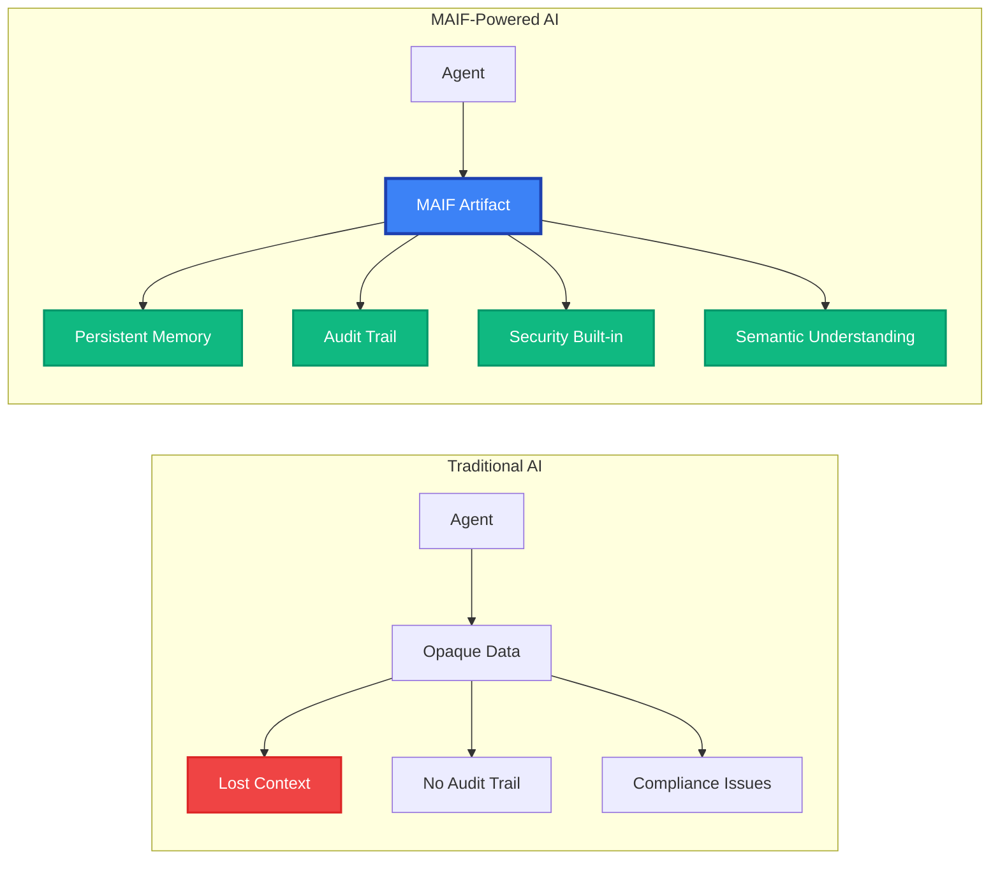

# Getting Started with MAIF

Welcome to MAIF - the Multi-Agent Intelligence Framework that revolutionizes how AI agents handle memory, privacy, and trust. In just 5 minutes, you'll have your first AI agent running with enterprise-grade security and semantic understanding.

## What is MAIF?

MAIF transforms AI from operating on ephemeral, opaque data to using **persistent, verifiable artifacts** that embed trust, privacy, and semantic understanding directly into the data structure.

### Traditional AI vs MAIF-Powered AI



## Quick Installation

Choose your installation method based on your needs:

::: code-group

```bash [Basic Installation]
# Core MAIF functionality
pip install maif
```

```bash [Full Installation (Recommended)]
# All features including novel algorithms, privacy, and performance optimizations
pip install maif[full]
```

```bash [Development Installation]
# For contributors and advanced users
git clone https://github.com/maif-ai/maif.git
cd maif
pip install -e .[dev,full]
```

:::

### System Requirements

- **Python**: 3.8+ (3.11+ recommended for best performance)
- **Memory**: 4GB+ RAM (8GB+ for large-scale operations)
- **Storage**: 1GB+ free space for optimal performance
- **OS**: Linux, macOS, Windows (Linux recommended for production)

## 5-Minute Tutorial: Your First Agent

Let's build a privacy-aware AI agent that can remember conversations, understand semantic relationships, and maintain complete audit trails.

### Step 1: Basic Agent Setup

```python
from maif_sdk import create_client, create_artifact
from maif import PrivacyLevel, SecurityLevel

# Create a high-performance MAIF client
client = create_client(
    agent_id="my-first-agent",
    enable_mmap=True,        # Memory-mapped I/O for performance
    enable_compression=True   # Automatic compression
)

# Create an artifact (agent's persistent memory)
memory = create_artifact(
    name="agent-memory", 
    client=client,
    security_level=SecurityLevel.CONFIDENTIAL
)

print("✅ Agent memory initialized!")
```

### Step 2: Add Encrypted Content

```python
# Add text with automatic encryption and semantic embedding
conversation_id = memory.add_text(
    "User asked about quarterly sales data. Need to analyze revenue trends.",
    title="Sales Query",
    encrypt=True,                    # Automatic AES-GCM encryption
    privacy_level=PrivacyLevel.CONFIDENTIAL,
    metadata={
        "topic": "sales_analysis",
        "timestamp": "2024-01-15T10:30:00Z",
        "user_id": "user_123"
    }
)

# Add structured data with semantic understanding
analysis_id = memory.add_multimodal({
    "query": "quarterly sales analysis",
    "data_sources": ["crm_db", "sales_reports"],
    "analysis_type": "trend_analysis",
    "confidence": 0.87
}, title="Analysis Request")

print(f"✅ Added encrypted conversation: {conversation_id}")
print(f"✅ Added semantic analysis: {analysis_id}")
```

### Step 3: Semantic Search & Retrieval

```python
# Save the artifact with cryptographic signatures
signature = memory.save("agent-memory.maif", sign=True)
print(f"✅ Memory saved with signature: {signature[:16]}...")

# Reload and perform semantic search
from maif_sdk import load_artifact

loaded_memory = load_artifact("agent-memory.maif")

# Search for related content using semantic understanding
results = loaded_memory.search(
    query="sales data analysis revenue",
    top_k=5,
    include_metadata=True
)

for result in results:
    print(f"Found: {result['title']} (similarity: {result['score']:.3f})")
```

### Step 4: Privacy & Audit Verification

```python
# Verify integrity and audit trail
integrity_report = loaded_memory.verify_integrity()
privacy_report = loaded_memory.get_privacy_report()
audit_trail = loaded_memory.get_audit_trail()

print(f"🔒 Integrity verified: {integrity_report['valid']}")
print(f"🛡️  Privacy level: {privacy_report['encryption_status']}")
print(f"📋 Audit entries: {len(audit_trail)} operations recorded")

# Check what data is encrypted
for entry in audit_trail:
    print(f"  - {entry['timestamp']}: {entry['operation']} by {entry['agent_id']}")
```

::: tip Success!
🎉 **Congratulations!** You've just created your first MAIF-powered AI agent with:

- **Persistent Memory**: Data survives across sessions
- **Privacy-by-Design**: Automatic encryption and anonymization  
- **Semantic Understanding**: AI-native search and relationships
- **Complete Audit Trail**: Every operation is cryptographically recorded
- **Enterprise Security**: Digital signatures and tamper detection
:::

## Real-World Example: Chat Agent with Memory

Now let's build a more realistic chat agent that remembers conversations and learns from interactions:

```python
from maif_sdk import create_client, create_artifact
from maif import PrivacyPolicy, EncryptionMode
import datetime

class PrivacyAwareChatAgent:
    def __init__(self, agent_id: str):
        self.client = create_client(agent_id)
        self.memory = create_artifact(f"{agent_id}-memory", self.client)
        
        # Set up privacy policy
        self.privacy_policy = PrivacyPolicy(
            privacy_level=PrivacyLevel.CONFIDENTIAL,
            encryption_mode=EncryptionMode.AES_GCM,
            anonymization_required=True,
            audit_required=True
        )
    
    def chat(self, user_message: str, user_id: str = None) -> str:
        # Store user message with privacy protection
        msg_id = self.memory.add_text(
            user_message,
            title="User Message",
            privacy_policy=self.privacy_policy,
            metadata={
                "user_id": user_id,
                "timestamp": datetime.datetime.now().isoformat(),
                "message_type": "user_input"
            }
        )
        
        # Search for relevant context from previous conversations
        context = self.memory.search(user_message, top_k=3)
        
        # Generate response (integrate with your LLM here)
        response = self._generate_response(user_message, context)
        
        # Store agent response
        response_id = self.memory.add_text(
            response,
            title="Agent Response", 
            privacy_policy=self.privacy_policy,
            metadata={
                "user_id": user_id,
                "timestamp": datetime.datetime.now().isoformat(),
                "message_type": "agent_response",
                "context_used": [c['id'] for c in context]
            }
        )
        
        # Periodic save with signature
        if self.memory.get_unsaved_count() > 10:
            self.memory.save(f"{self.client.agent_id}-memory.maif", sign=True)
        
        return response
    
    def _generate_response(self, message: str, context: list) -> str:
        # Placeholder for your LLM integration
        context_str = "\n".join([c['content'][:100] for c in context])
        return f"Based on our previous conversations about: {context_str}\n\nI understand you're asking about: {message}"
    
    def get_conversation_summary(self) -> dict:
        """Get privacy-compliant conversation analytics"""
        return {
            "total_messages": self.memory.count_blocks_by_type("text"),
            "privacy_status": self.memory.get_privacy_report(),
            "audit_entries": len(self.memory.get_audit_trail()),
            "semantic_clusters": self.memory.analyze_semantic_clusters()
        }

# Usage
agent = PrivacyAwareChatAgent("customer-support-bot")

# Simulate conversation
response1 = agent.chat("I'm having trouble with my account login", "user_123")
response2 = agent.chat("The password reset email isn't arriving", "user_123")
response3 = agent.chat("Thanks, that fixed it!", "user_123")

# Get insights while respecting privacy
summary = agent.get_conversation_summary()
print(f"💬 Handled {summary['total_messages']} messages with full privacy compliance")
```

## What You Just Built

In just a few minutes, you've created an AI agent with capabilities that typically take months to implement:

### 🔒 Enterprise Security
- **AES-GCM Encryption**: Military-grade encryption for sensitive data
- **Digital Signatures**: Cryptographic proof of data authenticity
- **Tamper Detection**: Immediate detection of unauthorized modifications
- **Access Control**: Granular permissions with audit trails

### 🧠 AI-Native Features
- **Semantic Search**: Find relevant information using meaning, not just keywords
- **Cross-Modal Understanding**: Connect text, images, and structured data
- **Automatic Embeddings**: AI-powered semantic representations
- **Knowledge Graphs**: Structured relationships between concepts

### 🛡️ Privacy-by-Design
- **Automatic Anonymization**: Remove PII from stored content
- **Differential Privacy**: Statistical privacy for analytics
- **Zero-Knowledge Proofs**: Verify without revealing sensitive data
- **GDPR/HIPAA Ready**: Built-in compliance features

### ⚡ High Performance
- **Memory-Mapped I/O**: Zero-copy operations for large data
- **Write Buffering**: Batch operations for optimal throughput
- **Compression**: 60% size reduction with semantic preservation
- **Streaming Processing**: Handle data larger than memory

## Next Steps

Now that you have a working MAIF agent, explore these advanced capabilities:

::: info Continue Your Journey

**🏗️ [Architecture Deep-Dive](/guide/architecture)** - Understand how MAIF works under the hood

**🔐 [Privacy & Security](/guide/privacy)** - Advanced privacy and security features

**🎯 [Real-World Examples](/examples/)** - Production-ready agent implementations

**📚 [API Reference](/api/)** - Complete API documentation

:::

## Quick Reference

### Essential Commands

```python
# Core operations
from maif_sdk import create_client, create_artifact, load_artifact

client = create_client("agent-id")
artifact = create_artifact("name", client)
artifact.add_text("content", encrypt=True)
artifact.save("file.maif", sign=True)

# Loading and searching
loaded = load_artifact("file.maif")
results = loaded.search("query", top_k=5)
verified = loaded.verify_integrity()
```

### Common Patterns

```python
# Privacy-enabled content
artifact.add_text(
    content, 
    privacy_level=PrivacyLevel.CONFIDENTIAL,
    anonymize=True,
    encrypt=True
)

# Multi-modal with semantic understanding
artifact.add_multimodal({
    "text": "description",
    "data": structured_data,
    "metadata": {"key": "value"}
})

# High-performance streaming
with client.stream_writer("output.maif") as writer:
    for batch in large_dataset:
        writer.write_batch(batch)
```

## Troubleshooting

<details>
<summary><strong>Installation Issues</strong></summary>

**Problem**: `pip install maif` fails with compilation errors

**Solution**: 
```bash
# Install system dependencies (Ubuntu/Debian)
sudo apt-get install build-essential python3-dev

# Install system dependencies (macOS)
brew install python@3.11

# Use pre-compiled wheels
pip install --only-binary=all maif[full]
```

</details>

<details>
<summary><strong>Performance Issues</strong></summary>

**Problem**: Slow semantic search or high memory usage

**Solution**:
```python
# Enable performance optimizations
client = create_client(
    "agent-id",
    enable_mmap=True,           # Memory-mapped I/O
    buffer_size=128*1024,       # Larger write buffer
    enable_compression=True,    # Automatic compression
    cache_embeddings=True       # Cache semantic embeddings
)
```

</details>

<details>
<summary><strong>Privacy/Security Issues</strong></summary>

**Problem**: Need to verify encryption is working

**Solution**:
```python
# Check privacy status
privacy_report = artifact.get_privacy_report()
print(f"Encryption: {privacy_report['encryption_enabled']}")
print(f"Anonymization: {privacy_report['anonymization_active']}")

# Verify signatures
integrity = artifact.verify_integrity()
print(f"Signatures valid: {integrity['signatures_valid']}")
```

</details>

## Community & Support

- **💬 [Discord Community](https://discord.gg/maif)** - Get help and share ideas
- **📝 [GitHub Issues](https://github.com/maif-ai/maif/issues)** - Report bugs and request features
- **📖 [Documentation](https://maif.ai/docs)** - Complete guides and references
- **🎓 [Examples Repository](https://github.com/maif-ai/examples)** - Production-ready examples

---

**Ready to build the future of trustworthy AI?** 

[Continue to Installation Guide →](/guide/installation) 