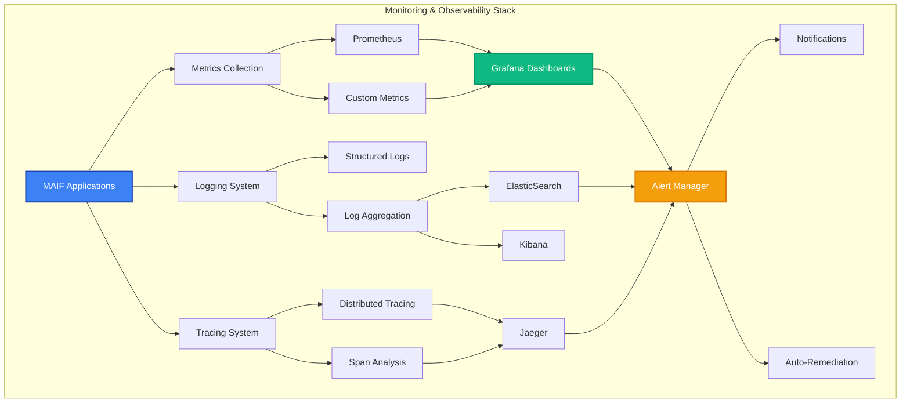

# Monitoring & Observability

MAIF provides comprehensive monitoring and observability capabilities for production deployments. This guide covers metrics collection, logging, alerting, and performance monitoring for enterprise-grade operations.

## Overview

MAIF's monitoring and observability features:

- **Real-time Metrics**: System, application, and business metrics
- **Distributed Tracing**: End-to-end request tracing
- **Centralized Logging**: Structured logging across all components
- **Intelligent Alerting**: Proactive issue detection and notification
- **Performance Analytics**: Deep insights into system performance



## Metrics Collection

### 1. System Metrics

Monitor system-level performance. The following code demonstrates how to configure a `MetricsCollector` and a `SystemMonitor` to track key infrastructure metrics like CPU, memory, disk, and network usage.

```python
from maif_sdk import MetricsCollector, SystemMonitor
import asyncio

# Configure metrics collector to gather data every 30 seconds,
# retain it for 30 days, and export in Prometheus format.
metrics_collector = MetricsCollector(
    collection_interval="30s",
    retention_period="30d",
    export_format="prometheus"
)

# System monitor for infrastructure metrics.
# `detailed_monitoring=True` enables granular data collection.
system_monitor = SystemMonitor(
    metrics_collector,
    detailed_monitoring=True
)

async def setup_system_monitoring():
    # Configure which specific system metrics to track.
    system_metrics = {
        "cpu": {
            "utilization": True,
            "load_average": True,
            "context_switches": True,
            "interrupts": True
        },
        "memory": {
            "usage": True,
            "available": True,
            "swap_usage": True,
            "page_faults": True
        },
        "disk": {
            "usage": True,
            "io_operations": True,
            "throughput": True,
            "latency": True
        },
        "network": {
            "bandwidth": True,
            "packets": True,
            "errors": True,
            "connections": True
        }
    }
    
    # Apply the metric configuration to the monitor.
    await system_monitor.configure_metrics(system_metrics)
    
    # Start the monitoring process in the background.
    await system_monitor.start()
    
    print("System monitoring configured and started")

# Run the asynchronous setup function.
asyncio.run(setup_system_monitoring())
```

### 2. Application Metrics

Monitor MAIF application performance. This example sets up an `ApplicationMonitor` to collect metrics related to API requests, artifact management, search performance, and storage operations.

```python
from maif_sdk import ApplicationMonitor
import asyncio

# Assume metrics_collector is already defined from the previous step.

# Application-specific monitoring for a service named 'maif-production'.
app_monitor = ApplicationMonitor(
    metrics_collector,
    application_name="maif-production"
)

async def setup_application_monitoring():
    # Configure core application performance metrics to track.
    app_metrics = {
        "requests": {
            "rate": True,
            "duration": True,
            "status_codes": True,
            "error_rate": True
        },
        "artifacts": {
            "count": True,
            "size_distribution": True,
            "creation_rate": True,
            "access_patterns": True
        },
        "search": {
            "query_rate": True,
            "response_time": True,
            "result_quality": True,
            "cache_hit_ratio": True
        },
        "embeddings": {
            "generation_rate": True,
            "processing_time": True,
            "similarity_computations": True,
            "index_updates": True
        },
        "storage": {
            "read_operations": True,
            "write_operations": True,
            "data_size": True,
            "compression_ratio": True
        }
    }
    
    # Apply the application metric configuration.
    await app_monitor.configure_metrics(app_metrics)
    
    # Configure custom business-level metrics.
    business_metrics = {
        "user_activity": {
            "active_users": True,
            "session_duration": True,
            "feature_usage": True
        },
        "data_quality": {
            "accuracy_scores": True,
            "completeness_metrics": True,
            "consistency_checks": True
        }
    }
    
    # Apply the business metric configuration.
    await app_monitor.configure_business_metrics(business_metrics)
    
    # Start the application monitoring process.
    await app_monitor.start()
    print("Application monitoring configured and started.")

# Run the asynchronous setup function.
asyncio.run(setup_application_monitoring())
```

### 3. Custom Metrics

Define and collect custom metrics tailored to your specific use case. The code below shows how to define and use different types of custom metrics: counters, gauges, histograms, and summaries.

```python
from maif_sdk import CustomMetrics
import asyncio
import time
from types import SimpleNamespace

# Assume metrics_collector is already defined.

# Custom metrics for specific use cases.
custom_metrics = CustomMetrics(metrics_collector)

async def setup_custom_metrics():
    # Define custom counters for tracking cumulative values.
    await custom_metrics.define_counter(
        name="documents_processed_total",
        description="Total number of documents processed",
        labels=["document_type", "processing_stage"]
    )
    
    # Define custom gauges for tracking current values that can go up or down.
    await custom_metrics.define_gauge(
        name="active_connections",
        description="Number of active client connections",
        labels=["client_type", "region"]
    )
    
    # Define custom histograms to track the distribution of observed values.
    await custom_metrics.define_histogram(
        name="semantic_search_duration_seconds",
        description="Time spent on semantic search operations",
        buckets=[0.01, 0.05, 0.1, 0.5, 1.0, 2.0, 5.0], # Buckets for the histogram.
        labels=["query_complexity", "index_size"]
    )
    
    # Define custom summaries to track quantiles of observed values.
    await custom_metrics.define_summary(
        name="embedding_similarity_scores",
        description="Distribution of embedding similarity scores",
        quantiles=[0.5, 0.9, 0.95, 0.99], # Quantiles to calculate.
        labels=["embedding_model", "data_type"]
    )

# Example of how to use the custom metrics within your application code.
async def process_document(document):
    # Increment a counter metric.
    await custom_metrics.increment_counter(
        "documents_processed_total",
        labels={"document_type": document.type, "processing_stage": "ingestion"}
    )
    
    # Record an observation in a histogram.
    start_time = time.time()
    # ... business logic to process the document ...
    time.sleep(0.02) # Simulate work
    duration = time.time() - start_time
    
    # This metric does not exist, using the search duration histogram as an example.
    await custom_metrics.record_histogram(
        "semantic_search_duration_seconds",
        duration,
        labels={"query_complexity": "medium", "index_size": "large"}
    )
    print(f"Processed document of type {document.type} in {duration:.4f} seconds.")

async def main():
    await setup_custom_metrics()
    # Create a mock document to process.
    mock_document = SimpleNamespace(type="pdf")
    await process_document(mock_document)

# Run the main asynchronous function.
asyncio.run(main())
```

## Distributed Tracing

### 1. Request Tracing

Trace requests across distributed components:

```python
from maif_sdk import DistributedTracer
import opentelemetry.trace as trace

# Configure distributed tracing
tracer = trace.get_tracer(__name__)
distributed_tracer = DistributedTracer(
    service_name="maif-service",
    jaeger_endpoint="http://jaeger:14268/api/traces",
    sampling_rate=0.1  # Sample 10% of traces
)

async def setup_distributed_tracing():
    # Configure trace sampling
    await distributed_tracer.configure_sampling({
        "default": 0.1,
        "high_priority": 1.0,
        "background_tasks": 0.01
    })
    
    # Set up trace exporters
    exporters = [
        {"type": "jaeger", "endpoint": "http://jaeger:14268/api/traces"},
        {"type": "zipkin", "endpoint": "http://zipkin:9411/api/v2/spans"},
        {"type": "console", "enabled": False}  # For debugging
    ]
    
    for exporter in exporters:
        await distributed_tracer.add_exporter(exporter)
    
    # Start tracing
    await distributed_tracer.start()

# Instrumented function example
async def search_artifacts(query, user_id):
    with tracer.start_as_current_span("search_artifacts") as span:
        span.set_attribute("query", query)
        span.set_attribute("user_id", user_id)
        
        # Trace semantic processing
        with tracer.start_as_current_span("semantic_processing"):
            embeddings = await generate_query_embeddings(query)
            span.set_attribute("embedding_dimension", len(embeddings))
        
        # Trace search execution
        with tracer.start_as_current_span("search_execution"):
            results = await execute_search(embeddings)
            span.set_attribute("result_count", len(results))
        
        # Trace result processing
        with tracer.start_as_current_span("result_processing"):
            processed_results = await process_search_results(results)
        
        span.set_attribute("total_results", len(processed_results))
        return processed_results

await setup_distributed_tracing()
```

### 2. Performance Tracing

Trace performance-critical operations:

```python
from maif_sdk import PerformanceTracer

# Performance-focused tracing
perf_tracer = PerformanceTracer(
    detailed_timing=True,
    memory_tracking=True,
    cpu_profiling=True
)

async def setup_performance_tracing():
    # Configure performance tracking
    await perf_tracer.configure({
        "track_memory_allocations": True,
        "track_cpu_usage": True,
        "track_io_operations": True,
        "track_network_calls": True
    })
    
    # Define performance thresholds
    thresholds = {
        "slow_operation": "1s",
        "memory_spike": "100MB",
        "high_cpu": "80%",
        "io_bottleneck": "100ms"
    }
    
    await perf_tracer.set_thresholds(thresholds)
    
    # Start performance tracing
    await perf_tracer.start()

# Performance-traced function
@perf_tracer.trace_performance
async def process_large_dataset(dataset):
    # This function will be automatically traced for performance
    with perf_tracer.memory_context():
        # Memory usage will be tracked
        processed_data = []
        
        for batch in dataset.batches(1000):
            with perf_tracer.cpu_context():
                # CPU usage will be tracked
                batch_result = await cpu_intensive_processing(batch)
                processed_data.extend(batch_result)
    
    return processed_data

await setup_performance_tracing()
```

## Centralized Logging

### 1. Structured Logging

Implement structured logging across all components:

```python
from maif_sdk import StructuredLogger
import json

# Configure structured logger
logger = StructuredLogger(
    service_name="maif-service",
    log_level="INFO",
    output_format="json",
    include_trace_id=True
)

async def setup_structured_logging():
    # Configure log structure
    log_schema = {
        "timestamp": "iso8601",
        "level": "string",
        "service": "string",
        "trace_id": "string",
        "span_id": "string",
        "user_id": "string",
        "operation": "string",
        "duration_ms": "number",
        "status": "string",
        "error": "object",
        "metadata": "object"
    }
    
    await logger.configure_schema(log_schema)
    
    # Set up log destinations
    destinations = [
        {"type": "console", "enabled": True},
        {"type": "file", "path": "/logs/maif.log", "rotation": "daily"},
        {"type": "elasticsearch", "endpoint": "http://elasticsearch:9200"},
        {"type": "cloudwatch", "log_group": "/aws/maif/production"}
    ]
    
    for destination in destinations:
        await logger.add_destination(destination)
    
    # Start logging
    await logger.start()

# Structured logging usage
async def create_artifact(name, user_id):
    operation_start = time.time()
    
    logger.info("artifact_creation_started", {
        "user_id": user_id,
        "artifact_name": name,
        "operation": "create_artifact"
    })
    
    try:
        artifact = await perform_artifact_creation(name, user_id)
        
        duration = (time.time() - operation_start) * 1000
        logger.info("artifact_creation_completed", {
            "user_id": user_id,
            "artifact_id": artifact.id,
            "artifact_name": name,
            "duration_ms": duration,
            "status": "success",
            "operation": "create_artifact"
        })
        
        return artifact
        
    except Exception as e:
        duration = (time.time() - operation_start) * 1000
        logger.error("artifact_creation_failed", {
            "user_id": user_id,
            "artifact_name": name,
            "duration_ms": duration,
            "status": "error",
            "error": {
                "type": type(e).__name__,
                "message": str(e),
                "stack_trace": traceback.format_exc()
            },
            "operation": "create_artifact"
        })
        raise

await setup_structured_logging()
```

### 2. Log Aggregation

Aggregate logs from multiple sources:

```python
from maif_sdk import LogAggregator

# Log aggregation configuration
log_aggregator = LogAggregator(
    buffer_size="10MB",
    flush_interval="30s",
    compression=True
)

async def setup_log_aggregation():
    # Configure log sources
    log_sources = [
        {
            "name": "application_logs",
            "path": "/logs/maif-app-*.log",
            "parser": "json",
            "tags": {"component": "application", "environment": "production"}
        },
        {
            "name": "system_logs",
            "path": "/var/log/system.log",
            "parser": "syslog",
            "tags": {"component": "system", "environment": "production"}
        },
        {
            "name": "access_logs",
            "path": "/logs/access.log",
            "parser": "nginx",
            "tags": {"component": "nginx", "environment": "production"}
        }
    ]
    
    for source in log_sources:
        await log_aggregator.add_source(source)
    
    # Configure log processing
    processing_rules = [
        {
            "name": "enrich_user_context",
            "condition": "user_id exists",
            "action": "lookup_user_metadata"
        },
        {
            "name": "detect_errors",
            "condition": "level == 'ERROR'",
            "action": "trigger_alert"
        },
        {
            "name": "extract_metrics",
            "condition": "operation exists",
            "action": "generate_metric"
        }
    ]
    
    for rule in processing_rules:
        await log_aggregator.add_processing_rule(rule)
    
    # Start aggregation
    await log_aggregator.start()

await setup_log_aggregation()
```

## Alerting System

### 1. Alert Configuration

Set up intelligent alerting:

```python
from maif_sdk import AlertManager, AlertRule

# Alert manager configuration
alert_manager = AlertManager(
    notification_channels=["email", "slack", "pagerduty"],
    escalation_enabled=True,
    alert_grouping=True
)

async def setup_alerting():
    # Define alert rules
    alert_rules = [
        AlertRule(
            name="high_error_rate",
            description="Error rate exceeds threshold",
            condition="error_rate > 5%",
            duration="5m",
            severity="warning",
            labels={"team": "platform", "service": "maif"}
        ),
        AlertRule(
            name="system_down",
            description="System is not responding",
            condition="up == 0",
            duration="1m",
            severity="critical",
            labels={"team": "platform", "service": "maif"}
        ),
        AlertRule(
            name="high_latency",
            description="Response time is too high",
            condition="response_time_p95 > 2s",
            duration="10m",
            severity="warning",
            labels={"team": "platform", "service": "maif"}
        ),
        AlertRule(
            name="disk_space_low",
            description="Disk space is running low",
            condition="disk_usage > 85%",
            duration="15m",
            severity="warning",
            labels={"team": "infrastructure", "service": "maif"}
        ),
        AlertRule(
            name="memory_leak",
            description="Memory usage continuously increasing",
            condition="memory_usage increase > 10% in 1h",
            duration="30m",
            severity="warning",
            labels={"team": "platform", "service": "maif"}
        )
    ]
    
    for rule in alert_rules:
        await alert_manager.add_rule(rule)
    
    # Configure notification channels
    channels = {
        "email": {
            "smtp_server": "smtp.company.com",
            "recipients": ["platform-team@company.com"],
            "template": "alert_email_template"
        },
        "slack": {
            "webhook_url": "https://hooks.slack.com/services/...",
            "channel": "#alerts",
            "template": "alert_slack_template"
        },
        "pagerduty": {
            "api_key": "your-pagerduty-api-key",
            "service_id": "your-service-id"
        }
    }
    
    for channel_name, config in channels.items():
        await alert_manager.configure_channel(channel_name, config)
    
    # Start alert manager
    await alert_manager.start()

await setup_alerting()
```

### 2. Intelligent Alert Routing

Configure smart alert routing and escalation:

```python
from maif_sdk import AlertRouter

# Intelligent alert routing
alert_router = AlertRouter(
    alert_manager,
    routing_strategy="intelligent"
)

async def setup_alert_routing():
    # Define routing rules
    routing_rules = [
        {
            "condition": "severity == 'critical'",
            "actions": [
                {"type": "notify", "channels": ["pagerduty", "slack"]},
                {"type": "escalate", "delay": "15m", "to": "on_call_manager"}
            ]
        },
        {
            "condition": "severity == 'warning' and team == 'platform'",
            "actions": [
                {"type": "notify", "channels": ["slack"]},
                {"type": "escalate", "delay": "1h", "to": "platform_team"}
            ]
        },
        {
            "condition": "labels.service == 'maif' and business_hours == false",
            "actions": [
                {"type": "notify", "channels": ["pagerduty"]},
                {"type": "suppress", "duration": "30m", "similar_alerts": True}
            ]
        }
    ]
    
    for rule in routing_rules:
        await alert_router.add_routing_rule(rule)
    
    # Configure alert suppression
    suppression_rules = [
        {
            "name": "maintenance_window",
            "condition": "maintenance_mode == true",
            "action": "suppress_all"
        },
        {
            "name": "duplicate_alerts",
            "condition": "same_alert_within_10m",
            "action": "group_and_suppress"
        }
    ]
    
    for rule in suppression_rules:
        await alert_router.add_suppression_rule(rule)
    
    # Start alert routing
    await alert_router.start()

await setup_alert_routing()
```

## Dashboards and Visualization

### 1. Grafana Dashboards

Create comprehensive monitoring dashboards:

```python
from maif_sdk import GrafanaDashboard

# Grafana dashboard configuration
grafana_dashboard = GrafanaDashboard(
    grafana_url="http://grafana:3000",
    api_key="your-grafana-api-key"
)

async def setup_grafana_dashboards():
    # System overview dashboard
    system_dashboard = {
        "title": "MAIF System Overview",
        "panels": [
            {
                "title": "Request Rate",
                "type": "graph",
                "targets": [
                    {"expr": "rate(http_requests_total[5m])", "legend": "Requests/sec"}
                ]
            },
            {
                "title": "Response Time",
                "type": "graph",
                "targets": [
                    {"expr": "histogram_quantile(0.95, http_request_duration_seconds_bucket)", "legend": "95th percentile"},
                    {"expr": "histogram_quantile(0.50, http_request_duration_seconds_bucket)", "legend": "50th percentile"}
                ]
            },
            {
                "title": "Error Rate",
                "type": "singlestat",
                "targets": [
                    {"expr": "rate(http_requests_total{status=~'5..'}[5m]) / rate(http_requests_total[5m])", "legend": "Error Rate"}
                ]
            },
            {
                "title": "Active Users",
                "type": "singlestat",
                "targets": [
                    {"expr": "active_users", "legend": "Active Users"}
                ]
            }
        ]
    }
    
    await grafana_dashboard.create_dashboard(system_dashboard)
    
    # Application performance dashboard
    app_dashboard = {
        "title": "MAIF Application Performance",
        "panels": [
            {
                "title": "Artifact Operations",
                "type": "graph",
                "targets": [
                    {"expr": "rate(artifacts_created_total[5m])", "legend": "Created/sec"},
                    {"expr": "rate(artifacts_accessed_total[5m])", "legend": "Accessed/sec"}
                ]
            },
            {
                "title": "Search Performance",
                "type": "graph",
                "targets": [
                    {"expr": "rate(search_queries_total[5m])", "legend": "Queries/sec"},
                    {"expr": "histogram_quantile(0.95, search_duration_seconds_bucket)", "legend": "95th percentile latency"}
                ]
            },
            {
                "title": "Cache Hit Ratio",
                "type": "singlestat",
                "targets": [
                    {"expr": "cache_hits / (cache_hits + cache_misses)", "legend": "Hit Ratio"}
                ]
            }
        ]
    }
    
    await grafana_dashboard.create_dashboard(app_dashboard)

await setup_grafana_dashboards()
```

### 2. Real-time Monitoring

Set up real-time monitoring views:

```python
from maif_sdk import RealTimeMonitor

# Real-time monitoring setup
rt_monitor = RealTimeMonitor(
    update_interval="5s",
    retention_window="1h"
)

async def setup_realtime_monitoring():
    # Configure real-time metrics
    rt_metrics = [
        "current_active_users",
        "requests_per_second",
        "average_response_time",
        "error_rate",
        "cpu_utilization",
        "memory_usage",
        "active_connections",
        "queue_length"
    ]
    
    for metric in rt_metrics:
        await rt_monitor.add_metric(metric)
    
    # Set up real-time alerts
    rt_alerts = [
        {
            "metric": "error_rate",
            "threshold": 10,
            "condition": "greater_than",
            "action": "immediate_notification"
        },
        {
            "metric": "response_time",
            "threshold": 5000,  # 5 seconds
            "condition": "greater_than",
            "action": "performance_alert"
        }
    ]
    
    for alert in rt_alerts:
        await rt_monitor.add_realtime_alert(alert)
    
    # Start real-time monitoring
    await rt_monitor.start()

await setup_realtime_monitoring()
```

## Best Practices

### 1. Monitoring Strategy

Implement comprehensive monitoring strategy:

```python
async def monitoring_best_practices():
    best_practices = {
        "metrics": [
            "Monitor the four golden signals: latency, traffic, errors, saturation",
            "Use histogram metrics for timing measurements",
            "Implement proper metric labeling strategy",
            "Set up service level objectives (SLOs)",
            "Monitor business metrics alongside technical metrics"
        ],
        "logging": [
            "Use structured logging with consistent schema",
            "Include correlation IDs for request tracing",
            "Log at appropriate levels (DEBUG, INFO, WARN, ERROR)",
            "Implement log sampling for high-volume scenarios",
            "Include contextual information in logs"
        ],
        "alerting": [
            "Alert on symptoms, not causes",
            "Implement proper alert fatigue prevention",
            "Use escalation policies for critical alerts",
            "Test alert delivery mechanisms regularly",
            "Document runbooks for common alerts"
        ],
        "dashboards": [
            "Create role-specific dashboards",
            "Use consistent visualization standards",
            "Include both technical and business metrics",
            "Implement dashboard as code",
            "Regular dashboard maintenance and updates"
        ]
    }
    
    for category, practices in best_practices.items():
        print(f"\n{category.upper()} BEST PRACTICES:")
        for practice in practices:
            print(f"  • {practice}")

await monitoring_best_practices()
```

### 2. Performance Monitoring

Monitor performance proactively:

```python
from maif_sdk import PerformanceMonitor

# Performance monitoring setup
perf_monitor = PerformanceMonitor(
    baseline_collection_period="7d",
    anomaly_detection=True,
    performance_regression_detection=True
)

async def setup_performance_monitoring():
    # Configure performance baselines
    baselines = {
        "search_latency_p95": "100ms",
        "artifact_creation_time": "500ms",
        "embedding_generation_time": "200ms",
        "index_update_time": "1s"
    }
    
    await perf_monitor.set_baselines(baselines)
    
    # Configure performance alerts
    perf_alerts = [
        {
            "name": "performance_regression",
            "condition": "current_performance < baseline * 0.8",
            "action": "alert_performance_team"
        },
        {
            "name": "performance_anomaly",
            "condition": "anomaly_score > 0.8",
            "action": "investigate_anomaly"
        }
    ]
    
    for alert in perf_alerts:
        await perf_monitor.add_performance_alert(alert)
    
    # Start performance monitoring
    await perf_monitor.start()

await setup_performance_monitoring()
```

## Troubleshooting

### Common Monitoring Issues

1. **High Cardinality Metrics**
   ```python
   # Avoid high cardinality labels
   # Bad: user_id as label (millions of users)
   # Good: user_type as label (few types)
   
   await metrics_collector.configure_cardinality_limits({
       "max_series_per_metric": 10000,
       "cardinality_warning_threshold": 5000
   })
   ```

2. **Alert Fatigue**
   ```python
   # Implement alert suppression and grouping
   await alert_manager.configure_suppression({
       "group_by": ["service", "severity"],
       "group_wait": "30s",
       "group_interval": "5m",
       "repeat_interval": "12h"
   })
   ```

3. **Missing Traces**
   ```python
   # Ensure proper trace propagation
   await distributed_tracer.configure_propagation({
       "formats": ["jaeger", "b3", "w3c"],
       "auto_instrumentation": True
   })
   ```

## Next Steps

- Explore [Performance Optimization](performance.md) for performance tuning based on monitoring data
- Learn about [Distributed Deployment](distributed.md) for monitoring distributed systems
- Check out [ACID Transactions](acid.md) for transaction monitoring
- See [Examples](../examples/) for complete monitoring implementations 