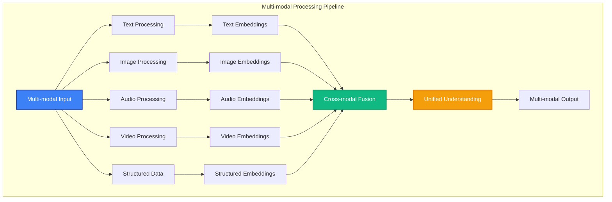

# Multi-modal Data

MAIF excels at handling multiple data modalities simultaneously - text, images, audio, video, and structured data - with unified semantic understanding and cross-modal relationships.

## Overview

Multi-modal AI systems can process and understand different types of data together, creating richer, more contextual intelligence. MAIF provides native support for:

- **Text & Images**: Document understanding, image captioning, visual question answering
- **Audio & Text**: Speech recognition, audio transcription, voice assistants
- **Video & Audio**: Video analysis, subtitle generation, content moderation
- **Structured Data**: Integration with databases, APIs, and knowledge graphs



## Core Concepts

### 1. Cross-Modal Embeddings

MAIF automatically generates embeddings that capture relationships between different modalities:

```python
from maif_sdk import create_artifact

# Create multi-modal artifact
artifact = create_artifact("multimodal-demo", client)

# Add different modalities
text_id = artifact.add_text("A beautiful sunset over the ocean")
image_id = artifact.add_image(sunset_image_data)
audio_id = artifact.add_audio(ocean_sounds_data)

# MAIF automatically creates cross-modal relationships
relationships = artifact.get_relationships(text_id)
print(f"Text relates to {len(relationships)} other blocks")

# Find similar content across modalities
similar_blocks = artifact.search_similar(text_id, cross_modal=True)
for block in similar_blocks:
    print(f"Similar {block.type}: {block.title} (similarity: {block.similarity:.3f})")
```

### 2. Semantic Alignment

MAIF uses advanced algorithms to align semantic meaning across modalities:

```python
# Semantic alignment example
artifact.add_text("Red sports car", metadata={"category": "vehicle"})
artifact.add_image(red_car_image, metadata={"category": "vehicle"})

# Query across modalities
results = artifact.search("fast vehicle", modalities=["text", "image"])
for result in results:
    print(f"{result.type}: {result.title} - Score: {result.relevance:.3f}")
```

### 3. Contextual Understanding

MAIF maintains context across different data types:

```python
# Context-aware multi-modal processing
conversation_artifact = create_artifact("conversation", client)

# Add conversation context
conversation_artifact.add_text("User: Can you describe this image?")
conversation_artifact.add_image(user_uploaded_image)
conversation_artifact.add_text("AI: This image shows a golden retriever playing in a park")
conversation_artifact.add_text("User: What breed characteristics can you identify?")

# The system maintains context across all modalities
context = conversation_artifact.get_context()
print(f"Conversation has {len(context.blocks)} blocks across {len(context.modalities)} modalities")
```

## Supported Modalities

### Text Processing

Advanced natural language understanding with:
- Sentiment analysis
- Named entity recognition
- Topic modeling
- Language detection
- PII identification

```python
# Advanced text processing
text_block = artifact.add_text(
    "John Smith from Acme Corp called about the Q4 financial report",
    features={
        "extract_entities": True,
        "detect_pii": True,
        "analyze_sentiment": True,
        "extract_topics": True
    }
)

# Access extracted features
features = text_block.get_features()
print(f"Entities: {features.entities}")
print(f"PII detected: {features.pii_detected}")
print(f"Sentiment: {features.sentiment}")
```

### Image Processing

Computer vision capabilities including:
- Object detection
- Scene understanding
- Facial recognition
- OCR (text extraction)
- Image classification

```python
# Advanced image processing
image_block = artifact.add_image(
    image_data,
    features={
        "detect_objects": True,
        "extract_text": True,
        "analyze_scene": True,
        "detect_faces": False  # Privacy-conscious
    }
)

# Access visual features
features = image_block.get_features()
print(f"Objects detected: {features.objects}")
print(f"Text in image: {features.extracted_text}")
print(f"Scene description: {features.scene_description}")
```

### Audio Processing

Audio analysis and understanding:
- Speech-to-text
- Speaker identification
- Emotion detection
- Audio classification
- Noise reduction

```python
# Audio processing
audio_block = artifact.add_audio(
    audio_data,
    sample_rate=44100,
    features={
        "transcribe": True,
        "identify_speaker": True,
        "detect_emotion": True,
        "classify_audio": True
    }
)

# Access audio features
features = audio_block.get_features()
print(f"Transcription: {features.transcription}")
print(f"Speaker: {features.speaker_id}")
print(f"Emotion: {features.emotion}")
```

### Video Processing

Video understanding capabilities:
- Scene detection
- Action recognition
- Object tracking
- Subtitle generation
- Content moderation

```python
# Video processing
video_block = artifact.add_video(
    video_data,
    features={
        "detect_scenes": True,
        "recognize_actions": True,
        "track_objects": True,
        "generate_captions": True,
        "moderate_content": True
    }
)

# Access video features
features = video_block.get_features()
print(f"Scenes: {len(features.scenes)}")
print(f"Actions: {features.actions}")
print(f"Captions: {features.captions}")
```

## Cross-Modal Use Cases

### 1. Document Understanding

Process documents with text, images, and tables:

```python
# Document processing
document_artifact = create_artifact("financial-report", client)

# Add document components
document_artifact.add_text(report_text)
document_artifact.add_image(chart_image, metadata={"type": "chart"})
document_artifact.add_structured_data(financial_data, metadata={"type": "table"})

# Unified document understanding
summary = document_artifact.summarize(
    include_modalities=["text", "image", "structured"],
    focus="financial_performance"
)
print(f"Document summary: {summary}")
```

### 2. Content Moderation

Multi-modal content safety:

```python
# Content moderation across modalities
content_artifact = create_artifact("user-content", client)

# Add user-generated content
content_artifact.add_text(user_comment)
content_artifact.add_image(user_image)
content_artifact.add_video(user_video)

# Comprehensive moderation
moderation_result = content_artifact.moderate_content(
    policies=["hate_speech", "violence", "adult_content"],
    confidence_threshold=0.8
)

if moderation_result.requires_action:
    print(f"Content flagged: {moderation_result.violations}")
    print(f"Confidence: {moderation_result.confidence}")
```

### 3. Interactive AI Assistant

Multi-modal AI interactions:

```python
# Interactive assistant
assistant_artifact = create_artifact("ai-assistant", client)

# User sends image with question
assistant_artifact.add_image(user_image)
assistant_artifact.add_text("What's happening in this image?")

# AI processes both modalities
response = assistant_artifact.generate_response(
    context_modalities=["image", "text"],
    response_type="descriptive"
)

assistant_artifact.add_text(response, metadata={"source": "ai"})
```

## Advanced Features

### 1. Cross-Modal Search

Search across different data types:

```python
# Cross-modal search
results = artifact.search(
    query="happy children playing",
    modalities=["text", "image", "video"],
    fusion_method="late_fusion",
    weights={"text": 0.4, "image": 0.4, "video": 0.2}
)

for result in results:
    print(f"{result.modality}: {result.title} (score: {result.score:.3f})")
```

### 2. Multi-Modal Embeddings

Generate unified embeddings across modalities:

```python
# Multi-modal embeddings
embedding = artifact.get_multimodal_embedding(
    block_ids=[text_id, image_id, audio_id],
    fusion_method="attention_weighted"
)

# Use for similarity search
similar_artifacts = client.search_similar_artifacts(
    embedding=embedding,
    modalities=["text", "image", "audio"]
)
```

### 3. Temporal Alignment

Align time-based modalities:

```python
# Temporal alignment for video + audio
video_artifact = create_artifact("presentation", client)

# Add synchronized content
video_artifact.add_video(presentation_video)
video_artifact.add_audio(presentation_audio)
video_artifact.add_text(presentation_transcript)

# Align timestamps
alignment = video_artifact.align_temporal_modalities(
    reference_modality="video",
    target_modalities=["audio", "text"]
)

# Query by time
content_at_time = video_artifact.get_content_at_time(
    timestamp="00:05:30",
    modalities=["video", "audio", "text"]
)
```

## Performance Optimization

### 1. Efficient Processing

Optimize multi-modal processing:

```python
# Batch processing for efficiency
batch_artifact = create_artifact("batch-processing", client)

# Process multiple modalities in parallel
batch_artifact.add_batch([
    {"type": "text", "data": text_data},
    {"type": "image", "data": image_data},
    {"type": "audio", "data": audio_data}
], parallel=True)

# Streaming processing for large files
stream_artifact = create_artifact("streaming", client)
stream_artifact.add_video_stream(
    video_stream,
    chunk_size="10s",
    process_realtime=True
)
```

### 2. Memory Management

Handle large multi-modal datasets:

```python
# Memory-efficient processing
large_artifact = create_artifact("large-dataset", client, 
    config={
        "memory_mapping": True,
        "lazy_loading": True,
        "compression": "high"
    }
)

# Process large video files
large_artifact.add_video(
    large_video_file,
    processing_mode="streaming",
    memory_limit="2GB"
)
```

## Best Practices

### 1. Data Quality

Ensure high-quality multi-modal data:

```python
# Data quality checks
quality_report = artifact.check_data_quality(
    checks={
        "text": ["language_consistency", "encoding_validity"],
        "image": ["resolution_check", "format_validation"],
        "audio": ["sample_rate_consistency", "noise_level"]
    }
)

if not quality_report.passed:
    print(f"Quality issues found: {quality_report.issues}")
```

### 2. Privacy Considerations

Handle sensitive multi-modal data:

```python
# Privacy-aware processing
private_artifact = create_artifact("sensitive-data", client,
    privacy_config={
        "anonymize_faces": True,
        "redact_pii": True,
        "encrypt_audio": True
    }
)

# Add data with privacy protection
private_artifact.add_image(image_with_faces, privacy_level="high")
private_artifact.add_text(text_with_pii, privacy_level="high")
```

### 3. Scalability

Scale multi-modal processing:

```python
# Distributed processing
distributed_artifact = create_artifact("distributed", client,
    config={
        "processing_nodes": 4,
        "load_balancing": "round_robin",
        "fault_tolerance": True
    }
)

# Process large datasets across nodes
distributed_artifact.process_dataset(
    dataset_path="/path/to/multimodal/dataset",
    batch_size=100,
    parallel_workers=8
)
```

## Integration Examples

### 1. With Computer Vision Libraries

```python
import cv2
import torch
from transformers import CLIPModel, CLIPProcessor

# Integrate with CLIP for vision-language understanding
clip_model = CLIPModel.from_pretrained("openai/clip-vit-base-patch32")
clip_processor = CLIPProcessor.from_pretrained("openai/clip-vit-base-patch32")

# Process image-text pairs
def process_image_text_pair(image, text):
    artifact = create_artifact("clip-processing", client)
    
    # Add raw data
    image_id = artifact.add_image(image)
    text_id = artifact.add_text(text)
    
    # Generate CLIP embeddings
    inputs = clip_processor(text=[text], images=[image], return_tensors="pt")
    outputs = clip_model(**inputs)
    
    # Store embeddings
    image_embedding = outputs.image_embeds.detach().numpy()
    text_embedding = outputs.text_embeds.detach().numpy()
    
    artifact.add_embedding(image_embedding, metadata={"source": "clip_image"})
    artifact.add_embedding(text_embedding, metadata={"source": "clip_text"})
    
    return artifact
```

### 2. With Speech Processing

```python
import whisper
import librosa

# Integrate with Whisper for speech recognition
whisper_model = whisper.load_model("base")

def process_audio_with_whisper(audio_file):
    artifact = create_artifact("speech-processing", client)
    
    # Load audio
    audio_data, sr = librosa.load(audio_file)
    
    # Add raw audio
    audio_id = artifact.add_audio(audio_data, sample_rate=sr)
    
    # Transcribe with Whisper
    result = whisper_model.transcribe(audio_file)
    
    # Add transcription
    text_id = artifact.add_text(result["text"], metadata={
        "source": "whisper_transcription",
        "language": result["language"],
        "confidence": result.get("confidence", 0.0)
    })
    
    # Link audio and text
    artifact.add_relationship(audio_id, text_id, "transcription")
    
    return artifact
```

## Troubleshooting

### Common Issues

1. **Memory Issues with Large Files**
   ```python
   # Use streaming processing
   artifact.add_video_stream(large_video, chunk_size="30s")
   ```

2. **Slow Cross-Modal Search**
   ```python
   # Pre-compute embeddings
   artifact.precompute_embeddings(modalities=["text", "image"])
   ```

3. **Inconsistent Quality Across Modalities**
   ```python
   # Standardize quality
   artifact.standardize_quality({
       "image": {"min_resolution": (224, 224)},
       "audio": {"sample_rate": 16000},
       "text": {"min_length": 10}
   })
   ```

## Next Steps

- Explore [Semantic Understanding](semantic.md) for advanced AI algorithms
- Learn about [Real-time Processing](streaming.md) for live multi-modal data
- Check out [Performance Optimization](performance.md) for scaling tips
- See [Examples](../examples/) for complete multi-modal applications 