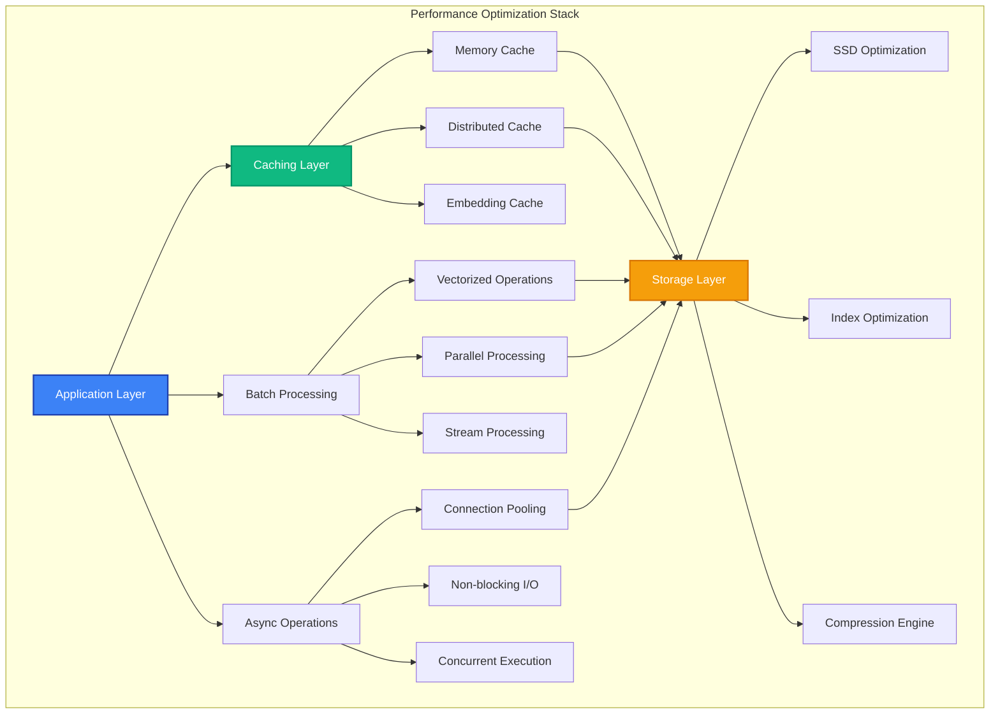

# Performance Optimization

MAIF delivers enterprise-grade performance with 400+ MB/s streaming throughput and <50ms semantic search latency. This guide covers optimization techniques, benchmarking, and scaling strategies for maximum performance.

## Overview

MAIF's performance optimization covers:

- **High-Throughput Processing**: Optimize for maximum data ingestion rates
- **Low-Latency Operations**: Minimize response times for real-time applications
- **Memory Efficiency**: Optimize memory usage for large datasets
- **CPU Optimization**: Leverage multi-core processing effectively
- **Storage Performance**: Optimize disk I/O and caching strategies



## High-Throughput Optimization

### 1. Batch Processing

Maximize throughput with efficient batching. The following code configures a high-throughput client and uses a `BatchProcessor` to ingest a large number of documents efficiently.

```python
from maif_sdk import create_client, BatchProcessor
import asyncio

# Configure a client for high-throughput scenarios with a large batch size,
# multiple connections, and compression enabled.
client = create_client(
    endpoint="https://api.maif.ai",
    batch_size=10000,
    max_connections=50,
    compression=True
)

# Use a BatchProcessor to automatically handle batching of operations
# for maximum throughput. It flushes every second or when the memory limit is reached.
batch_processor = BatchProcessor(
    client,
    batch_size=5000,
    flush_interval="1s",
    max_memory="2GB"
)

# Utility function to break a list into smaller chunks.
def chunks(lst, n):
    for i in range(0, len(lst), n):
        yield lst[i:i + n]

async def high_throughput_ingestion():
    # Create an artifact to store the data.
    artifact = await client.create_artifact("high-throughput")
    
    # Prepare a large dataset for ingestion.
    documents = []
    for i in range(100000):
        documents.append({
            "content": f"Document {i} with substantial content for processing",
            "metadata": {"index": i, "batch": "bulk_load"}
        })
    
    # Process the documents in optimized batches.
    # The `async with` block ensures the processor is properly closed.
    async with batch_processor:
        for batch in chunks(documents, 5000):
            # The processor automatically optimizes the batch submission.
            await batch_processor.add_text_batch(artifact, batch)
    
    print(f"Processed {len(documents)} documents with high throughput")

# Run the asynchronous ingestion function.
asyncio.run(high_throughput_ingestion())
```

### 2. Parallel Processing

Leverage multiple CPU cores to process data in parallel. This example configures a client for parallel processing and uses a `ThreadPoolExecutor` to execute tasks concurrently.

```python
import asyncio
from concurrent.futures import ThreadPoolExecutor
from maif_sdk import create_client
from types import SimpleNamespace

# Configure a client for parallel processing with a specified number of worker threads.
parallel_client = create_client(
    endpoint="https://api.maif.ai",
    max_workers=16,
    processing_mode="parallel"
)

# Mock function to simulate loading a large dataset.
def load_large_dataset():
    class Dataset:
        def chunks(self, size):
            for i in range(0, 10000, size):
                yield [SimpleNamespace(content=f"Item {j}", metadata={"index": j}) for j in range(i, i + size)]
    return Dataset()

async def process_chunk_async(artifact, chunk):
    # Process each item in the chunk independently and asynchronously.
    chunk_results = []
    for item in chunk:
        result = await artifact.add_text(item.content, metadata=item.metadata)
        chunk_results.append(result)
    return chunk_results

async def parallel_processing_example():
    # Create an artifact for the parallel processing task.
    artifact = await parallel_client.create_artifact("parallel-processing")
    
    # Load the large dataset.
    large_dataset = load_large_dataset()
    
    # Use a ThreadPoolExecutor for parallel execution of async tasks.
    with ThreadPoolExecutor(max_workers=8) as executor:
        # Create a list of asyncio tasks to be run in parallel.
        tasks = []
        for chunk in large_dataset.chunks(1000):
            task = asyncio.create_task(
                process_chunk_async(artifact, chunk)
            )
            tasks.append(task)
        
        # Wait for all the parallel tasks to complete.
        results = await asyncio.gather(*tasks)
    
    print(f"Processed {len(results)} chunks in parallel")

# Run the asynchronous parallel processing example.
asyncio.run(parallel_processing_example())
```

## Low-Latency Optimization

### 1. Caching Strategies

Implement comprehensive caching for minimal latency. This example demonstrates setting up a multi-level cache (`memory`, `redis`, `disk`) and a specialized embedding cache to accelerate search operations.

```python
from maif_sdk import CacheManager, EmbeddingCache, create_client
import time
import asyncio

# Configure a multi-level cache manager with an in-memory L1 cache,
# a Redis L2 cache, and a disk-based L3 cache, using an LRU eviction policy.
cache_manager = CacheManager(
    l1_cache="memory://256MB",
    l2_cache="redis://localhost",
    l3_cache="disk://1GB",
    cache_policy="lru"
)

# Use a specialized cache for embeddings with quantization to reduce memory usage.
embedding_cache = EmbeddingCache(
    cache_size="512MB",
    precompute_similar=True,
    quantization="int8"
)

# Configure a client to use the defined cache manager and embedding cache.
cached_client = create_client(
    endpoint="https://api.maif.ai",
    cache_manager=cache_manager,
    embedding_cache=embedding_cache
)

async def low_latency_search():
    # Assume the artifact 'search-optimized' already exists and is populated.
    artifact = await cached_client.get_artifact("search-optimized")
    
    # The first search will be a cache miss, so it will take longer.
    start_time = time.time()
    results1 = await artifact.search("machine learning algorithms")
    first_search_time = time.time() - start_time
    
    # The second search for the same query should be a cache hit, resulting in a faster response.
    start_time = time.time()
    results2 = await artifact.search("machine learning algorithms")
    second_search_time = time.time() - start_time
    
    print(f"First search (cache miss): {first_search_time*1000:.2f}ms")
    print(f"Second search (cache hit): {second_search_time*1000:.2f}ms")
    # A speedup greater than 1x indicates caching is effective.
    if second_search_time > 0:
        print(f"Speedup: {first_search_time/second_search_time:.1f}x")

# Run the asynchronous search example.
asyncio.run(low_latency_search())
```

## Memory Optimization

### 1. Efficient Data Structures

Use memory-efficient data structures like `CompactArtifact` and `QuantizedEmbeddings` to reduce memory footprint. This code shows how to create and use these structures for memory-optimized processing.

```python
from maif_sdk import CompactArtifact, QuantizedEmbeddings, create_client
import asyncio
import numpy as np
from types import SimpleNamespace

# Assume a client is already created.
client = create_client()

# Use a CompactArtifact which is optimized for memory by using
# compression, quantization, and memory-mapping.
compact_artifact = CompactArtifact(
    client,
    compression="zstd",
    quantization="int8",
    memory_mapping=True
)

# Mock data for demonstration purposes.
sample_embeddings = [np.random.rand(128) for _ in range(100)]
large_document_set = [SimpleNamespace(content=f"Document content {i}") for i in range(1000)]
async def generate_embedding(content):
    return np.random.rand(128)

# Use QuantizedEmbeddings to reduce the memory usage of embedding vectors.
quantized_embeddings = QuantizedEmbeddings(
    precision="int8",  # Reduces float32 to int8, a 4x memory reduction.
    calibration_data=sample_embeddings # Data used to learn the quantization scale.
)

async def memory_efficient_processing():
    # Create a memory-optimized artifact.
    artifact = await compact_artifact.create("memory-optimized")
    
    # Add data, which will be automatically compressed and quantized.
    for document in large_document_set:
        # The text content is automatically compressed using zstd.
        text_id = await artifact.add_text_compressed(document.content)
        
        # Generate and then quantize the embedding before adding it.
        embedding = await generate_embedding(document.content)
        quantized_embedding = quantized_embeddings.quantize(embedding)
        
        await artifact.add_embedding(quantized_embedding, block_id=text_id)
    
    # Get statistics on memory usage to see the effect of optimizations.
    memory_stats = await artifact.get_memory_stats()
    print(f"Memory usage: {memory_stats.total_mb:.2f} MB")
    print(f"Compression ratio: {memory_stats.compression_ratio:.2f}x")

# Run the asynchronous memory-efficient processing example.
asyncio.run(memory_efficient_processing())
```

## Benchmarking and Monitoring

### 1. Performance Benchmarking

Comprehensive performance testing:

```python
from maif_sdk import PerformanceBenchmark
import time

# Performance benchmark suite
benchmark = PerformanceBenchmark(
    client,
    test_duration="60s",
    warmup_duration="10s",
    metrics=["throughput", "latency", "memory", "cpu"]
)

async def run_performance_benchmark():
    # Throughput benchmark
    throughput_results = await benchmark.test_throughput(
        operation="add_text",
        batch_sizes=[100, 500, 1000, 2000],
        concurrent_clients=[1, 5, 10, 20]
    )
    
    # Latency benchmark
    latency_results = await benchmark.test_latency(
        operation="search",
        query_types=["simple", "complex", "multi_modal"],
        percentiles=[50, 90, 95, 99]
    )
    
    # Generate performance report
    report = benchmark.generate_report({
        "throughput": throughput_results,
        "latency": latency_results
    })
    
    print("Performance Benchmark Results:")
    print(f"Max Throughput: {report.max_throughput:.2f} MB/s")
    print(f"P95 Latency: {report.p95_latency:.2f} ms")

await run_performance_benchmark()
```

## Best Practices

### 1. Performance Design Patterns

Implement proven performance patterns:

```python
# Performance-optimized client configuration
perf_client = create_client(
    endpoint="https://api.maif.ai",
    # Connection optimization
    connection_pool_size=20,
    keep_alive=True,
    
    # Batching optimization
    auto_batch=True,
    batch_size=1000,
    batch_timeout="100ms",
    
    # Caching optimization
    enable_caching=True,
    cache_size="512MB",
    cache_ttl="1h",
    
    # Compression optimization
    compression="lz4",
    compression_level=3,
    
    # Async optimization
    async_mode=True,
    max_concurrent_requests=50
)

async def performance_best_practices():
    artifact = await perf_client.create_artifact("best-practices")
    
    # 1. Batch operations when possible
    batch_data = collect_batch_data(size=1000)
    await artifact.add_batch(batch_data)
    
    # 2. Use async operations for I/O
    search_tasks = [
        artifact.search_async(query) 
        for query in search_queries
    ]
    search_results = await asyncio.gather(*search_tasks)
    
    # 3. Cache frequently accessed data
    cached_blocks = await artifact.get_blocks_cached(frequent_block_ids)

await performance_best_practices()
```

## Troubleshooting

### Common Performance Issues

1. **High Latency**
   ```python
   # Diagnose and fix high latency
   latency_analyzer = LatencyAnalyzer(client)
   
   bottlenecks = await latency_analyzer.identify_bottlenecks()
   for bottleneck in bottlenecks:
       if bottleneck.type == "network":
           await client.optimize_network_settings()
       elif bottleneck.type == "cache_miss":
           await client.warm_cache(bottleneck.keys)
   ```

2. **Memory Issues**
   ```python
   # Memory leak detection and cleanup
   memory_analyzer = MemoryAnalyzer(client)
   
   leaks = await memory_analyzer.detect_leaks()
   if leaks:
       await client.cleanup_memory()
   ```

## Next Steps

- Explore [Distributed Deployment](distributed.md) for scaling across clusters
- Learn about [Monitoring & Observability](monitoring.md) for production monitoring
- Check out [Real-time Processing](streaming.md) for streaming optimizations
- See [Examples](../examples/) for performance-optimized applications 