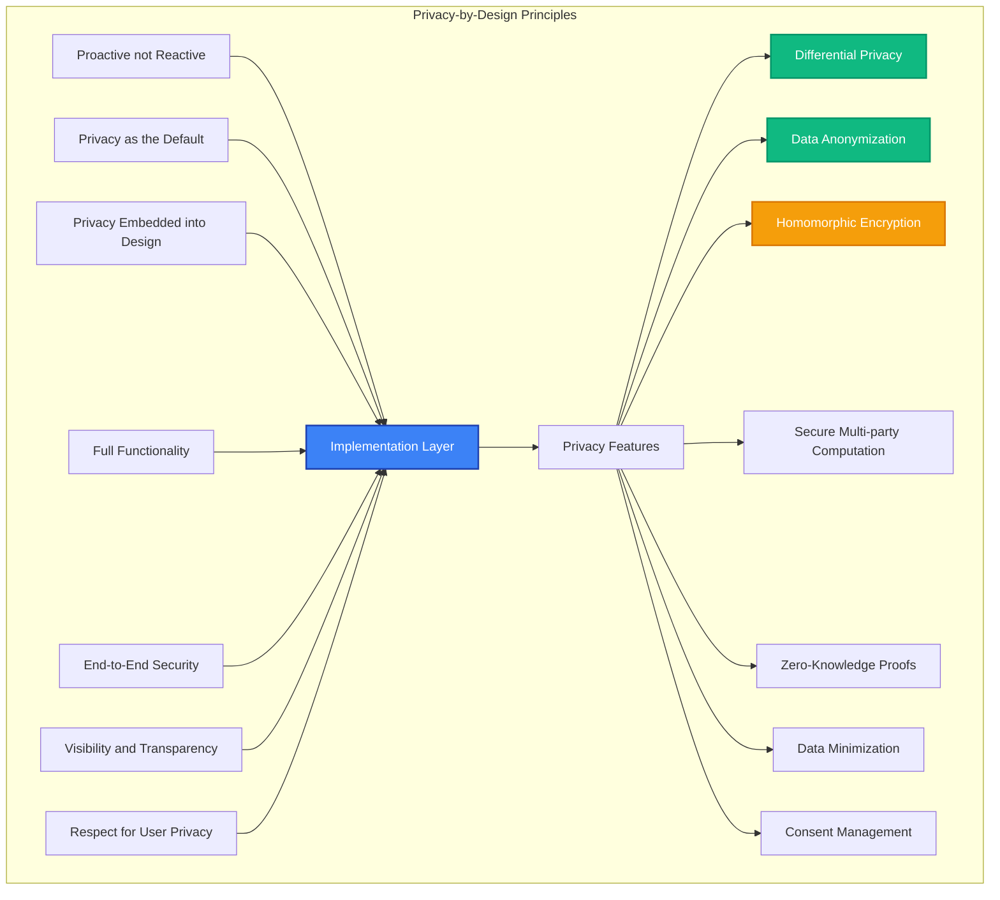

# Privacy Framework

MAIF implements privacy-by-design principles with advanced privacy-preserving technologies. This guide covers MAIF's privacy features, compliance capabilities, and how to build privacy-first AI applications.

## Privacy-by-Design Architecture

MAIF's privacy framework is built on seven foundational principles:



## Core Privacy Technologies

### 1. Differential Privacy

Differential Privacy provides mathematical guarantees that individual data cannot be identified from aggregate results. MAIF allows you to apply differential privacy mechanisms when adding or querying data.

```python
from maif.privacy import DifferentialPrivacy
from maif_sdk import create_artifact

# Assume an artifact object is already created.
artifact = create_artifact("privacy-demo")

# Configure an advanced differential privacy mechanism.
# Epsilon is the privacy budget (lower is more private).
# Delta is the probability of the privacy guarantee failing (lower is better).
# We use Rényi Differential Privacy (RDP) for tighter composition of budgets.
dp_advanced = DifferentialPrivacy(
    epsilon=0.5,
    delta=1e-6,
    mechanism="Gaussian",
    composition="RDP",
    privacy_accounting=True # Track privacy budget consumption.
)

# Add sensitive data to an artifact with differential privacy enabled.
# The privacy engine will automatically add noise to the data's representation.
artifact.add_text(
    "Sensitive customer feedback about product X",
    privacy_engine=dp_advanced,
    anonymize=True
)

# When querying the data, the results are perturbed to protect privacy.
results = artifact.search(
    "customer satisfaction",
    privacy_engine=dp_advanced,
    noise_scale="auto" # Automatically calibrate noise based on query sensitivity.
)

# You can track the consumption of the privacy budget.
remaining_budget = dp_advanced.get_remaining_budget()
print(f"Remaining privacy budget: {remaining_budget}")
```

**Key Features:**
- **Composable Privacy**: Multiple queries consume privacy budget
- **Adaptive Noise**: Automatic noise calibration based on query sensitivity
- **Privacy Accounting**: Track and manage privacy budget consumption

### 2. Data Anonymization

MAIF provides tools for the automatic detection and anonymization of personally identifiable information (PII) to help comply with regulations like GDPR.

```python
from maif.privacy import Anonymizer, PIIDetector
from maif_sdk import create_artifact

artifact = create_artifact("anonymization-demo")

# Configure a PII detector to find common identifiers and custom patterns.
pii_detector = PIIDetector(
    detect_names=True,
    detect_emails=True,
    detect_phone_numbers=True,
    detect_ssn=True,
    custom_patterns=["CUST-\d{6}"] # Example: Find custom customer IDs.
)

# Configure an anonymizer using the k-anonymity method.
# This ensures each record is indistinguishable from at least k-1 other records.
anonymizer = Anonymizer(
    method="k_anonymity",
    k_value=5,
    preserve_utility=True, # Attempt to preserve data utility post-anonymization.
    reversible=False
)

# Process a text block containing PII. The detector and anonymizer will
# automatically find and mask the sensitive information before storage.
artifact.add_text(
    "Customer John Smith (john@email.com, SSN: 123-45-6789) called about CUST-123456",
    pii_detector=pii_detector,
    anonymizer=anonymizer
)
print("PII has been detected and anonymized.")
```

**Anonymization Methods:**
- **K-Anonymity**: Ensure each record is indistinguishable from k-1 others
- **L-Diversity**: Ensure diversity in sensitive attributes
- **T-Closeness**: Maintain distribution similarity
- **Synthetic Data**: Generate statistically similar synthetic records

### 3. Homomorphic Encryption

Homomorphic Encryption allows you to perform computations directly on encrypted data without needing to decrypt it first, which is ideal for secure analytics.

```python
from maif.privacy import HomomorphicEncryption
from maif_sdk import create_artifact

artifact = create_artifact("he-demo")

# Configure a homomorphic encryption scheme.
# CKKS is suitable for computations on real numbers (e.g., for machine learning).
he = HomomorphicEncryption(
    scheme="CKKS",
    poly_modulus_degree=8192,
    coeff_modulus=[40, 40, 40, 40, 40],
    scale=2**40
)

# Encrypt a list of sensitive numerical data points.
encrypted_data = he.encrypt([1.5, 2.3, 3.7, 4.1])

# Perform computations (e.g., addition, multiplication) on the encrypted data.
encrypted_sum = he.add(encrypted_data, encrypted_data)
encrypted_product = he.multiply(encrypted_data, 2.0)

# The results remain encrypted and can be stored securely in an artifact.
artifact.add_encrypted_data(
    encrypted_sum,
    title="Encrypted Analytics Result",
    encryption_scheme="homomorphic"
)
print("Homomorphic computation performed and result stored securely.")
```

### 4. Secure Multi-party Computation (SMPC)

SMPC enables multiple parties to jointly compute a function over their private inputs without revealing those inputs to each other.

```python
from maif.privacy import SecureMultipartyComputation

# Mock sensitive data from one party.
sensitive_data = {"value": 100}

# Configure an SMPC instance with a list of participating parties and a protocol.
smpc = SecureMultipartyComputation(
    parties=["party_a", "party_b", "party_c"],
    protocol="BGW", # Ben-Or, Goldwasser, Wigderson protocol
    threshold=2 # Minimum number of parties required to perform the computation.
)

# A party contributes its private data to a joint computation.
smpc.contribute_data(
    party_id="party_a",
    data=sensitive_data,
    computation_id="joint_analysis"
)

# Once enough parties have contributed, the secure computation can be executed.
# The result is revealed without revealing the individual private inputs.
result = smpc.compute(
    function="aggregate_statistics",
    computation_id="joint_analysis"
)
print(f"SMPC joint computation result: {result}")
```

### 5. Zero-Knowledge Proofs

Zero-Knowledge Proofs (ZKPs) allow one party to prove to another that they know a piece of information without revealing the information itself.

```python
from maif.privacy import ZeroKnowledgeProof

# Create a ZKP instance using a specific protocol (e.g., zk-SNARKs)
# and for a specific computational problem (a "circuit").
zkp = ZeroKnowledgeProof(
    protocol="zk-SNARKs",
    circuit="age_verification"
)

# A user can generate a proof that they meet a condition (e.g., age is over 18)
# without revealing their actual age.
proof = zkp.generate_proof(
    private_input={"age": 25},
    public_input={"minimum_age": 18},
    statement="age >= minimum_age"
)

# The verifier can check the proof without learning the user's age.
is_valid = zkp.verify_proof(proof)
print(f"Age verification proof is valid: {is_valid}")
```

## Privacy-Preserving Analytics

### Federated Learning Integration

Train AI models on decentralized data without needing to centralize sensitive user information. MAIF provides tools to facilitate this process securely.

```python
from maif.privacy import FederatedLearning

# Mock data for demonstration.
local_sensitive_data = [{"feature": 1, "label": 0}]
model_updates = []

# Configure a federated learning process with secure aggregation and differential privacy.
fl = FederatedLearning(
    aggregation_method="FedAvg", # Federated Averaging algorithm
    differential_privacy=True,
    secure_aggregation=True,
    min_participants=5
)

# A participant trains a model on their local data and generates an update.
# Only the model updates (gradients) are shared, not the raw data.
fl.train_local_model(
    data=local_sensitive_data,
    model_updates_only=True,
    privacy_budget=0.1 # Apply differential privacy to the update.
)

# The central coordinator securely aggregates the updates from all participants
# to create an improved global model.
global_model = fl.aggregate_models(
    participant_updates=model_updates,
    privacy_preserving=True
)
print("Federated learning cycle complete.")
```

### Private Information Retrieval

Private Information Retrieval (PIR) allows a user to retrieve an item from a server's database without the server learning which item was retrieved.

```python
from maif.privacy import PrivateInformationRetrieval

# Configure PIR with a specific scheme.
pir = PrivateInformationRetrieval(scheme="SealPIR")

# The client generates a query for a specific index without revealing the index itself.
query = pir.generate_query(database_size=1000, desired_index=42)

# The server processes the query on its database and returns a response.
# The server does not know which index (42) was requested.
response = pir.process_query(server_database, query)

# The client decodes the response to retrieve the desired item.
retrieved_item = pir.decode_response(response)
print(f"Retrieved item privately: {retrieved_item}")
```

## Compliance and Regulatory Support

### GDPR Compliance

Comprehensive support for General Data Protection Regulation requirements.

```python
from maif.privacy import GDPRCompliance

# Configure GDPR compliance
gdpr = GDPRCompliance(
    lawful_basis="consent",
    data_controller="Your Organization",
    dpo_contact="dpo@yourorg.com"
)

# Process data with GDPR compliance
artifact.add_text(
    personal_data,
    gdpr_compliance=gdpr,
    consent_id="consent_12345",
    purpose="customer_service",
    retention_period="2_years"
)

# Handle data subject rights
gdpr.handle_data_subject_request(
    request_type="access",
    subject_id="user_123",
    verification_method="email_verification"
)
```

**GDPR Features:**
- **Right to Access**: Provide data subjects with their personal data
- **Right to Rectification**: Allow correction of inaccurate data
- **Right to Erasure**: Implement "right to be forgotten"
- **Right to Portability**: Export data in machine-readable format
- **Right to Object**: Allow opt-out of processing

### HIPAA Compliance

Healthcare data protection and privacy requirements.

```python
from maif.privacy import HIPAACompliance

# Configure HIPAA compliance
hipaa = HIPAACompliance(
    covered_entity="Healthcare Provider",
    minimum_necessary=True,
    access_controls=True,
    audit_logging=True
)

# Process healthcare data
artifact.add_text(
    medical_record,
    hipaa_compliance=hipaa,
    phi_detection=True,
    encryption_required=True,
    access_logging=True
)

# Generate HIPAA compliance report
compliance_report = hipaa.generate_compliance_report(
    period="2024-Q1",
    include_risk_assessment=True
)
```

### CCPA Compliance

California Consumer Privacy Act requirements.

```python
from maif.privacy import CCPACompliance

# Configure CCPA compliance
ccpa = CCPACompliance(
    business_category="technology",
    annual_revenue=25_000_000,
    consumer_threshold=50000
)

# Handle consumer rights
ccpa.handle_consumer_request(
    request_type="do_not_sell",
    consumer_id="consumer_456",
    verification_required=True
)
```

## Privacy-Preserving AI Operations

### Private Semantic Search

Perform semantic search without revealing query content.

```python
from maif.privacy import PrivateSemanticSearch

# Configure private search
private_search = PrivateSemanticSearch(
    encryption_scheme="functional",
    privacy_level="semantic_security",
    query_obfuscation=True
)

# Perform private search
encrypted_query = private_search.encrypt_query("sensitive search term")
results = artifact.private_search(
    encrypted_query=encrypted_query,
    preserve_ranking=True,
    result_anonymization=True
)
```

### Confidential Computing

Use trusted execution environments for sensitive operations.

```python
from maif.privacy import ConfidentialComputing

# Configure confidential computing
cc = ConfidentialComputing(
    tee_type="Intel_SGX",
    attestation_required=True,
    sealed_storage=True
)

# Process data in secure enclave
secure_result = cc.secure_compute(
    function=sensitive_analysis,
    data=confidential_data,
    verify_integrity=True
)
```

## Privacy Monitoring and Auditing

### Privacy Impact Assessment

Automated privacy risk assessment and mitigation recommendations.

```python
from maif.privacy import PrivacyImpactAssessment

# Conduct privacy impact assessment
pia = PrivacyImpactAssessment(
    data_types=["personal", "sensitive", "biometric"],
    processing_purposes=["analytics", "ml_training"],
    data_subjects=["customers", "employees"]
)

assessment_result = pia.conduct_assessment(
    artifact=artifact,
    include_recommendations=True,
    risk_threshold="medium"
)

print(f"Privacy risk level: {assessment_result.risk_level}")
print(f"Recommendations: {assessment_result.recommendations}")
```

### Privacy Metrics and Monitoring

Track privacy-related metrics and compliance status.

```python
from maif.privacy import PrivacyMonitor

# Configure privacy monitoring
privacy_monitor = PrivacyMonitor(
    metrics=["privacy_budget", "pii_exposure", "consent_status"],
    alerting=True,
    dashboard_integration=True
)

# Get privacy metrics
metrics = privacy_monitor.get_privacy_metrics()
print(f"Privacy budget consumed: {metrics.privacy_budget_consumed}")
print(f"PII incidents: {metrics.pii_incidents}")
print(f"Consent compliance rate: {metrics.consent_compliance_rate}")

# Set up privacy alerts
privacy_monitor.add_alert_rule({
    "condition": "privacy_budget_consumed > 0.8",
    "action": "notify_privacy_officer",
    "severity": "high"
})
```

## Data Subject Rights Management

### Consent Management

Comprehensive consent tracking and management system.

```python
from maif.privacy import ConsentManager

# Configure consent management
consent_manager = ConsentManager(
    consent_types=["processing", "marketing", "analytics"],
    granular_consent=True,
    consent_withdrawal=True,
    proof_of_consent=True
)

# Record consent
consent_id = consent_manager.record_consent(
    subject_id="user_789",
    consent_type="processing",
    purpose="customer_service",
    legal_basis="consent",
    timestamp=datetime.now(),
    proof_method="digital_signature"
)

# Check consent status
is_valid = consent_manager.check_consent(
    subject_id="user_789",
    purpose="analytics"
)
```

### Data Subject Request Handling

Automated handling of data subject rights requests.

```python
from maif.privacy import DataSubjectRights

# Configure data subject rights handler
dsr = DataSubjectRights(
    supported_rights=["access", "rectification", "erasure", "portability"],
    verification_methods=["email", "sms", "identity_document"],
    response_time_limit="30_days"
)

# Handle access request
access_request = dsr.handle_access_request(
    subject_id="user_123",
    verification_token="token_abc123",
    format="json"
)

# Handle erasure request
erasure_result = dsr.handle_erasure_request(
    subject_id="user_123",
    verification_token="token_def456",
    cascade_delete=True
)
```

## Privacy-Preserving Data Sharing

### Secure Data Collaboration

Share insights without sharing raw data.

```python
from maif.privacy import SecureDataCollaboration

# Configure secure collaboration
collaboration = SecureDataCollaboration(
    participants=["org_a", "org_b", "org_c"],
    privacy_technique="differential_privacy",
    trust_model="semi_honest"
)

# Share privacy-preserving insights
insights = collaboration.share_insights(
    data=local_data,
    analysis_type="statistical_summary",
    privacy_budget=0.1
)

# Receive aggregated results
aggregated_insights = collaboration.receive_insights(
    computation_id="collab_123"
)
```

### Privacy-Preserving Record Linkage

Link records across datasets without revealing identities.

```python
from maif.privacy import PrivacyPreservingRecordLinkage

# Configure private record linkage
pprl = PrivacyPreservingRecordLinkage(
    method="bloom_filter",
    hash_function="sha256",
    false_positive_rate=0.01
)

# Create privacy-preserving identifiers
ppid = pprl.create_identifier(
    record={"name": "John Doe", "dob": "1990-01-01"},
    salt="random_salt_123"
)

# Perform private matching
matches = pprl.find_matches(
    query_identifier=ppid,
    database_identifiers=database_ppids,
    similarity_threshold=0.8
)
```

## Advanced Privacy Features

### Synthetic Data Generation

Generate privacy-preserving synthetic datasets.

```python
from maif.privacy import SyntheticDataGenerator

# Configure synthetic data generation
sdg = SyntheticDataGenerator(
    method="GAN",
    privacy_mechanism="DPGAN",
    epsilon=1.0,
    utility_metrics=["statistical_similarity", "ml_utility"]
)

# Generate synthetic data
synthetic_data = sdg.generate(
    original_data=sensitive_dataset,
    num_samples=10000,
    preserve_correlations=True
)

# Validate synthetic data quality
quality_report = sdg.validate_quality(
    original_data=sensitive_dataset,
    synthetic_data=synthetic_data
)
```

### Privacy-Preserving Machine Learning

Train ML models while preserving privacy.

```python
from maif.privacy import PrivacyPreservingML

# Configure private ML
ppml = PrivacyPreservingML(
    technique="differential_privacy",
    privacy_budget=1.0,
    noise_mechanism="Gaussian"
)

# Train private model
private_model = ppml.train_model(
    data=sensitive_training_data,
    model_type="neural_network",
    privacy_accounting=True
)

# Make private predictions
predictions = ppml.predict(
    model=private_model,
    data=test_data,
    output_perturbation=True
)
```

## Privacy Configuration Examples

### Maximum Privacy Configuration

```python
client = create_client(
    "maximum-privacy-agent",
    
    # Differential privacy
    differential_privacy=True,
    privacy_budget=0.5,
    
    # Data anonymization
    automatic_pii_detection=True,
    anonymization_method="k_anonymity",
    k_value=10,
    
    # Encryption
    homomorphic_encryption=True,
    encryption_scheme="CKKS",
    
    # Compliance
    gdpr_compliance=True,
    hipaa_compliance=True,
    
    # Monitoring
    privacy_monitoring=True,
    privacy_impact_assessment=True,
    
    # Data minimization
    data_minimization=True,
    purpose_limitation=True,
    storage_limitation=True
)
```

### Research-Friendly Configuration

```python
client = create_client(
    "research-privacy-agent",
    
    # Federated learning
    federated_learning=True,
    secure_aggregation=True,
    
    # Synthetic data
    synthetic_data_generation=True,
    preserve_statistical_properties=True,
    
    # Private analytics
    private_information_retrieval=True,
    secure_multiparty_computation=True,
    
    # Privacy accounting
    privacy_budget_management=True,
    composition_tracking=True
)
```

## Best Practices

### 1. Privacy by Design

```python
# Always configure privacy settings first
privacy_config = {
    "differential_privacy": True,
    "epsilon": 1.0,
    "anonymization": True,
    "pii_detection": True
}

client = create_client(
    "privacy-first-agent",
    **privacy_config
)
```

### 2. Data Minimization

```python
# Only collect and process necessary data
artifact.add_text(
    data,
    purpose="customer_service",
    data_minimization=True,
    retention_period="2_years",
    automatic_deletion=True
)
```

### 3. Consent Management

```python
# Always verify consent before processing
if consent_manager.check_consent(user_id, "analytics"):
    artifact.add_text(data, purpose="analytics")
else:
    print("Consent not granted for analytics")
```

### 4. Regular Privacy Audits

```python
# Conduct regular privacy assessments
privacy_audit = privacy_monitor.conduct_audit(
    scope="full_system",
    compliance_frameworks=["GDPR", "CCPA"],
    include_recommendations=True
)
```

## Next Steps

- **[Agent Development →](/guide/agent-development)** - Building privacy-aware agents
- **[Performance →](/guide/performance)** - Privacy-performance optimization
- **[Compliance Cookbook →](/cookbook/compliance)** - Detailed compliance guides
- **[API Reference →](/api/privacy/)** - Complete privacy API documentation 