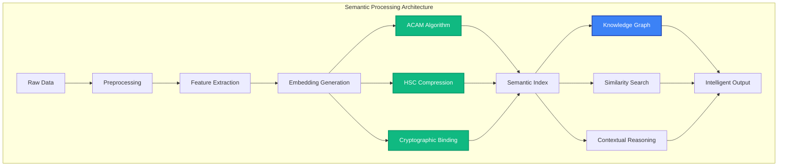

# Semantic Understanding

MAIF provides advanced semantic understanding capabilities through novel AI algorithms, cross-modal embeddings, and intelligent knowledge representation. This guide covers MAIF's semantic processing features and how to leverage them for building intelligent applications.

## Overview

Semantic understanding goes beyond simple keyword matching to comprehend meaning, context, and relationships in data. MAIF's semantic engine provides:

- **Deep Semantic Embeddings**: Multi-dimensional vector representations of meaning
- **Cross-Modal Understanding**: Unified semantics across text, images, audio, and video
- **Novel AI Algorithms**: ACAM, HSC, and CSB for advanced processing
- **Knowledge Graphs**: Dynamic relationship mapping and reasoning
- **Contextual Intelligence**: Understanding context and intent



## Novel AI Algorithms

### 1. ACAM (Adaptive Cross-Modal Attention Mechanism)

ACAM enables dynamic attention across different data modalities for enhanced understanding:

```python
from maif_sdk import create_artifact, ACAMProcessor

# Initialize ACAM processor
acam = ACAMProcessor(
    attention_heads=8,
    cross_modal_fusion="adaptive",
    temperature=0.07
)

# Create artifact with ACAM processing
artifact = create_artifact("acam-demo", client, 
    processors=[acam]
)

# Add multi-modal data
text_id = artifact.add_text("A serene mountain landscape at sunset")
image_id = artifact.add_image(mountain_sunset_image)
audio_id = artifact.add_audio(nature_sounds)

# ACAM automatically computes cross-modal attention
attention_maps = artifact.get_attention_maps()
print(f"Text-Image attention: {attention_maps['text_image'].mean():.3f}")
print(f"Text-Audio attention: {attention_maps['text_audio'].mean():.3f}")
print(f"Image-Audio attention: {attention_maps['image_audio'].mean():.3f}")

# Query with cross-modal understanding
results = artifact.search("peaceful nature scene", use_acam=True)
for result in results:
    print(f"{result.type}: {result.title} (relevance: {result.acam_score:.3f})")
```

### 2. HSC (Hierarchical Semantic Compression)

HSC provides efficient compression while preserving semantic meaning:

```python
from maif_sdk import HSCCompressor

# Configure HSC compression
hsc = HSCCompressor(
    compression_ratio=0.1,  # 10x compression
    semantic_preservation=0.95,  # 95% semantic fidelity
    hierarchical_levels=3
)

# Apply HSC to embeddings
artifact = create_artifact("hsc-demo", client, 
    compressor=hsc
)

# Add large text document
document_id = artifact.add_text(large_document, compress=True)

# Check compression stats
stats = artifact.get_compression_stats(document_id)
print(f"Original size: {stats.original_size} bytes")
print(f"Compressed size: {stats.compressed_size} bytes")
print(f"Compression ratio: {stats.ratio:.2f}x")
print(f"Semantic preservation: {stats.semantic_fidelity:.3f}")

# Search still works with compressed data
results = artifact.search("key concepts", compressed_search=True)
```

### 3. CSB (Cryptographic Semantic Binding)

CSB provides secure semantic processing with privacy guarantees:

```python
from maif_sdk import CSBProcessor

# Initialize CSB with privacy settings
csb = CSBProcessor(
    encryption_level="AES-256",
    differential_privacy=True,
    privacy_budget=1.0
)

# Create privacy-preserving artifact
artifact = create_artifact("csb-demo", client, 
    processors=[csb],
    privacy_level="high"
)

# Add sensitive data with semantic processing
sensitive_text = "Patient John Doe has diabetes and hypertension"
text_id = artifact.add_text(sensitive_text, encrypt=True)

# Semantic search works on encrypted data
results = artifact.search("medical conditions", encrypted_search=True)
print(f"Found {len(results)} results without decrypting data")

# Only authorized users can access decrypted results
if user.has_permission("medical_data"):
    decrypted_results = artifact.decrypt_search_results(results)
```

## Embedding Systems

### 1. Multi-Modal Embeddings

Generate unified embeddings across different data types:

```python
# Multi-modal embedding generation
artifact = create_artifact("multimodal-embeddings", client)

# Add different modalities
text_id = artifact.add_text("A cat sitting on a windowsill")
image_id = artifact.add_image(cat_image)
audio_id = artifact.add_audio(cat_purring_sound)

# Generate unified embedding
unified_embedding = artifact.get_unified_embedding([text_id, image_id, audio_id])

# Use for similarity search across modalities
similar_artifacts = client.search_similar_artifacts(
    embedding=unified_embedding,
    threshold=0.8
)
```

### 2. Contextual Embeddings

Generate context-aware embeddings that consider surrounding information:

```python
# Contextual embedding example
conversation_artifact = create_artifact("conversation", client)

# Add conversation history
conversation_artifact.add_text("User: What's the weather like?")
conversation_artifact.add_text("AI: It's sunny and 75°F today.")
conversation_artifact.add_text("User: Should I wear a jacket?")

# Generate contextual embedding for the last message
contextual_embedding = conversation_artifact.get_contextual_embedding(
    block_id=last_message_id,
    context_window=3,  # Consider last 3 messages
    context_weight=0.3  # 30% context, 70% current message
)

# Generate response with context awareness
response = conversation_artifact.generate_response(
    embedding=contextual_embedding,
    response_type="helpful"
)
```

### 3. Temporal Embeddings

Handle time-series and temporal data:

```python
# Temporal embedding for time-series data
time_series_artifact = create_artifact("temporal-data", client)

# Add time-stamped data
for timestamp, data in time_series_data:
    time_series_artifact.add_structured_data(
        data, 
        timestamp=timestamp,
        temporal_context=True
    )

# Generate temporal embeddings
temporal_embedding = time_series_artifact.get_temporal_embedding(
    time_range=("2024-01-01", "2024-01-31"),
    temporal_resolution="daily",
    trend_analysis=True
)

# Predict future values
prediction = time_series_artifact.predict_temporal(
    embedding=temporal_embedding,
    forecast_horizon="7d"
)
```

## Knowledge Graphs

### 1. Dynamic Knowledge Graph Construction

MAIF automatically builds knowledge graphs from your data:

```python
# Knowledge graph construction
kg_artifact = create_artifact("knowledge-graph", client,
    enable_knowledge_graph=True
)

# Add related documents
kg_artifact.add_text("Apple Inc. is a technology company founded by Steve Jobs.")
kg_artifact.add_text("Steve Jobs was the CEO of Apple until 2011.")
kg_artifact.add_text("Apple develops iPhones, iPads, and Mac computers.")

# Access the constructed knowledge graph
knowledge_graph = kg_artifact.get_knowledge_graph()

# Query the knowledge graph
entities = knowledge_graph.get_entities()
relationships = knowledge_graph.get_relationships()

print(f"Entities: {[e.name for e in entities]}")
print(f"Relationships: {[(r.source, r.relation, r.target) for r in relationships]}")

# Semantic reasoning
reasoning_result = knowledge_graph.reason("Who founded the company that makes iPhones?")
print(f"Answer: {reasoning_result.answer}")
```

### 2. Knowledge Graph Querying

Perform complex queries on the knowledge graph:

```python
# Complex knowledge graph queries
from maif_sdk import KGQuery

# SPARQL-like queries
query = KGQuery("""
    SELECT ?person ?company ?product
    WHERE {
        ?person founded ?company .
        ?company develops ?product .
        ?product type "smartphone"
    }
""")

results = knowledge_graph.query(query)
for result in results:
    print(f"{result.person} founded {result.company} which makes {result.product}")

# Graph traversal queries
path_query = knowledge_graph.find_path(
    start_entity="Steve Jobs",
    end_entity="iPhone",
    max_hops=3
)

print(f"Path: {' -> '.join(path_query.path)}")
```

### 3. Knowledge Graph Updates

Dynamically update the knowledge graph:

```python
# Dynamic knowledge graph updates
kg_artifact.add_text("Tim Cook became CEO of Apple in 2011.")

# The knowledge graph automatically updates
updated_kg = kg_artifact.get_knowledge_graph()

# Verify the update
current_ceo = updated_kg.query("Who is the current CEO of Apple?")
print(f"Current CEO: {current_ceo.answer}")

# Manual relationship addition
kg_artifact.add_relationship(
    subject="Tim Cook",
    predicate="succeeded",
    object="Steve Jobs",
    confidence=0.95
)
```

## Similarity Search

### 1. Semantic Similarity

Find semantically similar content:

```python
# Semantic similarity search
artifact = create_artifact("similarity-demo", client)

# Add diverse content
artifact.add_text("The quick brown fox jumps over the lazy dog")
artifact.add_text("A fast red fox leaps above a sleepy canine")
artifact.add_text("Python is a programming language")
artifact.add_text("JavaScript is used for web development")

# Semantic search finds related content even with different words
results = artifact.search_similar("rapid fox jumping", similarity_type="semantic")

for result in results:
    print(f"Text: {result.text}")
    print(f"Similarity: {result.similarity:.3f}")
    print("---")
```

### 2. Cross-Modal Similarity

Find similar content across different modalities:

```python
# Cross-modal similarity search
multimodal_artifact = create_artifact("cross-modal", client)

# Add different types of content
multimodal_artifact.add_text("A beautiful red rose in a garden")
multimodal_artifact.add_image(rose_image)
multimodal_artifact.add_audio(garden_sounds)

# Search with text, find similar images and audio
cross_modal_results = multimodal_artifact.search_similar(
    "flowering plants outdoors",
    modalities=["image", "audio"],
    cross_modal=True
)

for result in cross_modal_results:
    print(f"{result.modality}: {result.title} (similarity: {result.similarity:.3f})")
```

### 3. Contextual Similarity

Find content similar within specific contexts:

```python
# Contextual similarity search
context_artifact = create_artifact("contextual", client)

# Add content with context
context_artifact.add_text("Machine learning algorithms", context="technology")
context_artifact.add_text("Learning to play piano", context="music")
context_artifact.add_text("Deep learning networks", context="technology")

# Search within specific context
tech_results = context_artifact.search_similar(
    "learning systems",
    context="technology",
    context_weight=0.5
)

print("Technology context results:")
for result in tech_results:
    print(f"- {result.text} (similarity: {result.similarity:.3f})")
```

## Advanced Semantic Features

### 1. Concept Extraction

Automatically extract key concepts from data:

```python
# Concept extraction
concept_artifact = create_artifact("concepts", client)

# Add content
text_id = concept_artifact.add_text("""
    Artificial intelligence and machine learning are transforming healthcare 
    through predictive analytics, diagnostic imaging, and personalized medicine.
    Deep learning models can analyze medical images with superhuman accuracy.
""")

# Extract concepts
concepts = concept_artifact.extract_concepts(text_id)

for concept in concepts:
    print(f"Concept: {concept.name}")
    print(f"Relevance: {concept.relevance:.3f}")
    print(f"Category: {concept.category}")
    print(f"Related terms: {concept.related_terms}")
    print("---")
```

### 2. Semantic Clustering

Group semantically similar content:

```python
# Semantic clustering
cluster_artifact = create_artifact("clustering", client)

# Add diverse content
documents = [
    "Machine learning algorithms for data analysis",
    "Deep learning in computer vision",
    "Natural language processing techniques",
    "Recipe for chocolate chip cookies",
    "How to bake a perfect cake",
    "Cooking tips for beginners"
]

for doc in documents:
    cluster_artifact.add_text(doc)

# Perform semantic clustering
clusters = cluster_artifact.semantic_cluster(
    num_clusters=2,
    method="hierarchical",
    distance_metric="cosine"
)

for i, cluster in enumerate(clusters):
    print(f"Cluster {i + 1}:")
    for item in cluster.items:
        print(f"  - {item.text}")
    print(f"  Theme: {cluster.theme}")
    print("---")
```

### 3. Semantic Anomaly Detection

Detect semantically anomalous content:

```python
# Semantic anomaly detection
anomaly_artifact = create_artifact("anomalies", client)

# Add normal content
normal_texts = [
    "The weather is sunny today",
    "It's raining outside",
    "Cloudy skies are expected",
    "Temperature is 75 degrees"
]

for text in normal_texts:
    anomaly_artifact.add_text(text, label="normal")

# Add anomalous content
anomaly_artifact.add_text("The quantum flux capacitor is malfunctioning", label="test")

# Detect anomalies
anomalies = anomaly_artifact.detect_semantic_anomalies(
    threshold=0.3,
    method="isolation_forest"
)

for anomaly in anomalies:
    print(f"Anomalous text: {anomaly.text}")
    print(f"Anomaly score: {anomaly.score:.3f}")
```

## Integration with AI Models

### 1. Custom Embedding Models

Integrate your own embedding models:

```python
from transformers import AutoModel, AutoTokenizer
import torch

# Custom embedding model integration
class CustomEmbedder:
    def __init__(self, model_name):
        self.tokenizer = AutoTokenizer.from_pretrained(model_name)
        self.model = AutoModel.from_pretrained(model_name)
    
    def embed(self, text):
        inputs = self.tokenizer(text, return_tensors="pt", padding=True, truncation=True)
        with torch.no_grad():
            outputs = self.model(**inputs)
        return outputs.last_hidden_state.mean(dim=1).numpy()

# Register custom embedder
custom_embedder = CustomEmbedder("sentence-transformers/all-MiniLM-L6-v2")
client.register_embedder("custom", custom_embedder)

# Use custom embedder
artifact = create_artifact("custom-embeddings", client,
    embedder="custom"
)

artifact.add_text("This text will use the custom embedder")
```

### 2. LLM Integration

Integrate with large language models:

```python
from maif_sdk import LLMIntegration

# OpenAI integration
openai_llm = LLMIntegration(
    provider="openai",
    model="gpt-4",
    api_key="your-api-key"
)

# Create artifact with LLM capabilities
llm_artifact = create_artifact("llm-enhanced", client,
    llm=openai_llm
)

# Add content and generate insights
llm_artifact.add_text("Climate change is affecting global weather patterns")

# Generate semantic insights using LLM
insights = llm_artifact.generate_insights(
    focus="environmental_impact",
    insight_types=["summary", "implications", "related_concepts"]
)

print(f"Summary: {insights.summary}")
print(f"Implications: {insights.implications}")
print(f"Related concepts: {insights.related_concepts}")
```

### 3. Hugging Face Integration

Seamless integration with Hugging Face models:

```python
from maif_sdk import HuggingFaceIntegration

# Hugging Face model integration
hf_integration = HuggingFaceIntegration(
    model_name="microsoft/DialoGPT-medium",
    task="text-generation"
)

# Create conversational artifact
conversation_artifact = create_artifact("conversation", client,
    integrations=[hf_integration]
)

# Add conversation history
conversation_artifact.add_text("User: Hello, how are you?")

# Generate response using Hugging Face model
response = conversation_artifact.generate_response(
    context_length=5,
    max_length=50,
    temperature=0.7
)

conversation_artifact.add_text(f"AI: {response}")
```

## Performance Optimization

### 1. Embedding Caching

Cache embeddings for improved performance:

```python
# Enable embedding caching
cached_artifact = create_artifact("cached", client,
    config={
        "embedding_cache": True,
        "cache_size": "1GB",
        "cache_ttl": "24h"
    }
)

# Embeddings are automatically cached
cached_artifact.add_text("This text's embedding will be cached")

# Subsequent operations use cached embeddings
similar_texts = cached_artifact.search_similar("similar text", use_cache=True)
```

### 2. Batch Processing

Process multiple items efficiently:

```python
# Batch semantic processing
batch_artifact = create_artifact("batch", client)

# Batch add multiple texts
texts = [
    "First document about machine learning",
    "Second document about artificial intelligence",
    "Third document about data science"
]

# Process in batch for efficiency
batch_artifact.add_text_batch(texts, 
    batch_size=100,
    parallel=True
)

# Batch similarity search
batch_results = batch_artifact.search_similar_batch(
    queries=["ML algorithms", "AI systems", "data analysis"],
    batch_size=50
)
```

### 3. Distributed Processing

Scale semantic processing across multiple nodes:

```python
# Distributed semantic processing
distributed_artifact = create_artifact("distributed", client,
    config={
        "distributed": True,
        "num_nodes": 4,
        "load_balancing": "semantic_aware"
    }
)

# Large-scale processing
distributed_artifact.process_large_dataset(
    dataset_path="/path/to/large/dataset",
    processing_type="semantic_analysis",
    chunk_size=1000
)
```

## Best Practices

### 1. Embedding Quality

Ensure high-quality embeddings:

```python
# Embedding quality assessment
quality_artifact = create_artifact("quality", client)

# Add content
text_id = quality_artifact.add_text("Sample text for quality assessment")

# Assess embedding quality
quality_metrics = quality_artifact.assess_embedding_quality(text_id)

print(f"Embedding dimension: {quality_metrics.dimension}")
print(f"Norm: {quality_metrics.norm:.3f}")
print(f"Sparsity: {quality_metrics.sparsity:.3f}")
print(f"Quality score: {quality_metrics.overall_score:.3f}")

# Improve embedding quality if needed
if quality_metrics.overall_score < 0.8:
    improved_embedding = quality_artifact.improve_embedding(
        text_id,
        methods=["normalization", "dimensionality_reduction"]
    )
```

### 2. Semantic Consistency

Maintain semantic consistency across your data:

```python
# Semantic consistency checking
consistency_artifact = create_artifact("consistency", client)

# Add related content
consistency_artifact.add_text("Dogs are loyal pets")
consistency_artifact.add_text("Canines make faithful companions")
consistency_artifact.add_text("Cats are independent animals")

# Check semantic consistency
consistency_report = consistency_artifact.check_semantic_consistency()

print(f"Consistency score: {consistency_report.score:.3f}")
print(f"Inconsistencies found: {len(consistency_report.inconsistencies)}")

for inconsistency in consistency_report.inconsistencies:
    print(f"- {inconsistency.description}")
```

### 3. Privacy-Preserving Semantics

Maintain privacy while preserving semantic meaning:

```python
# Privacy-preserving semantic processing
private_artifact = create_artifact("private-semantics", client,
    privacy_config={
        "differential_privacy": True,
        "privacy_budget": 1.0,
        "noise_mechanism": "gaussian"
    }
)

# Add sensitive data
private_artifact.add_text(
    "Patient John Smith has diabetes",
    privacy_level="high"
)

# Semantic search with privacy preservation
private_results = private_artifact.search(
    "medical conditions",
    privacy_preserving=True
)

# Results are semantically relevant but privacy-protected
for result in private_results:
    print(f"Result: {result.anonymized_text}")
    print(f"Relevance: {result.relevance:.3f}")
```

## Troubleshooting

### Common Issues

1. **Poor Embedding Quality**
   ```python
   # Improve embedding quality
   artifact.retrain_embeddings(
       quality_threshold=0.8,
       training_data_size=10000
   )
   ```

2. **Slow Semantic Search**
   ```python
   # Optimize search performance
   artifact.optimize_semantic_index(
       index_type="faiss",
       num_clusters=100
   )
   ```

3. **Memory Issues with Large Embeddings**
   ```python
   # Use compressed embeddings
   artifact.compress_embeddings(
       compression_ratio=0.5,
       method="pca"
   )
   ```

## Next Steps

- Explore [Multi-modal Data](multimodal.md) for cross-modal understanding
- Learn about [Real-time Processing](streaming.md) for live semantic analysis
- Check out [Performance Optimization](performance.md) for scaling semantic workloads
- See [Examples](../examples/) for complete semantic applications 