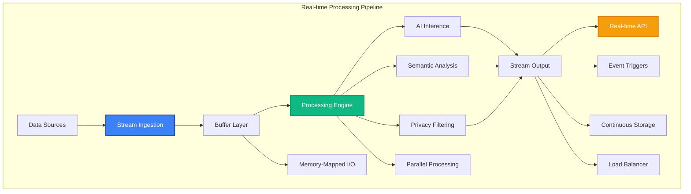

# Real-time Processing

MAIF provides high-performance real-time processing capabilities for streaming data, live AI inference, and continuous intelligence. This guide covers streaming architectures, real-time APIs, and performance optimization techniques.

## Overview

Real-time processing in MAIF enables:

- **High-Throughput Streaming**: Process 400+ MB/s of data
- **Low-Latency Inference**: <50ms response times for semantic search
- **Continuous Learning**: Adapt models in real-time
- **Event-Driven Architecture**: React to data changes instantly
- **Scalable Processing**: Auto-scale based on load



## Streaming Architecture

### 1. Stream Ingestion

MAIF supports multiple streaming data sources:

```python
from maif_sdk import create_stream_processor, StreamConfig

# Configure stream processor
stream_config = StreamConfig(
    buffer_size="128MB",
    batch_size=1000,
    processing_mode="real_time",
    parallelism=4
)

# Create stream processor
stream_processor = create_stream_processor("live-data", client, stream_config)

# Kafka stream ingestion
kafka_stream = stream_processor.add_kafka_source(
    bootstrap_servers=["localhost:9092"],
    topic="data-stream",
    consumer_group="maif-processors"
)

# WebSocket stream ingestion
websocket_stream = stream_processor.add_websocket_source(
    url="wss://api.example.com/stream",
    headers={"Authorization": "Bearer token"}
)

# File stream ingestion (for large files)
file_stream = stream_processor.add_file_source(
    path="/data/streaming/",
    pattern="*.jsonl",
    poll_interval="1s"
)
```

### 2. Real-time Processing

Process streaming data with low latency:

```python
# Real-time text processing
@stream_processor.on_text_message
async def process_text_stream(message):
    # Add to artifact with streaming mode
    artifact = get_or_create_artifact(message.source_id)
    
    # Process with minimal latency
    text_id = await artifact.add_text_async(
        message.content,
        process_immediately=True,
        generate_embeddings=True
    )
    
    # Immediate semantic analysis
    if message.requires_analysis:
        analysis = await artifact.analyze_sentiment_async(text_id)
        await send_analysis_result(message.source_id, analysis)
    
    return text_id

# Real-time image processing
@stream_processor.on_image_message
async def process_image_stream(message):
    artifact = get_or_create_artifact(message.source_id)
    
    # Streaming image processing
    image_id = await artifact.add_image_async(
        message.image_data,
        features={
            "object_detection": True,
            "scene_analysis": True,
            "face_detection": False  # Privacy
        }
    )
    
    # Real-time object detection results
    objects = await artifact.get_detected_objects_async(image_id)
    await send_detection_results(message.source_id, objects)
    
    return image_id
```

### 3. Event-Driven Processing

React to data events in real-time:

```python
# Event-driven processing
@stream_processor.on_event("new_data")
async def handle_new_data(event):
    data = event.payload
    
    # Immediate processing
    if data.priority == "high":
        await process_high_priority(data)
    else:
        await queue_for_batch_processing(data)

@stream_processor.on_event("similarity_threshold")
async def handle_similarity_alert(event):
    # Real-time similarity detection
    similar_items = await find_similar_content(
        event.content,
        threshold=0.9,
        max_results=10
    )
    
    if similar_items:
        await trigger_similarity_alert(event.source, similar_items)

@stream_processor.on_event("privacy_violation")
async def handle_privacy_alert(event):
    # Immediate privacy protection
    await anonymize_content(event.content_id)
    await notify_privacy_team(event)
```

## High-Performance Features

### 1. Memory-Mapped I/O

Achieve maximum throughput with memory-mapped processing:

```python
# Memory-mapped streaming
mmap_processor = create_stream_processor("mmap-stream", client,
    config={
        "memory_mapping": True,
        "mmap_size": "1GB",
        "zero_copy": True
    }
)

# Process large files with memory mapping
@mmap_processor.on_large_file
async def process_large_file(file_path):
    # Memory-mapped file processing
    with mmap_processor.mmap_file(file_path) as mmap_data:
        # Process in chunks without loading into memory
        async for chunk in mmap_data.iter_chunks(chunk_size="64MB"):
            await process_chunk_async(chunk)
```

### 2. Parallel Processing

Leverage multiple cores for maximum performance:

```python
# Parallel stream processing
parallel_processor = create_stream_processor("parallel", client,
    config={
        "parallelism": 8,
        "worker_threads": 16,
        "async_processing": True
    }
)

# Parallel batch processing
@parallel_processor.batch_processor(batch_size=1000)
async def process_batch(messages):
    # Process batch in parallel
    tasks = []
    for message in messages:
        task = asyncio.create_task(process_message_async(message))
        tasks.append(task)
    
    # Wait for all tasks to complete
    results = await asyncio.gather(*tasks)
    return results

# Parallel similarity search
async def parallel_similarity_search(query, artifacts):
    search_tasks = []
    for artifact in artifacts:
        task = asyncio.create_task(
            artifact.search_similar_async(query, max_results=10)
        )
        search_tasks.append(task)
    
    # Combine results from all artifacts
    all_results = await asyncio.gather(*search_tasks)
    return merge_and_rank_results(all_results)
```

## Next Steps

- Explore [Performance Optimization](performance.md) for advanced tuning
- Learn about [Distributed Deployment](distributed.md) for scaling across clusters
- Check out [Monitoring & Observability](monitoring.md) for production monitoring
- See [Examples](../examples/) for complete streaming applications 