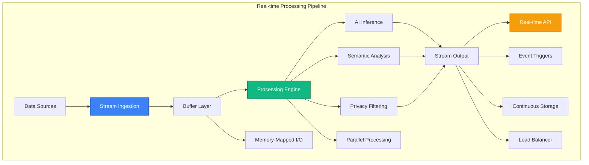

# Real-time Processing

MAIF provides high-performance real-time processing capabilities for streaming data, live AI inference, and continuous intelligence. This guide covers streaming architectures, real-time APIs, and performance optimization techniques.

## Overview

Real-time processing in MAIF enables:

- **High-Throughput Streaming**: Process 400+ MB/s of data
- **Low-Latency Inference**: <50ms response times for semantic search
- **Continuous Learning**: Adapt models in real-time
- **Event-Driven Architecture**: React to data changes instantly
- **Scalable Processing**: Auto-scale based on load



## Streaming Architecture

### 1. Stream Ingestion

MAIF supports multiple streaming data sources. The following example demonstrates how to configure a `StreamProcessor` and add Kafka, WebSocket, and file-based sources for real-time data ingestion.

```python
from maif_sdk import create_stream_processor, StreamConfig, create_client

# Assume a client is already created.
client = create_client()

# Configure the stream processor with a buffer, batch size, and parallelism.
stream_config = StreamConfig(
    buffer_size="128MB",
    batch_size=1000,
    processing_mode="real_time",
    parallelism=4
)

# Create a stream processor for handling live data streams.
stream_processor = create_stream_processor("live-data", client, stream_config)

# Add a Kafka stream as a data source.
kafka_stream = stream_processor.add_kafka_source(
    bootstrap_servers=["localhost:9092"],
    topic="data-stream",
    consumer_group="maif-processors"
)

# Add a WebSocket stream for real-time updates from a web API.
websocket_stream = stream_processor.add_websocket_source(
    url="wss://api.example.com/stream",
    headers={"Authorization": "Bearer token"}
)

# Add a file source to monitor a directory for new line-delimited JSON files.
file_stream = stream_processor.add_file_source(
    path="/data/streaming/",
    pattern="*.jsonl",
    poll_interval="1s"
)
```

### 2. Real-time Processing

Process streaming data with low latency using decorators. The following examples show how to define functions that automatically handle incoming text and image messages from the stream.

```python
from types import SimpleNamespace

# Mock functions for demonstration purposes.
async def get_or_create_artifact(source_id): return SimpleNamespace()
async def send_analysis_result(source_id, analysis): pass
async def send_detection_results(source_id, objects): pass

# This decorator registers the function to process incoming text messages.
@stream_processor.on_text_message
async def process_text_stream(message):
    # Get or create an artifact based on the message source.
    artifact = await get_or_create_artifact(message.source_id)
    
    # Asynchronously add the text content to the artifact for immediate processing.
    text_id = await artifact.add_text_async(
        message.content,
        process_immediately=True, # Ensure low-latency processing.
        generate_embeddings=True  # Generate embeddings in real-time.
    )
    
    # Perform further analysis if required by the message.
    if message.requires_analysis:
        analysis = await artifact.analyze_sentiment_async(text_id)
        await send_analysis_result(message.source_id, analysis)
    
    return text_id

# This decorator registers the function to process incoming image messages.
@stream_processor.on_image_message
async def process_image_stream(message):
    artifact = await get_or_create_artifact(message.source_id)
    
    # Asynchronously add the image data and specify real-time feature extraction.
    image_id = await artifact.add_image_async(
        message.image_data,
        features={
            "object_detection": True,
            "scene_analysis": True,
            "face_detection": False  # Disable features for privacy.
        }
    )
    
    # Get the results of the real-time object detection.
    objects = await artifact.get_detected_objects_async(image_id)
    await send_detection_results(message.source_id, objects)
    
    return image_id
```

### 3. Event-Driven Processing

React to data events in real-time using event handlers. These examples show how to trigger actions based on specific event types, such as new data, similarity alerts, or privacy violations.

```python
# Mock functions for demonstration.
async def process_high_priority(data): pass
async def queue_for_batch_processing(data): pass
async def find_similar_content(content, threshold, max_results): return []
async def trigger_similarity_alert(source, items): pass
async def anonymize_content(content_id): pass
async def notify_privacy_team(event): pass

# This decorator registers a handler for the 'new_data' event.
@stream_processor.on_event("new_data")
async def handle_new_data(event):
    data = event.payload
    
    # Branch processing based on data priority.
    if data.priority == "high":
        await process_high_priority(data)
    else:
        await queue_for_batch_processing(data)

# This handler triggers on similarity detection events.
@stream_processor.on_event("similarity_threshold")
async def handle_similarity_alert(event):
    # Search for content that is highly similar to the incoming event's content.
    similar_items = await find_similar_content(
        event.content,
        threshold=0.9,
        max_results=10
    )
    
    # If similar items are found, trigger an alert.
    if similar_items:
        await trigger_similarity_alert(event.source, similar_items)

# This handler responds to privacy violation events.
@stream_processor.on_event("privacy_violation")
async def handle_privacy_alert(event):
    # Take immediate action to anonymize the content and notify the relevant team.
    await anonymize_content(event.content_id)
    await notify_privacy_team(event)
```

## High-Performance Features

### 1. Memory-Mapped I/O

Achieve maximum throughput with memory-mapped I/O, which allows for processing large files without loading them entirely into memory. This is ideal for zero-copy data processing.

```python
# Create a stream processor specifically configured for memory-mapped I/O.
mmap_config = StreamConfig(
    memory_mapping=True,
    mmap_size="1GB",
    zero_copy=True
)
mmap_processor = create_stream_processor("mmap-stream", client, mmap_config)

async def process_chunk_async(chunk):
    # Mock processing for a chunk of data.
    pass

# This handler processes large files using memory mapping.
@mmap_processor.on_large_file
async def process_large_file(file_path):
    # The file is mapped into memory, allowing for efficient, chunked access.
    with mmap_processor.mmap_file(file_path) as mmap_data:
        # Iterate over the data in large chunks without high memory overhead.
        async for chunk in mmap_data.iter_chunks(chunk_size="64MB"):
            await process_chunk_async(chunk)
```

### 2. Parallel Processing

Leverage multiple cores for maximum performance by processing streams in parallel. This example sets up a processor with multiple worker threads for concurrent batch and search operations.

```python
import asyncio

# Create a stream processor configured for parallel execution.
parallel_config = StreamConfig(
    parallelism=8,
    worker_threads=16,
    async_processing=True
)
parallel_processor = create_stream_processor("parallel", client, parallel_config)

async def process_message_async(message):
    # Mock processing for a single message.
    return "processed"
def merge_and_rank_results(results):
    # Mock merging and ranking of search results.
    return results

# This decorator defines a function that processes messages in parallel batches.
@parallel_processor.batch_processor(batch_size=1000)
async def process_batch(messages):
    # Create an asyncio task for each message in the batch.
    tasks = []
    for message in messages:
        task = asyncio.create_task(process_message_async(message))
        tasks.append(task)
    
    # Wait for all tasks in the batch to complete.
    results = await asyncio.gather(*tasks)
    return results

# This function demonstrates a parallel similarity search across multiple artifacts.
async def parallel_similarity_search(query, artifacts):
    # Create an asyncio task for each search operation.
    search_tasks = []
    for artifact in artifacts:
        task = asyncio.create_task(
            artifact.search_similar_async(query, max_results=10)
        )
        search_tasks.append(task)
    
    # Gather and combine the results from all parallel searches.
    all_results = await asyncio.gather(*search_tasks)
    return merge_and_rank_results(all_results)
```

## Next Steps

- Explore [Performance Optimization](performance.md) for advanced tuning
- Learn about [Distributed Deployment](distributed.md) for scaling across clusters
- Check out [Monitoring & Observability](monitoring.md) for production monitoring
- See [Examples](../examples/) for complete streaming applications 